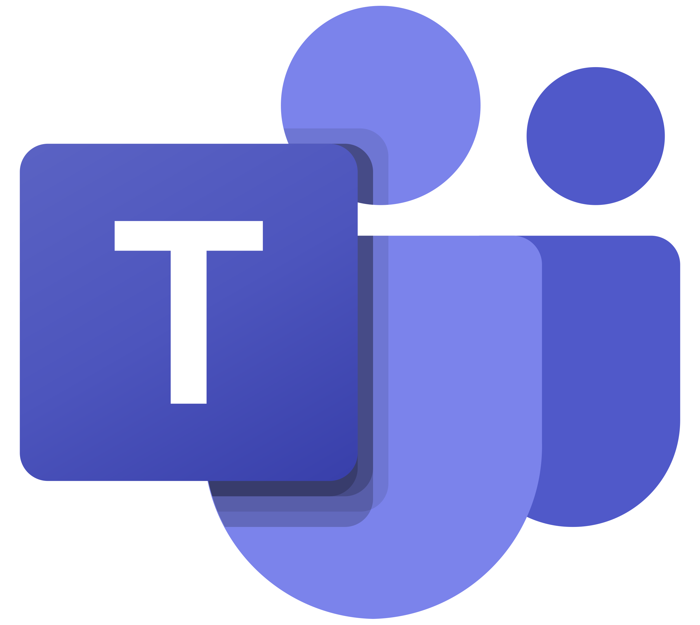
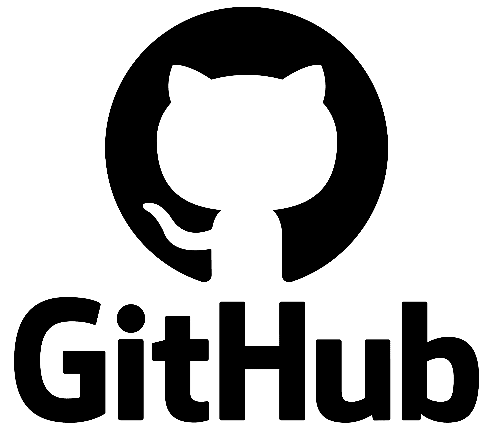
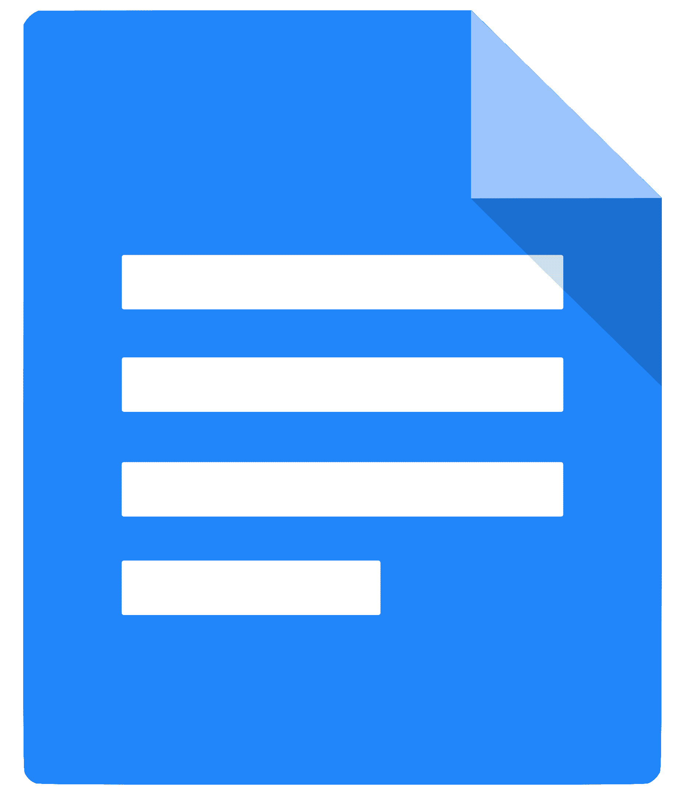
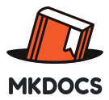
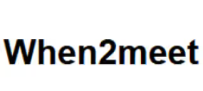
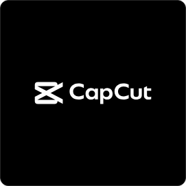

# Ferramentas do Projeto

## Histórico de Versão e Contribuição

| Data | Versão | Descrição | Autor(es) | Revisor(es) |
| :---: | :---: | :--- | :--- | :--- |
| 05/09/2026 | 1.0 | Tabela de ferramentas utilizadas no projeto. | Gabriel Melo | Tomas Garcia |

---

## 1. Introdução

Para o desenvolvimento estruturado e eficiente do projeto da disciplina de Interação Humano-Computador (IHC), selecionamos um conjunto de ferramentas focadas em otimizar a comunicação, o gerenciamento de tarefas, a colaboração em equipe e a documentação dos artefatos produzidos. 

A escolha dessas plataformas levou em consideração a acessibilidade, a eficiência e a integração necessária para que todas as etapas do processo de design (análise, síntese e avaliação) sejam conduzidas, registradas e compartilhadas de forma organizada e produtiva. A **Tabela 1** abaixo detalha as ferramentas adotadas e a motivação por trás de cada escolha para o ciclo de vida do projeto.

**Tabela 1** - Ferramentas utilizadas no projeto

| Ferramenta | Logo | Motivação da Escolha |
| :--- | :---: | :--- |
| **Microsoft Teams** | { width="45" } | Utilizado para a comunicação formal, realização das reuniões de alinhamento da equipe e gravação de encontros importantes ou sessões de avaliação que exigem registro em vídeo e áudio. |
| **LaTeX / Overleaf** | { width="45" } | Adotado para a criação e formatação do documento final e relatórios acadêmicos do projeto. Garante uma padronização rigorosa, versionamento de texto e alta qualidade tipográfica de forma colaborativa na nuvem. |
| **GitHub** | { width="45" } | Plataforma essencial para o versionamento, hospedagem dos artefatos do projeto (Wiki) e controle colaborativo do repositório. Permite rastrear as entregas, gerenciar *issues* e integrar a documentação. |
| **Google Docs** | { width="45" } | Utilizado para a edição rápida, simultânea e colaborativa de rascunhos, roteiros e textos preliminares antes da revisão final e transferência para a documentação oficial ou repositório. |
| **MkDocs** | { width="52" } | Escolhido para a geração da página de documentação estática do projeto. Ele transforma nossos arquivos Markdown em um site estruturado, limpo e de fácil navegação, integrando-se perfeitamente ao GitHub Pages. |
| **YouTube** | { width="45" } | Plataforma de hospedagem utilizada para o upload e compartilhamento dos vídeos produzidos ao longo do projeto, como registros de testes de usabilidade, simulações ou apresentações das entregas. |
| **WhatsApp** | { width="45" } | Ferramenta de comunicação diária. É fundamental para a troca rápida de mensagens, avisos cotidianos, lembretes de prazos e resolução de impedimentos urgentes entre os membros do grupo. |
| **When2meet** | { width="90" } | Utilizado para cruzar e mapear a disponibilidade de horários de todos os integrantes da equipe e geração do *heatmap* (mapa de calor) visual para facilitar a identificação rápida dos melhores momentos para o agendamento de reuniões. |
| **Google Gemini** | { width="45" } | Empregado como assistente de inteligência artificial para apoio na revisão sintática e textual, padronização da formatação em Markdown e auxílio na estruturação e estilização de código front-end para o MkDocs. |
| **123APPS** |  | Plataforma utilizada para a gravação de tela e áudio durante as apresentações assíncronas dos artefatos produzidos pela equipe, garantindo o registro em vídeo exigido pela disciplina. |
| **CapCut** |  | Escolhido para a edição rápida e eficiente dos vídeos gravados. Permite realizar cortes, ajustes de áudio e a renderização final do material audiovisual antes do upload na plataforma de hospedagem. |

*Fonte: Autores. Logomarcas de propriedade de suas respectivas empresas institucionais.*

## 2. Declaração sobre o Uso de IA Generativa

Em cumprimento às normas de conduta acadêmica da SBC e ao Plano de Ensino da disciplina, declara-se que ferramentas de Inteligência Artificial Generativa foram empregadas para auxílio na estruturação textual, refinamento de clareza formal e formatação Markdown do presente documento. Toda a fundamentação teórica, levantamento empírico de dados, capturas de tela e análises críticas permaneceram sob responsabilidade exclusiva dos integrantes da equipe.

## 3. Referências Bibliográficas

-   BARBOSA, S. D. J.; SILVA, B. S. *Interação Humano-Computador*. Rio de Janeiro: Elsevier, 2010.
-   SALES, André Barros de. *Plano de Ensino: Interação Humano Computador*. Universidade de Brasília, Faculdade UnB Gama, 2026.