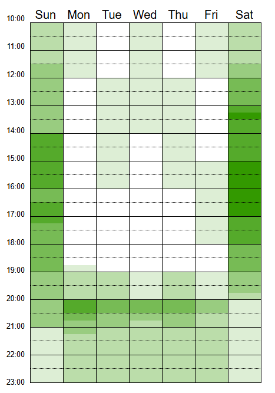

# Disponibilidade dos Integrantes

## Histórico de Versão e Contribuição

| Data | Versão | Descrição | Autor(es) | Revisor(es) |
| :---: | :---: | :--- | :--- | :--- |
| 05/09/2026 | 1.0 | Documentação do mapa de disponibilidade dos integrantes. | Gabriel Melo | Tomas Garcia |

---

## 1. Introdução

O desenvolvimento de um projeto de Interação Humano-Computador exige sincronia e trabalho colaborativo constante entre os membros da equipe. Para viabilizar a organização dos encontros e gravações da disciplina, foi realizado um mapeamento cruzado dos horários de todos os integrantes.

A **Figura 1** apresenta o *heatmap* (mapa de calor) gerado, indicando os períodos de maior e menor disponibilidade do grupo para o agendamento de reuniões síncronas. Quanto mais escura a tonalidade da cor verde, maior é o número de integrantes disponíveis simultaneamente naquele determinado bloco de tempo.

**Figura 1** - Mapa de calor (Heatmap) da disponibilidade da equipe

*Fonte: Autores. Gráfico gerado por meio da ferramenta When2meet.*

## 2. Declaração sobre o Uso de IA Generativa

Em cumprimento às normas de conduta acadêmica da SBC e ao Plano de Ensino da disciplina, declara-se que ferramentas de Inteligência Artificial Generativa foram empregadas para auxílio na estruturação textual, refinamento de clareza formal e formatação Markdown do presente documento. Toda a fundamentação teórica, levantamento empírico de dados, capturas de tela e análises críticas permaneceram sob responsabilidade exclusiva dos integrantes da equipe.

## 3. Referências Bibliográficas

-   SALES, André Barros de. *Plano de Ensino: Interação Humano Computador*. Universidade de Brasília, Faculdade UnB Gama, 2026.