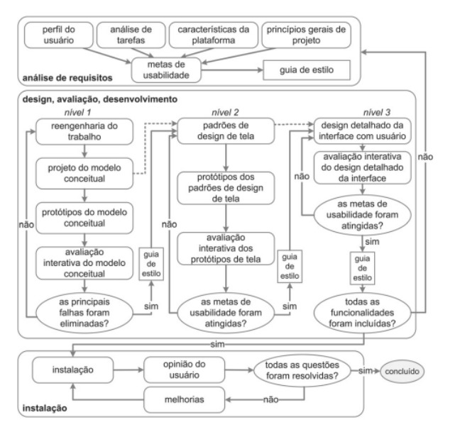

# Processo de Design

## Histórico de Versão e Contribuição

| Data | Versão | Descrição | Autor(es) | Revisor(es) |
| :---: | :---: | :--- | :--- | :--- |
| 05/09/2026 | 1.0 | Justificação da proposta de processo de design escolhida. | Tomas Garcia | Rodrigo Carvalho |

---

## 1. Introdução

Na literatura de Interação Humano-Computador (IHC) existem diversas propostas de processo de design. Apesar de cada uma organizar as atividades de um jeito diferente, todas compartilham um núcleo comum de três grandes etapas: a análise da situação atual (entendimento do problema e dos usuários), a proposta de uma intervenção para os problemas identificados e a avaliação dessa intervenção junto aos usuários.

Um aspecto importante, presente em praticamente todos esses processos, é a **iteratividade**: o designer não segue as etapas de forma estritamente linear, podendo, e devendo, retornar a fases anteriores sempre que a avaliação de uma proposta indicar a necessidade de revisão. Da mesma forma, todos os processos reforçam a importância de manter os usuários envolvidos ao longo de todo o ciclo, já que é o contato direto com suas necessidades reais que permite identificar e corrigir problemas de usabilidade com mais precisão (BARBOSA et al., 2021).

Entre as propostas mais conhecidas de processo de design em IHC, destacam-se:

* **Ciclo de vida em Estrela**: proposto por Hix e Hartson em 1993, foi um dos primeiros ciclos de vida voltados especificamente para IHC. É composto por seis atividades; análise de tarefas, usuários e funções; especificação de requisitos; projeto conceitual e especificação do design; prototipação; implementação; e avaliação, sem uma ordem obrigatória entre elas, cabendo ao designer decidir por qual atividade começar a cada momento.
* **Engenharia de Usabilidade de Mayhew**: desenvolvida por Deborah Mayhew em 1999, organiza o trabalho em três grandes fases: análise de requisitos, design/avaliação/desenvolvimento e instalação, sendo reconhecida por oferecer uma visão bastante detalhada e sequencial do processo.
* **Design Contextual**: elaborado por Beyer e Holtzblatt em 1997, parte da investigação do contexto real de uso do sistema para compreender as necessidades dos usuários antes de propor qualquer solução.
* **Design Baseado em Cenários**: desenvolvido por Rosson e Carroll em 2002, utiliza cenários narrativos que descrevem as atividades dos usuários como principal ferramenta de análise e comunicação entre os envolvidos no projeto.
* **Design Dirigido por Objetivos**: proposto por Alan Cooper, Robert Reimann, David Cronin e Christopher Noessel, incentiva o designer a explorar o potencial da tecnologia disponível para chegar a soluções criativas, inovadoras e eficientes.

Para o projeto de avaliação do site da **Semob-DF** (Secretaria de Estado de Mobilidade do Distrito Federal), o grupo optou por adotar a **Engenharia de Usabilidade de Mayhew** como processo de design a ser seguido.

## 2. Engenharia de Usabilidade de Mayhew

O ciclo de vida proposto por Mayhew (1999), ilustrado na **Figura 1**, é estruturado de forma iterativa e dividido em três fases principais:

1. **Análise de Requisitos**: nesta fase são definidas as metas de usabilidade do projeto, a partir do levantamento do perfil dos usuários, da análise das tarefas que eles realizam, das possibilidades e limitações da plataforma em que o sistema é utilizado, e dos princípios gerais de design de IHC. O resultado dessa etapa costuma ser registrado em guias de estilo, que servem de referência para as fases seguintes.
2. **Design, Avaliação e Desenvolvimento**: fase em que se busca chegar a uma solução de interface que atenda às metas de usabilidade definidas anteriormente. O processo é conduzido em níveis crescentes de detalhe, normalmente por meio de protótipos de baixa, média e alta fidelidade, sempre avaliados com usuários antes de avançar para o próximo nível.
3. **Instalação**: etapa em que o sistema já está em uso real, e são coletadas as opiniões e o comportamento dos usuários ao longo do tempo. Essas informações retroalimentam o processo, servindo tanto para melhorar o sistema atual quanto para orientar o desenvolvimento de versões futuras.

**Figura 1** – Ciclo de vida para a engenharia de usabilidade

*Fonte: BARBOSA et al. (2021)*

### 2.1 Por que usar o ciclo de vida de Mayhew?

O grupo escolheu o ciclo de Mayhew principalmente pelo fato de suas etapas serem bem definidas, detalhadas e sequenciais, o que reduz a subjetividade na condução do projeto quando comparado a processos mais livres, como o Ciclo de Vida em Estrela. Essa característica é especialmente vantajosa para a equipe, já que a maioria dos integrantes não possui grande experiência prévia em projetos de IHC, e um processo mais estruturado passo a passo diminui o risco de erros de condução e facilita o acompanhamento do progresso do trabalho ao longo do semestre.

### 2.2 Aplicando a Usabilidade de Mayhew na avaliação do site da SEMOB-DF

Como o site da SEMOB-DF já está em produção e em uso pela população, a avaliação do grupo não parte do zero: ela se inicia, na prática, a partir da fase de **Instalação** do ciclo de Mayhew, momento em que são identificados os problemas de interação e as oportunidades de melhoria na interface já existente.

A partir dos problemas encontrados nessa análise inicial, o grupo retorna à primeira fase do ciclo, a **Análise de Requisitos**, para levantar o perfil dos usuários do site, as tarefas que eles precisam realizar (como consultar linhas de ônibus, horários, tarifas ou solicitar serviços de mobilidade) e as limitações da plataforma atual. Concluída essa etapa, o processo segue normalmente pela fase de **Design, Avaliação e Desenvolvimento**, na qual serão propostas e avaliadas as melhorias de interface sugeridas pelo grupo, por meio de protótipos em diferentes níveis de fidelidade.

## 3. Declaração sobre o Uso de IA Generativa

Em cumprimento às normas de conduta acadêmica da SBC e ao Plano de Ensino da disciplina, declara-se que ferramentas de Inteligência Artificial Generativa foram empregadas para auxílio na estruturação textual, refinamento de clareza formal e formatação Markdown do presente documento. Toda a fundamentação teórica, levantamento empírico de dados, capturas de tela e análises críticas permaneceram sob responsabilidade exclusiva dos integrantes da equipe.

## 4. Referências Bibliográficas

- BARBOSA, S. D. J.; SILVA, B. S. da; SILVEIRA, M. S.; GASPARINI, I.; DARIN, T.; BARBOSA, G. D. J. **Interação Humano-Computador e Experiência do Usuário**. Rio de Janeiro: Elsevier, 2021.

- BEYER, H.; HOLTZBLATT, K. **Contextual Design: Defining Customer-Centered Systems**. San Francisco: Morgan Kaufmann Publishers Inc., 1997.

- MAYHEW, D. J. **The Usability Engineering Lifecycle: a practitioner's handbook for user interface design**. San Francisco: Morgan Kaufmann, 1999.

- SALES, André Barros de. *Plano de Ensino: Interação Humano Computador*. Universidade de Brasília, Faculdade UnB Gama, 2026.

