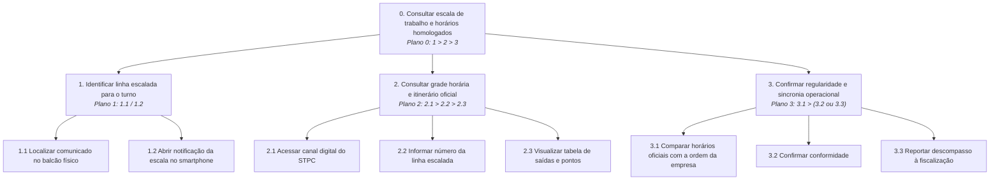
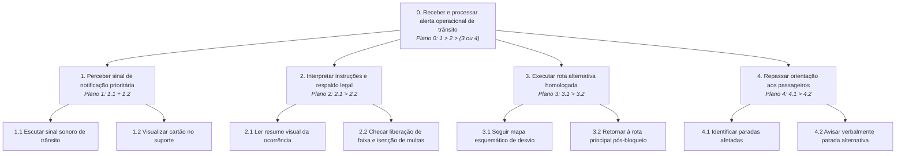
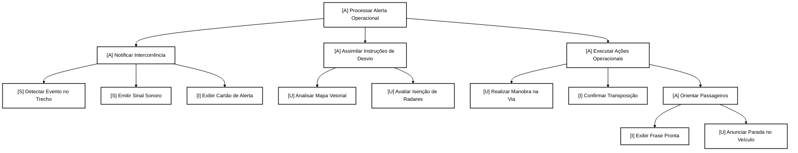

# Análise de Tarefas em IHC: HTA e CTT — Motoristas do STPC/DF (Contexto SEMOB-DF)

## Histórico de Versão e Contribuição

| Data | Versão | Descrição | Autor(es) | Revisor(es) |
| :---: | :---: | :--- | :--- | :--- |
| 26/09/2026 | 1.0 | Concepção e modelagem da Análise de Tarefas utilizando Análise Hierárquica de Tarefas (HTA) e Árvores de Tarefas Concorrentes (CTT), fundamentada na pesquisa de campo com o motorista (`MOT-01`), na persona Valdir Soares e na literatura clássica de IHC (Barbosa e Silva, 2010; Annett e Duncan, 1967; Reason, 1990; Paternò, 2000). | [Carlos Costa](https://github.com/carloshfgit) | [Igor Dantas](https://github.com/IgorDARAUJO) e [Gabriel Melo](https://github.com/gabriellcardone-06) |
| 27/09/2026 | 1.1 | Integração formal ao repositório MkDocs com padronização de diagramas Mermaid, tuplas operacionais HTA, operadores temporais CTT e rastreabilidade bidirecional com personas e cenários. | [Carlos Costa](https://github.com/carloshfgit) | [Arthur Mariani](https://github.com/arthur-mariani) |

---

## 1. Introdução e Fundamentação Metodológica

A **Análise de Tarefas** é uma das atividades basilares da disciplina de **Interação Humano-Computador (IHC)** e da Engenharia de Requisitos. Seu propósito fundamental é investigar, estruturar e explicitar como as pessoas realizam seu trabalho cotidiano para atingir seus objetivos, analisando o papel mediador exercido ou a ser exercido pelos sistemas computacionais (Barbosa e Silva, 2010, pp. 191–192).

O presente documento apresenta a modelagem de tarefas centrada no trabalho dos motoristas de transporte público coletivo do Distrito Federal (STPC/DF), contextualizada na relação operacional com a **Secretaria de Transporte e Mobilidade do Distrito Federal (SEMOB-DF)**. A análise tem como protagonista o perfil empírico levantado junto ao participante **`MOT-01`** ([Perfil de Usuário: Motoristas de Ônibus](../perfis-de-usuario/perfil-motorista.md)), consubstanciado na persona **[Valdir Soares ("Seu Valdir")](../personas/valdir-soares.md)** e nos [Cenários de Uso](../cenarios/index.md).

```
                    PARADIGMA DA ANÁLISE DE TAREFAS EM IHC
         (Barbosa e Silva, 2010, pp. 191–192; Annett e Duncan, 1967; Paternò, 2000)
+---------------------------------------------------------------------------------------+
| 1. Centralidade nos Objetivos | Foco nos estados finais desejados pelas pessoas sob   |
|                               | uma perspectiva psicológica e operacional concreta.   |
| 2. Perspectiva HTA            | Decomposição hierárquica do trabalho, planos de fluxo,|
|                               | tuplas operacionais, problemas e falhas de Reason.    |
| 3. Perspectiva CTT            | Representação da solução de design da interação com   |
|                               | tarefas (U, S, I, A) e operadores temporais formais.  |
+---------------------------------------------------------------------------------------+
```

### 1.1 Definição de Objetivos a partir das Pessoas (Barbosa e Silva, 2010, pp. 191–192)
Conforme enfatizam Barbosa e Silva (2010, p. 191), a análise de tarefas deve iniciar pela coleta e formulação dos **objetivos das pessoas**, definidos em termos psicológicos como os estados finais concretos e observáveis que o usuário busca alcançar no mundo real. Metas puramente organizacionais ou financeiras (como "maximizar a fiscalização do órgão" ou "aumentar a arrecadação da concessionária") não constituem o objeto central da análise de tarefas.

Para o motorista Valdir Soares, o objetivo primário não é "clicar em botões em uma tela", mas sim:
1. **Obter previsibilidade temporal e operacional** da sua jornada de direção ("mais os horários mesmo");
2. **Prevenir atritos interpessoais e desgastes com passageiros** na catraca decorrentes de desinformação pública;
3. **Executar a viagem com segurança viária e regularidade**, sem incorrer em advertências ou multas da SEMOB.

### 1.2 Finalidade e Nível de Abstração no Ciclo de Design (Barbosa e Silva, 2010, p. 191)
Em IHC, a análise de tarefas pode ser empregada em três atividades fundamentais: (1) análise da situação atual de trabalho; (2) (re)design de um sistema computacional; e (3) avaliação de uma intervenção ou novo sistema.

Este artefato atua de maneira articulada em dois níveis de abstração correspondentes:
- **Análise da Situação Atual:** Mapeia a rotina concreta de trabalho de Seu Valdir (consulta a informativos impressos em folhas de papel no balcão da garagem, uso de WhatsApp e aplicativo da empresa concessionária), identificando pontos de vulnerabilidade crítica onde a ausência de sincronia entre o portal web da SEMOB e a garagem gera sobrecarga cognitiva e conflitos físicos.
- **(Re)Design do Sistema de Interação:** Modela a solução de IHC em nível conceitual e operacional para um **Canal Móvel de Informações Operacionais da SEMOB (Módulo do Operador)**, definindo como o diálogo homem–máquina deve ocorrer em smartphones sob redes móveis para apoiar com fluidez os objetivos do trabalhador.

---

## 2. Tarefas do Domínio Selecionadas para Modelagem

A partir das dores e necessidades levantadas na pesquisa empírica, foram selecionadas duas tarefas críticas da jornada de trabalho do motorista para a análise formal:

1. **TAR-03: Consultar Escala de Trabalho e Horários Homologados da Linha**  
   *Contexto:* Realizada no início de cada turno de trabalho na garagem da concessionária (Setor de Garagens Oficiais - SGO), fora da condução do veículo. Envolve a identificação da tabela de saída/retorno, itinerário escalado e checagem de sincronia com a SEMOB (correspondente ao [Cenário 5 — Consulta ágil da escala diária](../cenarios/cenario-5-consulta-escala.md)).
2. **TAR-04: Receber e Processar Alerta Operacional Emergencial de Trânsito / Faixa Exclusiva**  
   *Contexto:* Realizada antes da partida ou durante pausas em terminais rodoviários em momentos de intercorrência viária (bloqueios, desvios ou liberação de faixas exclusivas), exigindo assimilação rápida de rotas alternativas sem risco de autuação nos radares de trânsito (correspondente ao [Cenário 6 — Alerta emergencial de desvio](../cenarios/cenario-6-alerta-desvio.md)).

---

## 3. Parte I: Análise Hierárquica de Tarefas (HTA)

A **Análise Hierárquica de Tarefas (HTA – *Hierarchical Task Analysis*)**, desenvolvida originalmente por Annett e Duncan (1967) e consolidada em IHC por Barbosa e Silva (2010, pp. 192–196) e Diaper (2003), parte de objetivos de alto nível e os decompõe sucessivamente em subobjetivos mais específicos, com o intuito de mapear pontos críticos de execução, planos de controle e potenciais falhas humanas.

### 3.1 Princípios de Decomposição e Critérios Técnicos de Parada (Barbosa e Silva, 2010, pp. 195–196)
1. **Mutuamente Exclusivos e Exaustivos:** Em cada ramificação da hierarquia, os subobjetivos formulados cobrem integralmente o escopo do objetivo superior sem apresentar redundâncias ou sobreposições funcionais entre si (Barbosa e Silva, 2010, p. 196).
2. **Critério *p* × *c* de Annett e Duncan (1967):** A decomposição das tarefas foi interrompida formalmente quando o produto da probabilidade de erro (*p*) pelo custo/severidade da falha (*c*) atinge um limiar aceitável, ou quando a causa-raiz de um problema foi isolada, permitindo propor uma recomendação direta de design de IHC (Barbosa e Silva, 2010, p. 195).
3. **Estrutura das Operações na Base (Tupla Operacional):** O nível folha de cada ramo é alcançado por operações definidas por:
   - **Input (Entrada):** Estados do ambiente ou gatilhos contextuais que ativam o objetivo;
   - **Ação (Action):** Atividades e transformações realizadas para atingi-lo;
   - **Feedback:** Sinais perceptíveis e testes que comprovam o alcance do estado final desejado (Barbosa e Silva, 2010, p. 193).
4. **Classificação Tripartida de Erro Humano de Reason (1990):** As dificuldades identificadas foram categorizadas em falhas baseadas em **habilidades** (*skill-based* - lapsos motores ou de atenção), **regras** (*rule-based* - aplicação equivocada de procedimentos) ou **conhecimento** (*knowledge-based* - raciocínio incompleto em situações inéditas) (Barbosa e Silva, 2010, p. 196).

---

### 3.2 HTA – TAR-03: Consultar Escala de Trabalho e Horários Homologados da Linha

#### 3.2.1 Diagrama Hierárquico Gráfico (HTA 1)

```
0. Consultar escala de trabalho e horários homologados da linha
   |
   +-- [Plano 0: 1 > 2 > 3]
   |
   +-- 1. Identificar linha escalada para o turno
   |      |
   |      +-- [Plano 1: 1.1 / 1.2]
   |      +-- 1.1 Localizar comunicado impresso no balcão da garagem
   |      +-- 1.2 Abrir notificação da escala no smartphone
   |
   +-- 2. Consultar grade horária e itinerário oficial da SEMOB
   |      |
   |      +-- [Plano 2: 2.1 > 2.2 > 2.3]
   |      +-- 2.1 Acessar canal digital de informações do STPC
   |      +-- 2.2 Informar número da linha escalada
   |      +-- 2.3 Visualizar tabela de saídas e pontos de controle
   |
   +-- 3. Confirmar regularidade e sincronia operacional
          |
          +-- [Plano 3: 3.1 > (3.2 ou 3.3)]
          +-- 3.1 Comparar horários do sistema com a ordem da concessionária
          +-- 3.2 Confirmar conformidade ("tabela sem divergências")
          +-- 3.3 Reportar descompasso de dados à fiscalização/despachante
```



<div align="center">
<p><strong>Figura 1</strong> — Diagrama HTA: Consultar Escala de Trabalho e Horários Homologados (TAR-03).</p>
<p><em>Fonte: Carlos Costa (2026).</em></p>
</div>

---

#### 3.2.2 Tabela Descritiva de Decomposição (HTA 1)
*(Seguindo a estrutura canônica da Tabela 6.3 de Barbosa e Silva, 2010, pp. 194–195)*

A Tabela 1 detalha a decomposição da tarefa de consulta da escala, relacionando objetivos, condições de execução, problemas diagnosticados e recomendações de design.

<div align="center">
<p><strong>Tabela 1</strong> — Tabela Descritiva HTA: TAR-03 (Consultar Escala de Trabalho e Horários)</p>
</div>

| Objetivos / Subobjetivos | Plano | Input (Circunstâncias de Ativação) | Ações (Instruções de Transformação) | Feedback (Critério de Avaliação do Estado Final) | Problemas Diagnosticados | Hipóteses de Erro de Reason (1990) | Recomendações de Design de IHC |
| :--- | :--- | :--- | :--- | :--- | :--- | :--- | :--- |
| **0. Consultar escala de trabalho e horários homologados** | 1 > 2 > 3 | Apresentação na garagem no início da madrugada (04h50). | Executar a sequência de identificação da linha, consulta da tabela e confirmação da sincronia. | Motorista ciente dos horários de saída/chegada e com a viagem autorizada. | Insegurança quanto a possíveis mudanças de itinerário de última hora. | Desempenho baseado em regras (aplicar tabela desatualizada). | Centralizar as informações essenciais em painel único de rápido carregamento. |
| **1. Identificar linha escalada para o turno** | 1.1 / 1.2 | Início do turno sem saber se houve rotatividade de linhas no dia. | Optar por checar o balcão físico da garagem (1.1) ou abrir o aviso da escala no smartphone (1.2). | Número da linha e prefixo do carro identificados. | Fila e aglomeração no balcão físico; comunicados impressos rasurados. | Desempenho baseado em regras (confundir a pasta da escala no balcão). | Notificação automática (Push) no smartphone com o número da linha ao bater o ponto. |
| **1.1 Localizar comunicado no balcão físico** | - | Falta de sinal no celular ou aparelho descarregado. | Caminhar até o balcão da escala e procurar a folha da Bacia 1. | Folha de papel sulfite com a escala do dia localizada e lida. | Letras pequenas, iluminação fraca da garagem às 05h da manhã. | Desempenho baseado em habilidades (ler linha adjacente por distração visual). | Diagramação com fontes ampliadas e separação por cores das bacias operacionais. |
| **1.2 Abrir notificação da escala no celular** | - | Smartphone conectado à rede móvel 4G pessoal. | Desbloquear o aparelho e tocar no aviso da empresa concessionária. | Tela do smartphone exibindo os dados do turno e linha. | Instabilidade do sinal móvel em zonas de sombra no galpão da garagem. | Desempenho baseado em habilidades (toque incorreto em botões pequenos). | Armazenamento em cache local (offline first) para permitir consulta sem rede. |
| **2. Consultar grade horária e itinerário oficial da SEMOB** | 2.1 > 2.2 > 2.3 | Linha identificada, necessitando checar horários regulamentados. | Acessar o sistema, inserir o código e visualizar os dados da tabela. | Grade horária carregada com paradas e horários de controle. | Portais web tradicionais exigem múltiplos cliques e navegação lenta. | Desempenho baseado em conhecimento (dificuldade em navegar por menus burocráticos). | Mecanismo de busca direta por dígito único da linha em tela inicial minimalista. |
| **2.1 Acessar canal digital do STPC** | - | Celular na mão durante o intervalo na sala de repouso. | Abrir o navegador ou aplicativo oficial do STPC. | Página inicial do sistema carregada em menos de 3 segundos. | Lentidão de carregamento por excesso de imagens pesadas no portal governamental. | Desempenho baseado em habilidades (abandono do fluxo por lentidão). | Interface leve (HTML/CSS otimizado), dispensando elementos pesados em conexões móveis. |
| **2.2 Informar número da linha escalada** | - | Campo de busca habilitado na interface. | Digitar o número da linha (ex.: `0.509`) no campo de busca. | Campo preenchido e lista de sugestões automáticas exibida. | Digitação dificultada por teclado virtual pequeno para dedos calejados de motorista. | Desempenho baseado em habilidades (erro de digitação de dígitos numéricos). | Teclado numérico ampliado acionado por padrão ao focar o campo de busca. |
| **2.3 Visualizar tabela de saídas e pontos** | - | Linha selecionada pelo usuário. | Percorrer a lista de partidas do terminal de origem e paradas-chave. | Horários de saída do turno destacados visualmente na tela. | Tabelas governamentais em formato PDF estático de difícil leitura em celular. | Desempenho baseado em regras (tentativa frustrada de dar zoom em tabela PDF). | Renderização responsiva em cards verticais com alto contraste e fontes legíveis. |
| **3. Confirmar regularidade e sincronia operacional** | 3.1 > (3.2 ou 3.3) | Grade horária carregada em tela. | Comparar os horários com a ordem da garagem; validar ou reportar erro. | Viagem iniciada com segurança ou chamado aberto para correção. | Desalinhamento entre o que a SEMOB publica e o que a garagem determinou. | Desempenho baseado em conhecimento (insegurança sobre qual horário cumprir). | Inclusão de selo visual explícito de sincronização de dados entre SEMOB e empresa. |
| **3.1 Comparar horários oficiais com a garagem** | - | Tabela oficial visível na tela e folha da empresa em mãos. | Confrontar horário de início e fim da viagem planejada. | Confirmação de que os horários são idênticos ou divergentes. | Divergência de minutos que pode gerar multas por parte dos fiscais. | Desempenho baseado em regras (presumir que 5 minutos de diferença são irrelevantes). | Alerta visual em cor contrastante se houver divergência entre sistemas. |
| **3.2 Confirmar conformidade"** | - | Horários 100% coincidentes. | Tocar no botão de confirmação e guardar o aparelho. | Mensagem de sucesso: "Viagem confirmada conforme OS oficial". | Nulo (estado ótimo de trabalho). | Não se aplica (sucesso). | Botão amplo de fechamento com confirmação tátil/sonora imediata. |
| **3.3 Reportar descompasso à fiscalização** | - | Horários divergentes entre site público e ordem da empresa. | Acionar botão "Reportar Divergência" ou procurar despachante. | Registro de chamado emitido e protocolo gerado para resguardo legal. | Motorista não tem canal rápido para contestar erros da SEMOB antes de rodar. | Desempenho baseado em conhecimento (falta de protocolo formal de resguardo). | Botão de "Alerta de Divergência" com emissão instantânea de comprovante digital. |

<div align="center">
<p><em>Fonte: Carlos Costa (2026).</em></p>
</div>

---

### 3.3 HTA – TAR-04: Receber e Processar Alerta Operacional Emergencial de Trânsito

#### 3.3.1 Diagrama Hierárquico Gráfico (HTA 2)

```
0. Receber e processar alerta operacional de trânsito em rota
   |
   +-- [Plano 0: 1 > 2 > (3 ou 4)]
   |
   +-- 1. Perceber sinal de notificação prioritária
   |      |
   |      +-- [Plano 1: 1.1 + 1.2]
   |      +-- 1.1 Escutar sinal sonoro característico de trânsito
   |      +-- 1.2 Visualizar cartão de alerta no painel/suporte
   |
   +-- 2. Interpretar instruções do desvio e respaldo legal
   |      |
   |      +-- [Plano 2: 2.1 > 2.2]
   |      +-- 2.1 Ler resumo visual da ocorrência (trecho bloqueado)
   |      +-- 2.2 Checar liberação expressa da faixa e isenção de multas
   |
   +-- 3. Executar rota alternativa homologada
   |      |
   |      +-- [Plano 3: 3.1 > 3.2]
   |      +-- 3.1 Seguir mapa vetorial simplificado de desvio
   |      +-- 3.2 Retornar à rota principal após transpor o obstáculo
   |
   +-- 4. Repassar orientação aos passageiros a bordo
          |
          +-- [Plano 4: 4.1 > 4.2]
          +-- 4.1 Identificar paradas provisoriamente suprimidas
          +-- 4.2 Avisar verbalmente no veículo a parada provisória alternativa
```



<div align="center">
<p><strong>Figura 2</strong> — Diagrama HTA: Receber e Processar Alerta Operacional Emergencial de Trânsito (TAR-04).</p>
<p><em>Fonte: Carlos Costa (2026).</em></p>
</div>

---

#### 3.3.2 Tabela Descritiva de Decomposição (HTA 2)

A Tabela 2 detalha a decomposição do processamento de alertas de trânsito e evidencia os problemas, riscos de erro e recomendações associados a cada subobjetivo.

<div align="center">
<p><strong>Tabela 2</strong> — Tabela Descritiva HTA: TAR-04 (Receber e Processar Alerta de Trânsito)</p>
</div>

| Objetivos / Subobjetivos | Plano | Input (Circunstâncias de Ativação) | Ações (Instruções de Transformação) | Feedback (Critério de Avaliação do Estado Final) | Problemas Diagnosticados | Hipóteses de Erro de Reason (1990) | Recomendações de Design de IHC |
| :--- | :--- | :--- | :--- | :--- | :--- | :--- | :--- |
| **0. Receber e processar alerta de trânsito** | 1 > 2 > (3 ou 4) | Bloqueio viário, acidente ou obra no percurso da linha. | Perceber o aviso, interpretar a orientação e executar o desvio regulamentado. | Ônibus desviando com segurança e sem autuações nos radares da via. | Falta de aviso prévio fazendo o coletivo ingressar em engarrafamento severo. | Desempenho baseado em conhecimento (improvisar rotas não autorizadas). | Sistema de mensageria em tempo real com envio geolocalizado de alertas prioritários. |
| **1. Perceber sinal de notificação prioritária** | 1.1 + 1.2 | Emissão de alerta pelo centro de controle operacional da SEMOB. | Escutar o toque sonoro do aparelho e fixar o olhar no visor por 2 segundos. | Atenção do motorista capturada com segurança antes do trecho crítico. | Ruído elevado do motor e do trânsito abafando alertas de áudio convencionais. | Desempenho baseado em habilidades (não escutar ou não notar a notificação). | Alerta multimodal (som grave e potente + padrão de vibração + tela que acende em cor âmbar). |
| **1.1 Escutar sinal sonoro de trânsito** | - | Ocorrência transmitida com prioridade alta. | Ouvir padrão acústico específico e diferenciado de mensagens comuns. | Reconhecimento imediato de que se trata de aviso operacional oficial. | Confundir aviso da SEMOB com mensagens sociais de grupos de WhatsApp. | Desempenho baseado em regras (ignorar o áudio por achar que é mensagem pessoal). | Sinal sonoro sonoplastificado exclusivo, padronizado e inconfundível. |
| **1.2 Visualizar cartão no suporte** | - | Celular afixado no suporte veicular do painel. | Olhar rapidamente para o cartão em destaque visual. | Identificação do título do alerta ("BR-020: Desvio Colorado"). | Reflexo do sol no vidro dificultando a legibilidade da tela. | Desempenho baseado em habilidades (dificuldade de leitura sob luz intensa). | Interface de altíssimo contraste com fontes pretas sobre cartões amarelo/âmbar. |
| **2. Interpretar instruções e respaldo legal** | 2.1 > 2.2 | Cartão de alerta visível na tela de espera. | Ler o que aconteceu e verificar se a circulação fora da faixa está isenta de multas. | Compreensão completa da manobra autorizada e garantia de não punição. | Textos regulatórios longos que não podem ser lidos durante a condução. | Desempenho baseado em regras (medo de tomar multa por radar se sair da faixa exclusiva). | Resumo em tópicos diretos e selo verde destacado: "ISENTO DE RADAR ATÉ 19H". |
| **2.1 Ler resumo visual da ocorrência** | - | Veículo parado em semáforo ou ponto de embarque. | Passar os olhos pelo motivo e trecho exato do bloqueio viário. | Assimilação imediata: "Acidente km 12 - pista exclusiva interditada". | Siglas técnicas da engenharia de tráfego que o motorista desconhece. | Desempenho baseado em conhecimento (não compreender nomenclaturas como 'eixo de transposição'). | Uso de linguagem popular e pontos de referência conhecidos (balões, pontes, passarelas). |
| **2.2 Checar liberação e isenção de multas** | - | Dúvida sobre a legalidade de desviar pela via marginal. | Conferir a tarja de autorização da fiscalização no rodapé do alerta. | Confirmação explícita de que os radares daquele trecho estão desativados para ônibus. | Insegurança jurídica do motorista de ser punido posteriormente por descumprimento de rota. | Desempenho baseado em regras (recusar-se a desviar por medo de autuação do fiscal). | Registro automático da ordem de desvio no histórico do condutor para resguardo funcional. |
| **3. Executar rota alternativa homologada** | 3.1 > 3.2 | Autorização assimilada e chegada próxima ao ponto de bloqueio. | Seguir o mapa simples de contorno e reassumir a faixa principal pós-acidente. | Viagem continuando com atraso mínimo e fluidez garantida. | Dúvida sobre o ponto exato de entrar e de sair da via marginal. | Desempenho baseado em regras (perder a entrada do desvio temporário). | Mapa esquemático vetorial com setas direcionais amarelas sobre fundo escuro. |
| **3.1 Seguir mapa esquemático de desvio** | - | Cones de bloqueio visíveis adiante na pista. | Guiar o veículo pela faixa marginal indicada no esquema gráfico. | Ônibus trafegando pela via liberada contornando o ponto crítico. | Mapas geográficos complexos e cheios de linhas confusas estilo GPS tradicional. | Desempenho baseado em habilidades (desvio de atenção visual prolongado da via). | Desenho vetorial puramente linear (apenas a rota e o desvio, sem poluição visual cartográfica). |
| **3.2 Retornar à rota principal pós-bloqueio** | - | Fim do trecho de retenção viária. | Retornar para a faixa prioritária do transporte coletivo. | Veículo reingressando na sua linha regular normal. | Risco de esquecer de retornar e desviar demais da rota prevista. | Desempenho baseado em habilidades (prosseguir na via marginal inadvertidamente). | Alerta de retorno: "Fim do desvio: retorne à faixa exclusiva à frente". |
| **4. Repassar orientação aos passageiros** | 4.1 > 4.2 | Desvio alterando locais de embarque e desembarque. | Identificar se há parada cancelada e avisar a bordo de forma humana. | Passageiros tranquilos e cientes de onde descerão sem tumulto. | Passageiros alarmados ao perceberem que o ônibus mudou de pista sem explicação. | Desempenho baseado em regras (não comunicar os passageiros, gerando revolta no salão). | Fornecer na tela do celular a frase pronta de aviso para o motorista falar ao público. |
| **4.1 Identificar paradas afetadas** | - | Alerta indicando interdição de plataforma. | Ler na tela se alguma parada do trecho ficará sem atendimento. | Conhecimento exato de quais pontos deixaram de ser atendidos na manobra. | Informação de parada exibida por código numérico de poste em vez de nome da estação. | Desempenho baseado em conhecimento (não associar o código à parada real). | Indicar o nome popular da parada e a localização exata do ponto substituto provisório. |
| **4.2 Avisar verbalmente parada alternativa** | - | Passageiros aguardando para descer no trecho. | Anunciar em voz alta ou via sistema de som a parada provisória mais próxima. | Passageiros desembarcando com segurança e acolhimento. | Conflito na catraca se o passageiro achar que o motorista "pulou" o ponto por preguiça. | Desempenho baseado em regras (confronto verbal no desembarque). | Mensagem institucional oficial da SEMOB exibida em telões internos do ônibus (se houver). |

<div align="center">
<p><em>Fonte: Carlos Costa (2026).</em></p>
</div>

---

## 4. Parte II: Árvores de Tarefas Concorrentes (ConcurTaskTrees – CTT)

O modelo de **Árvores de Tarefas Concorrentes (ConcurTaskTrees – CTT)**, concebido por **Fabio Paternò (2000)** e consagrado na literatura de IHC por Barbosa e Silva (2010, pp. 203–205), foi concebido para superar as limitações da análise tradicional e representar a **solução de design da interação** entre o usuário e o sistema.

O modelo permite especificar os papéis desempenhados por cada agente (humano ou computacional) e registrar explicitamente as **relações temporais e de concorrência** que governam o diálogo homem–máquina (Barbosa e Silva, 2010, p. 205).

### 4.1 Tipologia das Tarefas no Modelo CTT (Barbosa e Silva, 2010, p. 203)
Na notação CTT, cada nó da árvore é formalmente classificado em uma de quatro categorias funcionais:

```
                               CATEGORIAS DE TAREFAS NO CTT
+-------------------------------------------------------------------------------------------------+
| [U] Tarefa do Usuário    | Realizada exclusivamente pelo usuário fora do sistema computacional. |
| [S] Tarefa do Sistema    | Processamento interno autônomo da máquina, sem intervenção direta.   |
| [I] Tarefa Interativa    | Diálogo direto humano-computador (troca de estímulos e respostas).   |
| [A] Tarefa Abstrata      | Composição conceitual de tarefas utilizada para apoiar a hierarquia. |
+-------------------------------------------------------------------------------------------------+
```

### 4.2 Notação dos Operadores Temporais e Controle de Fluxo (Barbosa e Silva, 2010, pp. 203–204)

As relações temporais entre tarefas irmãs do mesmo nível hierárquico são governadas pelos operadores canônicos:

- **`T1 >> T2` (Ativação Sequencial Simples):** *T*<sub>2</sub> só pode ser iniciada após a conclusão obrigatória de *T*<sub>1</sub>.
- **`T1 [ ] >> T2` (Ativação com Passagem de Informação):** *T*<sub>2</sub> só inicia após *T*<sub>1</sub>, consumindo os dados gerados por *T*<sub>1</sub>.
- **`T1 [] T2` (Escolha / Alternância):** Ambas estão habilitadas; o início de uma desabilita e cancela a outra.
- **`T1 ||| T2` (Concorrência Simples):** Executadas em qualquer ordem ou ao mesmo tempo, sem troca de dados.
- **`T1 | [ ] | T2` (Concorrência Comunicante):** Executadas ao mesmo tempo ou em qualquer ordem, trocando dados continuamente.
- **`T1 |=| T2` (Tarefas Independentes):** Iniciadas em qualquer ordem, mas a iniciada deve terminar antes que a outra comece.
- **`T1 [> T2` (Desativação / Cancelamento):** *T*<sub>1</sub> é definitivamente interrompida e abortada pela ativação de *T*<sub>2</sub>.
- **`T1 |> T2` (Suspensão e Retomada):** *T*<sub>1</sub> é suspensa temporariamente por *T*<sub>2</sub>, sendo retomada de onde parou após o término de *T*<sub>2</sub>.

### 4.3 Semântica Hierárquica de Realização e Limitações da Notação (Barbosa e Silva, 2010, pp. 203, 205)

- **Regra de Realização:** Uma tarefa pai (*T*<sub>1</sub>) só é considerada concluída se todas as suas tarefas filhas (*T*<sub>2</sub>, *T*<sub>3</sub>, ...) forem concluídas segundo as regras de seus operadores temporais (Barbosa e Silva, 2010, p. 203).
- **Tratamento de Erros:** Conforme advertem Barbosa e Silva (2010, p. 205), o CTT não possui operadores nativos específicos para mecanismos complexos de prevenção e recuperação de erros da interface. Para mitigar essa limitação inerente da notação, o modelo CTT aqui apresentado incorpora explicitamente tarefas interativas de validação de dados e alternativas de cancelamento e contestação.

---

### 4.4 CTT – TAR-03: Consultar Escala de Trabalho e Horários Homologados da Linha

#### 4.4.1 Árvore Hierárquica Estruturada (Notação Textual Formal CTT)

```
[A] Consultar Escala e Horários Homologados
 |
 |-- [A] Identificar Linha Escalada [ ] >>
 |    |-- [I] Autenticar / Bater Ponto no Sistema []
 |    |-- [S] Recuperar Linha Vinculada à Escala [ ] >>
 |    \-- [I] Visualizar Resumo da Escala no Smartphone
 |
 |-- [A] Buscar e Carregar Grade Oficial da SEMOB [ ] >>
 |    |-- [I] Digitar Número da Linha no Campo de Busca [ ] >>
 |    |-- [S] Consultar Base de Dados Unificada do STPC [ ] >>
 |    \-- [I] Exibir Grade Horária e Paradas de Controle
 |
 \-- [A] Validar Sincronia da Tabela
      |-- [U] Comparar Horários Oficiais com a Folha de Bordo [] >>
      |-- [I] Confirmar Viagem Regular ("Tabela Ok") []
      \-- [I] Acionar Alerta de Divergência Operacional
```

#### 4.4.2 Relações Temporais Detalhadas no Nível 1
`Identificar Linha Escalada [ ] >> Buscar e Carregar Grade Oficial [ ] >> Validar Sincronia da Tabela`

*Interpretação:* A linha identificada no primeiro bloco transfere formalmente o seu identificador numérico (`linha_id`) para o motor de busca do sistema, que em seguida transfere a grade horária carregada para o julgamento cognitivo e decisão do motorista.

#### 4.4.3 Diagrama CTT (Mermaid com Tipologia de Tarefas)

```mermaid
graph TD
    classDef abstract fill:#ffffff,stroke:#000000,stroke-width:2px,color:#000000;
    classDef user fill:#ffffff,stroke:#000000,stroke-width:2px,color:#000000;
    classDef interactive fill:#ffffff,stroke:#000000,stroke-width:2px,color:#000000;
    classDef system fill:#ffffff,stroke:#000000,stroke-width:2px,color:#000000;
    linkStyle default stroke:#000000,stroke-width:1.5px;

    A0["[A] Consultar Escala e Horários"]:::abstract
    
    A1["[A] Identificar Linha Escalada"]:::abstract
    A2["[A] Buscar e Carregar Grade"]:::abstract
    A3["[A] Validar Sincronia da Tabela"]:::abstract
    
    A0 --> A1
    A0 --> A2
    A0 --> A3
    
    I11["[I] Autenticar / Bater Ponto"]:::interactive
    S12["[S] Recuperar Linha Vinculada"]:::system
    I13["[I] Visualizar Resumo da Escala"]:::interactive
    A1 --> I11
    A1 --> S12
    A1 --> I13
    
    I21["[I] Digitar Número da Linha"]:::interactive
    S22["[S] Consultar Base do STPC"]:::system
    I23["[I] Exibir Grade Horária e Paradas"]:::interactive
    A2 --> I21
    A2 --> S22
    A2 --> I23
    
    U31["[U] Comparar Horários com Folha"]:::user
    I32["[I] Confirmar Viagem Regular"]:::interactive
    I33["[I] Acionar Alerta de Divergência"]:::interactive
    A3 --> U31
    A3 --> I32
    A3 --> I33
```



<div align="center">
<p><strong>Figura 3</strong> — Diagrama CTT: Consultar Escala de Trabalho e Horários Homologados (TAR-03).</p>
<p><em>Legenda: Azul [A] = Abstrata; Amarelo [U] = Usuário; Verde [I] = Interativa; Roxo [S] = Sistema. Fonte: Carlos Costa (2026).</em></p>
</div>

---

### 4.5 CTT – TAR-04: Receber e Processar Alerta Operacional Emergencial de Trânsito

#### 4.5.1 Árvore Hierárquica Estruturada (Notação Textual Formal CTT)

```
[A] Receber e Processar Alerta Operacional em Rota
 |
 |-- [A] Notificar Intercorrência Viária [ ] >>
 |    |-- [S] Detectar Evento Crítico no Trecho da Linha [ ] >>
 |    |-- [S] Emitir Sinal Sonoro e Iluminação de Alerta |||
 |    \-- [I] Exibir Cartão de Alerta no Visor do Dispositivo
 |
 |-- [A] Assimilar Instruções de Desvio [ ] >>
 |    |-- [U] Analisar Mapa Vetorial e Trecho Interditado [] >>
 |    \-- [U] Avaliar Cláusula de Isenção de Radares
 |
 \-- [A] Executar Ações Operacionais Concorrentes
      |-- [U] Realizar Manobra de Desvio na Via |||
      |-- [I] Confirmar Transposição do Obstáculo []
      \-- [A] Orientar Passageiros a Bordo
           |-- [I] Exibir Mensagem Padronizada de Aviso [ ] >>
           \-- [U] Anunciar Parada Provisória no Interior do Veículo
```

#### 4.5.2 Relações Temporais e Operadores Especiais
- No nível folha da notificação: o sistema emite o sinal sonoro em concorrência simples (`|||`) com a renderização visual do cartão no display do smartphone.
- No nível de execução: a tarefa cognitiva/física de dirigir o coletivo e desviar pela via marginal (`[U] Realizar Manobra`) ocorre em **concorrência (`|||`)** com a tarefa de orientar os passageiros (`[A] Orientar Passageiros a Bordo`).
- O motorista pode a qualquer momento **desativar (`[>`)** o cartão de alerta na tela caso necessite retornar ao mapa padrão de navegação da linha.

#### 4.5.3 Diagrama CTT (Mermaid com Tipologia de Tarefas)



<div align="center">
<p><strong>Figura 4</strong> — Diagrama CTT: Receber e Processar Alerta Operacional Emergencial de Trânsito (TAR-04).</p>
<p><em>Legenda: Azul [A] = Abstrata; Amarelo [U] = Usuário; Verde [I] = Interativa; Roxo [S] = Sistema. Fonte: Carlos Costa (2026).</em></p>
</div>

---

## 5. Comparação e Síntese Metodológica entre HTA e CTT

A literatura de IHC (Barbosa e Silva, 2010, pp. 191–205) demonstra que as abordagens HTA e CTT não são excludentes, mas profundamente complementares no processo de engenharia de usabilidade:

A Tabela 3 compara as contribuições de cada abordagem e explicita como ambas se articulam na análise das tarefas do motorista.

<div align="center">
<p><strong>Tabela 3</strong> — Quadro Comparativo entre HTA e CTT no Contexto do Motorista</p>
</div>

| Dimensão de Comparação | Análise Hierárquica de Tarefas (HTA) | Árvores de Tarefas Concorrentes (CTT) | Papel Articulado no Projeto SEMOB-DF |
| :--- | :--- | :--- | :--- |
| **Origem e Fundamentação** | Annett e Duncan (1967); Barbosa e Silva (2010, p. 192). | Fabio Paternò (2000); Barbosa e Silva (2010, p. 203). | Ambas ancoram o rigor da análise no livro de referência de Barbosa e Silva. |
| **Foco Primordial** | O trabalho real, objetivos psicológicos, decomposição e falhas humanas. | A solução de design da interação humano–computador e diálogo de interface. | O HTA mapeou as dores reais do motorista; o CTT modelou o sistema móvel ideal. |
| **Estrutura Hierárquica** | Objetivos, subobjetivos, planos de fluxo e tuplas operacionais. | Árvore de tarefas com tarefas abstratas, de usuário, sistema e interativas. | O HTA define o *porquê* e *o quê*; o CTT define *quem executa* e *como dialoga*. |
| **Controle de Fluxo e Tempo** | Planos textuais (`sequência fixa`, `seleção/decisão`, `paralelo`). | Operadores formais expressivos (`>>`, `[ ] >>`, `[]`, `|||`, `| [ ] |`, `[>`, etc.). | O CTT traz rigor matemático ao fluxo temporal concorrente entre condutor e máquina. |
| **Mapeamento de Erros** | Taxonomia clássica de erro de Reason (1990) e problemas/recomendações. | Não modela nativamente tratamento de erros (limitação inerente da notação). | O HTA supriu com êxito a lacuna teórica de erros do CTT (Barbosa e Silva, p. 205). |
| **Aderência ao Perfil de Valdir** | Captura a rotina física de direção, cansaço matutino e hostilidades na catraca. | Desenha um canal móvel leve, *Mobile-First*, com foco em poucos toques e cache local. | Garante que o artefato final atenda diretamente às metas reais da persona. |

<div align="center">
<p><em>Fonte: Carlos Costa (2026).</em></p>
</div>

---

## 6. Rastreabilidade com Persona, Cenários e Requisitos de IHC

A integração sistemática entre este artefato e os documentos anteriores do projeto consolida uma cadeia de engenharia de IHC coesa e auditável:

```
+--------------------+        +---------------------+        +--------------------+
| PERSONA: SEU VALDIR| -----> | CENÁRIOS OPERACIONAIS| -----> | ANÁLISE DE TAREFAS |
| ([valdir-soares.md])|       | ([cenarios-motorista])|       |   (HTA e CTT)      |
+--------------------+        +---------------------+        +--------------------+
 - "Mais os horários"          - C2: Consulta no SGO          - TAR-03 (Escala e Tabela)
 - Previsibilidade             - C3: Alerta na BR-020         - TAR-04 (Alerta e Desvio)
 - Smartphone 4G exclusivo     - C1: Conflito na Catraca      - HTA: Falhas de Reason
 - Evitar atritos e multas     - C4: Dúvida na W3 Sul         - CTT: Interação [I] e [S]
```

### 6.1 Requisitos de Design Consolidados a partir de HTA e CTT
1. **Mecanismo de Cache Local Resiliente (*Offline First*):** Diante da identificação de falhas baseadas em habilidades decorrentes de oscilação de sinal na garagem, o sistema deve armazenar localmente a grade horária da linha escalada assim que a conexão estiver presente.
2. **Sinalização Multimodal de Alta Prioridade:** Conforme mapeado no HTA 2 e CTT 2, os comunicados de bloqueio viário em rota exigem sinal sonoro padronizado e cartão em alto contraste visual, garantindo percepção em menos de 2 segundos sem exigir leitura contínua.
3. **Isenção Explícita de Autuações em Radares:** Resolução do erro de regra/julgamento de Reason, garantindo que o motorista tenha resguardo documental digital para efetuar desvios em faixas exclusivas sem medo de ser multado.
4. **Simplificação Estrita da Busca de Linhas:** Campo de busca com teclado numérico ativado por padrão e autocompletar em tela inicial minimalista, evitando erros de digitação em displays pequenos.

---

## 7. Referências Bibliográficas

- **ANNETT, John; DUNCAN, Keith D.** *Task analysis and training design*. Journal of Occupational Psychology, v. 41, n. 4, pp. 211–221, 1967.
- **BARBOSA, Simone Diniz Junqueira; SILVA, Bruno Santana da.** *Interação Humano-Computador*. Rio de Janeiro: Elsevier / Campus, 2010. Capítulo 6: *Organização do Espaço de Problema*, Seção 6.4 – *Análise de Tarefas* (pp. 191–192); Seção 6.4.1 – *Análise Hierárquica de Tarefas* (pp. 192–196); Seção 6.4.3 – *Árvores de Tarefas Concorrentes – CTT* (pp. 203–205).
- **CARROLL, John M.** *Making Use: Scenario-Based Design of Human-Computer Interactions*. Cambridge: MIT Press, 2000. ISBN: 978-0262032797.
- **COOPER, Alan; REIMANN, Robert; CRONIN, Dave.** *About Face 3: The Essentials of Interaction Design*. Indianapolis: Wiley Publishing, Inc., 2007. ISBN: 978-0-470-08411-3. Chapter 5: *Modeling Users: Personas and Goals* (pp. 75–108); Chapter 6: *Designing with Personas: A Methodology* (pp. 109–124).
- **DIAPER, Dan.** *Understanding Task Analysis for Human-Computer Interaction*. In: DIAPER, Dan; STANTON, Neville (Eds.). *The Handbook of Task Analysis for Human-Computer Interaction*. Mahwah: Lawrence Erlbaum Associates, 2003. pp. 5–47.
- **EASON, Ken.** *Information Technology and Organisational Change*. London: Taylor & Francis, 1987.
- **NORMAN, Donald A.** *Emotional Design: Why We Love (or Hate) Everyday Things*. New York: Basic Books, 2004.
- **PATERNÒ, Fabio.** *Model-Based Design and Evaluation of Human-Computer Interfaces*. London: Springer-Verlag, 2000. ISBN: 978-1-85233-155-9.
- **REASON, James.** *Human Error*. Cambridge: Cambridge University Press, 1990. ISBN: 978-0521314190.
- **ROSSON, Mary Beth; CARROLL, John M.** *Usability Engineering: Scenario-Based Development of Human-Computer Interaction*. San Francisco: Morgan Kaufmann, 2002. ISBN: 978-1558607125.
