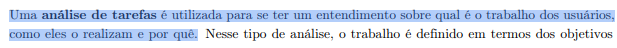
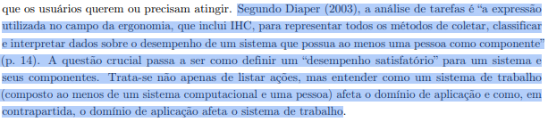

# Análise de Tarefas: HTA e CTT

## Histórico de Versão e Contribuição

| Data | Versão | Descrição | Autor(es) | Revisor(es) |
| :---: | :---: | :--- | :--- | :--- |
| 26/09/2026 | 1.0 | Criação do documento e preenchimento das análises de tarefas HTA e CTT. | [Igor Dantas](https://github.com/IgorDARAUJO) e [Gabriel Melo](https://github.com/gabriellcardone-06) | [Gabriel Melo](https://github.com/gabriellcardone-06) e [Igor Dantas](https://github.com/IgorDARAUJO) |
| 27/09/2026 | 1.1 | Modularização em artefatos dedicados por tarefa e estruturação da visão geral teórica. | [Carlos Costa](https://github.com/carloshfgit) | [Igor Dantas](https://github.com/IgorDARAUJO) e [Gabriel Melo](https://github.com/gabriellcardone-06) |
| 27/09/2026 | 1.2 | Inclusão das tarefas operacionais TAR-03 e TAR-04 da persona Valdir Soares (motorista de ônibus) com HTA e CTT completos. | [Carlos Costa](https://github.com/carloshfgit) | [Igor Dantas](https://github.com/IgorDARAUJO) e [Gabriel Melo](https://github.com/gabriellcardone-06) |

---

## 1. Introdução

Neste conjunto de documentos estão registradas as análises de tarefas produzidas pelos participantes do projeto. Para cada tarefa avaliada, foram aplicadas duas técnicas complementares da literatura de Interação Humano-Computador: a **Análise Hierárquica de Tarefas (HTA - *Hierarchical Task Analysis*)**, que detalha a decomposição dos objetivos em suboperações e planos, e o **ConcurTaskTrees (CTT)**, que modela graficamente as relações temporais e lógicas entre as tarefas (Barbosa et al., 2021, p. 163–164).

### 1.1 Análise Hierárquica de Tarefas (HTA)

Desenvolvida originalmente por Annett e Duncan (1967), a HTA busca identificar os objetivos de alto nível dos usuários e decompor sistematicamente esses objetivos em subobjetivos e operações (ações físicas ou cognitivas elementares). Além da hierarquia, a técnica define **planos** de execução (sequenciais, condicionais, cíclicos ou concorrentes) e critérios objetivos de sucesso e parada baseados na regra *p* × *c* (probabilidade de erro multiplicada pelo custo do erro).

### 1.2 ConcurTaskTrees (CTT)

Proposta por Paternò (1999), a notação CTT fornece uma modelagem gráfica flexível e rigorosa para expressar a concorrência e a dinâmica temporal das tarefas. No modelo CTT, as tarefas são classificadas em quatro categorias funcionais:
* **Tarefas de Usuário:** Atividades puramente cognitivas ou de decisão humana.
* **Tarefas de Aplicação:** Processamentos executados autonomamente pelo sistema.
* **Tarefas de Interação:** Ações que envolvem troca bilateral direta de informação entre o usuário e a interface gráfica.
* **Tarefas Abstratas:** Composição complexa que engloba diferentes tipos subordinados.

---

## 2. Quadro Consolidado de Tarefas Analisadas

Na Tabela 1, apresenta-se o quadro consolidado com todas as análises realizadas, seus respectivos responsáveis, status e links de acesso direto:

<strong>Tabela 1</strong> — Registro das Análises de Tarefas (HTA e CTT)

| ID | Tarefa Analisada | Data de Realização | Responsáveis (Elaboração) | Status HTA | Status CTT | Documento Completo |
| :---: | :--- | :---: | :--- | :---: | :---: | :---: |
| **TAR-01** | Alerta inteligente de saída | 23/09/2026 | [Igor Dantas](https://github.com/IgorDARAUJO) | Concluído | Concluído | [Acessar Análise](tar-01-alerta-saida.md) |
| **TAR-02** | Pré-agendamento no Programa DF Acessível | 24/09/2026 | [Gabriel Melo](https://github.com/gabriellcardone-06) | Concluído | Concluído | [Acessar Análise](tar-02-df-acessivel.md) |
| **TAR-03** | Consultar escala de trabalho e horários homologados | 26/09/2026 | [Carlos Costa](https://github.com/carloshfgit) | Concluído | Concluído | [Acessar Análise](analise-hta-ctt-motorista.md#32-hta-tar-03-consultar-escala-de-trabalho-e-horarios-homologados-da-linha) |
| **TAR-04** | Receber e processar alerta operacional de trânsito | 26/09/2026 | [Carlos Costa](https://github.com/carloshfgit) | Concluído | Concluído | [Acessar Análise](analise-hta-ctt-motorista.md#33-hta-tar-04-receber-e-processar-alerta-operacional-emergencial-de-transito) |

<em>Fonte: Autores (2026).</em>

---

## 3. Fotos de Referência Teórica

<em>Imagem 1 — Fundamentação teórica de Análise de Tarefas: HTA (Barbosa et al., 2021, Seção 8.4, p. 163).</em>

 

<em>Imagem 2 — Fundamentação teórica de Análise de Tarefas: Notação CTT (Barbosa et al., 2021, Seção 8.4, p. 164).</em>

---

## 4. Referências Bibliográficas

* ANNETT, John; DUNCAN, Keith D. **Task analysis and training design**. *Journal of Occupational Psychology*, v. 41, n. 4, p. 211–221, 1967.
* BARBOSA, Simone Diniz Junqueira; SILVA, Bruno Santana da; SILVEIRA, Milene Selbach; GASPARINI, Isabela; DARIN, Ticianne; BARBOSA, Gabriel Diniz Junqueira. **Interação Humano-Computador e Experiência do Usuário**. Rio de Janeiro: Autopublicação, 2021. ISBN 978-65-00-19677-1. Seção 8.4: Análise de Tarefas (pp. 163–175).
* PATERNÒ, Fabio. **Model-Based Design and Evaluation of Interactive Applications**. London: Springer-Verlag, 1999.
