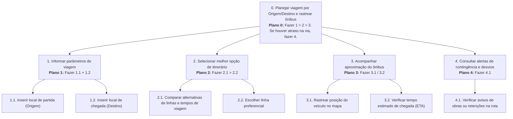
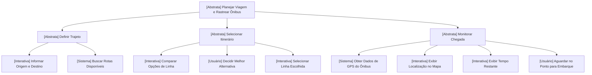

# TAR-03: Planejamento de Rota por Origem e Destino com Monitoramento em Tempo Real

## Histórico de Versão e Contribuição

| Data | Versão | Descrição | Autor(es) | Revisor(es) |
| :---: | :---: | :--- | :--- | :--- |
| 27/09/2026 | 1.0 | Elaboração completa da Análise de Tarefas (HTA, CTT e GOMS/KLM) para a tarefa do Passageiro Cotidiano. | [Arthur Mariani](https://github.com/arthur-mariani) e [Lucas Araújo](https://github.com/Lucasaraujoszz) | [Carlos Costa](https://github.com/carloshfgit) |

---

## 1. Caracterização da Tarefa

* **Identificador da Tarefa:** `TAR-03`
* **Título:** Planejamento de Deslocamento por Origem/Destino e Rastreamento de Veículo em Tempo Real
* **Persona Primária Associada:** [Marcos Paulo Vieira (Passageiro Cotidiano)](../personas/marcos-paulo-vieira.md)
* **Perfil de Usuário:** [Passageiro do STPC/DF (Usuário Primário)](../perfis-de-usuario/perfil-primario.md)
* **Responsável pela Elaboração:** [Lucas Araújo](https://github.com/Lucasaraujoszz)
* **Objetivo da Tarefa:** Permitir que o passageiro descubra a rota ótima e as linhas de ônibus disponíveis para seu deslocamento diário inserindo apenas sua localização atual e o ponto de chegada desejado, acompanhando visualmente a posição georreferenciada do ônibus para minimizar seu tempo de espera na parada e evitar atrasos.

---

## 2. Análise Hierárquica de Tarefas (HTA)

A **Análise Hierárquica de Tarefas (HTA - *Hierarchical Task Analysis*)** foi desenvolvida na década de 1960 por Annett e Duncan (1967) e consolidada em IHC para desdobrar tarefas complexas em objetivos, subobjetivos e operações atômicas, mapeando falhas de desempenho e riscos operacionais (Barbosa e Silva, 2010, pp. 192–196).

### 2.1 Diagrama HTA

### 2.2 Tabela HTA (com Problemas e Recomendações de IHC)

Conforme Barbosa & Silva (2010, p. 193), cada operação é especificada pela tupla ⟨Input, Ação, Feedback⟩. O critério de parada adotado é o **p × c** (probabilidade de erro multiplicada pelo custo do erro).

A Tabela 1 apresenta a decomposição hierárquica da tarefa e relaciona seus objetivos aos problemas do sistema atual e às recomendações de design propostas.

<strong>Tabela 1</strong> — Tabela da Análise Hierárquica de Tarefas (HTA) da TAR-03

| Objetivos e Operações | Relações / Planos | Problemas Detectados no Sistema Atual | Recomendações de Design de IHC |
| :--- | :--- | :--- | :--- |
| **0. Planejar viagem e rastrear ônibus** | **Plano 0:** Executar `1 > 2 > 3`. Em caso de alerta de retenção na rota, executar `4`. | O portal atual não integra o planejamento ao rastreamento, forçando navegação em telas separadas ou apps externos. | Integrar em uma única tela fluida a consulta de rota e a visualização do veículo em tempo real. |
| **1. Informar parâmetros de viagem** | **Plano 1:** Executar `1.1 + 1.2` em qualquer ordem. | O portal exige que o usuário saiba o número da linha (ex.: 0.818), não possuindo busca textual por nome de bairros ou pontos notórios. | Implementar campos com preenchimento automático (*autocomplete*) e geolocalização automática por GPS do aparelho. |
| **1.1. Inserir local de partida** | Operação: ⟨Localização atual / endereço, Digitar ou aceitar GPS, Ponto de partida marcado no mapa⟩ | O usuário tem que selecionar a parada por lista codificada incompreensível. | Permitir botão "Usar minha localização atual". |
| **1.2. Inserir local de chegada** | Operação: ⟨Nome do local de destino, Digitar texto de referência, Destino fixado⟩ | Falha de busca caso o nome não seja exatamente o cadastrado no banco administrativo. | Permitir sinônimos populares ("SIA", "ParkShopping", "UnB"). |
| **2. Selecionar itinerário** | **Plano 2:** Executar `2.1 > 2.2`. | Listagem estática em PDF com horários teóricos de saída que desconsideram o trânsito real. | Apresentar cards de rotas com tempo estimado total, número da linha e tarifa correspondente. |
| **2.1. Comparar alternativas de linhas** | Operação: ⟨Lista de opções calculadas, Examinar trajetos, Seleção da linha mais vantajosa⟩ | Falta de clareza se a linha é semiexpressa ou parador. | Indicar visualmente o tipo da linha (Expressa, Direta ou Circular) e integrações necessárias. |
| **2.2. Escolher linha preferencial** | Operação: ⟨Card da rota escolhida, Clicar no botão 'Ver ônibus', Abertura do mapa em tempo real⟩ | Botões pequenos que exigem múltiplos toques na tela móvel. | Aumentar área de toque (alvo de Fitts) respeitando o padrão móvel de no mínimo 48x48 px. |
| **3. Acompanhar aproximação** | **Plano 3:** Executar `3.1` e `3.2` simultaneamente na mesma tela. | O usuário precisa atualizar a página manualmente (*F5*), o que costuma travar o navegador por falhas de cache. | Atualização automática periódica (via WebSocket/SSE) com contador regressivo em minutos. |
| **3.1. Rastrear posição no mapa** | Operação: ⟨Coordenadas GPS do veículo, Visualizar ícone em movimento, Identificar proximidade da parada⟩ | O mapa demora excessivamente para carregar em 4G, exibindo blocos cinzas sem renderização. | Otimizar camada vetorial do mapa para dispositivos móveis com baixo consumo de dados. |
| **3.2. Verificar tempo estimado (ETA)** | Operação: ⟨Distância e velocidade da via, Leitura do tempo estimado, Preparação para o embarque⟩ | Informação expressa em horário fixo em vez de contagem em minutos restantes ("passa às 07h12" vs "chega em 4 min"). | Apresentar *"Chega em X min"* com sinalizador de trânsito lento. |
| **4. Consultar alertas de desvios** | **Plano 4:** Executar `4.1` quando houver interdição. | Notícias de desvios estão misturadas com releases de assessoria de imprensa no portal. | Exibir *badge* de alerta contextual diretamente no card da linha selecionada. |

<em>Fonte: Lucas Araújo Lima (2026).</em>

---

## 3. ConcurTaskTrees (CTT)

O modelo **ConcurTaskTrees (CTT)**, proposto por Fabio Paternò (1999, 2000), descreve graficamente as tarefas com foco na concorrência, suporte computacional e dinâmica de interação (Barbosa e Silva, 2010, pp. 203–205).

### 3.1 Classificação dos Nós no CTT

* **Tarefa Abstrata (Nuvem):** Tarefas compostas que englobam subníveis hierárquicos.
* **Tarefa do Usuário (Figura Humana):** Atividades estritamente cognitivas ou do mundo real (ex.: decidir rota, caminhar até a parada).
* **Tarefa Interativa (Usuário com Sistema):** Ações de entrada e diálogo bilateral com a interface (ex.: digitar destino, tocar em card).
* **Tarefa do Sistema (Computador):** Processamentos autônomos internos do software (ex.: calcular rotas, consultar API do GPS).

### 3.2 Estrutura Formal e Operadores Lógicos CTT

#### Relações Temporais Formais da Tarefa:
1. `Definir Trajeto []>> Selecionar Itinerário`: Ativação sequencial com passagem de informação (as opções de rota dependem das coordenadas de origem e destino fornecidas).
2. `Informar Origem e Destino >> Buscar Rotas Disponíveis`: O sistema só inicia o algoritmo de busca após o usuário submeter os parâmetros.
3. `Comparar Opções [] Decidir Melhor Alternativa >> Selecionar Linha`: Processo de escolha e decisão cognitiva que culmina na seleção.
4. `Obter GPS []>> (Exibir Localização ||| Exibir Tempo Restante)`: O sistema recupera a telemetria do veículo e atualiza concomitantemente (`|||`) o mapa e o contador de minutos.
5. `(Exibir Localização ||| Exibir Tempo) [> Embarcar no Ônibus`: Desativação (*deactivation*) — o monitoramento é cancelado no momento em que o passageiro realiza o embarque físico no ônibus.

---

## 4. Análise Preditiva de Desempenho com GOMS / KLM (*Card, Moran & Newell, 1983*)

O **Keystroke-Level Model (KLM)** é uma técnica analítica da família GOMS que prevê o tempo de execução de uma tarefa rotineira realizada por um usuário competente sem erros (Barbosa & Silva, 2010, pp. 198–200; Kieras, 1993).

### 4.1 Operadores Padrão Adotados e Tempos de Referência

* **K (Pressionar Tecla / Toque no Teclado Virtual Móvel):** 0,20 s (usuário mediano em smartphone).
* **P (Apontar com o Dedo / Toque em Elemento da Tela):** 1,10 s (equivalente funcional ao apontamento de Fitts).
* **B (Tocar / Pressionar na Tela):** 0,10 s.
* **H (Reposicionar Mão / Ajustar Empunhadura do Celular):** 0,40 s.
* **M (Preparação Mental / Decisão Cognitiva):** 1,20 s.
* **W(t) (Tempo de Espera pela Resposta do Servidor/Rede):** Variável de acordo com a arquitetura do sistema.

---

### 4.2 Comparação Paramétrica de Métodos

#### Método 1: Fluxo Atual (Consulta Indireta com Redirecionamento e Busca Cega)
No modelo atual, o usuário abre o portal, fecha modais de propaganda, descobre que precisa do código da linha, pesquisa externamente e navega por tabelas pesadas.

A Tabela 2 estima, por meio do KLM, o tempo necessário para executar esse fluxo atual e evidencia o custo das etapas de navegação e espera.

<strong>Tabela 2</strong> — Predição de Tempo KLM para o Método Atual

| Passo | Operador KLM | Descrição do Operador | Duração (s) |
|---|:---:|---|:---:|
| 1 | **M** | Preparar-se mentalmente para procurar a área de linhas na Home | 1,20 |
| 2 | **P** | Deslocar o polegar até o menu de serviços | 1,10 |
| 3 | **B** | Tocar no link de linhas | 0,10 |
| 4 | **W** | Espera pelo carregamento do redirecionamento externo | 3,50 |
| 5 | **M** | Perceber o modal invasivo sugerindo baixar aplicativo | 1,20 |
| 6 | **P** | Mirar no botão de fechar (alvo pequeno) | 1,10 |
| 7 | **B** | Tocar para fechar o modal | 0,10 |
| 8 | **M** | Tentar lembrar ou deduzir o código da linha para o destino | 1,20 |
| 9 | **P** | Tocar no campo de código da linha | 1,10 |
| 10 | **K (5x)** | Digitar o número com 4 caracteres e ponto (ex.: 0.818) | 1,00 |
| 11 | **P** | Tocar no botão 'Consultar' | 1,10 |
| 12 | **W** | Espera do processamento e carregamento da tabela | 4,00 |
| 13 | **M** | Ler tabela de horários estática para interpretar o próximo | 1,20 |
| **TOTAL** | — | **Tempo Total Estimado (Método Atual)** | **17,80 s** |

<em>Fonte: Lucas Araújo Lima (2026), baseado em Card et al. (1983) e Kieras (1993).</em>

*(Nota: Este tempo considera um cenário ideal sem travamento de cache; nos casos reais reportados no Cenário 3, o tempo ultrapassa 50 segundos com falha de conexão).*

---

#### Método 2: Fluxo Projetado (Busca Direta por Origem/Destino e Rastreamento Integrado)
No modelo reprojetado, o campo de destino está disponível imediatamente no topo da página inicial com preenchimento preditivo e geolocalização automática.

A Tabela 3 estima o tempo do fluxo reprojetado, permitindo compará-lo ao método atual e avaliar o ganho de eficiência previsto.

<strong>Tabela 3</strong> — Predição de Tempo KLM para o Método Reprojetado

| Passo | Operador KLM | Descrição do Operador | Duração (s) |
|---|:---:|---|:---:|
| 1 | **M** | Decidir inserir o destino desejado | 1,20 |
| 2 | **P** | Tocar no campo 'Para onde você vai?' na Home | 1,10 |
| 3 | **K (3x)** | Digitar primeiras letras do destino (ex.: "SIA") | 0,60 |
| 4 | **M** | Reconhecer a sugestão do destino na lista automática | 1,20 |
| 5 | **P** | Tocar na opção "SIA Trecho 3" sugerida | 1,10 |
| 6 | **W** | Resposta instantânea da API de rotas integradas | 1,00 |
| 7 | **M** | Identificar o card da rota mais rápida em destaque | 1,20 |
| 8 | **P** | Tocar no card para abrir o mapa em tempo real | 1,10 |
| 9 | **W** | Renderização imediata do mapa vetorial leve com o ônibus | 1,20 |
| **TOTAL** | — | **Tempo Total Estimado (Método Reprojetado)** | **9,70 s** |

<em>Fonte: Lucas Araújo Lima (2026), baseado em Card et al. (1983) e Kieras (1993).</em>

### 4.3 Conclusão da Análise KLM
O fluxo reprojetado reduz o tempo preditivo de execução da tarefa de **17,80 s para 9,70 s** (um ganho de eficiência de **45,5%**), além de eliminar **4 operadores mentais de dúvida (M)** causados pela desorientação do código da linha e pelo modal indesejado, comprovando um salto substancial na **facilidade de aprendizado e eficiência de uso** (*Nielsen, 1993; Barbosa & Silva, 2010*).

---

## 5. Referências Bibliográficas

* ANNETT, John; DUNCAN, Keith D. **Task analysis and training design**. *Journal of Occupational Psychology*, v. 41, n. 4, p. 211–221, 1967.
* BARBOSA, Simone Diniz Junqueira; SILVA, Bruno Santana da. **Interação Humano-Computador**. Rio de Janeiro: Elsevier / Campus, 2010. Capítulo 6: Organização do Espaço de Problema — Análise de Tarefas (pp. 191–205).
* CARD, Stuart K.; MORAN, Thomas P.; NEWELL, Allen. **The Psychology of Human-Computer Interaction**. Hillsdale: Lawrence Erlbaum Associates, 1983.
* KIERAS, David. **Using the Keystroke-Level Model to Estimate Execution Times**. Ann Arbor: University of Michigan, 1993.
* PATERNÒ, Fabio. **Model-Based Design and Evaluation of Interactive Applications**. London: Springer-Verlag, 1999.
