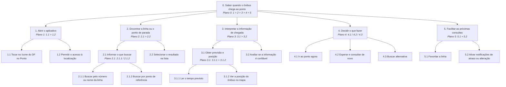

# TAR-06: Consulta de ônibus em tempo real no DF no Ponto

## Histórico de Versão e Contribuição

| Data | Versão | Descrição | Autor(es) | Revisor(es) |
| :---: | :---: | :--- | :--- | :--- |
| 27/09/2026 | 1.0 | Elaboração da Análise de Tarefas (HTA e GOMS) para a consulta de ônibus em tempo real no DF no Ponto. | [Rodrigo Barbosa](https://github.com/RodrigoCBarbosa) | [Arthur Mariani](https://github.com/arthur-mariani) |


---

## 1. Introdução

Este documento analisa a tarefa de consultar, no aplicativo DF no Ponto, quando um ônibus chegará à parada. A HTA organiza objetivos, operações, problemas e hipóteses de erro, enquanto o modelo GOMS descreve estratégias possíveis de consulta; como a análise se baseia em documentação, seus resultados permanecem como hipóteses a validar com usuários e com o sistema em uso.

## 2. Caracterização da Tarefa

* **Título da Tarefa:** Consulta de ônibus em tempo real no DF no Ponto
* **Perfil do Participante:** Usuário primário / Passageiro do transporte coletivo do DF ([Persona](../personas/mariana-borges-almeida.md))
* **Responsáveis pela Elaboração:** Rodrigo Barbosa
* **Data da Realização:** [27/09/2026]
* **Sistema analisado:** Aplicativo DF no Ponto, da Secretaria de Transporte e Mobilidade do DF (Semob-DF), lançado em julho de 2025.
* **Objetivo da Tarefa (estado final):** O passageiro sabe quando o ônibus chega ao ponto de parada e, com base nisso, definiu o que fazer (ir ao ponto, esperar ou buscar alternativa).
* **Objetivo de experiência (hipótese):** Não se sentir perdido ou sem informação enquanto espera o ônibus.
* **Escopo:** A tarefa não inclui a recarga do Cartão Mobilidade, que é feita pelos canais do BRB Mobilidade e não pelo DF no Ponto.
* **Fontes de dados:** documentação pública da Semob-DF e matéria jornalística sobre o aplicativo (ver Referências). Não houve observação nem entrevista com usuários.

> **Limitação declarada.** Conforme Barbosa et al. (2021, p. 191–192), os dados de uma análise de tarefas são sempre uma simulação das tarefas reais, e a observação do desempenho é um insumo importante, complementado por entrevistas, questionários e sistemas existentes. Esta análise foi feita a partir de documentação, portanto os passos de interface, os problemas e as recomendações abaixo são **hipóteses a validar** com usuários e com o aplicativo aberto.

---

## 3. Análise Hierárquica de Tarefas (HTA)

Segundo Barbosa et al. (2021, p. 192–193), a HTA parte dos **objetivos** das pessoas (estados finais) e os decompõe em subobjetivos. Os subobjetivos e a relação entre eles formam um **plano**, e no nível mais baixo cada subobjetivo é alcançado por uma **operação**. Os planos usam a notação da Figura 6.1 do livro:

A Tabela 1 apresenta os símbolos utilizados nos planos e esclarece a relação representada por cada um deles.

**Tabela 1** — Notação utilizada nos planos da HTA

| Notação | Relação entre os subobjetivos |
| :---: | :--- |
| `1>2` | sequencial (um objetivo deve ser atingido antes do próximo) |
| `1/2` | seleção (qual objetivo será atingido depende das circunstâncias) |
| `1+2` | paralelo (mais de um objetivo atingido ao mesmo tempo) |

Nos rótulos abaixo, os números do plano se referem aos subobjetivos do próprio objetivo (por exemplo, o plano `1>2` do objetivo 1 trata de 1.1 e 1.2), como na Figura 6.2 do livro. Itens marcados com **(operação)** estão no nível mais baixo da hierarquia.

### 3.1 Diagrama hierárquico



<div align="center">
<p><strong>Figura 1</strong> — Diagrama HTA da consulta de ônibus em tempo real no DF no Ponto.</p>
<p><em>Legenda: a numeração decimal indica os níveis de decomposição; as setas conectam objetivos aos seus subobjetivos; “&gt;” indica sequência, “/” indica seleção conforme as circunstâncias e “+” indica execução paralela.</em></p>
<p><em>Fonte: Rodrigo Barbosa (2026).</em></p>
</div>

### 3.2 Tabela de objetivos, operações, problemas e recomendações

A Tabela 2 segue o formato da Tabela 6.3 do livro: cada objetivo tem *input* (circunstâncias que o ativam), *feedback* (condição que indica o atingimento), *plano* e, quando houver, *problema* e *recomendação*. Essa organização permite relacionar a decomposição da tarefa às oportunidades de melhoria.

**Tabela 2** — Objetivos, operações, problemas e recomendações da HTA

| objetivos / operações | problemas e recomendações |
| :--- | :--- |
| **0. Saber quando o ônibus chega ao ponto** 1>2>3>4>5 | *input*: necessidade de saber quando o ônibus chega; smartphone com o aplicativo e conexão de dados<br>*feedback*: o passageiro sabe se vai ao ponto, espera ou busca alternativa<br>*plano*: abrir o aplicativo **e depois** encontrar a linha ou o ponto, **e depois** interpretar a informação, **e depois** decidir o que fazer. O objetivo 5 é feito apenas por quem usa a linha com frequência (regra de seleção) |
| **1. Abrir o aplicativo** 1>2 | *input*: passageiro com o aplicativo instalado<br>*feedback*: tela inicial do aplicativo exibida<br>*plano*: tocar no ícone **e depois** permitir a localização (só se o aplicativo solicitar, no primeiro uso) |
| 1.1 Tocar no ícone do DF no Ponto | |
| 1.2 Permitir o acesso à localização | *problema (hipótese)*: o usuário nega a permissão e deixa de receber sugestões de pontos próximos<br>*recomendação*: explicar, no momento do pedido, para que a localização é usada |
| **2. Encontrar a linha ou o ponto de parada** 1>2 | *input*: linha ou local de interesse do passageiro<br>*feedback*: linha ou ponto de parada selecionado<br>*plano*: informar o que buscar **e depois** selecionar o resultado |
| **2.1 Informar o que buscar** 1/2 | *plano*: buscar pelo número ou nome da linha **ou** buscar por ponto de referência. Se o usuário sabe a linha, usa 2.1.1. Senão, usa 2.1.2 |
| 2.1.1 Buscar pelo número ou nome da linha | *problema (hipótese)*: exige que o usuário lembre o número ou o nome da linha<br>*recomendação*: oferecer atalho para linhas usadas antes |
| 2.1.2 Buscar por ponto de referência | *observação*: a busca aceita locais como shopping, hospital e escola, o que atende quem não sabe o nome da parada nem o número da linha<br>*recomendação*: manter esse caminho tão visível quanto a busca por linha |
| 2.2 Selecionar o resultado na lista | *problema (hipótese)*: vários pontos de parada ou linhas próximos podem gerar seleção errada |
| **3. Interpretar a informação de chegada** 1>2 | *input*: linha ou ponto selecionado<br>*feedback*: o passageiro formou uma expectativa confiável do horário de chegada<br>*plano*: obter previsão e posição **e depois** avaliar a confiabilidade |
| **3.1 Obter previsão e posição** 1+2 | *plano*: ler o tempo previsto **e** ver a posição no mapa |
| 3.1.1 Ler o tempo previsto | |
| 3.1.2 Ver a posição do ônibus no mapa | |
| 3.2 Avaliar se a informação é confiável | *problema*: a posição em tempo real depende do rastreador do veículo e da comunicação de dados, então pode ficar defasada por alguns minutos se o equipamento falhar ou o ônibus passar por área sem cobertura<br>*recomendação (hipótese)*: indicar a hora da última atualização da posição |
| **4. Decidir o que fazer** 1/2/3 | *input*: previsão e posição avaliadas<br>*feedback*: ação escolhida<br>*plano*: ir ao ponto **ou** esperar e consultar de novo **ou** buscar alternativa, conforme o tempo disponível e a confiança na informação |
| 4.1 Ir ao ponto agora | |
| 4.2 Esperar e consultar de novo | |
| 4.3 Buscar alternativa | *problema (hipótese)*: se a informação estava defasada e não foi percebida, o passageiro decide com base em dado errado |
| **5. Facilitar as próximas consultas** 1+2 | *input*: uso frequente da mesma linha<br>*feedback*: linha salva e alertas ativos<br>*plano*: favoritar a linha **e** ativar as notificações (o aplicativo permite receber aviso de atraso ou alteração) |
| 5.1 Favoritar a linha | |
| 5.2 Ativar notificações de atraso ou alteração | |

### 3.3 Critério de parada da decomposição

Conforme o livro (p. 195), a decomposição termina quando se têm as informações necessárias para os objetivos da análise, e um critério é o **p × c**: parar quando o produto da probabilidade de falha (*p*) pelo custo da falha (*c*) é julgado aceitável.

* **Objetivo 3.2 (avaliar a confiabilidade)** foi tratado como operação separada porque o custo da falha é alto (perder o ônibus ou esperar sem necessidade) e a defasagem da posição torna a falha plausível.
* **Objetivos 1, 4 e 5** não foram decompostos além das operações, pois a falha nesses pontos tem custo baixo e é facilmente corrigida pelo usuário.
* **Objetivo 2** foi decomposto em dois níveis porque envolve uma escolha entre duas estratégias (linha ou ponto de referência), o que gera o plano de seleção `1/2`.

### 3.4 Hipóteses sobre erros (classificação de Reason, 1990)

Na etapa 7 da HTA (p. 196), o livro sugere classificar erros como baseados em habilidades, regras ou conhecimento:

A Tabela 3 aplica essa classificação às operações com maior possibilidade de falha e registra as hipóteses que deverão ser verificadas posteriormente.

**Tabela 3** — Hipóteses de erro nas operações analisadas

| Operação | Tipo de erro | Hipótese |
| :--- | :--- | :--- |
| 2.2 | Habilidades | Toque impreciso ao selecionar um item em uma lista com opções próximas. |
| 3.2 | Regras | Classificação equivocada da situação: tratar uma posição defasada como se fosse atual e aplicar a regra "se o ônibus está perto, vou ao ponto". |
| 2.1 | Conhecimento | Usuário novo que não sabe que a busca por ponto de referência existe e desiste ao não lembrar o número da linha. |

### 3.5 Situação dos passos da HTA (Diaper, 2003, apud Barbosa et al., 2021, p. 195–196)

A Tabela 4 registra o andamento metodológico da análise e torna explícitas as etapas concluídas, parciais e ainda pendentes de validação.

**Tabela 4** — Situação dos passos metodológicos da HTA

| Passo | Situação |
| :--- | :--- |
| 1. Decidir os objetivos da análise | Feito: avaliar um sistema existente (DF no Ponto) e propor melhorias. |
| 2. Consenso sobre objetivos e medidas de sucesso | Parcial. Evidência de sucesso: o passageiro consegue informar quando o ônibus chega. Consequência da falha: perder o ônibus ou esperar sem necessidade. **Consenso com as partes interessadas pendente.** |
| 3. Fontes de informação e aquisição de dados | Parcial: apenas documentação pública. **Observação e entrevistas pendentes.** |
| 4. Esboçar diagrama e tabela | Feito (seções 3.1 e 3.2). |
| 5. Verificar a validade com as partes interessadas | **Pendente.** |
| 6. Identificar operações significativas (p × c) | Feito (seção 3.3). |
| 7. Gerar hipóteses sobre aprendizado e desempenho | Feito como hipóteses (seção 3.4), **sem teste**. |

---

## 4. GOMS

Segundo Barbosa et al. (2021, p. 196–198), o GOMS descreve a tarefa e o conhecimento do usuário em termos de **objetivos** (*goals*), **operadores** (*operators*), **métodos** (*methods*) e **regras de seleção** (*selection rules*). Ele se aplica principalmente a usuários que **já dominam** a tarefa, e costuma ser usado depois de uma análise básica de tarefas, que aqui é a HTA da seção 3.

Adotou-se o **CMN-GOMS**, cuja notação é de pseudocódigo com hierarquia estrita de objetivos, operadores em ordem sequencial e métodos com condicionais. Como nos Exemplos 6.7 e 6.8 do livro, **algarismos indicam sequência e letras indicam alternativas**. O nível de detalhe é o do Exemplo 6.8 (modelo detalhado), e só foram incluídas as tarefas mentais relacionadas ao design do sistema.

> **Perfil assumido para o GOMS:** passageiro que já conhece o aplicativo e sabe usá-lo. Para um usuário novato, que ainda está descobrindo o que fazer, o GOMS não é a técnica indicada.

### 4.1 Modelo CMN-GOMS

```
GOAL 0: saber quando o ônibus chega ao ponto
  GOAL 1: abrir o aplicativo
    OP. 1.1: localizar o ícone do DF no Ponto
    OP. 1.2: tocar no ícone

  GOAL 2: encontrar a linha ou o ponto de parada
    METHOD 2.A: buscar pelo número ou nome da linha
    (SEL. RULE: o usuário sabe o número ou o nome da linha)
      OP. 2.A.1: tocar no campo de busca
      OP. 2.A.2: digitar o número ou o nome da linha
      OP. 2.A.3: verificar os resultados da busca
      OP. 2.A.4: tocar na linha desejada
    METHOD 2.B: buscar por ponto de referência
    (SEL. RULE: o usuário não sabe a linha, mas conhece um local próximo, como shopping, hospital ou escola)
      OP. 2.B.1: tocar no campo de busca
      OP. 2.B.2: digitar o nome do local de referência
      OP. 2.B.3: verificar os resultados da busca
      OP. 2.B.4: tocar no ponto de parada próximo
      OP. 2.B.5: tocar na linha desejada

  GOAL 3: interpretar a informação de chegada
    OP. 3.1: ler o tempo previsto
    OP. 3.2: localizar o ônibus no mapa
    METHOD 3.A: aceitar a informação
    (SEL. RULE: a posição no mapa é coerente com o tempo previsto)
      OP. 3.A.1: considerar o tempo previsto como válido
    METHOD 3.B: verificar a informação
    (SEL. RULE: a posição parece parada ou não é coerente com o tempo previsto)
      OP. 3.B.1: consultar novamente a linha ou o ponto
      OP. 3.B.2: comparar com o horário previsto da linha

  GOAL 4: decidir o que fazer
    METHOD 4.A: ir ao ponto agora
    (SEL. RULE: o ônibus chega em tempo compatível com o deslocamento até o ponto)
      OP. 4.A.1: sair em direção ao ponto de parada
    METHOD 4.B: esperar e consultar de novo
    (SEL. RULE: o usuário já está no ponto e o tempo previsto é compatível com o tempo disponível)
      OP. 4.B.1: aguardar
      OP. 4.B.2: voltar à tela da linha e verificar a posição do ônibus
    METHOD 4.C: buscar alternativa
    (SEL. RULE: o tempo previsto é maior que o tempo disponível ou a informação não é confiável)
      OP. 4.C.1: escolher outra linha ou outro modo de transporte

  GOAL 5: facilitar as próximas consultas
  (usuário que usa a mesma linha com frequência)
    OP. 5.1: tocar em favoritar a linha
    OP. 5.2: ativar as notificações de atraso ou alteração
```

### 4.2 Leitura do modelo (análise qualitativa)

Conforme o livro (p. 197, 201), o GOMS qualitativo ajuda a perceber métodos semelhantes, métodos atipicamente curtos ou longos e pontos onde faltam métodos ou *feedback*:

1. **Métodos 2.A e 2.B têm as mesmas operações de interação e diferem só no conhecimento exigido** (lembrar a linha ou lembrar um local de referência). O método 2.B tem uma operação a mais (2.B.4), mas dispensa uma memória difícil. Isso sugere manter os dois igualmente acessíveis.
2. **O objetivo 3 é o ponto crítico.** O método 3.B só existe porque a posição pode ficar defasada, e nada no fluxo ajuda o usuário a decidir entre 3.A e 3.B. Um indicador de "última atualização" daria *feedback* para essa regra de seleção.
3. **Consistência com o objetivo 5:** favoritar a linha (5.1) reduz a necessidade do método 2.A, pois o usuário deixa de precisar lembrar e digitar o número da linha.

### 4.3 Sobre o KLM

O livro apresenta o KLM (Tabela 6.4 e Exemplo 6.6) para estimar tempos, mas seus operadores e durações foram definidos para teclado e mouse. Como o DF no Ponto é usado em tela de toque, a estimativa de tempo não foi feita aqui, para não aplicar valores fora do contexto da tabela.

---

## 5. Referências Bibliográficas

* BARBOSA, Simone Diniz Junqueira; SILVA, Bruno Santana da; SILVEIRA, Milene Selbach; GASPARINI, Isabela; DARIN, Ticianne; BARBOSA, Gabriel Diniz Junqueira. **Interação Humano-Computador e Experiência do Usuário**. Rio de Janeiro: Autopublicação, 2021. ISBN 978-65-00-19677-1. Capítulo 6, seção 6.4, p. 191–203.
* SECRETARIA DE TRANSPORTE E MOBILIDADE DO DISTRITO FEDERAL (Semob-DF). **Portal institucional**. Disponível em: <https://www.semob.df.gov.br/>. Acesso em: 27 set. 2026.
* SOU BRASÍLIA. **DF no Ponto: veja o horário do ônibus em tempo real no app da Semob**. Disponível em: <https://soubrasilia.com/df-no-ponto-app-semob-onibus-tempo-real-como-usar/>. Acesso em: 27 set. 2026.

