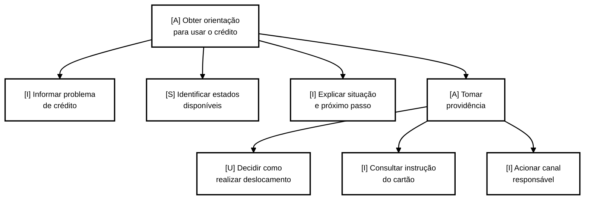

# TAR-07: Resolver indisponibilidade de crédito de Vale-Transporte

## Histórico de Versão e Contribuição

| Data | Versão | Descrição | Autor(es) | Revisor(es) |
| :---: | :---: | :--- | :--- | :--- |
| 05/10/2026 | 1.0 | Elaboração da análise de tarefas (HTA e CTT) para o problema de crédito de Vale-Transporte não disponível no cartão. | [Arthur Mariani](https://github.com/arthur-mariani) | [Carlos Costa](https://github.com/carloshfgit) |

---

## 1. Caracterização da Tarefa

* **Título da Tarefa:** Resolver a indisponibilidade de crédito de Vale-Transporte no cartão.
* **Perfil do Participante:** Usuária primária / passageira trabalhadora ([Maria Eduarda Santos](../personas/maria-eduarda-santos.md)).
* **Cenário de origem:** [Cenário 4 — Crédito de Vale-Transporte não disponível no cartão](../cenarios/cenario-4-credito-vale-transporte.md).
* **Responsável pela Elaboração:** [Arthur Mariani](https://github.com/arthur-mariani).
* **Data da Realização:** 05/10/2026.
* **Sistema e serviços analisados:** portal da SEMOB-DF, canais do BRB Mobilidade e comunicação com o RH do empregador.
* **Objetivo da tarefa (estado final):** Maria Eduarda sabe se o crédito foi enviado, processado e disponibilizado no cartão; conhece o responsável e o próximo passo para poder utilizá-lo, sem comprometer o deslocamento ao trabalho.
* **Objetivo de experiência:** não se sentir culpada, perdida ou constrangida ao receber a mensagem de saldo insuficiente.
* **Escopo:** a análise cobre a busca e a compreensão da orientação para resolver o problema. Não pressupõe acesso da SEMOB ou do BRB aos dados do empregador, nem afirma qual é o procedimento operacional correto para todos os cartões.

> **Limitação declarada.** Conforme Barbosa et al. (2021, p. 191–196), a análise de tarefas é uma simulação do trabalho real e deve ser validada com as partes interessadas. Esta análise parte do cenário de problema e de documentação pública; portanto, os passos, problemas e recomendações são **hipóteses a validar** com usuárias, RH, SEMOB-DF e BRB Mobilidade.

---

## 2. Análise Hierárquica de Tarefas (HTA)

Segundo Barbosa et al. (2021, p. 192–195), a HTA começa pelos objetivos das pessoas e os decompõe em subobjetivos. Os planos registram a relação entre subobjetivos: `1>2` indica sequência, `1/2` indica seleção conforme a circunstância e `1+2` indica atividades paralelas. No nível mais baixo, os subobjetivos são operações.

### 2.1 Diagrama hierárquico

```mermaid
flowchart TB
    classDef mono fill:#ffffff,stroke:#000000,stroke-width:2px,color:#000000,font-size:12px;
    linkStyle default stroke:#000000,stroke-width:1.5px;

    T0["0. Obter orientação<br/>para usar o crédito<br/><i>Plano: 1 > 2 > 3 > 4 > 5</i>"]:::mono

    T1["1. Identificar crédito<br/>indisponível<br/><i>Plano: 1.1 > 1.2</i>"]:::mono
    T2["2. Buscar orientação<br/>oficial<br/><i>Plano: 2.1 > 2.2</i>"]:::mono
    T3["3. Entender situação<br/>e responsável<br/><i>Plano: 3.1 + 3.2 + 3.3</i>"]:::mono
    T4["4. Decidir ação<br/>imediata<br/><i>Plano: 4.1 / 4.2</i>"]:::mono
    T5["5. Realizar ação<br/>indicada<br/><i>Plano: 5.1 / 5.2 / 5.3</i>"]:::mono

    T0 --> T1
    T0 --> T2
    T0 --> T3
    T0 --> T4
    T0 --> T5

    T11["1.1 Aproximar<br/>cartão"]:::mono
    T12["1.2 Reconhecer<br/>saldo insuficiente"]:::mono
    T1 --> T11
    T1 --> T12

    T21["2.1 Informar<br/>a dúvida"]:::mono
    T22["2.2 Abrir<br/>orientação"]:::mono
    T2 --> T21
    T2 --> T22

    T31["3.1 Verificar envio<br/>pelo empregador"]:::mono
    T32["3.2 Verificar estado<br/>no cartão"]:::mono
    T33["3.3 Identificar canal<br/>e procedimento"]:::mono
    T3 --> T31
    T3 --> T32
    T3 --> T33

    T41["4.1 Embarcar com<br/>alternativa"]:::mono
    T42["4.2 Adiar ou alterar<br/>deslocamento"]:::mono
    T4 --> T41
    T4 --> T42

    T51["5.1 Atualizar ou<br/>validar cartão"]:::mono
    T52["5.2 Solicitar<br/>correção"]:::mono
    T53["5.3 Registrar<br/>atendimento"]:::mono
    T5 --> T51
    T5 --> T52
    T5 --> T53
```



### 2.2 Tabela de objetivos, operações, problemas e recomendações

A Tabela 1 relaciona a decomposição da tarefa aos problemas identificados e às recomendações de design propostas para orientar a usuária diante do crédito indisponível.

**Tabela 1** — Objetivos, operações, problemas e recomendações da HTA

| Objetivos / operações | Problemas e recomendações |
| :--- | :--- |
| **0. Obter orientação para usar o crédito de Vale-Transporte** `1>2>3>4>5` | *Input:* mensagem de saldo insuficiente, cartão e necessidade de deslocamento.<br>*Feedback:* a usuária entende o estado do crédito, o responsável e o próximo passo.<br>*Plano:* identificar o problema, buscar orientação, compreender a situação, decidir como se deslocar e executar a ação indicada. |
| **1. Identificar a indisponibilidade do crédito** `1>2` | *Input:* tentativa de embarque.<br>*Feedback:* a usuária reconhece que o cartão não foi aceito.<br>*Plano:* aproximar o cartão e interpretar a resposta do validador. |
| 1.1 Aproximar o cartão do validador | |
| 1.2 Reconhecer a mensagem de saldo insuficiente | *Problema (hipótese):* a mensagem não distingue saldo inexistente, crédito em processamento ou cartão que exige atualização.<br>*Recomendação:* apresentar estado compreensível e próximo passo, sem atribuir culpa à usuária. |
| **2. Buscar orientação oficial** `1>2` | *Input:* dúvida sobre a causa e a solução.<br>*Feedback:* uma orientação acessível está aberta.<br>*Plano:* formular a dúvida e abrir o conteúdo encontrado. |
| 2.1 Informar a dúvida em busca ou canal de atendimento | *Problema (hipótese):* termos cotidianos como “crédito não caiu” podem não corresponder ao vocabulário institucional.<br>*Recomendação:* aceitar linguagem natural e oferecer atalhos para “crédito enviado, mas não disponível”. |
| 2.2 Abrir a orientação encontrada | *Problema (hipótese):* o fluxo pode dispersar a usuária entre SEMOB, BRB Mobilidade e empregador.<br>*Recomendação:* preservar o contexto do atendimento e explicar o papel de cada instituição. |
| **3. Entender a situação e o responsável** `1+2+3` | *Input:* orientação aberta e, quando disponível, confirmação do RH.<br>*Feedback:* estado do crédito, responsável e ação necessária conhecidos.<br>*Plano:* conferir, em paralelo conceitual, envio pelo empregador, disponibilidade no cartão e canal de resolução. |
| 3.1 Verificar se o empregador enviou o crédito | *Problema (hipótese):* a confirmação de envio é interpretada como disponibilidade imediata.<br>*Recomendação:* separar visualmente os estados “enviado”, “processado”, “disponível” e “pendente de atualização”. |
| 3.2 Verificar o estado do crédito no cartão | *Problema (hipótese):* a usuária não sabe se o cartão precisa de atualização nem onde fazê-la.<br>*Recomendação:* informar, quando aplicável, ação, local, horário e requisitos; se os dados não estiverem disponíveis, indicar o canal que os confirma. |
| 3.3 Identificar canal e procedimento adequados | *Problema (hipótese):* responsabilidades distribuídas criam encaminhamentos genéricos.<br>*Recomendação:* apresentar uma decisão orientada por estado, não apenas uma lista de instituições. |
| **4. Decidir a ação imediata** `1/2` | *Input:* horário de trabalho, recursos financeiros e orientação disponível.<br>*Feedback:* alternativa de deslocamento escolhida.<br>*Plano:* embarcar com alternativa disponível **ou** adiar/alterar o deslocamento, conforme o tempo e os recursos. |
| 4.1 Embarcar com alternativa disponível | *Problema (hipótese):* pagar em dinheiro pode comprometer a alimentação ou integração da viagem.<br>*Recomendação:* informar alternativas de atendimento compatíveis com rota e horário, para reduzir a recorrência do custo. |
| 4.2 Adiar ou alterar o deslocamento | |
| **5. Executar o próximo passo indicado** `1/2/3` | *Input:* procedimento e responsável identificados.<br>*Feedback:* cartão atualizado, solicitação registrada ou atendimento iniciado.<br>*Plano:* atualizar/validar cartão, solicitar correção ou registrar atendimento, conforme a causa identificada. |
| 5.1 Atualizar ou validar o cartão | |
| 5.2 Solicitar correção ao responsável | |
| 5.3 Registrar atendimento ou reclamação | |

### 2.3 Critério de parada da decomposição

Conforme Barbosa et al. (2021, p. 195), a decomposição termina quando já há informações suficientes para a análise, podendo-se aplicar o critério **p × c**: o produto da probabilidade de falha pelo custo da falha deve ser aceitável.

* O objetivo **3** foi decomposto porque há alta probabilidade de confusão entre envio, processamento e disponibilidade, e o custo pode ser atraso e perda de recursos financeiros.
* O objetivo **4** permanece em operações porque a escolha de meio de pagamento ou de deslocamento é externa ao serviço de orientação e depende de recursos pessoais da usuária.
* O objetivo **5** não é decomposto além das operações: os procedimentos concretos variam por cartão, serviço e confirmação das partes interessadas, devendo ser observados antes de detalhamento adicional.

### 2.4 Hipóteses sobre erros

Na etapa 7 da HTA, o livro sugere examinar hipóteses sobre desempenho baseado em habilidades, regras e conhecimento (Reason, 1990, apud Barbosa et al., 2021, p. 196).

A Tabela 2 aplica essa classificação às operações com maior possibilidade de falha e registra as hipóteses que deverão ser verificadas posteriormente.

**Tabela 2** — Hipóteses de erro nas operações analisadas

| Operação | Tipo de erro | Hipótese |
| :--- | :--- | :--- |
| 2.1 | Conhecimento | A usuária não conhece a expressão institucional utilizada para localizar a orientação. |
| 3.1 | Regras | A usuária aplica a regra “o RH enviou, então o cartão já funciona” a uma situação em que o crédito ainda não está disponível. |
| 3.3 | Conhecimento | A usuária atribui a resolução à instituição errada por não conhecer a divisão de responsabilidades. |
| 4.1 | Regras | Sob pressão de tempo, a usuária utiliza recursos reservados para outra necessidade sem saber se existe solução mais apropriada. |

### 2.5 Situação dos passos da HTA

A Tabela 3 registra o andamento metodológico da análise e torna explícitas as etapas concluídas, parciais e ainda pendentes de validação.

**Tabela 3** — Situação dos passos metodológicos da HTA

| Passo | Situação |
| :--- | :--- |
| 1. Decidir os objetivos da análise | Feito: analisar a orientação para resolver crédito indisponível. |
| 2. Consenso sobre objetivos e medidas de sucesso | Parcial. Sucesso: a usuária identifica o estado, o responsável e o próximo passo. Consequência da falha: atraso, gasto imprevisto e repetição do problema. **Validação com partes interessadas pendente.** |
| 3. Fontes de informação e aquisição de dados | Parcial: cenário de problema e documentação. **Observação e entrevistas específicas pendentes.** |
| 4. Esboçar diagrama e tabela | Feito (seções 2.1 e 2.2). |
| 5. Verificar a validade da decomposição | **Pendente.** |
| 6. Identificar operações significativas (p × c) | Feito (seção 2.3). |
| 7. Gerar hipóteses sobre aprendizado e desempenho | Feito como hipóteses (seção 2.4), **sem teste empírico**. |

---

## 3. ConcurTaskTrees (CTT)

O CTT representa tarefas de usuário, sistema, interação e tarefas abstratas, além das relações temporais entre elas (Barbosa et al., 2021, p. 203–205). A modelagem abaixo descreve a solução de interação desejada: um orientador integrado que explicita o estado do crédito e encaminha a usuária sem exigir que ela deduza responsabilidades entre instituições.

### 3.1 Estrutura formal e relações temporais

```text
[A] Obter orientação para usar o crédito de Vale-Transporte
 |
 |-- [I] Informar problema de crédito [ ] >>
 |-- [S] Identificar estados disponíveis [ ] >>
 |-- [I] Explicar situação e próximo passo [ ] >>
 \-- [A] Tomar providência
      |-- [U] Decidir como realizar o deslocamento []
      |-- [I] Consultar instrução para atualizar ou validar cartão []
      \-- [I] Acionar canal responsável []
```

* **`[ ] >>` — ativação com passagem de informação:** a descrição do problema é usada pelo sistema para identificar estados e elaborar a orientação.
* **`[]` — escolha:** após compreender a situação, a usuária seleciona a providência compatível com seu contexto; o sistema não deve impor uma instituição sem evidência suficiente.

### 3.2 Diagrama CTT



> **Limite do CTT.** A notação representa tarefas e relações temporais; problemas de prevenção e recuperação de erro permanecem registrados na HTA, porque o CTT não possui elementos próprios para esse tratamento (Barbosa et al., 2021, p. 205).

---

## 4. Referências Bibliográficas

* BARBOSA, Simone Diniz Junqueira; SILVA, Bruno Santana da. **Interação Humano-Computador**. Rio de Janeiro: Elsevier / Campus, 2010. Capítulo 6, Seção 6.4: Análise de Tarefas, pp. 191–205.
* PATERNÒ, Fabio. **Model-Based Design and Evaluation of Interactive Applications**. London: Springer-Verlag, 2000.
* REASON, James. **Human Error**. Cambridge: Cambridge University Press, 1990.
