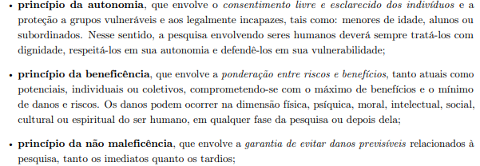
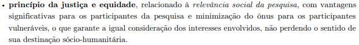

# Aspectos Éticos

## Histórico de Versão e Contribuição

| Data | Versão | Descrição | Autor(es) | Revisor(es) |
| :---: | :---: | :--- | :--- | :--- |
| 26/09/2026 | 1.0 | Criação do documento de organização dos aspectos éticos que foram utilizados no site do **SEMOB-DF**. | [Igor Dantas](https://github.com/IgorDARAUJO) | [Gabriel Melo](https://github.com/gabriellcardone-06) |

---

# Aspectos Éticos e Termo de Consentimento Livre e Esclarecido (TCLE)

Nesta seção, apresentam-se as diretrizes éticas que norteiam a coleta de dados e as pesquisas de campo do projeto de Interação Humano-Computador (IHC) para o sistema de mobilidade do Distrito Federal (SEMOB-DF / BRB Mobilidade), bem como o modelo de Termo de Consentimento Livre e Esclarecido (TCLE) elaborado para as atividades de investigação com participantes.

---

## 1. Diretrizes Éticas que Regem a Pesquisa

Toda pesquisa que envolve a participação de seres humanos — seja na fase de levantamento de requisitos, validação de personas ou testes de usabilidade — deve assegurar o respeito, a dignidade, a integridade e a proteção aos direitos dos participantes.

As práticas adotadas neste projeto seguem as orientações éticas consolidadas na literatura de IHC e na legislação brasileira. No Brasil, as pesquisas envolvendo pessoas são respaldadas pelas **Resoluções nº 466/2012 e nº 510/2016 do Conselho Nacional de Saúde (CNS)**, as quais definem quatro princípios éticos fundamentais incorporados a este trabalho, presentes nas imagens 1 e 2 (Barbosa et al., 2021, Seção 7.4, p. 126–127):

1. **Princípio da Autonomia:** Garante o consentimento livre e esclarecido dos indivíduos em participar da pesquisa, assegurando o respeito à sua vontade de ingressar, recusar ou abandonar o estudo a qualquer momento sem penalidades.
2. **Princípio da Beneficência:** Exige a ponderação entre riscos e benefícios (potenciais e atuais), comprometendo-se com o máximo de proveito gerado para o participante e para a sociedade com o mínimo de danos.
3. **Princípio da Não Maleficência:** Assegura a garantia de evitar danos previsíveis e constrangimentos (físicos, psíquicos, morais ou intelectuais) decorrentes das atividades de pesquisa.
4. **Princípio da Justiça e Equidade:** Requer a relevância social da pesquisa, garantindo a justa consideração dos interesses envolvidos e a proteção aos participantes.

### Diretrizes de IHC Aplicadas na Coleta de Dados

Com base nas diretrizes de pesquisas em IHC descritas por Barbosa et al. (2021, p. 127–128), a condução das atividades com usuários neste projeto obedece aos seguintes compromissos:

* **Esclarecimento Prévio:** O pesquisador explica claramente os objetivos da investigação, o tempo de duração estimado, os métodos de coleta de dados e como as informações serão utilizadas.
* **Privacidade e Confidencialidade:** Os dados brutos coletados (áudios, transcrições e anotações) são de acesso exclusivo da equipe de projeto.
* **Garantia de Anonimato:** Em todos os relatórios e publicações, a identidade dos participantes é preservada por meio do uso de nomes fictícios ou códigos de identificação.
* **Gravação Mediante Autorização:** O registro de áudio ou imagem ocorre exclusivamente após permissão expressa e documentada do participante.
* **Conforto e Respeito:** O ambiente de interação é planejado para evitar qualquer tipo de fadiga ou estresse emocional. Adicionalmente, enfatiza-se ao participante que o objeto sob avaliação é o **sistema/artefato**, e não a sua capacidade individual.

---

## 2. Termo de Consentimento Livre e Esclarecido (TCLE)

O documento a seguir foi elaborado com base na estrutura de modelo de TCLE apresentada no Exemplo 7.1 do livro de Barbosa et al. (2021, p. 128–129), adaptado especificamente para as atividades de análise de requisitos e validação do sistema da SEMOB-DF.

[Clique aqui para ler o documento](../assets/PDFs/TCLE_Pesquisa_Transporte.pdf)
**Elaborado por:** [Igor Dantas](https://github.com/IgorDARAUJO)

---

## 3. Referências Bibliográficas

* BARBOSA, Simone Diniz Junqueira; SILVA, Bruno Santana da; SILVEIRA, Milene Selbach; GASPARINI, Isabela; DARIN, Ticianne; BARBOSA, Gabriel Diniz Junqueira. **Interação Humano-Computador e Experiência do Usuário**. Rio de Janeiro: Autopublicação, 2021. ISBN 978-65-00-19677-1. (Capítulo 7: Identificação de Necessidades dos Usuários e Definição dos Requisitos de IHC, Seção 7.4: Aspectos Éticos de Pesquisas Envolvendo Pessoas, p. 126–129).
* BRASIL. Conselho Nacional de Saúde. **Resolução nº 466, de 12 de dezembro de 2012**. Trata de pesquisas envolvendo seres humanos. Brasília: Diário Oficial da União, 2013.
* BRASIL. Conselho Nacional de Saúde. **Resolução nº 510, de 07 de abril de 2016**. Regulamenta as pesquisas em Ciências Humanas e Sociais. Brasília: Diário Oficial da União, 2016.

## 4. Fotos de referência

*Imagem 1 - Barbosa et al., 2021, Seção 7.4, p. 126*

*Imagem 2 - Barbosa et al., 2021, Seção 7.4, p. 127*
