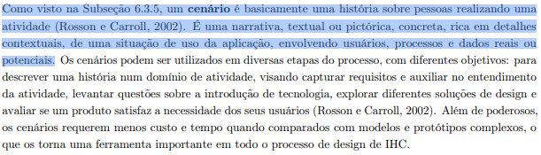

# Cenários

## Histórico de Versão e Contribuição

| Data | Versão | Descrição | Autor(es) | Revisor(es) |
| :---: | :---: | :--- | :--- | :--- |
| 26/09/2026 | 1.0 | Criação do documento de cenários de uso identificados para o ecossistema do **SEMOB-DF**. | [Gabriel Melo](https://github.com/gabriellcardone-06) e [Igor Dantas](https://github.com/IgorDARAUJO) | [Igor Dantas](https://github.com/IgorDARAUJO) e [Gabriel Melo](https://github.com/gabriellcardone-06) |
| 27/09/2026 | 1.1 | Modularização em artefatos dedicados por cenário e visão geral teórica. | [Carlos Costa](https://github.com/carloshfgit) | [Gabriel Melo](https://github.com/gabriellcardone-06) e [Igor Dantas](https://github.com/IgorDARAUJO) |
| 27/09/2026 | 1.2 | Inclusão dos cenários de uso da persona Valdir Soares (motorista de ônibus do STPC/DF) e fundamentação em Goal-Directed Design. | [Carlos Costa](https://github.com/carloshfgit) | [Rodrigo Carvalho](https://github.com/RodrigoCBarbosa) e [Gabriel Melo](https://github.com/gabriellcardone-06) |

---

## 1. Introdução

Na área de Interação Humano-Computador (IHC), um **cenário** é basicamente uma história sobre pessoas realizando uma atividade (Rosson e Carroll, 2002). Trata-se de uma narrativa textual ou pictórica, concreta e rica em detalhes contextuais, que retrata uma situação de uso da aplicação envolvendo usuários, processos e dados reais ou potenciais (Barbosa et al., 2021).

Os cenários exercem papel fundamental na fase de análise de requisitos, pois permitem:
* Ilustrar como os usuários interagem (ou tentam interagir) com o sistema no mundo real.
* Revelar falhas silenciosas, fricções de interface, desvios operacionais e barreiras de comunicação.
* Manter o design ancorado nas necessidades, limitações físicas, temporais e psicológicas dos usuários mapeados.

### 1.1 Elementos Estruturais de um Cenário

Conforme Barbosa et al. (2021), um cenário bem estruturado deve explicitar:
* **Ambiente ou contexto:** Detalhes de tempo, espaço físico, dispositivos em uso, qualidade de sinal de rede e recursos disponíveis.
* **Atores:** Usuários principais e secundários, suas características, habilidades e motivações.
* **Objetivos e Subobjetivos:** O que os atores pretendem alcançar ao realizar a tarefa.
* **Planejamento, Ações, Eventos e Avaliação:** O ciclo reflexivo do usuário — o que ele planeja mentalmente, o que executa, o que o sistema responde (incluindo eventos ocultos do ambiente) e como ele interpreta o resultado.
* **Problemas Revelados:** As barreiras encontradas e sua relação com os requisitos dos usuários.

### 1.2 Tipos de Cenários

* **Cenários de Problema:** Retratam a situação atual vivenciada pelos usuários com os sistemas e processos existentes (como o portal da SEMOB-DF e canais atuais), evidenciando as oportunidades de melhoria.
* **Cenários de Concepção / Projetados:** Descrevem o comportamento futuro desejado com a nova intervenção de design proposta.

---

## 2. Registro dos Cenários Mapeados

Os cenários desenvolvidos pela equipe concentram-se no diagnóstico das tarefas críticas das personas do projeto (tanto primárias quanto atendidas/operacionais), estando documentados individualmente nos links a seguir:

<strong>Tabela 1</strong> — Cenários de Uso Mapeados no Projeto

| Cenário | Persona Associada | Tipo de Cenário | Autor da Elaboração | Artefato Completo |
| :--- | :--- | :---: | :--- | :---: |
| **Cenário 1 — Última viagem para casa** | [Larissa Ferreira Lima](../personas/larissa-ferreira-lima.md) | Cenário de Problema | [Gabriel Melo](https://github.com/gabriellcardone-06) | [Acessar Cenário](cenario-1-ultima-viagem.md) |
| **Cenário 2 — Atraso na viagem matutina por conflito no app** | [João Pedro Carvalho](../personas/joao-pedro-carvalho.md) | Cenário de Problema | [Igor Dantas](https://github.com/IgorDARAUJO) | [Acessar Cenário](cenario-2-viagem-matutina.md) |
| **Cenário 3 — Conflito na catraca por divergência de horários** | [Valdir Soares ("Seu Valdir")](../personas/valdir-soares.md) | Cenário de Problema | [Carlos Costa](https://github.com/carloshfgit) | [Acessar Cenário](cenarios-motorista.md#2-cenario-1-o-conflito-na-catraca-gerado-por-inconsistencia-de-dados-publicos) |
| **Cenário 4 — Consulta ágil da escala diária no smartphone** | [Valdir Soares ("Seu Valdir")](../personas/valdir-soares.md) | Cenário de Caminho Crítico (Projetado) | [Carlos Costa](https://github.com/carloshfgit) | [Acessar Cenário](cenarios-motorista.md#3-cenario-2-consulta-agil-da-escala-diaria-e-tabela-homologada-no-smartphone) |
| **Cenário 5 — Alerta emergencial de desvio na faixa exclusiva** | [Valdir Soares ("Seu Valdir")](../personas/valdir-soares.md) | Cenário de Contingência | [Carlos Costa](https://github.com/carloshfgit) | [Acessar Cenário](cenarios-motorista.md#4-cenario-3-intercorrencia-viaria-e-alerta-emergencial-de-desvio-na-faixa-exclusiva) |
| **Cenário 6 — Resolução cooperativa de dúvida de passageiro** | [Valdir Soares ("Seu Valdir")](../personas/valdir-soares.md) | Cenário de Mediação Social | [Carlos Costa](https://github.com/carloshfgit) | [Acessar Cenário](cenarios-motorista.md#5-cenario-4-resolucao-cooperativa-de-duvida-de-passageiro-sem-constrangimento) |

<em>Fonte: Autores (2026).</em>

---

## 3. Fotos de Referência

<em>Imagem 1 — Fundamentação teórica de Cenários em IHC (Barbosa et al., 2021, Seção 8.3, p. 158).</em>

---

## 4. Referências Bibliográficas

* BARBOSA, Simone Diniz Junqueira; SILVA, Bruno Santana da; SILVEIRA, Milene Selbach; GASPARINI, Isabela; DARIN, Ticianne; BARBOSA, Gabriel Diniz Junqueira. **Interação Humano-Computador e Experiência do Usuário**. Rio de Janeiro: Autopublicação, 2021. ISBN 978-65-00-19677-1. Seção 8.3: Cenários (pp. 158–162).
* CARROLL, John M. **Making Use: Scenario-Based Design of Human-Computer Interactions**. Cambridge: MIT Press, 2000. ISBN: 978-0262032797.
* COOPER, Alan; REIMANN, Robert; CRONIN, Dave. **About Face 3: The Essentials of Interaction Design**. Indianapolis: Wiley Publishing, Inc., 2007. ISBN: 978-0-470-08411-3. Chapter 5 e 6 (pp. 75–124).
* ROSSON, Mary Beth; CARROLL, John M. **Usability Engineering: Scenario-Based Development of Human-Computer Interaction**. San Francisco: Morgan Kaufmann, 2002.
