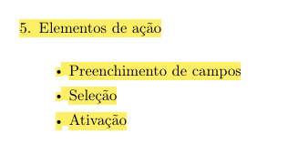

# Elementos de ação

## Histórico de Versão e Contribuição

| Data | Versão | Descrição | Autor(es) | Revisor(es) |
| :---: | :---: | :--- | :--- | :--- |
| 05/10/2026 | 1.0 | Criação do documento de elementos de ação do guia de estilo. | [Arthur Mariani](https://github.com/arthur-mariani) | [Carlos Henrique](https://github.com/carloshfgit) |

## 1. Introdução

Esta seção registra as decisões relacionadas ao preenchimento de campos, à seleção e à ativação de ações no portal da SEMOB-DF. As decisões aplicam os princípios de correspondência com as expectativas, simplicidade, controle, consistência, visibilidade, expressão adequada e prevenção de erros apresentados por Barbosa et al. (2021).

As regras foram relacionadas às tarefas já documentadas no projeto, principalmente:

- planejar viagem por origem e destino;
- consultar linhas e horários;
- acompanhar ônibus em tempo real;
- consultar alertas e desvios;
- realizar pré-agendamento no Programa DF Acessível;
- buscar atendimento e registrar manifestações;
- buscar orientação sobre problemas de cartão e Vale-Transporte.

---

## 2. Preenchimento de campos

### 2.1 Busca de trajetos

A busca de trajetos deve utilizar os campos:

- **Origem:** localização inicial do passageiro;
- **Destino:** local para onde o passageiro deseja se deslocar.

O campo de origem deve aceitar uma localização ou endereço. A interface também deve oferecer a ação **"Usar minha localização atual"**, conforme definido na [TAR-03](../analise-de-tarefas/tar-03-planejamento-rota.md).

O campo de destino deve aceitar nomes de locais e pontos de referência. A TAR-03 registra como exemplos "SIA", "ParkShopping" e "UnB".

A busca não deve exigir exclusivamente o código da linha. O projeto documentou a necessidade de pesquisar por:

- origem;
- destino;
- localização;
- ponto de referência;
- número da linha, quando conhecido.

Essa decisão reduz a necessidade de o passageiro memorizar códigos administrativos e corresponde ao princípio do capítulo de utilizar conceitos familiares ao usuário.

### 2.2 Pré-agendamento no Programa DF Acessível

O fluxo de pré-agendamento deve permitir a escolha:

- do local do atendimento;
- do dia do atendimento.

Esses são os únicos dados explicitamente identificados na [TAR-02](../analise-de-tarefas/tar-02-df-acessivel.md). Outros campos não devem ser definidos no guia enquanto não estiverem documentados no projeto.

### 2.3 Preservação dos dados

Os dados já fornecidos devem ser preservados quando ocorrer:

- erro de preenchimento;
- falha de carregamento;
- perda temporária de conexão;
- retorno a uma etapa anterior.

Essa decisão aplica a orientação do capítulo de proteger o trabalho do usuário e considera a conectividade móvel instável registrada nos [resultados da análise](resultados-de-analise.md).

### 2.4 Tratamento de erros

Quando um campo apresentar erro, a interface deve:

- identificar o dado problemático;
- explicar o problema em linguagem simples;
- indicar como corrigi-lo;
- preservar os demais dados;
- permitir uma nova tentativa.

A mensagem não deve apresentar códigos técnicos ou exigir que o passageiro possua conhecimento técnico para se recuperar. O [brainstorming](../brainstorm.md) registrou que algumas falhas atualmente exigem ações como apagar o *cache*, o que os participantes consideraram inadequado.

### 2.5 Informações ainda não validadas

A [TAR-07](../analise-de-tarefas/tar-07-credito-vale-transporte.md) sugere aceitar expressões cotidianas como "crédito não caiu" na busca por orientação sobre Vale-Transporte. Entretanto, a própria análise declara que esse fluxo permanece hipotético e depende de validação com usuárias, RH, SEMOB-DF e BRB Mobilidade.

Por isso, essa expressão não deve ser consolidada como regra definitiva do guia neste momento.

---

## 3. Seleção

### 3.1 Seleção de rota

Depois do preenchimento de origem e destino, a interface deve apresentar alternativas de rota para comparação.

Conforme a TAR-03, cada alternativa deve informar:

- tempo estimado total;
- número da linha;
- tarifa;
- tipo da linha, quando aplicável;
- integrações necessárias.

O projeto registra os tipos **Expressa**, **Direta** e **Circular**. Esses termos devem receber explicação quando não forem imediatamente compreensíveis.

A rota selecionada deve permanecer visualmente identificável. A seleção não deve ser indicada somente por cor, conforme a orientação do capítulo de utilizar pistas secundárias.

### 3.2 Seleção de linha e ponto de parada

A consulta em tempo real deve permitir que o passageiro encontre o transporte por:

- número ou nome da linha;
- ponto de referência;
- ponto de parada próximo.

Essas alternativas estão documentadas na [TAR-06](../analise-de-tarefas/tar-06-df-no-ponto.md). Elas atendem usuários que conhecem a linha e usuários que conhecem apenas um local próximo.

### 3.3 Linhas favoritas e notificações

A TAR-06 registra as ações de:

- favoritar uma linha;
- ativar notificações de atraso ou alteração.

Quando essas opções forem oferecidas, seu estado deve permanecer visível para que o passageiro reconheça se a linha está favoritada e se as notificações estão ativas.

### 3.4 Rotas alternativas

Quando a linha inicialmente planejada não estiver disponível ou quando a informação não for confiável, a interface deve oferecer a possibilidade de buscar outra linha ou outro modo de transporte.

Essa necessidade aparece na TAR-06 e no [Cenário 2](../cenarios/cenario-2-viagem-matutina.md).

---

## 4. Ativação

### 4.1 Rótulos das ações

Os rótulos devem informar claramente o efeito da ação. Com base nas tarefas documentadas, podem ser utilizados:

- **Usar minha localização atual**;
- **Buscar rotas**;
- **Ver ônibus**;
- **Tentar novamente**;
- **Favoritar linha**;
- **Ativar notificações**;
- **Registrar manifestação**.

Devem ser evitados rótulos genéricos como:

- "Clique aqui";
- "Consultar", sem informar o que será consultado;
- logotipos sem um rótulo textual que explique a ação.

A [inspeção de visibilidade e reconhecimento](../principios-gerais/visibilidade-e-reconhecimento.md) já identificou esses problemas no portal atual.

### 4.2 Consistência das ações

Uma mesma ação deve possuir:

- o mesmo rótulo;
- a mesma aparência;
- o mesmo comportamento;
- o mesmo tipo de resultado.

Os elementos usados para selecionar uma opção devem possuir aparência diferente daqueles usados para executar uma ação.

O projeto já identificou sete formas visuais diferentes de apresentar elementos de navegação. O guia deve reduzir essa variedade aos componentes documentados na [inspeção de consistência e padronização](../principios-gerais/consistencia-e-padronizacao.md):

- cartão de serviço;
- botão de ação;
- link de texto.

### 4.3 Feedback

Depois de uma ação, o sistema deve informar o que aconteceu.

Na consulta de ônibus, o feedback deve indicar:

- posição do veículo;
- previsão de chegada;
- momento da última atualização;
- existência de erro ou indisponibilidade dos dados.

Quando os dados estiverem desatualizados ou conflitantes, o sistema não deve apresentar silenciosamente a viagem como concluída. O Cenário 2 documenta que esse comportamento deixou o passageiro sem saber se o ônibus estava atrasado ou se já havia passado.

### 4.4 Operações demoradas

Durante carregamentos, o sistema deve indicar que a operação está em andamento. Em operações demoradas, deve apresentar progresso e possibilidade de cancelamento, de acordo com as orientações temporais apresentadas no capítulo.

Essa regra é especialmente relevante para:

- carregamento do mapa;
- cálculo de rotas;
- consulta da posição do ônibus;
- envio de manifestações.

### 4.5 Redirecionamentos

Antes de encaminhar o passageiro para outro site ou serviço, a interface deve informar:

- qual serviço será aberto;
- qual instituição é responsável;
- por que o redirecionamento é necessário.

O brainstorming e os resultados da análise registram que a fragmentação entre SEMOB-DF, BRB Mobilidade, Metrô-DF e outros serviços gera desorientação.

De acordo com a inspeção de consistência:

- links internos devem abrir na mesma aba;
- links externos e documentos devem ser identificados e seguir um comportamento padronizado;
- o contexto da tarefa deve ser preservado durante o encaminhamento.

---

## 5. Rastreabilidade das decisões

**Tabela 1** - Relação entre as decisões, os princípios do capítulo e as evidências do projeto

| Decisão do guia | Fundamento do capítulo 10 | Evidência do projeto |
|---|---|---|
| Busca por origem e destino | Idioma do usuário, simplicidade e reconhecimento | TAR-03 e brainstorming |
| Preservação dos dados preenchidos | Proteção do trabalho do usuário | Resultados da análise |
| Alternativas de linha e rota | Controle, liberdade e antecipação | TAR-03, TAR-06 e Cenário 2 |
| Estado selecionado visível | Visibilidade e reconhecimento | TAR-03 e TAR-06 |
| Rótulos que expressem o efeito das ações | Conteúdo relevante e expressão adequada | Inspeções de consistência e visibilidade |
| Indicação da última atualização | Visibilidade do estado do sistema | TAR-06 e resultados da análise |
| Mensagens de erro com recuperação | Projeto para erros | Brainstorming e Cenário 2 |
| Explicação dos redirecionamentos | Visibilidade dos efeitos das ações | Brainstorming e inspeções |

*Fonte: Arthur Mariani, elaborado a partir dos artefatos do projeto e de Barbosa et al. (2021).*

---

## 6. Declaração sobre o Uso de IA Generativa

Em cumprimento às normas de conduta acadêmica da SBC e ao Plano de Ensino da disciplina, declara-se que a Gemini, uma ferramenta de Inteligência Artificial Generativa, foi empregado para auxílio na estruturação textual, refinamento de clareza formal e formatação Markdown do presente documento. Toda a fundamentação teórica, o levantamento empírico de dados, as tomadas de decisão e as análises críticas permaneceram sob responsabilidade exclusiva dos integrantes da equipe.

---

## Fotos de Referência

{ width="500" }

*Imagem 1 - Elementos de ação. Fonte: Barbosa et al. (2021), p. 258.*

## Referências Bibliográficas

BARBOSA, S. D. J.; SILVA, B. S. da; SILVEIRA, M. S.; GASPARINI, I.; DARIN, T.; BARBOSA, G. D. J. **Interação Humano-Computador e Experiência do Usuário.** Autopublicação, 2021. ISBN 978-65-00-19677-1. Capítulo 10, p. 237-259.
