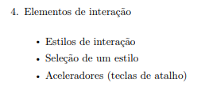

# Elementos de Interação

## Histórico de Versão e Contribuição

| Data | Versão | Descrição | Autor(es) | Revisor(es) |
| :---: | :---: | :--- | :--- | :--- |
| 05/10/2026 | 1.0 | Criação do documento de Elementos de Interação. | [Rodrigo Barbosa](https://github.com/RodrigoCBarbosa) | [Arthur Mariani](https://github.com/arthur-mariani) |

## 1. Introdução

Esta seção detalha os elementos de interação do Guia de Estilo para o portal da SEMOB-DF. Conforme estruturado por Mayhew (1999) e Marcus (1991) (citados por Barbosa et al., 2021, p. 258), os elementos de interação englobam os estilos de interação, a justificativa para a seleção de um estilo e a definição de aceleradores (teclas de atalho), visando garantir uma comunicação eficiente e consistente entre o sistema e o usuário.

## 2. Estilo de Interação

Os usuários podem interagir com o portal da SEMOB-DF na busca por linhas, consulta de horários, acompanhamento da localização do ônibus no mapa e verificação ou recarga de cartões. Essas interações são feitas principalmente por meio do preenchimento de campos de busca (formulários), menus de navegação, botões e manipulação direta (arrastar e dar zoom) nos mapas. Além disso, ao acessar o site do SEMOB, ele tem uma gama de opções referentes a sites governamentais que possuem diferentes tipos de interação.

## 3. Seleção de Estilos

A escolha do estilo para o portal da SEMOB-DF foca em uma interface simples, objetiva e voltada à principal necessidade do passageiro. A interface segue padrões visuais e de navegação consolidados (semelhantes a aplicativos de mobilidade), utilizando alvos de toque grandes e acessíveis, visando facilitar o uso em dispositivos móveis durante os deslocamentos urbanos.

## 4. Aceleradores (Teclas de Atalho)

No portal voltado para o passageiro, não foram implementadas teclas de atalho tradicionais.

---

## 5. Fotos de Referência

*Imagem 1 - Estrutura do guia de estilo (Elementos de interação) — Barbosa et al. (2021), p. 258*

## 6. Referências Bibliográficas

* BARBOSA, Simone Diniz Junqueira; SILVA, Bruno Santana da; SILVEIRA, Milene Selbach; GASPARINI, Isabela; DARIN, Ticianne; BARBOSA, Gabriel Diniz Junqueira. **Interação Humano-Computador e Experiência do Usuário**. 1. ed. Rio de Janeiro: Autopublicação, 2021. ISBN 978-65-00-19677-1. (Capítulo 10, Seção 10.5, p. 258).
* MAYHEW, Deborah J. **The Usability Engineering Lifecycle: A Practitioner's Handbook for User Interface Design**. Morgan Kaufmann, 1999.
* MARCUS, Aaron. **Graphic design for electronic documents and user interfaces**. New York: ACM, 1991.
