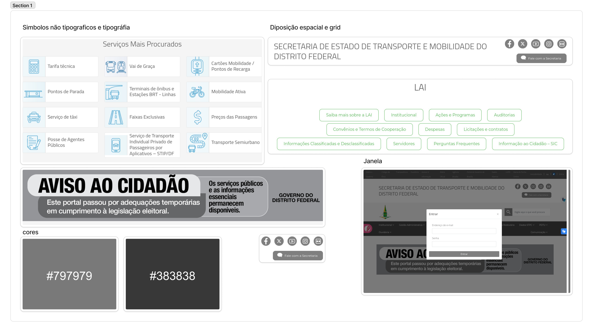

# Elementos de Interface

## Histórico de Versão e Contribuição

| Data | Versão | Descrição | Autor(es) | Revisor(es) |
| :---: | :---: | :--- | :--- | :--- |
| 06/10/2026 | 1.0 | Criação do documento de Elementos de Interface. | [Seu Nome](https://github.com/RodrigoCBarbosa) | [Arthur Mariani](https://github.com/arthur-mariani) |

## 1. Introdução

Esta seção detalha os elementos de interface do Guia de Estilo para o portal da SEMOB-DF. Conforme estruturado por Mayhew (1999) e Marcus (1991) (citados por Barbosa et al., 2021, p. 258, imagem 1), os elementos de interface englobam a disposição espacial e grid, janelas, tipografia, símbolos não tipográficos, cores e animações, visando garantir a consistência visual, a legibilidade e a harmonia estética na apresentação dos componentes ao usuário.

## 2. Elementos de interface

Os elementos sobre disposição espacial e grid, janelas, tipografia, símbolos não tipográficos, cores e animações são apresentados na figura 1.

---

## 3. Referências Bibliográficas

* BARBOSA, Simone Diniz Junqueira; SILVA, Bruno Santana da; SILVEIRA, Milene Selbach; GASPARINI, Isabela; DARIN, Ticianne; BARBOSA, Gabriel Diniz Junqueira. **Interação Humano-Computador e Experiência do Usuário**. 1. ed. Rio de Janeiro: Autopublicação, 2021. ISBN 978-65-00-19677-1. (Capítulo 10, Seção 10.5, p. 258).
* MARCUS, Aaron. **Graphic design for electronic documents and user interfaces**. New York: ACM, 1991.
* MAYHEW, Deborah J. **The Usability Engineering Lifecycle: A Practitioner's Handbook for User Interface Design**. Morgan Kaufmann, 1999.

