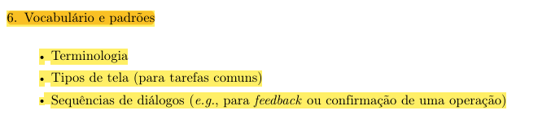

# Vocabulário e padrões

## Histórico de Versão e Contribuição

| Data | Versão | Descrição | Autor(es) | Revisor(es) |
| :---: | :---: | :--- | :--- | :--- |
| 05/10/2026 | 1.0 | Criação do documento de vocabulário e padrões do guia de estilo. | [Arthur Mariani](https://github.com/arthur-mariani) | [Carlos Henrique](https://github.com/carloshfgit) |

## 1. Introdução

Esta seção padroniza a terminologia, os tipos de tela utilizados nas tarefas comuns e as sequências de diálogo do portal da SEMOB-DF.

As decisões aplicam as orientações do capítulo de:

- utilizar o idioma do usuário;
- evitar termos orientados ao sistema;
- manter a mesma terminologia;
- organizar diálogos com início, meio e fim;
- apresentar conteúdo conciso e relevante;
- fornecer feedback ao final das ações.

---

## 2. Terminologia

### 2.1 Vocabulário controlado

**Tabela 1** - Vocabulário controlado do portal

| Conceito | Termo adotado | Termos que não devem ser alternados indiscriminadamente |
|---|---|---|
| Planejamento do deslocamento | **Planejar viagem** | Planejador, planejamento de rota, planejamento de deslocamento |
| Local inicial | **Origem** | Partida, localização inicial |
| Local pretendido | **Destino** | Chegada, localização final |
| Consulta da posição do veículo | **Ver ônibus em tempo real** | Rastreamento, georreferenciamento, telemetria |
| Estimativa de chegada | **Chega em X min** | ETA, horário fixo apresentado como garantia |
| Atualidade dos dados | **Última atualização** | Dados atuais, tempo real sem indicação temporal |
| Dúvidas recorrentes | **Perguntas frequentes** | FAQ-SEMOB, FAQ |
| Tema relacionado à LAI | **Acesso à Informação (LAI)** | LAI e Acesso à informação usados como serviços diferentes |
| Ação relacionada ao SIC | **Pedir informação (SIC)** | SIC, e-SIC e LAI usados como sinônimos |
| Conjunto de serviços e contatos | **Atendimento e serviços** | Ouvidoria utilizada como nome para serviços que não pertencem à Ouvidoria |

*Fonte: Arthur Mariani, elaborado a partir das análises de tarefas, do brainstorming e das inspeções do projeto.*

Os termos relacionados a **Acesso à Informação (LAI)**, **Pedir informação (SIC)** e **Atendimento e serviços** já aparecem como recomendações na [inspeção de consistência e padronização](../principios-gerais/consistencia-e-padronizacao.md).

### 2.2 Siglas e termos técnicos

Siglas como **STPC**, **PDTU**, **CTPC** e **STIP** não devem aparecer sem explicação na primeira ocorrência.

Termos como **linha circular**, **integração tarifária**, **validador**, **tabela** e **soltura** foram identificados no projeto como potencialmente desconhecidos. Quando seu uso for necessário, devem ser acompanhados de explicação em linguagem familiar ao passageiro.

### 2.3 Instituições

Os nomes oficiais devem ser preservados quando for necessário informar responsabilidades:

- SEMOB-DF;
- BRB Mobilidade;
- Metrô-DF;
- operadoras de ônibus;
- Participa DF.

A interface deve explicar a função da instituição no contexto da tarefa, pois os usuários documentados no projeto não distinguem claramente as responsabilidades de cada órgão.

### 2.4 Terminologia ainda pendente

Os estados **enviado**, **processado**, **disponível** e **pendente de atualização** aparecem na [TAR-07](../analise-de-tarefas/tar-07-credito-vale-transporte.md) como proposta para explicar o crédito de Vale-Transporte. Como essa tarefa ainda depende de validação, esses estados devem permanecer identificados como provisórios e não como terminologia definitiva.

---

## 3. Tipos de tela

### 3.1 Tela inicial

Deve priorizar as tarefas mais frequentes documentadas no projeto:

- planejar viagem;
- consultar linhas e horários;
- ver ônibus em tempo real;
- acessar atendimento.

A decisão é sustentada pelo [brainstorming](../brainstorm.md), no qual "menos informações na tela inicial" recebeu sete dos nove votos registrados.

### 3.2 Tela de busca de viagem

Deve permitir informar origem e destino e iniciar a busca de rotas.

### 3.3 Tela de resultados de rotas

Deve permitir comparar alternativas com tempo estimado, linha, tarifa, tipo da linha e integrações.

### 3.4 Tela de acompanhamento em tempo real

Deve reunir:

- posição do ônibus;
- tempo previsto de chegada;
- última atualização;
- alertas relacionados à linha.

### 3.5 Tela de alertas

Deve apresentar desvios, obras, retenções e alterações relacionados à linha consultada, sem misturá-los com notícias institucionais sem relação com a viagem.

### 3.6 Tela de pré-agendamento

Deve permitir selecionar o local e o dia do atendimento no Programa DF Acessível. Outros elementos dependem de documentação adicional.

### 3.7 Tela de atendimento

Deve apresentar o canal responsável, permitir o registro de manifestação e informar o protocolo quando disponível. A necessidade está documentada no brainstorming e nos [resultados da análise](resultados-de-analise.md).

### 3.8 Tela de erro e recuperação

Deve:

- informar o problema em linguagem simples;
- preservar os dados;
- apresentar uma ação de recuperação;
- permitir nova tentativa;
- evitar exigir conhecimento técnico.

### 3.9 Tela de redirecionamento

Deve explicar o destino, a instituição responsável e a razão do encaminhamento antes de abrir um serviço externo.

---

## 4. Sequências de diálogos

### 4.1 Planejar viagem

1. Informar origem.
2. Informar destino.
3. Buscar rotas.
4. Comparar alternativas.
5. Selecionar a rota.
6. Abrir o acompanhamento em tempo real.
7. Consultar posição, previsão e alertas.

A sequência deriva diretamente da [TAR-03](../analise-de-tarefas/tar-03-planejamento-rota.md).

### 4.2 Consultar ônibus em tempo real

1. Buscar pelo número ou nome da linha ou por um ponto de referência.
2. Selecionar a linha ou o ponto.
3. Consultar a previsão de chegada.
4. Verificar a posição no mapa.
5. Avaliar a confiabilidade pela última atualização.
6. Decidir entre ir ao ponto, esperar ou buscar alternativa.
7. Opcionalmente, favoritar a linha ou ativar notificações.

A sequência deriva da [TAR-06](../analise-de-tarefas/tar-06-df-no-ponto.md).

### 4.3 Pré-agendar atendimento no DF Acessível

1. Iniciar o pré-agendamento.
2. Escolher o local.
3. Escolher o dia.
4. Concluir a solicitação.
5. Receber feedback de conclusão.

Somente local e dia estão documentados na [TAR-02](../analise-de-tarefas/tar-02-df-acessivel.md). Dados adicionais não devem ser incluídos até que estejam registrados no projeto.

### 4.4 Recuperar-se de uma falha

1. O sistema detecta a falha.
2. Informa o que aconteceu em linguagem simples.
3. Preserva os dados e o contexto da tarefa.
4. Apresenta a ação **"Tentar novamente"** ou outro caminho documentado.
5. Informa o resultado da nova tentativa.

Essa sequência combina o projeto para erros do capítulo com as falhas documentadas no brainstorming e no [Cenário 2](../cenarios/cenario-2-viagem-matutina.md).

### 4.5 Resolver indisponibilidade de crédito

A TAR-07 propõe a sequência:

1. informar o problema;
2. identificar os estados disponíveis;
3. explicar a situação e o próximo passo;
4. permitir que a usuária escolha a providência adequada.

Entretanto, essa sequência deve permanecer marcada como **provisória**, porque ainda não foi validada com usuárias, RH, SEMOB-DF e BRB Mobilidade.

---

## 5. Rastreabilidade das decisões

**Tabela 2** - Relação entre as decisões, os princípios do capítulo e as evidências do projeto

| Decisão do guia | Fundamento do capítulo 10 | Evidência do projeto |
|---|---|---|
| Busca por origem e destino | Idioma do usuário, simplicidade e reconhecimento | TAR-03 e brainstorming |
| Tipos de tela baseados nas tarefas comuns | Vocabulário e padrões | Análises de tarefas |
| Indicação da última atualização | Visibilidade do estado do sistema | TAR-06 e resultados da análise |
| Mensagens de erro com recuperação | Projeto para erros | Brainstorming e Cenário 2 |
| Vocabulário controlado | Consistência terminológica | Inspeção de consistência |
| Explicação de siglas | Reconhecimento em vez de memorização | Inspeção de visibilidade |
| Explicação de redirecionamentos | Visibilidade dos efeitos das ações | Brainstorming e inspeções |
| Estados do crédito marcados como provisórios | *Design rationale* e validação das decisões | TAR-07 |

*Fonte: Arthur Mariani, elaborado a partir dos artefatos do projeto e de Barbosa et al. (2021).*

---

## 6. Declaração sobre o Uso de IA Generativa

Em cumprimento às normas de conduta acadêmica da SBC e ao Plano de Ensino da disciplina, declara-se que a Gemini, uma ferramenta de Inteligência Artificial Generativa, foi empregado para auxílio na estruturação textual, refinamento de clareza formal e formatação Markdown do presente documento. Toda a fundamentação teórica, o levantamento empírico de dados, as tomadas de decisão e as análises críticas permaneceram sob responsabilidade exclusiva dos integrantes da equipe.

---

## Referências bibliográficas

BARBOSA, S. D. J.; SILVA, B. S. da; SILVEIRA, M. S.; GASPARINI, I.; DARIN, T.; BARBOSA, G. D. J. **Interação Humano-Computador e Experiência do Usuário.** Autopublicação, 2021. ISBN 978-65-00-19677-1. Capítulo 10, p. 237-259.

## Foto do texto da referência

{ width="500" }

*Imagem 1 - Vocabulários e Padrões. Fonte: Barbosa et al. (2021), p. 258.*
