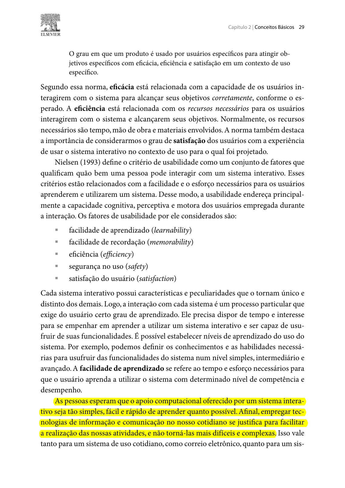
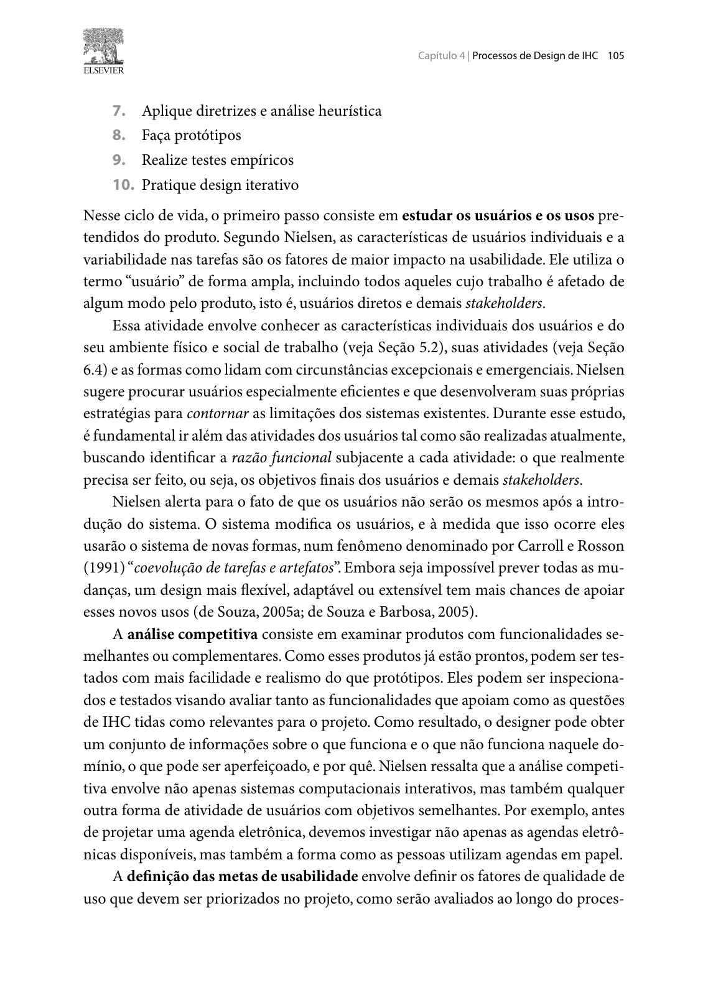
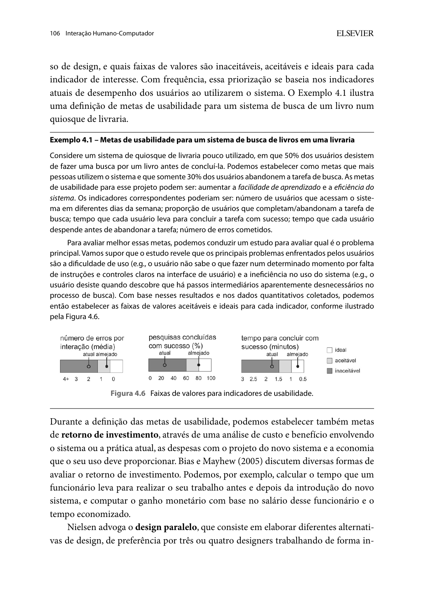
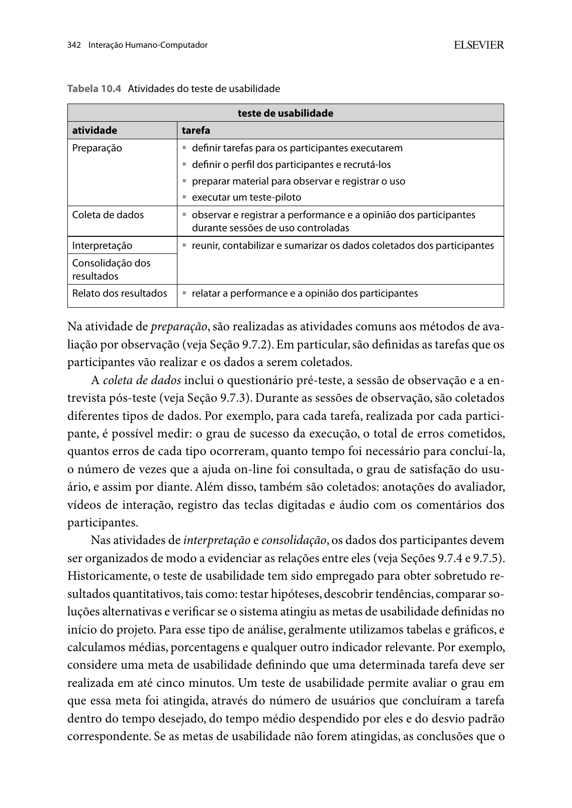

# Metas de Usabilidade

## Histórico de Versão e Contribuição

| Data | Versão | Descrição | Autor(es) | Revisor(es) |
| :---: | :---: | :--- | :--- | :--- |
| 06/10/2026 | 1.0 | Definição e justificativa das metas de usabilidade para o portal da SEMOB-DF com base nos fatores apresentados por Barbosa e Silva (2010). | [Arthur Mariani](https://github.com/arthur-mariani) | [Carlos Costa](https://github.com/carloshfgit) |

---

## 1. Introdução

Este documento define as metas de usabilidade que orientarão o projeto de Interação Humano-Computador do portal da **Secretaria de Estado de Transporte e Mobilidade do Distrito Federal (SEMOB-DF)**. A fundamentação teórica utiliza exclusivamente o livro *Interação Humano-Computador*, de Barbosa e Silva (2010), enquanto a seleção e a priorização das metas são decisões da equipe aplicadas às evidências registradas nos artefatos do projeto.

Barbosa e Silva (2010, pp. 105-106), ao apresentarem a Engenharia de Usabilidade de Nielsen, explicam que a definição das metas de usabilidade envolve:

1. definir os fatores de qualidade de uso que devem ser priorizados no projeto;
2. determinar como esses fatores serão avaliados ao longo do processo de design;
3. estabelecer faixas de valores inaceitáveis, aceitáveis e ideais para cada indicador de interesse;
4. considerar, com frequência, os indicadores atuais de desempenho dos usuários ao utilizarem o sistema.

No processo de Engenharia de Usabilidade de Mayhew, adotado pelo projeto, as metas são definidas na fase de análise de requisitos com base no perfil dos usuários, na análise de tarefas, nas possibilidades e limitações da plataforma e nos princípios gerais de design de IHC (Barbosa e Silva, 2010, pp. 109-110).

---

## 2. Fundamentação Teórica

### 2.1 Usabilidade e seus fatores

Segundo a definição da ISO 9241-11 apresentada por Barbosa e Silva (2010, p. 29), a usabilidade corresponde ao grau em que usuários específicos utilizam um produto para alcançar objetivos específicos com **eficácia**, **eficiência** e **satisfação** em determinado contexto de uso.

O livro também apresenta os fatores de usabilidade definidos por Nielsen (1993):

- facilidade de aprendizado;
- facilidade de recordação;
- eficiência;
- segurança no uso;
- satisfação do usuário.

Unificando o fator de eficiência, presente nas duas referências, este documento considera seis fatores de usabilidade apresentados no livro: **eficácia, facilidade de aprendizado, facilidade de recordação, eficiência, segurança no uso e satisfação do usuário**.

Barbosa e Silva (2010, p. 32) destacam que dificilmente um sistema apresentará o mesmo nível de qualidade em todos os fatores de usabilidade. A priorização deve ser realizada com base no conhecimento sobre os usuários, suas necessidades, atividades, objetivos e contextos de uso.

### 2.2 Indicadores e faixas de valores

O Exemplo 4.1 do livro relaciona metas de usabilidade a indicadores observáveis, como:

- proporção de usuários que concluem ou abandonam uma tarefa;
- tempo necessário para concluir uma tarefa com sucesso;
- tempo despendido antes do abandono;
- número de erros cometidos.

Ao descrever os testes de usabilidade, Barbosa e Silva (2010, pp. 341-343) também apresentam como dados possíveis o grau de sucesso, o total e os tipos de erros, o número de consultas à ajuda, o grau de satisfação e as opiniões e os sentimentos dos participantes.

O livro orienta estabelecer faixas **inaceitáveis**, **aceitáveis** e **ideais** para os indicadores selecionados. Essas faixas não são universais: devem considerar os dados de desempenho atuais e os problemas observados no sistema avaliado. Por essa razão, este documento seleciona as metas e seus indicadores, mas mantém as faixas quantitativas pendentes até que seja realizada uma medição do portal atual da SEMOB-DF.

---

## 3. Evidências do Projeto Consideradas

A aplicação dos fatores apresentados no livro ao caso da SEMOB-DF considerou os seguintes artefatos:

- os [Perfis de Usuário](perfis-de-usuario/index.md), que caracterizam passageiros, profissionais técnicos e motoristas, bem como seus contextos de acesso e conhecimento do domínio;
- as [Personas](personas/index.md), que registram objetivos, habilidades, tarefas, necessidades e expectativas;
- os [Cenários](cenarios/index.md), que descrevem situações de uso, problemas e consequências enfrentadas pelos usuários;
- as [Análises de Tarefas](analise-de-tarefas/index.md), que decompõem os objetivos e os fluxos de interação investigados;
- o [Brainstorming de Necessidades e Desejos](brainstorm.md), que registra as prioridades manifestadas pelos participantes;
- as inspeções dos [Princípios Gerais](principios-gerais/correspondencia-com-as-expectativas-dos-usuarios.md), que relacionam problemas do portal às diretrizes de design de IHC.

A fundamentação dos fatores permanece a apresentada pelo livro. As relações estabelecidas a seguir com linhas, horários, itinerários, benefícios e atendimento correspondem à aplicação analítica realizada pela equipe para o domínio da SEMOB-DF.

---

## 4. Seleção e Justificativa das Metas de Usabilidade

### 4.1 Eficácia

#### Definição segundo o livro

A eficácia está relacionada à capacidade de os usuários interagirem com o sistema para alcançar corretamente os objetivos esperados (Barbosa e Silva, 2010, p. 29).

#### Razão da seleção para a SEMOB-DF

A eficácia foi selecionada porque os usuários acessam os serviços de mobilidade com objetivos concretos, como encontrar uma linha, consultar um horário, planejar uma rota, compreender tarifas e integrações, obter orientação sobre cartão ou Vale-Transporte e localizar o canal responsável por uma manifestação. Os cenários e as análises de tarefas mostram situações em que a fragmentação entre serviços, os resultados inadequados de busca e as falhas de navegação podem impedir a conclusão desses objetivos.

#### Indicadores apresentados no livro

- grau de sucesso na execução da tarefa;
- proporção de usuários que concluem ou abandonam a tarefa;
- número de usuários que não conseguem realizar a tarefa.

### 4.2 Facilidade de aprendizado

#### Definição segundo o livro

A facilidade de aprendizado corresponde ao tempo e ao esforço necessários para que o usuário aprenda a utilizar o sistema com determinado nível de competência e desempenho (Barbosa e Silva, 2010, pp. 29-30).

#### Razão da seleção para a SEMOB-DF

Essa meta foi selecionada porque o portal atende usuários com diferentes níveis de escolaridade, experiência tecnológica e conhecimento sobre o domínio do transporte público. Os perfis e as personas registram que parte do público conhece seus próprios trajetos, mas não distingue com clareza as responsabilidades da SEMOB-DF, do BRB Mobilidade, do Metrô-DF e das empresas operadoras. Desse modo, a interação deve permitir que usuários iniciantes aprendam a localizar e utilizar os serviços pertinentes.

#### Indicadores apresentados no livro

- número de erros cometidos nas primeiras sessões de uso;
- número de usuários que completam as tarefas com sucesso;
- número de consultas à ajuda ou ao manual;
- tempo e esforço necessários para aprender a realizar as atividades principais.

### 4.3 Eficiência

#### Definição segundo o livro

A eficiência está relacionada aos recursos necessários para que os usuários interajam com o sistema e alcancem seus objetivos. O livro destaca, em especial, o tempo necessário para concluir uma atividade depois que o usuário aprendeu a utilizar o sistema (Barbosa e Silva, 2010, pp. 29-31).

#### Razão da seleção para a SEMOB-DF

A eficiência foi selecionada porque várias tarefas documentadas no projeto ocorrem sob pressão de tempo, como consultar uma linha antes de sair, verificar a previsão de chegada no ponto, planejar um deslocamento urgente ou buscar orientação diante de um problema com o cartão. O brainstorming e as análises de tarefas também registram a necessidade de reduzir buscas repetidas, passos intermediários e mudanças de contexto entre diferentes serviços.

#### Indicadores apresentados no livro

- tempo necessário para concluir a tarefa com sucesso;
- tempo despendido antes de abandonar a tarefa;
- número de vezes que o usuário se desvia do caminho mais eficiente.

### 4.4 Segurança no uso

#### Definição segundo o livro

A segurança no uso refere-se ao grau de proteção oferecido pelo sistema contra condições desfavoráveis ou perigosas. Segundo o livro, ela pode ser promovida evitando problemas e auxiliando o usuário a se recuperar de situações problemáticas (Barbosa e Silva, 2010, p. 31).

#### Razão da seleção para a SEMOB-DF

Essa meta foi selecionada porque erros ou ambiguidades em informações de mobilidade podem produzir consequências fora da interface. O usuário pode escolher uma linha inadequada, perder um horário, dirigir-se ao ponto errado, interpretar incorretamente o estado de um benefício ou procurar uma instituição que não seja responsável por seu problema. Os cenários também registram falhas que interrompem tarefas e exigem recuperação. Portanto, o portal deve reduzir a ocorrência de erros e apoiar o usuário quando uma situação problemática ocorrer.

#### Indicadores apresentados no livro

- número total de erros cometidos;
- número de erros de cada tipo;
- ocorrência de acionamentos equivocados;
- possibilidade de cancelar ou interromper operações;
- possibilidade de recuperação diante de erros ou equívocos.

### 4.5 Facilidade de recordação

#### Definição segundo o livro

A facilidade de recordação diz respeito ao esforço cognitivo necessário para o usuário lembrar como interagir com a interface conforme aprendeu anteriormente. O livro destaca a importância desse fator em operações e sistemas de baixa frequência de uso (Barbosa e Silva, 2010, p. 30).

#### Razão da seleção para a SEMOB-DF

Essa meta foi selecionada porque o portal reúne tanto tarefas recorrentes, como consultar linhas e horários, quanto tarefas realizadas apenas em situações específicas, como procurar informações sobre benefícios, resolver problemas de Vale-Transporte ou registrar uma manifestação. A organização, os rótulos e as sequências de interação devem fornecer pistas que auxiliem o usuário a retomar essas tarefas sem precisar aprender novamente todo o caminho.

#### Aspectos de observação apresentados pelo livro

- esforço cognitivo necessário para lembrar como utilizar a interface;
- erros cometidos ao utilizar novamente partes do sistema;
- pistas fornecidas pela organização, pelas categorias, pelos comandos e pelas sequências de operações.

### 4.6 Satisfação do usuário

#### Definição segundo o livro

A satisfação corresponde à avaliação subjetiva que expressa o efeito do uso do sistema sobre as emoções e os sentimentos do usuário (Barbosa e Silva, 2010, p. 31).

#### Razão da seleção para a SEMOB-DF

A satisfação foi selecionada porque os artefatos do projeto registram experiências de frustração e insegurança relacionadas a falhas, informações dispersas, redirecionamentos, linguagem institucional e dificuldade para identificar o canal responsável. Além do desempenho observado, o processo de avaliação deve considerar como a experiência de uso afeta os usuários.

#### Indicadores apresentados no livro

- grau de satisfação do usuário;
- opiniões manifestadas durante e após a interação;
- sentimentos decorrentes da experiência de uso.

---

## 5. Tarefas do Projeto Relacionadas às Metas

As metas poderão orientar a avaliação das tarefas já modeladas no projeto:

| Tarefa documentada | Metas diretamente relacionadas |
| --- | --- |
| [TAR-01 - Alerta inteligente de saída](analise-de-tarefas/tar-01-alerta-saida.md) | Eficácia, eficiência, segurança e satisfação. |
| [TAR-02 - Pré-agendamento no Programa DF Acessível](analise-de-tarefas/tar-02-df-acessivel.md) | Eficácia, facilidade de aprendizado, segurança e satisfação. |
| [TAR-03 - Planejamento de rota por origem e destino](analise-de-tarefas/tar-03-planejamento-rota.md) | Eficácia, eficiência, facilidade de aprendizado e satisfação. |
| [TAR-06 - Consulta de ônibus em tempo real](analise-de-tarefas/tar-06-df-no-ponto.md) | Eficácia, eficiência, facilidade de recordação e satisfação. |
| [TAR-07 - Resolver indisponibilidade de crédito de Vale-Transporte](analise-de-tarefas/tar-07-credito-vale-transporte.md) | Eficácia, facilidade de aprendizado, segurança e satisfação. |

Essa relação orienta quais fatores observar em cada tarefa, mas não substitui a preparação da avaliação com representantes dos usuários.

---

## 6. Indicadores e Faixas de Valores

Conforme Barbosa e Silva (2010, pp. 105-106), a definição das metas de usabilidade deve estabelecer faixas de valores inaceitáveis, aceitáveis e ideais para os indicadores selecionados. Como o projeto ainda não realizou a medição do desempenho dos usuários no portal atual da SEMOB-DF, essas faixas serão estabelecidas após a coleta dos dados. Os indicadores que orientarão essa medição estão apresentados junto a cada meta na Seção 4.

Segundo Barbosa e Silva (2010, pp. 341-343), esses dados podem ser coletados em testes de usabilidade nos quais representantes dos usuários realizam tarefas em condições controladas. A preparação deve definir tarefas, perfis dos participantes, materiais de registro e teste-piloto. A coleta deve registrar a performance e a opinião dos participantes, e os resultados devem ser posteriormente interpretados, consolidados e relatados.

---

## 7. Conclusão

As metas de usabilidade selecionadas para o portal da SEMOB-DF são eficácia, facilidade de aprendizado, eficiência, segurança no uso, facilidade de recordação e satisfação do usuário. Todos esses fatores são apresentados por Barbosa e Silva (2010). A razão de cada seleção foi estabelecida a partir dos perfis, tarefas, cenários e demais evidências do projeto, conforme o procedimento de Engenharia de Usabilidade de Mayhew descrito no livro.

Os indicadores também foram selecionados entre aqueles apresentados pela obra. As faixas de valores inaceitáveis, aceitáveis e ideais serão definidas somente após a medição do desempenho atual, evitando atribuir valores sem evidência empírica.

---

## 8. Declaração sobre o Uso de IA Generativa

Em cumprimento às normas de conduta acadêmica da SBC e ao Plano de Ensino da disciplina, declara-se que o Gemini, uma ferramenta de Inteligência Artificial Generativa, foi empregado para auxílio na estruturação textual, refinamento de clareza formal e formatação Markdown do presente documento. Toda a fundamentação teórica, o levantamento empírico de dados, as tomadas de decisão e as análises críticas permaneceram sob responsabilidade exclusiva dos integrantes da equipe.

---

## 9. Fotos de Referência

{ width="700" }

*Imagem 1 - Eficácia, eficiência, satisfação e fatores de usabilidade apresentados por Nielsen. Fonte: Barbosa e Silva (2010), p. 29.*

{ width="700" }

*Imagem 2 - Contexto da Engenharia de Usabilidade de Nielsen e início da definição das metas de usabilidade. Fonte: Barbosa e Silva (2010), p. 105.*

{ width="700" }

*Imagem 3 - Continuação da definição, Exemplo 4.1 e Figura 4.6 sobre indicadores e faixas. Fonte: Barbosa e Silva (2010), p. 106.*

{ width="700" }

*Imagem 4 - Atividades do teste de usabilidade e dados mensuráveis para avaliar metas. Fonte: Barbosa e Silva (2010), p. 342.*

---

## 10. Referências Bibliográficas

- BARBOSA, Simone Diniz Junqueira; SILVA, Bruno Santana da. *Interação Humano-Computador*. Rio de Janeiro: Elsevier, 2010. Seção 2.2.1: Usabilidade e Experiência de Usuário (pp. 28-32); Seções 4.3.2 e 4.3.3: Engenharia de Usabilidade de Nielsen e de Mayhew (pp. 104-110); Seção 10.2.1: Teste de Usabilidade (pp. 341-343).
