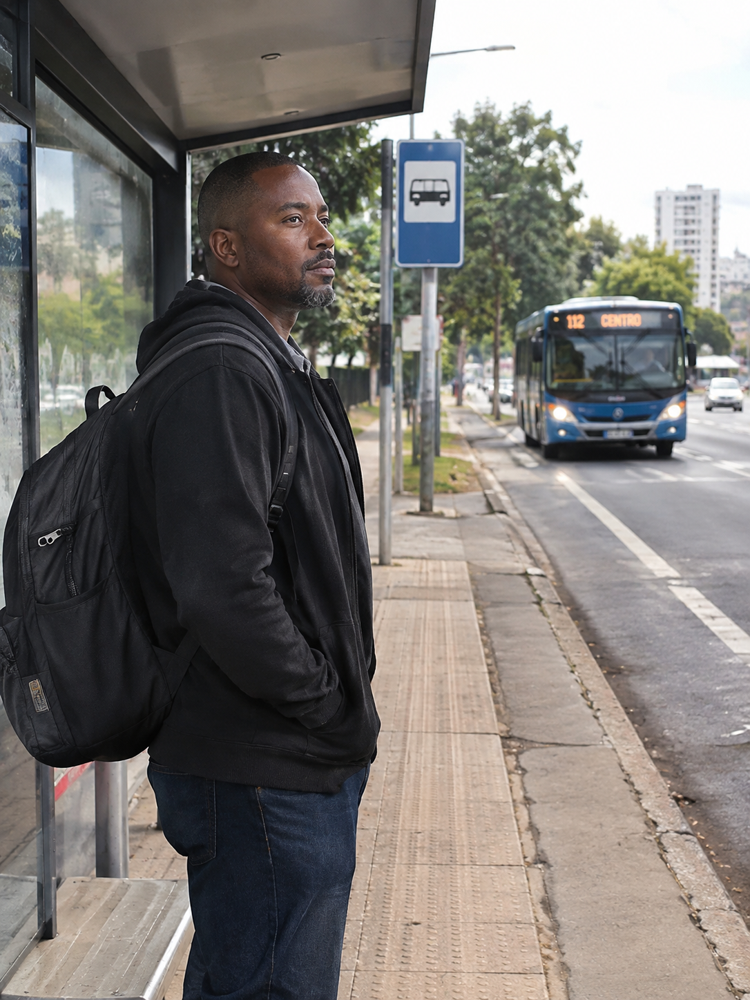

# Persona: Heitor Santos Júnior

## Histórico de Versão e Contribuição

| Data | Versão | Descrição | Autor(es) | Revisor(es) |
| :---: | :---: | :--- | :--- | :--- |
| 27/09/2026 | 1.0 | Elaboração detalhada da persona primária Heitor Santos Júnior. | [Tomás Rocho](https://github.com/TomasRocho) | [Rodrigo Carvalho](https://github.com/RodrigoCBarbosa) |

---

## 1. Caracterização Geral

**Autor: Tomás Rocho**

*Figura 1 — Heitor Santos Júnior (imagem ilustrativa, gerada por IA ChatGPT).*

> **"Todo dia eu pego o ônibus às 5h. Se ele atrasa ou muda o caminho e ninguém avisa, quem leva a bronca sou eu."**

**Resumo:** trabalhador de manutenção predial, pai de família, que depende do transporte público para ir de Planaltina ao Plano Piloto e para se deslocar entre os prédios que atende durante o expediente. Usa o celular de forma prática (WhatsApp, app do banco, YouTube), mas se perde em sites cheios de menus e termos técnicos. Precisa de informação confiável sobre linhas, horários e o Vale-Transporte para não perder dia de trabalho.

---

## 2. Identidade

| Campo | Descrição |
|---|---|
| **Nome** | Heitor Santos Júnior |
| **Idade** | 36 anos |
| **Gênero** | Masculino |
| **Família** | Casado com Cláudia (34, manicure autônoma que atende em casa). Pai de Ana Clara (12) e Davi (7), ambos estudantes de escola pública |
| **Moradia** | Planaltina (RA VI), Distrito Federal |
| **Escolaridade** | Ensino médio completo em escola pública; curso técnico de Eletricista Predial pelo SENAI |
| **Ocupação** | Técnico de manutenção predial (CLT) em empresa terceirizada que presta serviço a condomínios e prédios comerciais da Asa Norte e da Asa Sul, das 7h às 16h |
| **Renda** | Cerca de R$ 2.800/mês; renda familiar em torno de R$ 4.000, somando o trabalho da esposa |
| **Deslocamento** | Cerca de 3h30 por dia: ônibus de Planaltina até a Rodoviária do Plano Piloto e, durante o expediente, ônibus curtos entre os prédios atendidos |
| **Cartões de transporte** | +Vale-Transporte, creditado mensalmente pela empresa |
| **Dispositivos** | Smartphone Android de entrada, com tela trincada e plano de dados pré-pago; não tem computador em casa |
| **Como chega ao site** | Pelo celular, via busca no Google ("horário ônibus Planaltina") ou por links repassados no grupo de WhatsApp do trabalho e da família |
| **Personalidade** | Responsável, pontual e desconfiado de novidades digitais. Prefere perguntar a quem já sabe do que "ficar mexendo" e errar. Fica irritado quando o sistema o faz perder tempo ou dinheiro |

*Fonte: Tomás Rocho.*

---

## 3. Status

**Persona primária.**

Por que ele é a persona primária:

- **Representa o trabalhador que depende do transporte coletivo para garantir o sustento da família.** Não tem carro nem moto, e cada atraso ou falta pode gerar desconto no salário ou advertência.
- **Mora em uma RA de renda baixa e distante do centro.** Planaltina está no grupo 4 da Codeplan, em que quase metade dos domicílios não tem automóvel e os trajetos até o trabalho são longos — exatamente o público descrito no **[Perfil de Usuário Primário](../perfis-de-usuario/perfil-primario.md)**.
- **Usa o transporte também durante o expediente.** Além de ida e volta, precisa se deslocar entre endereços diferentes do Plano Piloto que nem sempre conhece, o que exige consultar rotas para destinos novos com frequência.
- **Tem letramento digital intermediário e baixo conhecimento institucional.** Um site que ele consiga usar sem ajuda será compreensível para boa parte dos usuários com menos familiaridade digital, complementando o perfil mais tecnológico de João Pedro e o perfil nativo digital de Larissa.
- **Deve orientar decisões de linguagem e de simplicidade de navegação,** ao lado das demais personas primárias.

---

## 4. Objetivos

### Objetivos de vida e de trabalho (além do site)

- Manter o emprego e ser reconhecido como um funcionário pontual e de confiança.
- Garantir o sustento da família e o estudo dos filhos.
- Chegar em casa a tempo de jantar com a família e acompanhar a lição dos filhos.
- Passar menos tempo em pé dentro do ônibus e mais tempo descansando.
- Não perder dinheiro com cobranças indevidas no cartão nem com passagens pagas do próprio bolso.

### Objetivos ao usar o site

- Saber o horário da primeira viagem da manhã em Planaltina e se ela está saindo normalmente.
- Descobrir qual ônibus pegar para chegar a um endereço novo do Plano Piloto durante o expediente.
- Ficar sabendo de greves, desvios e mudanças de itinerário antes de sair de casa.
- Entender por que o saldo do Vale-Transporte não entrou ou acabou antes do fim do mês, e a quem recorrer.
- Registrar uma reclamação quando o ônibus não passa, sem precisar ir a um posto de atendimento.

---

## 5. Habilidades

- **Educação e formação:** ensino médio completo em escola pública; curso técnico de Eletricista Predial (SENAI); NR-10 (segurança em instalações elétricas).
- **Competências profissionais:** manutenção elétrica e hidráulica de prédios, leitura de ordens de serviço, organização da própria agenda de atendimentos e bom relacionamento com síndicos e porteiros.
- **Competências digitais:** usa bem WhatsApp (inclusive áudios), YouTube, app do banco e Pix. Consegue buscar no Google e abrir links, mas tem dificuldade com formulários longos, cadastros com muitas etapas, PDFs e menus com muitas opções. Quando trava, pede ajuda à filha Ana Clara ou a um colega de trabalho. Prefere ícones grandes, botões claros e textos curtos.
- **Conhecimento do domínio (transporte):** conhece muito bem a linha que usa todos os dias de Planaltina até a Rodoviária, mas tem pouca familiaridade com as linhas internas do Plano Piloto. Não entende termos como "integração tarifária", "linha circular", "bacia" ou "STPC", e não sabe diferenciar Semob, BRB Mobilidade e empresas de ônibus.
- **Limitações e contexto de uso:** acessa o site no escuro, de madrugada, antes de sair de casa, ou na rua, entre um atendimento e outro, com as mãos às vezes sujas ou ocupadas com ferramentas. O celular é lento e o pacote de dados costuma acabar antes do fim do mês. Tem leve dificuldade de leitura de letras pequenas sem óculos.

---

## 6. Tarefas

| Tarefa | Frequência | Importância | Duração |
|---|---|---|---|
| Conferir o horário da primeira viagem da manhã em Planaltina | Diária | Crítica | 1 a 2 min |
| Consultar rota e linha para um endereço novo no Plano Piloto | 2 a 3 vezes por semana | Alta | 3 a 5 min |
| Verificar avisos de greves, desvios e mudanças de itinerário | Semanal ou quando o ônibus atrasa | Alta | 2 a 5 min |
| Conferir saldo e crédito mensal do Vale-Transporte | Mensal (início do mês) e quando o saldo parece errado | Alta | 2 a 5 min |
| Resolver problema no cartão (saldo não creditado, bloqueio, 2ª via) | Eventual (1 a 2 vezes por ano) | Crítica quando ocorre | 20 a 40 min, geralmente com ajuda de terceiros |
| Registrar reclamação sobre ônibus que não passou ou atrasou | Eventual (poucas vezes por ano) | Média | 5 a 15 min |

*Fonte: Tomás Rocho.*

> Os passos detalhados das tarefas estão descritos nos **[Cenários](../cenarios/index.md)** (em especial o **[Cenário 9](../cenarios/cenario-9-endereco-novo.md)**).

**Contexto da rotina (dia útil):**

| Horário | Atividade |
|---|---|
| ~4h40 | Acorda e confere no celular se o ônibus está saindo normalmente |
| ~5h05 | Pega o ônibus em Planaltina rumo à Rodoviária do Plano Piloto (cerca de 1h30) |
| 7h–16h | Atendimentos em prédios da Asa Norte e da Asa Sul, deslocando-se de ônibus entre eles |
| 16h–~17h45 | Volta para Planaltina no horário de pico, geralmente em pé |
| ~18h | Chega em casa, janta com a família e acompanha a lição dos filhos |

*Fonte: Tomás Rocho.*

---

## 7. Relacionamentos

| Quem | Relação com Heitor | Por que importa para o projeto |
|---|---|---|
| **Esposa (Cláudia) e filhos (Ana Clara e Davi)** | Convivência diária. Ana Clara o ajuda quando ele trava no celular | A filha funciona como "suporte técnico" informal; o site precisa ser usável sem esse apoio |
| **Supervisor e colegas de trabalho** | Cobram pontualidade; colegas trocam informações sobre linhas e greves no grupo de WhatsApp | Atrasos têm custo profissional direto; o grupo substitui o canal oficial quando ele falha |
| **RH da empresa terceirizada** | Credita o Vale-Transporte mensalmente | Stakeholder envolvido quando o saldo não aparece no cartão |
| **Síndicos e porteiros dos prédios atendidos** | Esperam o técnico no horário marcado e indicam como chegar ao endereço | Fonte informal de rota quando ele não sabe qual ônibus pegar |
| **Motoristas e cobradores** | Contato diário no embarque; perguntas sobre itinerário e desvios | Canal presencial de informação; reflete a qualidade da informação oficial (ver **[Perfil do Motorista](../perfis-de-usuario/perfil-motorista.md)**) |
| **BRB Mobilidade** | Emite e credita o cartão +Vale-Transporte | Parte das tarefas dele termina no ambiente do BRB, não no da Semob |
| **Empresas de ônibus e Semob** | Operam e regulam as linhas que ele usa | Geram os dados de horários, desvios e avisos que ele precisa consultar |
| **Ouvidoria do GDF (162 / ouv.df.gov.br)** | Canal formal para reclamar de atrasos e ônibus que não passam | Precisa ser fácil de achar e de usar pelo celular |

*Fonte: Tomás Rocho.*

---

## 8. Requisitos

| Necessidade | Em suas palavras |
|---|---|
| Saber cedo se o ônibus está saindo normalmente | *"Às 4h40 eu só quero saber uma coisa: o ônibus das 5h vai passar ou não?"* |
| Rota simples para endereços novos | *"Me passaram um prédio na 708 Norte. Eu só quero digitar o endereço e ver qual ônibus pegar da Rodoviária."* |
| Linguagem simples, sem termos técnicos | *"Não sei o que é 'bacia' nem 'integração tarifária'. Fala do jeito que o povo fala."* |
| Letras e botões grandes | *"Meu celular é pequeno e a tela é trincada. Se a letra for miúda, eu não enxergo."* |
| Site leve, que não gaste muitos dados | *"No fim do mês o meu pacote acaba. Se o site for pesado, nem abre."* |
| Avisos de greve e desvio antes de sair de casa | *"Se tem greve, eu preciso saber antes de sair, pra avisar o supervisor."* |
| Clareza sobre o Vale-Transporte | *"Quando o vale não cai, eu não sei se a culpa é da empresa ou do BRB. Queria que o site me dissesse onde resolver."* |
| Reclamar sem burocracia | *"Queria reclamar pelo celular mesmo, rapidinho, sem preencher um monte de coisa."* |

*Fonte: Tomás Rocho.*

---

## 9. Expectativas

### Como ele acredita que o serviço funciona

- Acredita que existe "um lugar do governo" onde se vê tudo sobre ônibus: horário, cartão e reclamação. Não diferencia Semob, BRB Mobilidade e empresas de ônibus.
- Espera que o site funcione como o WhatsApp ou o app do banco: abre, clica em um botão grande e resolve.
- Espera que avisos de greve e desvio apareçam logo na primeira tela, como uma notícia em destaque.
- Espera que, se o Vale-Transporte não caiu, o site diga claramente o motivo e onde resolver.

### Como ele organiza as informações no seu dia a dia

- Por **lugares de referência**: "Planaltina", "Rodoviária", "Asa Norte", "Esplanada" e o nome da quadra do prédio que vai atender.
- Pelo **horário da primeira viagem** e do **ônibus de volta** no fim do expediente.
- Pelo **número da linha** que já usa, e não pelo nome oficial ou pela empresa operadora.
- Por **problema concreto** ("o ônibus não passou", "o vale não caiu"), e não por tipo de serviço ou órgão responsável.

### Onde essas expectativas colidem com o site hoje

- **Um lugar para tudo × serviços distribuídos.** Horários ficam no DF no Ponto, o cartão e o Vale-Transporte ficam com o BRB Mobilidade e as reclamações vão para a Ouvidoria do GDF — ele não sabe por onde começar.
- **Botão grande e direto × menus institucionais.** O menu principal usa termos como Institucional, Governança, Legislação e Dados STPC, que não fazem sentido para ele.
- **Aviso em destaque × informação escondida.** Avisos de greves e mudanças de itinerário se misturam com notícias institucionais na página inicial, e ele não os encontra rapidamente.
- **Resposta clara × encaminhamento em várias etapas.** Quando o Vale-Transporte não é creditado, o caminho envolve a empresa, o BRB Mobilidade e, às vezes, um posto de atendimento presencial, o que o obriga a pedir ajuda ou faltar ao trabalho.

---

## 10. Referências Bibliográficas

* BARBOSA, Simone Diniz Junqueira; SILVA, Bruno Santana da; SILVEIRA, Milene Selbach; GASPARINI, Isabela; DARIN, Ticianne; BARBOSA, Gabriel Diniz Junqueira. **Interação Humano-Computador e Experiência do Usuário**. Rio de Janeiro: Autopublicação, 2021. ISBN 978-65-00-19677-1.
* COMPANHIA DE PLANEJAMENTO DO DISTRITO FEDERAL (CODEPLAN). **Pesquisa Distrital por Amostra de Domicílios — PDAD 2021**. Brasília: Codeplan, 2021.
