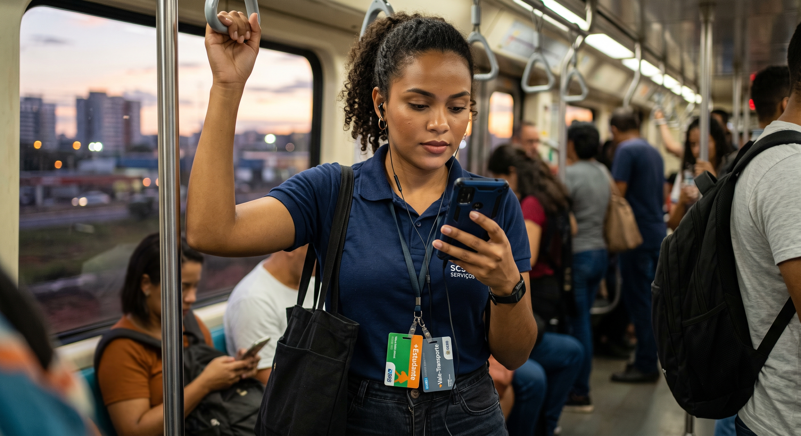

# Persona: Larissa Ferreira Lima

## Histórico de Versão e Contribuição

| Data | Versão | Descrição | Autor(es) | Revisor(es) |
| :---: | :---: | :--- | :--- | :--- |
| 26/09/2026 | 1.0 | Elaboração detalhada da persona primária Larissa Ferreira Lima. | [Gabriel Melo](https://github.com/gabriellcardone-06) | [Igor Dantas](https://github.com/IgorDARAUJO) |
| 27/09/2026 | 1.1 | Modularização em documento dedicado e padronização com a nova estrutura. | [Carlos Costa](https://github.com/carloshfgit) | [Gabriel Melo](https://github.com/gabriellcardone-06) |

---

## 1. Introdução

Este documento apresenta Larissa Ferreira Lima, persona que representa estudantes e trabalhadoras que utilizam o transporte público diariamente e consultam informações de mobilidade em intervalos curtos pelo celular. Sua caracterização apoia a compreensão de necessidades relacionadas a linhas, horários, segurança e atendimento, orientando cenários, requisitos e decisões de design do projeto.

## 2. Caracterização Geral

**Autor: Gabriel Melo**

*Figura 1 — Larissa Ferreira Lima, a "Lari" (imagem ilustrativa, gerada por IA Gemini).*

> **"Eu só preciso saber que ônibus pegar, que horas ele passa e se ainda dá tempo. Não quero ficar caçando isso em vários sites."**

**Resumo:** estudante e trabalhadora que depende do transporte público todos os dias. Usa o site da Semob em janelas curtas, pelo celular, para tirar dúvidas práticas sobre linhas, tarifas, cartões e atendimento.

---

## 3. Identidade

A Tabela 1 reúne os dados de identidade de Larissa e contextualiza as características pessoais que influenciam sua relação com o transporte público e com a tecnologia.

**Tabela 1** — Identidade e características pessoais de Larissa Ferreira Lima

| Campo | Descrição |
|---|---|
| **Nome** | Larissa Ferreira Lima ("Lari") |
| **Idade** | 23 anos |
| **Gênero** | Feminino |
| **Família** | Solteira, sem filhos. Mora com a mãe, Sônia (49, auxiliar de serviços gerais), e o irmão mais novo, Pedro (15, estudante do ensino médio em escola pública) |
| **Moradia** | Ceilândia (RA IX), Distrito Federal |
| **Escolaridade** | Ensino médio em escola pública. Cursa o 5º semestre de Administração (noturno) em universidade pública no Plano Piloto; formatura prevista para 2028 |
| **Ocupação** | Assistente administrativa (CLT) em empresa privada no Setor Comercial Sul, das 8h às 17h |
| **Renda** | Cerca de R$ 2.400/mês; renda familiar per capita em torno de R$ 1.400 |
| **Deslocamento** | Cerca de 3 horas por dia, combinando metrô e ônibus com integração |
| **Cartões de transporte** | +Estudante (Passe Livre Estudantil) e +Vale-Transporte |
| **Dispositivos** | Smartphone Android intermediário, com plano de dados limitado; notebook antigo compartilhado em casa |
| **Como chega ao site** | Quase sempre pelo celular, via busca no Google ou link recebido no WhatsApp e no Instagram |
| **Personalidade** | Organizada, prática e independente. Impaciente com burocracia, mas cautelosa para não perder benefícios |

*Fonte: Gabriel Melo.*

---

## 4. Status

**Persona primária.**

Por que ela é a persona primária:

- **É o perfil mais frequente e mais dependente do sistema.** Usa ônibus e metrô todos os dias e não tem alternativa de carro ou moto. Os estudantes têm peso enorme: o Passe Livre Estudantil somou 60,2 milhões de acessos em 2025.
- **Suas necessidades coincidem com o núcleo do site:** linhas e horários, tarifas e integração, cartões e benefícios, avisos de mudanças e canais de atendimento.
- **Reúne os dois perfis mais típicos (estudante e trabalhadora).** Projetar para ela também atende quem só estuda, quem só trabalha e boa parte dos usuários ocasionais.
- **Reflete um padrão observado no DF:** nas faixas de renda mais baixas, o ônibus é o meio predominante entre as mulheres.
- **Deve orientar as decisões de projeto.** Prioridade de conteúdo, menu, linguagem e design para celular são pensados primeiro para ela; os perfis secundários entram como adaptações.

---

## 5. Objetivos

### Objetivos de vida e de trabalho (além do site)

- Concluir a graduação e ser efetivada ou promovida na área administrativa, sem largar o emprego.
- Ajudar nas contas de casa e formar uma reserva para, no futuro, morar mais perto do trabalho.
- Reduzir o tempo e o desgaste do deslocamento para ter mais horas de descanso, estudo e convívio com a família.
- Chegar no horário ao trabalho e à aula, sem estresse (atrasos pesam na avaliação profissional e na frequência da faculdade).
- Voltar para casa com segurança à noite.
- Manter em dia os benefícios (Passe Livre Estudantil e Vale-Transporte), sem bloqueios surpresa.

### Objetivos ao usar o site

- Descobrir rapidamente qual linha pegar, em que horário e por qual trajeto, incluindo a última viagem da noite.
- Entender quanto vai pagar e como funciona a integração entre ônibus e metrô.
- Resolver questões de cartão e benefícios com poucos passos, ou saber exatamente a quem recorrer.
- Registrar reclamações e sugestões e sentir que foi ouvida.
- Ficar sabendo de mudanças (desvios, obras, novas linhas) que afetem o trajeto dela.

---

## 6. Habilidades

- **Educação e formação:** ensino médio em escola pública; graduação em Administração em andamento; curso de Excel intermediário.
- **Competências profissionais:** rotinas administrativas (planilhas, arquivo, agenda), atendimento a clientes e fornecedores, comunicação escrita objetiva e boa gestão do tempo para conciliar trabalho, aula e deslocamento.
- **Competências digitais:** nativa digital. Usa com desenvoltura WhatsApp, redes sociais, apps de banco, Pix e aplicativos de mapas, e já usou serviços do gov.br. Preenche formulários e anexa documentos pelo celular quando o passo a passo é claro, mas perde a paciência com PDFs longos, links quebrados e páginas que não cabem na tela.
- **Conhecimento do domínio (transporte):** especialista no uso, leiga na instituição. Conhece de cor as linhas que usa, os terminais, os horários de pico e as paradas mais seguras. Não domina termos como STPC/DF, bacia, tarifa técnica ou JARI, nem a diferença de papéis entre Semob, BRB Mobilidade, Metrô-DF e empresas de ônibus.
- **Limitações e contexto de uso:** acessa em janelas de 2 a 5 minutos, em pé, com uma mão, com sol na tela e internet instável; tem franquia de dados limitada; lê "na diagonal".

---

## 7. Tarefas

A Tabela 2 apresenta as tarefas mais frequentes de Larissa, permitindo relacionar sua rotina às necessidades consideradas pelo projeto.

**Tabela 2** — Tarefas realizadas por Larissa Ferreira Lima

| Tarefa | Frequência | Importância | Duração |
|---|---|---|---|
| Consultar linhas, horários e itinerários (ida, volta e alternativas) | Diária | Crítica | 1 a 3 min |
| Conferir o horário da última viagem à noite | Dias de aula (4 a 5 vezes por semana) | Crítica | 1 a 2 min |
| Verificar avisos de mudanças (desvios, obras, greves, novas linhas) | Semanal ou quando percebe atraso | Alta | 2 a 5 min |
| Entender tarifa e integração ônibus ↔ metrô | Ocasional (ao mudar de rota ou ver cobrança estranha) | Alta | 3 a 10 min |
| Conferir saldo e créditos dos cartões (Vale-Transporte e acessos do Passe Livre) e o que fazer quando não atualizam | Semanal | Alta | 1 a 3 min |
| Resolver problema no cartão (bloqueio, perda, 2ª via, cobrança indevida) | Eventual (2 a 3 vezes por ano) | Crítica quando ocorre | 15 a 30 min |
| Cuidar do cadastro do Passe Livre Estudantil (dela e do irmão): solicitar, atualizar dados, informar troca de instituição | Semestral ou anual | Alta | 10 a 20 min, mais a espera da análise |
| Registrar reclamação, sugestão ou pedido de nova linha ou abrigo | Eventual (poucas vezes por ano) | Média | 5 a 10 min |
| Consultar direitos e regras (ex.: desembarque fora do ponto à noite, gratuidades) | Eventual | Média | 2 a 3 min |

*Fonte: Gabriel Melo.*

> Os passos detalhados de cada tarefa estão descritos nos **[Cenários](../cenarios/index.md)** (em especial o **[Cenário 1](../cenarios/cenario-1-ultima-viagem.md)**).

**Contexto da rotina (dia útil):**

A Tabela 3 organiza a rotina diária de Larissa para evidenciar os momentos em que informações de transporte afetam seus deslocamentos entre trabalho, estudo e residência.

**Tabela 3** — Rotina diária de Larissa Ferreira Lima

| Horário | Atividade |
|---|---|
| ~6h30 | Sai de casa; metrô e ônibus até o Plano Piloto (cerca de 1h15) |
| 8h–17h | Trabalho no Setor Comercial Sul |
| 17h–19h | Vai até a universidade (cerca de 45 min) e faz um lanche rápido |
| 19h–22h30 | Aulas |
| 22h30–~23h45 | Volta para Ceilândia (ônibus e/ou metrô, conforme o horário) |

*Fonte: Gabriel Melo.*

---

## 8. Relacionamentos

A Tabela 4 identifica as pessoas e instituições com as quais Larissa se relaciona e explica como essas relações interferem em suas decisões de deslocamento.

**Tabela 4** — Relacionamentos relevantes de Larissa Ferreira Lima

| Quem | Relação com a Lari | Por que importa para o projeto |
|---|---|---|
| **Mãe (Sônia) e irmão (Pedro)** | Convivência diária. A Lari ajuda o Pedro com o cartão estudantil e responde às dúvidas de horário da mãe | Usuários indiretos: a informação precisa ser compreensível por quem tem menos familiaridade digital |
| **Chefe e equipe de trabalho** | Cobram pontualidade; colegas trocam dicas de rota | Atrasos causados por informação errada ou ausente têm custo profissional |
| **RH da empresa** | Credita o Vale-Transporte e é comunicado sobre gratuidades do funcionário | Stakeholder que precisa de regras claras e atualizadas |
| **Colegas de turma e secretaria do curso** | Trocam dicas de linhas; a secretaria emite a declaração escolar exigida no cadastro do Passe Livre Estudantil | A lista de documentos e prazos do cadastro precisa estar clara |
| **Grupos de WhatsApp de passageiros** | Fonte informal e rápida de avisos (atrasos, desvios, lotação) | Se o site não avisa a tempo, o grupo vira a fonte principal |
| **Motoristas e fiscais** | Contato presencial para dúvidas na hora do embarque | Canal informal de atendimento; reflete a qualidade da informação oficial |
| **BRB Mobilidade** | Emite cartões, recebe recargas e cadastra o Passe Livre Estudantil; tem app e central de atendimento | Stakeholder crítico: várias tarefas dela terminam no ambiente do BRB, não no da Semob |
| **Metrô-DF e empresas de ônibus** | Operam o serviço que ela usa todos os dias | Geram os dados de linhas, horários e desvios |
| **Ouvidoria do GDF (162 / ouv.df.gov.br) e Semob** | Canais formais de reclamação, sugestão e pedido de nova linha | Precisam ser fáceis de achar e permitir acompanhar o pedido |

*Fonte: Gabriel Melo.*

---

## 9. Requisitos

A Tabela 5 sintetiza as necessidades de Larissa em requisitos que devem orientar as decisões de projeto da interface.

**Tabela 5** — Necessidades e requisitos de Larissa Ferreira Lima

| Necessidade | Em suas palavras |
|---|---|
| Informação rápida de linhas e horários, no celular | *"Antes de sair de casa eu só quero saber: qual ônibus, que horas passa e se ainda tem o último."* |
| Um caminho claro para cada serviço | *"O cartão é no BRB, o horário é em outro site, a reclamação é em outro… Eu já perdi um tempão só descobrindo pra onde ir."* |
| Linguagem simples | *"Fala comigo como gente: eu posso ou não posso? O que eu levo e quanto tempo demora?"* |
| Site leve e fácil de usar com uma mão | *"Eu abro no celular, em pé no ônibus, com uma mão só. Se pesar ou travar, eu desisto."* |
| Resolver online, sem ir a um posto | *"Não dá pra faltar no serviço pra ir num posto. Se dá pra resolver pela internet, quero fazer pela internet."* |
| Acompanhar pedidos e reclamações | *"Mandei uma reclamação e nunca soube se alguém leu. Queria um número de protocolo e ver o andamento."* |
| Avisos de mudanças antes de chegar à parada | *"Se mudou o itinerário, eu quero saber antes de chegar na parada, não depois."* |
| Informações de segurança e direitos | *"Depois das 22h eu queria lembrar que posso descer fora do ponto e saber como pedir isso ao motorista."* |
| Clareza sobre os benefícios | *"Quero entender como o passe estudantil e o vale-transporte funcionam juntos, pra ninguém me cobrar depois."* |
| Confiança na informação | *"Tem que ser coisa oficial e atualizada. Se tiver a data da última atualização, melhor ainda."* |

*Fonte: Gabriel Melo.*

---

## 10. Expectativas

### Como ela acredita que o serviço funciona

- Acredita que "o site do transporte" é um balcão virtual único, onde se resolve tudo: horários, cartão, recarga, Passe Livre e reclamação. Não distingue Semob, BRB Mobilidade, Metrô-DF e empresas de ônibus; para ela é "o ônibus" e "o cartão".
- Espera pesquisar como no Google Maps: digitar origem e destino (ou o número da linha) e receber opções e horários, de preferência em tempo real.
- Espera fluxos parecidos com app de banco e gov.br: login simples, status do pedido e notificação por e-mail ou WhatsApp.
- Espera respostas objetivas, com passo a passo, lista de documentos e prazos, sem precisar ler leis e portarias.

### Como ela organiza as informações no seu dia a dia

- Por **trajeto** ("casa → trabalho → faculdade → casa") e por **lugares de referência** (Ceilândia, Rodoviária, Setor Comercial Sul, universidade).
- Por **número da linha** e por **horário** (pico da manhã, última viagem da noite).
- Por **situação de vida** ("sou estudante", "tenho vale-transporte", "perdi meu cartão"), e não por tipo de cartão, concessionária, bacia ou tarifa técnica.

### Onde essas expectativas colidem com o site hoje (observado em 24/09/2026)

- **Lugar único × serviços distribuídos.** A Semob planeja e regula o sistema, mas o cadastro do Passe Livre Estudantil, a emissão de cartões e a recarga ficam com o BRB Mobilidade; linhas e horários ficam no DF no Ponto; reclamações vão para a Ouvidoria do GDF.
- **Vocabulário do cidadão × vocabulário institucional.** O menu principal usa termos como Institucional, Governança, Legislação, Dados STPC e PDTU. Os serviços do dia a dia aparecem em blocos da página inicial, ao lado de conteúdos de transparência e parcerias público-privadas.
- **Resposta imediata × análise com prazo.** Ela espera resposta na hora para o Passe Livre; a 1ª via do cartão estudantil pode levar até 20 dias úteis.
- **"Um botão para resolver" × caminho em várias etapas.** Quando a integração falha, o caminho passa por levar o cartão a um posto do BRB para leitura e, se houver cobrança indevida, abrir uma manifestação na Ouvidoria.

---

## 11. Referências Bibliográficas

* BARBOSA, Simone Diniz Junqueira; SILVA, Bruno Santana da; SILVEIRA, Milene Selbach; GASPARINI, Isabela; DARIN, Ticianne; BARBOSA, Gabriel Diniz Junqueira. **Interação Humano-Computador e Experiência do Usuário**. Rio de Janeiro: Autopublicação, 2021. ISBN 978-65-00-19677-1.
