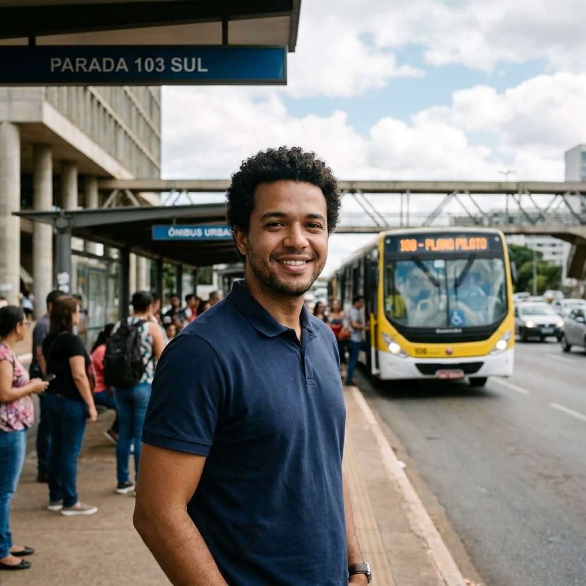

# Persona: Marcos Paulo Vieira (Passageiro Cotidiano)

## Histórico de Versão e Contribuição

| Data | Versão | Descrição | Autor(es) | Revisor(es) |
| :---: | :---: | :--- | :--- | :--- |
| 27/09/2026 | 1.0 | Elaboração detalhada da persona primária Marcos Paulo Vieira (Passageiro Cotidiano / Usuário Padrão). | [Lucas Araújo](https://github.com/Lucasaraujoszz) | [Arthur Mariani](https://github.com/arthur-mariani) |

---

## 1. Introdução

Este documento apresenta Marcos Paulo Vieira, persona que representa passageiros cotidianos que dependem do transporte coletivo para trabalhar e utilizam exclusivamente o smartphone para planejar seus deslocamentos. Sua caracterização evidencia necessidades de rapidez, simplicidade e informação em tempo real, apoiando a elaboração de cenários, análises de tarefas e decisões de design do projeto.

## 2. Caracterização Geral

**Autor: Lucas Araújo Lima**

<em>Figura 1 — Marcos Paulo Vieira, o "Marquinhos" (imagem ilustrativa em ponto de ônibus de Brasília, gerada por IA Gemini).</em>

<em>Fonte: Lucas Araújo Lima (2026).</em>

> **"Eu não quero ler notícias do governo nem ficar adivinhando o número de linha de ônibus. Eu só quero colocar onde eu estou e onde preciso chegar, ver onde o ônibus tá e não me atrasar pro trabalho."**

**Resumo:** Trabalhador do setor de logística e comércio que depende diariamente do transporte público coletivo do Distrito Federal (STPC/DF) para se deslocar entre Samambaia e o Setor de Indústria e Abastecimento (SIA). Acessa os serviços digitais de mobilidade exclusivamente pelo smartphone, na pressa do ponto ou dentro do ônibus, e exige rapidez, simplicidade e dados em tempo real.

---

## 3. Identidade

A Tabela 1 reúne os atributos pessoais de Marcos Paulo que contextualizam suas necessidades de mobilidade e sua relação com a tecnologia.

<strong>Tabela 1</strong> — Identidade e Atributos Pessoais da Persona

| Campo | Detalhamento |
|---|---|
| **Nome Completo** | Marcos Paulo Vieira ("Marquinhos") |
| **Idade** | 31 anos |
| **Gênero / Etnia** | Masculino / Pardo |
| **Família** | Casado com Camila (29 anos, operadora de caixa); pai de Lucas (4 anos) |
| **Moradia** | Samambaia Sul (Região Administrativa XII), Distrito Federal |
| **Escolaridade** | Ensino Médio completo em escola pública; curso técnico em Logística |
| **Ocupação** | Assistente de Logística e Estoque (CLT) em uma distribuidora no SIA Trecho 3 |
| **Horário de Trabalho** | Segunda a sexta-feira das 08h00 às 17h30; sábados alternados das 08h00 às 12h00 |
| **Renda Individual / Familiar** | R$ 2.650,00 mensais / Renda familiar total em torno de R$ 4.200,00 |
| **Rotina de Deslocamento** | Cerca de 2h40 a 3h10 diárias de deslocamento total (ônibus alimentador + linha semi-expressa) |
| **Meio de Pagamento** | Cartão Mobilidade (Vale-Transporte corporativo recarregado mensalmente) |
| **Dispositivo de Acesso** | Smartphone intermediário (Samsung Galaxy A24), tela com película riscada, plano pré-pago |
| **Forma de Acesso ao Portal** | Navegador móvel (Google Chrome) a partir de buscas no Google ou links rápidos salvos |
| **Personalidade e Estilo** | Prático, focado em resolver problemas sem rodeios, pontual, avesso a retrabalho e burocracia |

<em>Fonte: Lucas Araújo Lima (2026), estruturado com base em Courage & Baxter (2005).</em>

---

## 4. Status no Projeto

**Persona Primária (*Primary Persona*).**

### Justificativas Metodológicas (*Cooper et al., 2007; Barbosa & Silva, 2010*):
1. **Representa o maior contingente numérico do STPC/DF:** Trabalhador dependente exclusivo de transporte coletivo que realiza viagens pendulares cotidianas entre as cidades-satélites (RAs de baixa/média-baixa renda) e os polos de emprego e serviços do DF.
2. **Exigência de Solução Própria:** Suas necessidades e restrições não são plenamente atendidas pela interface pensada para estudantes universitários (que focam em regras do Passe Livre Estudantil e carteirinhas) nem por interfaces pensadas para analistas de gabinete da SEMOB. Marcos precisa de **planejamento operacional de rota e tempo real em mobilidade extrema**.
3. **Restrições Severas de Contexto:** Como utiliza o sistema sob o sol, em pé no ponto, com pressa e sinal de dados móveis flutuante, qualquer fricção cognitiva (redirecionamentos, botões minúsculos, páginas pesadas) leva ao abandono imediato do portal.

---

## 5. Objetivos da Persona

Conforme os fundamentos de Donald Norman (2003) e Alan Cooper (1999, 2007) discutidos em Barbosa & Silva (2010, pp. 180–183):

### 5.1 Objetivos de Vida (*Life Goals* - Nível Reflexivo)
* Garantir a estabilidade financeira de sua família e prover educação e qualidade de vida para seu filho.
* Crescer profissionalmente para o cargo de encarregado de logística na empresa.
* Reduzir o tempo e o cansaço do trânsito para passar mais tempo com sua esposa e filho no período da noite.

### 5.2 Objetivos Pessoais (*Personal Goals* - Nível Visceral / Humano)
* **Não se sentir perdido nem desinformado** diante de imprevistos na linha.
* **Não cometer erros de trajeto** que causem atraso no trabalho e advertências de ponto.
* **Manter o controle e a tranquilidade** em paradas com sensação de insegurança.

### 5.3 Objetivos Práticos / Ao Usar o Sistema (*End Goals* - Nível Comportamental)
* **Planejar deslocamentos informando apenas Origem e Destino:** Descobrir qual ônibus pegar sem precisar saber o código numérico da linha.
* **Verificar a localização em tempo real do ônibus:** Saber exatamente onde o veículo está e quantos minutos faltam para passar na parada de Samambaia.
* **Identificar alterações e desvios operacionais:** Ficar ciente de obras ou mudanças de itinerário que afetem o SIA antes de embarcar.
* **Resolver tudo em uma única interface:** Não ter que baixar múltiplos apps ou ser jogado para links externos quebrados.

> **Alerta de Falsos Objetivos:** Para Marcos, "consultar o PDF com a tabela horária do STPC/DF" não é um objetivo; o objetivo verdadeiro é **saber que horas o próximo ônibus vai passar na sua parada**.

---

## 6. Habilidades e Limitações de Contexto

* **Letramento e Linguagem:** Compreende termos diretos do dia a dia ("parada", "ônibus", "tarifa", "tempo de espera"). Rejeita termos técnicos e institucionais que desconhece ("bacia operacional", "ordem de serviço", "tarifa de remuneração", "STPC").
* **Competências Tecnológicas:** Usuário fluente de smartphone para tarefas práticas cotidianas (WhatsApp, YouTube, Nubank, Instagram, Google Maps e Waze para quando anda de carona). Consegue navegar com facilidade quando a interface oferece campos de busca preditivos e mapas interativos limpos.
* **Limitações de Conectividade e Hardware:** Possui franquia de dados móveis limitada (costuma economizar internet fora de casa); se depara frequentemente com cache travado do navegador e sinal oscilante de 3G/4G no percurso da via EPTG/Estrutural.
* **Ergonomia e Contexto Físico:** Opera o celular com apenas uma das mãos enquanto segura mochila ou marmita com a outra; consulta as telas sob luz solar intensa e em locais movimentados e barulhentos.

---

## 7. Tarefas da Persona

A Tabela 2 apresenta as tarefas recorrentes de Marcos Paulo e evidencia sua frequência, criticidade e contexto de execução para orientar as decisões de projeto.

<strong>Tabela 2</strong> — Matriz de Tarefas do Passageiro Cotidiano

| Tarefa | Frequência | Criticidade / Importância | Duração Típica | Contexto de Execução |
| :--- | :--- | :--- | :--- | :--- |
| **Planejar viagem por Origem e Destino** | 2 a 3 vezes/dia | **Crítica** | 30 s a 1 min | No ponto ou antes de sair de casa/trabalho |
| **Rastrear localização do ônibus no mapa** | 3 a 5 vezes/dia | **Crítica** | Menos de 40 s | Aguardando na parada (sob ansiedade) |
| **Consultar valor da tarifa e integração** | Semanal / Mensal | Média | 1 a 2 min | Ao mudar de linha ou trajeto |
| **Verificar comunicados de interdições/obras** | Ocasional / Urgente | Alta | 1 a 3 min | Quando percebe atraso excessivo |

<em>Fonte: Lucas Araújo Lima (2026).</em>

---

## 8. Relacionamentos

* **Colegas de Trabalho do SIA:** Trocam informações operacionais em grupos de WhatsApp sobre manifestações, paralisações e desvios de trânsito na Estrutural.
* **Encarregado da Distribuidora:** Exige pontualidade rigorosa na abertura do armazém às 08h00.
* **Motoristas e Cobradores:** Interage na catraca ao tirar dúvidas quando a linha demora ou muda de trajeto sem aviso.

---

## 9. Requisitos e Citações em Primeira Pessoa (*Quotes*)

> *"Quando eu tô no ponto de ônibus com a bolsa na mão, eu não tenho tempo de ficar procurando em menu de portal governamental. Eu só preciso de um campo pra dizer 'quero ir pro SIA Trecho 3' e ver na hora qual ônibus tá vindo."*

> *"Dá muita raiva quando o site manda a gente baixar outro app ou abre um link de erro dizendo pra limpar o cache. Se o governo tem um portal oficial de transporte, ele devia dar a rota e o horário direto na tela, limpo e funcionando."*

### Requisitos Elicitados para o Sistema:
1. **Requisito RF-01:** Campo de busca proeminente na página inicial baseado em "De onde você sai → Para onde você vai".
2. **Requisito RF-02:** Apresentação integrada da rota, paradas de transbordo e previsão de chegada em minutos (tempo real).
3. **Requisito RNF-01 (Desempenho e Usabilidade):** Carregamento em menos de 2 segundos em rede móvel 3G/4G sem necessidade de limpeza manual de cache.
4. **Requisito RNF-02 (Arquitetura de Informação):** Resolução integral da tarefa dentro do portal sem redirecionamento para lojas de aplicativos de terceiros.

---

## 10. Expectativas sobre o Sistema

* **Simplicidade Imediata:** O sistema deve reconhecer nomes de empresas, shoppings e bairros do DF sem exigir códigos técnicos.
* **Previsibilidade e Confiança:** Se o portal indica que o ônibus vai passar em 7 minutos, a informação deve corresponder com precisão à realidade da via.
* **Feedback Construtivo:** Caso haja falha de sinal do GPS da linha, o sistema deve informar claramente *"Sinal GPS indisponível no momento — exibindo horário programado da tabela"*, evitando que o usuário fique em dúvida se o sistema travou.

---

## 11. Referências Bibliográficas

* BARBOSA, Simone Diniz Junqueira; SILVA, Bruno Santana da. **Interação Humano-Computador**. Rio de Janeiro: Elsevier / Campus, 2010. Capítulo 6: Organização do Espaço de Problema — Personas (pp. 176–183).
* COOPER, Alan; REIMANN, Robert; CRONIN, David. **About Face 3: The Essentials of Interaction Design**. Indianapolis: Wiley, 2007.
* COURAGE, Catherine; BAXTER, Kathy. **Understanding Your Users: A Practical Guide to User Requirements, Methods, Tools, and Techniques**. San Francisco: Morgan Kaufmann, 2005.
