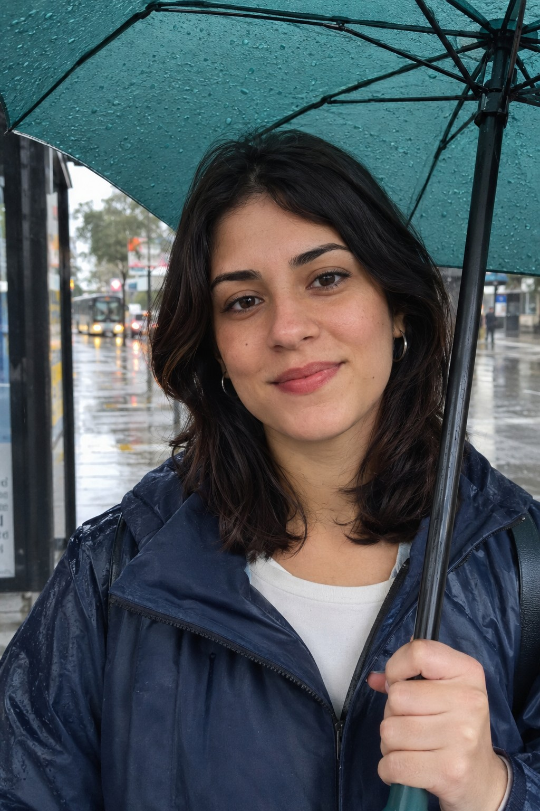

# Persona: Mariana Borges Almeida

## Histórico de Versão e Contribuição

| Data | Versão | Descrição | Autor(es) | Revisor(es) |
| :---: | :---: | :--- | :--- | :--- |
| 27/09/2026 | 1.0 | Elaboração detalhada da persona Mariana Borges Almeida a partir do Cenário 10 e padronização com a estrutura dos documentos de persona. | [Rodrigo Barbosa](https://github.com/RodrigoCBarbosa) | [Carlos Costa](https://github.com/carloshfgit) |

---

## 1. Introdução

Este documento apresenta Mariana Borges Almeida, persona que representa trabalhadoras que dependem do transporte público e precisam de informações confiáveis para ajustar o momento de sair de casa. Sua caracterização evidencia a importância do monitoramento em tempo real, sobretudo em condições climáticas adversas, orientando cenários, requisitos e decisões de design do projeto.

## 2. Caracterização Geral

**Autor:** Rodrigo Barbosa

*Figura 1 — Mariana Borges Almeida (imagem ilustrativa).*

> **"Só saio de casa na hora certa: nem antes, pra não esperar na chuva, nem depois, pra não perder o ônibus."**

**Resumo:** trabalhadora com rotina organizada, que depende do ônibus todos os dias para chegar ao trabalho. Consulta o Portal da SEMOB pelo celular em momentos curtos (durante o café da manhã e pouco antes de sair) para acompanhar o veículo em tempo real, especialmente em dias de chuva, já que o ponto de ônibus perto de sua casa não tem boa cobertura.

---

## 3. Identidade

A Tabela 1 reúne os dados de identidade de Mariana e contextualiza as características pessoais que influenciam sua relação com o transporte público e com a tecnologia.

**Tabela 1** — Identidade e características pessoais de Mariana Borges Almeida

| Campo | Descrição |
|---|---|
| **Nome** | Mariana Borges Almeida |
| **Idade** | 29 anos |
| **Gênero** | Feminino |
| **Família** | Mora sozinha; mantém contato frequente com familiares, mas toma sozinha as decisões da rotina diária |
| **Moradia** | Taguatinga Sul, Distrito Federal |
| **Escolaridade** | Ensino superior completo em Administração |
| **Ocupação** | Analista administrativa, com horário fixo de entrada pela manhã |
| **Renda** | Classe média; renda própria |
| **Deslocamento** | Diário, de casa para o trabalho, utilizando ônibus |
| **Cartões de transporte** | Possui cartão de transporte e realiza recargas pela internet |
| **Dispositivos** | Smartphone Android; usa o celular como principal ferramenta para consultas do dia a dia |
| **Como chega ao app/site** | Acessa o Portal da SEMOB diretamente pelo navegador do celular |
| **Personalidade** | Organizada, disciplinada e pontual; planeja a saída de casa com antecedência; valoriza previsibilidade e controle sobre o próprio tempo; fica frustrada com imprevistos evitáveis |

*Fonte: Rodrigo Barbosa.*

---

## 4. Status

**Persona primária.**

Por que ela é persona primária:

- Está associada a um **Cenário Ideal**, no qual o sistema funciona como esperado, servindo para validar a experiência desejada quando não há falhas.
- Seu perfil complementa o da persona primária, associada a um Cenário de Problema, ao demonstrar o valor concreto do rastreamento em tempo real e dos alertas de trânsito para quem os utiliza.
- Tem familiaridade digital confortável e rotina previsível, o que a torna uma usuária representativa do público geral de trabalhadores que consultam o portal antes de sair de casa.
- Suas necessidades entram como reforço e adaptação às decisões centrais de projeto, em especial a exibição do tempo estimado de chegada e dos alertas de condições operacionais.

---

## 5. Objetivos

### Objetivos de vida (além do app)

- Manter uma rotina equilibrada entre trabalho e vida pessoal.
- Chegar ao trabalho bem disposta, sem o desgaste de imprevistos no deslocamento.
- Evitar estresse e desconforto causados por esperas longas em condições climáticas adversas.

### Objetivos ao usar o app/site

- Saber exatamente quanto tempo falta para o ônibus chegar.
- Verificar as condições de trânsito.
- (Objetivo principal) Pegar o ônibus para o trabalho sem se molhar e sem esperar muito tempo na parada.

### Motivações

- A chuva forte e a falta de cobertura adequada no ponto de ônibus perto de casa.

### Sensações desejadas (nível visceral)

- Tranquilidade e sensação de controle sobre o próprio tempo.
- Alívio ao evitar imprevistos e confiança de que a informação do sistema corresponde à realidade.

---

## 6. Habilidades

- **Educação e formação:** ensino superior completo em Administração.
- **Competências profissionais:** atuação em rotinas administrativas, com boa organização de tempo e atenção a prazos e horários.
- **Competências digitais:** familiaridade confortável com aplicativos e sites mobile; consulta o portal com poucos toques e faz verificações rápidas e repetidas sem dificuldade. Prefere interfaces limpas, diretas e de carregamento rápido.
- **Conhecimento do domínio (transporte):** conhece bem sua própria linha e sua rotina diária, mas não domina detalhes do sistema como um todo, como regras tarifárias e integrações entre outras linhas.
- **Limitações e contexto de uso:** o ponto de ônibus próximo à sua casa não possui boa cobertura contra chuva, o que a torna dependente de informações precisas em tempo real para decidir o momento de sair.

---

## 7. Tarefas

A Tabela 2 apresenta as tarefas mais frequentes de Mariana, permitindo relacionar sua rotina às necessidades consideradas pelo projeto.

**Tabela 2** — Tarefas realizadas por Mariana Borges Almeida

| Tarefa | Frequência | Importância | Duração |
|---|---|---|---|
| Consultar linhas e horários | Diária | Crítica | 2 a 3 minutos, em duas consultas (durante o café e pouco antes de sair) |
| Verificar alertas de trânsito e condições operacionais | Diária | Crítica | Junto à consulta de horários, alguns segundos |

*Fonte: Rodrigo Barbosa.*

> Em dias de chuva forte, a importância dessas tarefas aumenta: uma informação imprecisa a leva a esperar exposta no ponto ou a perder o ônibus. Os passos detalhados dessa tarefa estão descritos nos **Cenários** (em especial o **Cenário 3**).

**Contexto da rotina (conhecido pelo Cenário 3 — cenário ideal):**

A Tabela 3 organiza a rotina de Mariana para evidenciar os momentos em que informações precisas sobre o transporte são especialmente importantes, sobretudo em dias de chuva.

**Tabela 3** — Rotina de Mariana Borges Almeida

| Horário | Atividade |
|---|---|
| 07:00 | Em casa, tomando café da manhã; acessa o Portal da SEMOB pelo celular |
| ~07:00 (durante o café) | Seleciona a linha diária; vê que o próximo veículo chega em aproximadamente 12 minutos; recebe alerta de trânsito intenso |
| +8 minutos | Faz última verificação; o portal indica chegada em 4 minutos |
| Em seguida | Sai de casa e caminha até a parada de ônibus |
| Ao chegar na parada | Espera menos de dois minutos; embarca no ônibus |

*Fonte: Rodrigo Barbosa.*

---

## 8. Relacionamentos

A Tabela 4 identifica as pessoas e instituições com as quais Mariana se relaciona e explica a relevância dessas relações para suas decisões de deslocamento.

**Tabela 4** — Relacionamentos relevantes de Mariana Borges Almeida

| Quem | Relação com Mariana | Por que importa para o projeto |
|---|---|---|
| **Júnior (vizinho)** | Morador da mesma rua; encontra-se com ela no ponto de ônibus | Funciona como contraste: não utiliza o Portal da SEMOB, sai de casa "às cegas" e fica frustrado esperando na chuva, evidenciando o valor do portal para quem o usa |
| **Motorista do ônibus** | Contato direto durante o embarque | Dirige sob condições adversas tentando cumprir o horário previsto pelo sistema, o que impacta diretamente a experiência de Mariana |
| **Colegas de trabalho** | Convivência diária no ambiente profissional | Fonte informal de dicas e comentários sobre trânsito e atrasos, complementando a informação do portal |
| **Chefia imediata** | Relação profissional; cobra pontualidade no início do expediente | Atrasos no transporte podem gerar cobranças e estresse, reforçando a importância de informações confiáveis |

*Fonte: Rodrigo Barbosa.*

---

## 9. Requisitos

A Tabela 5 sintetiza as necessidades de Mariana em requisitos que devem orientar as decisões de projeto da interface.

**Tabela 5** — Necessidades e requisitos de Mariana Borges Almeida

| Necessidade | Em suas palavras |
|---|---|
| Confirmar o tempo exato de chegada do ônibus para não ficar exposta na chuva | *"Está chovendo muito e não quero me molhar. Vou confirmar o tempo exato de chegada do ônibus para não ter que ficar exposta no ponto."* |
| Verificar se o trânsito está causando atraso na rota | *"Preciso verificar se o trânsito caótico da manhã está causando algum atraso significativo na minha rota."* |
| Confirmação de última hora antes de sair de casa | *"Vou só confirmar se o tempo estimado se manteve ou se houve algum atraso de última hora devido à chuva antes de sair de casa."* |
| Acesso rápido à linha diária logo na tela inicial | *"Ótimo, o site abriu rápido e a minha linha já está logo aqui na tela inicial."* |

*Fonte: Rodrigo Barbosa.*

---

## 10. Expectativas

### Como ela acredita que o serviço funciona

- Espera que o Portal da SEMOB abra rapidamente e já mostre sua linha diária na tela inicial.
- Espera visualizar o tempo estimado de chegada do ônibus com destaque.
- Espera receber alertas sobre condições de trânsito que possam gerar atraso.
- Espera que o tempo estimado se ajuste de forma confiável conforme o horário se aproxima.

### Como ela organiza as informações no seu dia a dia

- Por **linha e horário** da sua rota diária entre casa e trabalho.
- Por **momento de decisão prático**: a que horas sair de casa para não esperar (nem se molhar) à toa no ponto.
- Pela **fonte que já usa e confia**: o Portal da SEMOB, consultado pelo celular.

### Onde essas expectativas colidem com a realidade

Não há colisão no Cenário 10, que é um **cenário ideal**: todas as expectativas de Mariana são atendidas, e o ônibus chega conforme previsto pelo sistema. O contraste com a realidade aparece apenas na figura de Júnior, que, sem o portal, espera na chuva por 15 minutos.

---

## 11. Referências Bibliográficas

* BARBOSA, Simone Diniz Junqueira; SILVA, Bruno Santana da; SILVEIRA, Milene Selbach; GASPARINI, Isabela; DARIN, Ticianne; BARBOSA, Gabriel Diniz Junqueira. **Interação Humano-Computador e Experiência do Usuário**. Rio de Janeiro: Autopublicação, 2021. ISBN 978-65-00-19677-1.
