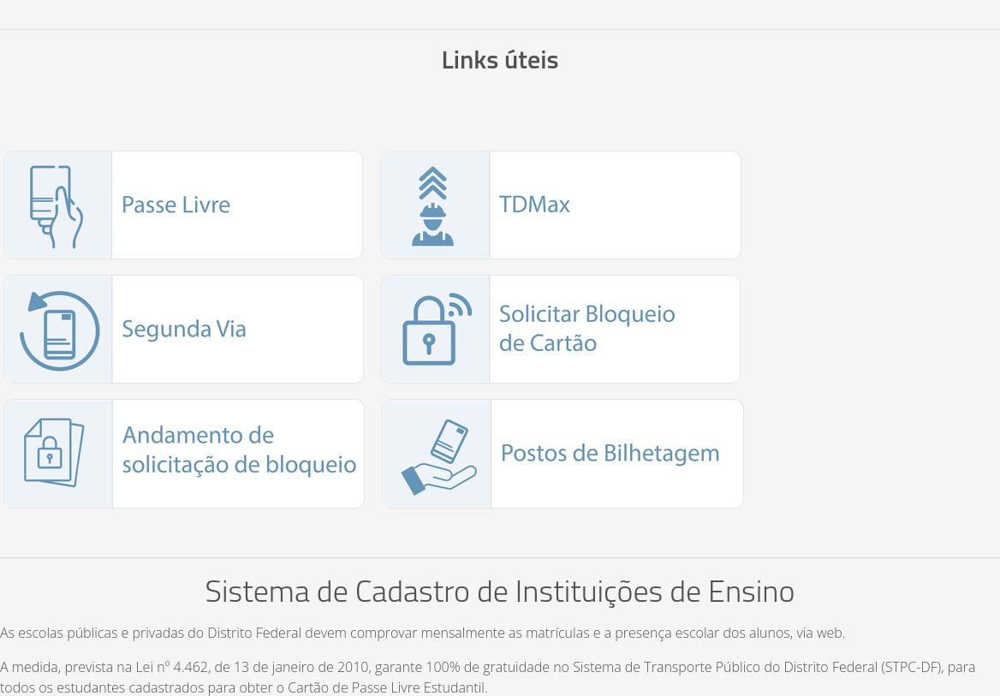
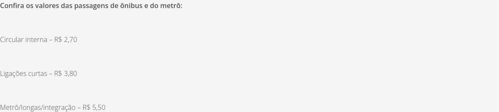
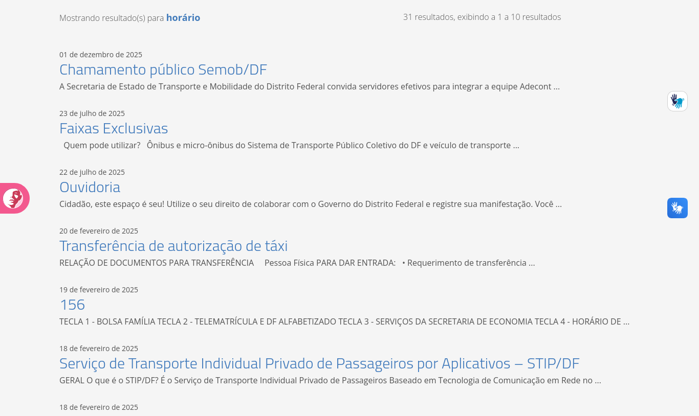
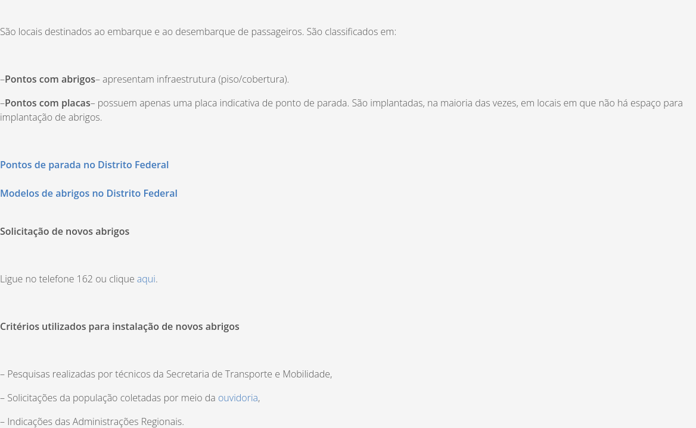

# Antecipação das Necessidades do Usuário no site da SEMOB-DF

## Histórico de Versão e Contribuição

| Data | Versão | Descrição | Autor(es) | Revisor(es) |
| :---: | :---: | :--- | :--- | :--- |
| 06/10/2026 | 1.0 | Criação do documento com a análise do princípio 10.2.6 Antecipação no site da SEMOB-DF. | [Tomás Rocho](https://github.com/TomasRocho) | [Rodrigo Carvalho](https://github.com/RodrigoCBarbosa) |

---

- **Autor:** [Tomás Rocho](https://github.com/TomasRocho)
- **Revisor:** [Rodrigo Carvalho](https://github.com/RodrigoCBarbosa)
- **Site analisado:** <https://www.semob.df.gov.br/> (Secretaria de Estado de Transporte e Mobilidade do Distrito Federal)
- **Princípio:** 10.2.6 Antecipação (tópico 5 dos Princípios Gerais: antecipação das necessidades do usuário)
- **Referência:** Barbosa, S. D. J. et al. (2021). *Interação Humano-Computador e Experiência do Usuário*, Cap. 10: Princípios e Diretrizes para o Design de IHC, pp. 243–244.
- **Data da inspeção:** 06/10/2026, em navegador desktop (Mozilla Firefox, janela de 1366 px de largura)

---

## 1. O princípio segundo o livro

O capítulo 10 apresenta a antecipação a partir de Tognazzini (2014) e Cooper (1999). As ideias usadas como critério nesta análise são:

1. **Prever o que o usuário quer e precisa**, *"em vez de esperar que os usuários busquem ou coletem informações ou invoquem ferramentas"* (Tognazzini).
2. **Fornecer todas as informações e ferramentas necessárias para cada passo do processo** (Tognazzini).
3. **Tomar a iniciativa e oferecer informações adicionais úteis**, em vez de responder só à pergunta feita. O exemplo do livro é o de alguém que pergunta o telefone de um restaurante: o sistema pode informar também os dias e horários de funcionamento (Cooper).
4. **Preparar-se para situações que provavelmente vão acontecer**, para responder mais rápido quando chegar a hora (Cooper).
5. **Ser observador** e antever o próximo passo do usuário a cada momento (Cooper).
6. **Escolher com cuidado os valores padrão** (*defaults*). Eles devem ser fáceis de trocar e neutros, porque *"as pessoas tendem a aceitar os valores defaults"* sem questioná-los (Tognazzini).

---

## 2. Como a inspeção foi feita

- Inspeção da página inicial e das páginas de serviço mais procuradas pelo cidadão: *Preços das Passagens*, *Bilhetagem* (cartões e recarga), *Pontos de Parada* e *Fale com a Secretaria*.
- Para cada página, a pergunta foi: **que dúvida o cidadão provavelmente terá em seguida, e a página já responde?**
- Buscas pelas palavras que um passageiro tende a usar (`horário`, `linha`). Também foi digitado `hora` no campo de busca para verificar se aparecem sugestões.
- Leitura do HTML e do DOM carregado no Firefox (controlado por WebDriver) para verificar conteúdos ocultos e valores padrão.
- Capturas de tela salvas na pasta `imagens/`.

**Limitações:** não foi testado se o site lembra as preferências do usuário entre visitas (por exemplo, o tamanho de fonte), porque o controle "Aa" não abriu no navegador automatizado. Os sites externos (DF no Ponto, BRB Mobilidade, Participa DF) não foram avaliados.

Escala de gravidade usada: **Alta** (impede ou atrapalha muito a tarefa), **Média** (confunde ou atrasa) e **Baixa** (problema cosmético).

---

## 3. Pontos positivos

| # | Observação | Relação com o princípio |
|---|---|---|
| P1 | A página *Bilhetagem* informa o telefone da Central do BRB Mobilidade **junto com o horário de atendimento** ("61 3120-9500, de 2ª a 6ª, das 7 às 19h") e cita o aplicativo para consultar saldo e recarregar. | É exatamente o exemplo de Cooper: além do telefone, o site já informa quando ligar. |
| P2 | Na mesma página, o bloco **"Links úteis"** oferece os próximos passos mais prováveis de quem tem cartão: *Passe Livre*, *Segunda Via*, *Solicitar Bloqueio de Cartão*, *Andamento de solicitação de bloqueio* e *Postos de Bilhetagem* (imagem A3). | Fornece as ferramentas necessárias para cada passo do processo (Tognazzini). |
| P3 | A página *Pontos de Parada* antecipa uma necessidade comum: depois de explicar os tipos de ponto, já mostra **como pedir um novo abrigo** (telefone 162 ou link) e os critérios de instalação (imagem A4). | Antevê o próximo passo do usuário (Cooper). |
| P4 | A página inicial tem um bloco de **Serviços Mais Procurados**, que reúne os assuntos mais buscados pelo cidadão. | A intenção é antecipar as tarefas frequentes, mas 10 dos 12 links estão quebrados (ver E1 no documento de Projeto para Erros). |

*Imagem A3: bloco "Links úteis" da página Bilhetagem, com os próximos passos mais prováveis de quem usa o cartão (ponto positivo P2).*

---

## 4. Problemas encontrados

### Resumo

| # | Problema | Diretriz violada (Cap. 10) | Gravidade |
|---|---|---|---|
| A1 | A página de preços só lista três valores e não responde às dúvidas seguintes | Fornecer informações adicionais úteis (Cooper) | **Alta** |
| A2 | A busca não antecipa a necessidade principal (linhas e horários) | Prever o que o usuário quer (Tognazzini) | **Alta** |
| A3 | Mudanças nas linhas não são anunciadas: a seção "Novidades nas Linhas" está vazia e oculta | Preparar-se para situações prováveis (Cooper) | **Média** |
| A4 | A localização dos pontos de parada é entregue como um arquivo PDF | Fornecer as ferramentas de cada passo (Tognazzini) | **Média** |
| A5 | Informações úteis aparecem numa página e faltam em outra | Fornecer informações adicionais úteis (Cooper) | **Média** |
| A6 | O padrão da busca ordena por data, e não por relevância | Escolher bons valores padrão (Tognazzini) | **Baixa** |

---

### A1. A página de preços só lista três valores (gravidade alta)

*Preços das Passagens* é um dos *Serviços Mais Procurados*. A página inteira se resume a três linhas (imagem A1):

> Circular interna – R$ 2,70
> Ligações curtas – R$ 3,80
> Metrô/longas/integração – R$ 5,50

Quem consulta o preço quase sempre tem a pergunta seguinte, e a página não responde a nenhuma destas:

- **Em qual categoria está a minha linha?** A página não explica o que é "circular interna", "ligação curta" ou "longa".
- **Como funciona a integração?** O termo aparece, mas sem regras: prazo, quantas viagens, entre quais modos.
- **Como pagar ou recarregar?** Não há link para *Bilhetagem* nem para *Postos de Bilhetagem*.
- **Tenho direito a gratuidade?** Não há link para *Passe Livre* nem para *Vai de Graça*.
- **Qual linha pego?** Não há link para *DF no Ponto – Linhas e Horários*.

**Por que é um problema:** o livro diz que o sistema deve *"tomar iniciativa e fornecer informações adicionais úteis, em vez de apenas responder precisamente a pergunta que o usuário tiver feito"*. A página responde só à pergunta literal e obriga o usuário a procurar o resto em outras partes do site. Isso pesa porque essas outras partes têm links quebrados e nomes diferentes (ver os documentos de Consistência e de Projeto para Erros).

**Recomendação:** completar a página com uma explicação curta de cada faixa, com exemplos de linhas, e com as regras de integração. Acrescentar links "Onde recarregar", "Gratuidades e Passe Livre" e "Consultar linhas e horários (DF no Ponto)".

*Imagem A1: conteúdo completo da página Preços das Passagens: três valores, sem explicação nem links para os passos seguintes.*

---

### A2. A busca não antecipa a necessidade principal (gravidade alta)

Consultar **linhas e horários** é a tarefa mais comum de um passageiro. Mesmo assim, a busca do site não leva até ela:

- A busca por **`horário`** retorna 31 resultados. Os primeiros são *Chamamento público Semob/DF*, *Faixas Exclusivas*, *Ouvidoria*, *Transferência de autorização de táxi* e *156* (imagem A2). **Nenhum** dos 10 primeiros leva ao *DF no Ponto – Linhas e Horários*.
- A busca por **`linha`** traz, entre os primeiros resultados, *Gestão Documental*, *Dados STPC/DF (Copiar 1)* e vários resultados que são só **nomes de pessoas**. Nenhum ajuda o passageiro a encontrar sua linha.
- Ao digitar `hora` no campo de busca, **nenhuma sugestão** aparece. Também não há atalho do tipo "Você procura linhas e horários?".

**Por que é um problema:** Tognazzini recomenda que as aplicações *"tentem prever o que o usuário quer e precisa"*. A busca é o momento em que o usuário declara o que quer. Um site de transporte que recebe "horário" ou "linha" pode prever, com segurança, que a pessoa quer consultar uma linha de ônibus. Hoje, a busca responde com conteúdo administrativo.

**Recomendação:** criar **resultados em destaque** (*best bets*) para os termos mais comuns. Por exemplo, "horário", "linha", "ônibus" e "itinerário" mostram primeiro o *DF no Ponto*. "Recarga", "cartão" e "saldo" mostram primeiro a *Bilhetagem*. Também vale ativar sugestões enquanto o usuário digita e retirar das buscas páginas internas sem interesse para o cidadão, como cópias ("Copiar 1") e páginas de servidores.

*Imagem A2: primeiros resultados da busca por "horário". Nenhum leva à consulta de linhas e horários.*

---

### A3. Mudanças nas linhas não são anunciadas (gravidade média)

O HTML da página inicial tem uma seção chamada **"Novidades nas Linhas"**, o lugar certo para avisar o passageiro sobre mudanças de itinerário, novas linhas ou reforços na frota. Na inspeção, essa seção:

- estava **vazia**: o conteúdo é "Ainda não há conteúdos a serem exibidos.";
- estava **oculta** para o usuário: no navegador, a seção tem altura 0 e o título não aparece.

Assim, a página inicial não traz nenhum aviso sobre mudanças nas linhas. As notícias sobre o assunto existem no site (a busca por "tarifa" encontra, por exemplo, "Transporte coletivo terá frota extra dia 7 de setembro"), mas o usuário só as encontra se procurar.

**Por que é um problema:** Cooper recomenda que o software *"antecipe e se prepare para situações que provavelmente acontecerão"*. Mudanças de linha são previsíveis e afetam diretamente a viagem do cidadão. O site já tem a estrutura para avisá-lo, mas não a usa.

**Recomendação:** alimentar a seção "Novidades nas Linhas" com as alterações vigentes e torná-la visível na página inicial. Se não houver novidades, esconder a seção de propósito, sem deixar um bloco vazio no código.

---

### A4. A localização dos pontos de parada é entregue como PDF (gravidade média)

Na página *Pontos de Parada*, a informação que o passageiro mais provavelmente procura, **onde fica o ponto mais próximo**, é oferecida como o link *"Pontos de parada no Distrito Federal"*. O link abre um arquivo PDF (`/documents/d/semob/levantamento-de-abrigos-final-pdf`) em nova aba (imagem A4). Não há mapa, busca por endereço ou filtro por região administrativa.

**Por que é um problema:** o livro pede que o designer forneça *"todas as informações e ferramentas necessárias para cada passo do processo"*. Um levantamento em PDF serve a quem vai planejar abrigos, mas não a quem está na rua e quer saber onde pegar o ônibus. O link também não avisa que se trata de um arquivo, problema já apontado no item V5 do documento de Visibilidade.

**Recomendação:** oferecer a localização dos pontos num mapa interativo ou com busca por endereço e região, ou então levar o usuário ao *DF no Ponto*, que já cumpre essa função. Manter o PDF como material complementar, identificado como "(PDF)".

*Imagem A4: a localização dos pontos é um link para PDF. Logo abaixo, a página antecipa como pedir um novo abrigo (ponto positivo P3).*

---

### A5. Informações úteis aparecem numa página e faltam em outra (gravidade média)

A antecipação que existe no site não é aplicada de forma uniforme:

- A página *Bilhetagem* informa o horário da Central do BRB Mobilidade (P1). Já a página *Fale com a Secretaria*, que o usuário procura justamente para saber com quem falar, lista o **mesmo telefone (61 3120-9500) sem o horário de atendimento**.
- Na mesma página *Fale com a Secretaria*, o menu do telefone 156 indica "TECLA 4 – HORÁRIO DE ÔNIBUS – **DFTRANS**". A própria página *Bilhetagem* informa que o DFTrans foi **extinto**. O cidadão não sabe se essa opção ainda vale para consultar horários.

**Por que é um problema:** a informação adicional útil, como o horário de atendimento, depende da página em que o usuário entra. Quem chega pelo "Fale com a Secretaria" não recebe o que quem chega pela "Bilhetagem" recebe. A referência a um órgão extinto também gera dúvida no momento em que o usuário precisa agir.

**Recomendação:** acompanhar todo telefone ou canal de atendimento do site do seu horário de funcionamento, e revisar as referências ao DFTrans, trocando-as pelo órgão responsável atual.

---

### A6. O padrão da busca ordena por data (gravidade baixa)

Na tela de resultados, o painel "Ordenar por" oferece **uma única opção**: *Criado*. Na busca por `horário`, os resultados aparecem do mais recente para o mais antigo (01/12/2025, 23/07/2025, 22/07/2025, 20/02/2025…), e não pelo quanto respondem à pergunta. O usuário não tem como trocar para "Relevância".

**Por que é um problema:** Tognazzini destaca a importância de *"definir cuidadosamente os valores e a configuração padrão"*, que devem ser fáceis de substituir. Ordenar por data favorece a página publicada por último, como um chamamento interno, em vez da mais útil. Como só há uma opção, o padrão não pode ser trocado.

**Recomendação:** usar **relevância** como ordem padrão da busca e manter "data" como alternativa.

---

## 5. Síntese das recomendações

1. **Completar as páginas de serviço com os próximos passos do usuário.** Preços com faixas, integração, recarga, gratuidades e linhas (resolve A1). O padrão de "Links úteis" da página *Bilhetagem* pode ser repetido nas outras páginas.
2. **Fazer a busca prever as intenções mais comuns**, com resultados em destaque, sugestões ao digitar e ordenação por relevância (resolve A2 e A6).
3. **Usar a seção "Novidades nas Linhas"** para avisar o passageiro sobre mudanças antes que ele precise procurar (resolve A3).
4. **Oferecer a localização dos pontos por mapa ou busca**, e não só em PDF (resolve A4).
5. **Padronizar as informações de atendimento** (telefone com horário) e atualizar as referências a órgãos extintos (resolve A5).

## 6. Conclusão

O site da SEMOB mostra que sabe antecipar necessidades. A página *Bilhetagem* é um bom exemplo: dá o telefone com o horário de atendimento e oferece, logo em seguida, os serviços que o usuário provavelmente vai querer, como segunda via, bloqueio e postos de recarga. A página *Pontos de Parada* também já mostra como pedir um novo abrigo. Mas essa postura não se repete no restante do site. A página de preços responde só à pergunta literal. A busca não reconhece a intenção mais óbvia de um passageiro, que é consultar linhas e horários, e ordena os resultados por data. O espaço criado para avisar sobre mudanças nas linhas está vazio e oculto. Aplicar em todo o site o que já é feito na página *Bilhetagem* (responder à pergunta e oferecer os próximos passos) colocaria o site de acordo com o que Tognazzini e Cooper recomendam.

---

### Referências

- BARBOSA, S. D. J.; SILVA, B. S. da; SILVEIRA, M. S.; GASPARINI, I.; DARIN, T.; BARBOSA, G. D. J. *Interação Humano-Computador e Experiência do Usuário*. Autopublicação, 2021. Cap. 10, Seção 10.2.6.
- COOPER, A. *The Inmates Are Running the Asylum*. Sams, 1999.
- TOGNAZZINI, B. *First Principles of Interaction Design (Revised & Expanded)*. AskTog, 2014.
