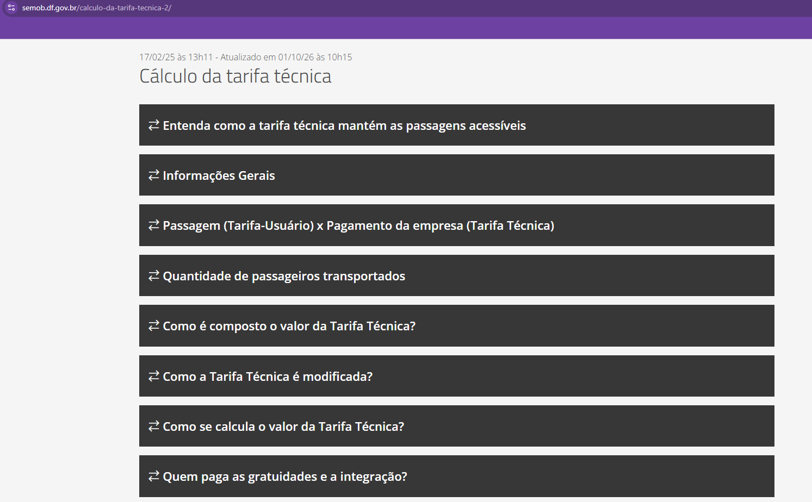
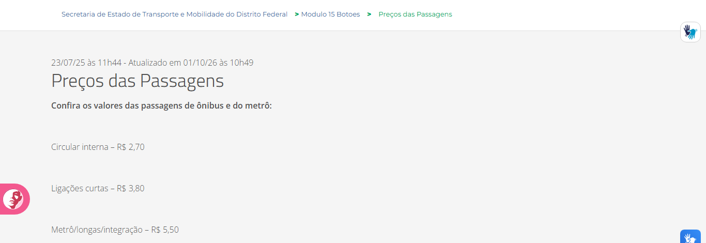
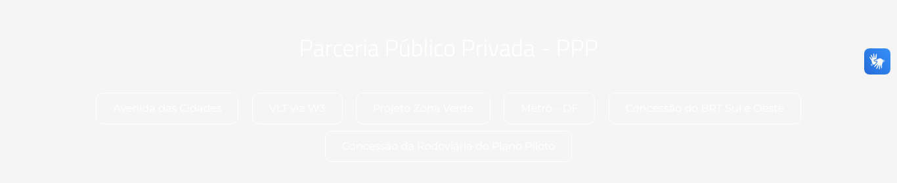
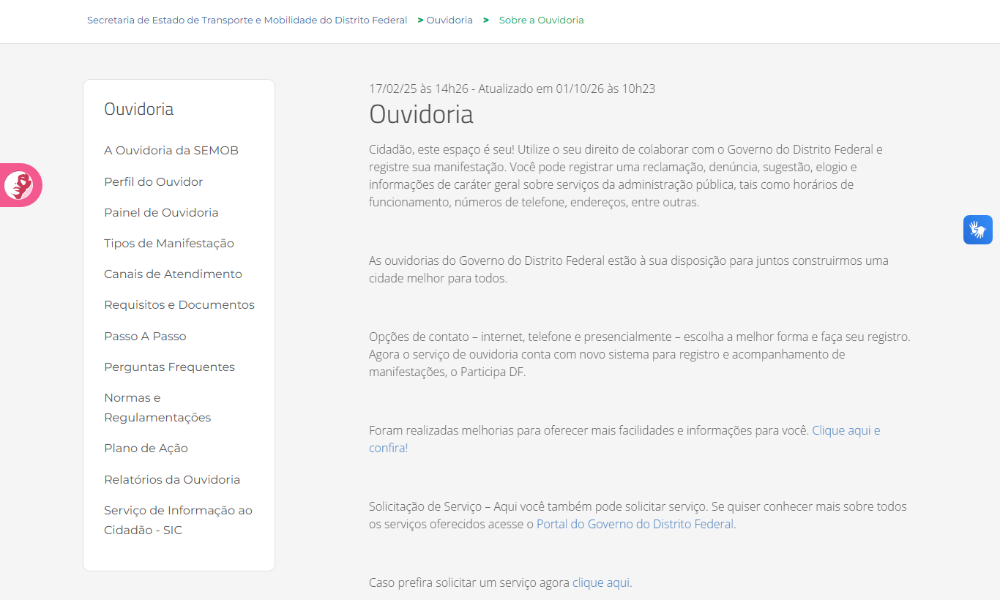
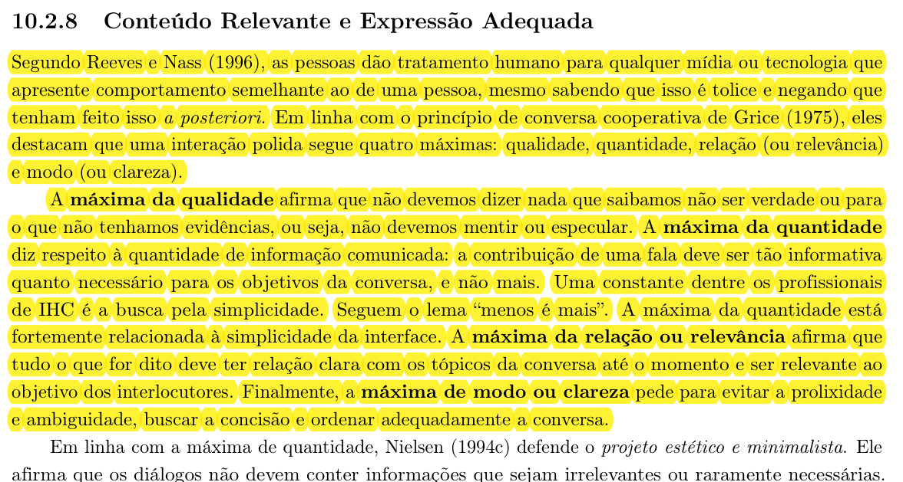
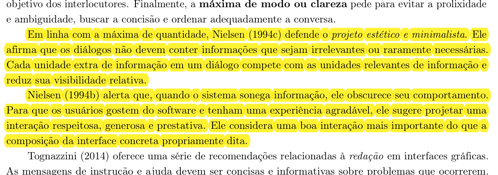
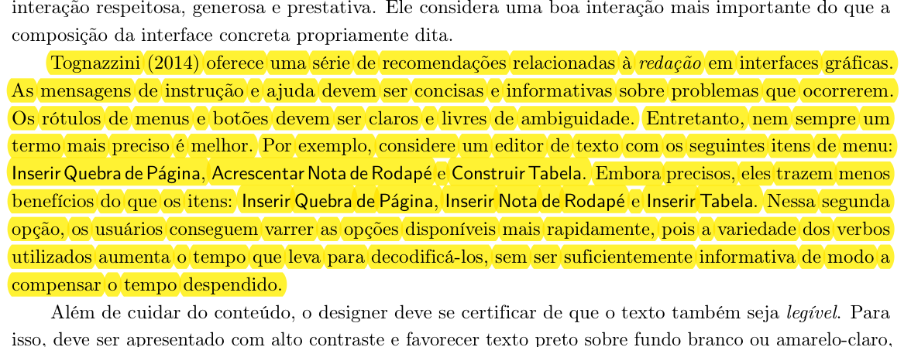
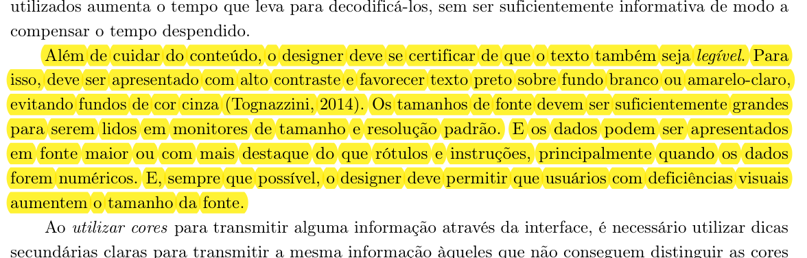
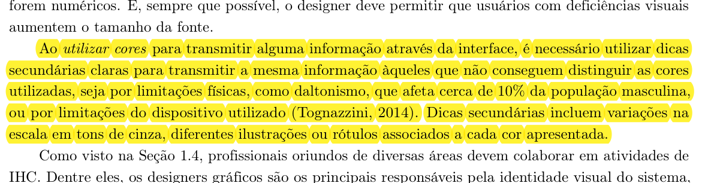
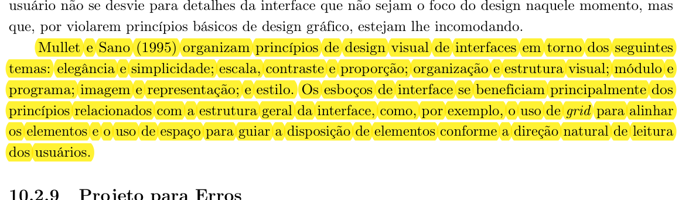

# Conteúdo Relevante e Expressão Adequada no site da SEMOB-DF

## Histórico de Versão e Contribuição

| Data | Versão | Descrição | Autor(es) | Revisor(es) |
| :---: | :---: | :--- | :--- | :--- |
| 05/10/2026 | 1.0 | Criação da análise de conteúdo relevante e expressão adequada do portal **SEMOB-DF** para a Entrega 3. | [Lucas Araújo](https://github.com/Lucasaraujoszz) | [Rodrigo Barbosa](https://github.com/RodrigoCBarbosa) |
| 05/10/2026 | 1.1 | Inclusão de imagens dos trechos de referência das páginas 246–247 do livro-texto e atualização da numeração das imagens. | [Lucas Araújo](https://github.com/Lucasaraujoszz) | [Rodrigo Barbosa](https://github.com/RodrigoCBarbosa) |

---

**Site analisado:** <https://www.semob.df.gov.br/> (Secretaria de Estado de Transporte e Mobilidade do Distrito Federal)

**Princípio:** 10.2.8 Conteúdo Relevante e Expressão Adequada

**Referência teórica:** Barbosa, S. D. J. et al. (2021). *Interação Humano-Computador e Experiência do Usuário*, Cap. 10: Princípios e Diretrizes para o Design de IHC, pp. 246–247.

**Contexto:** Grupo 05, Interação Humano-Computador, UnB/FCTE, Professor André Barros de Sales, Semestre 2026.2. Artefato correspondente ao tópico 7 do item 12 do checklist da Entrega 3.

**Data da inspeção:** 05/10/2026, em navegador desktop (Google Chrome)

**Autor do artefato:** [Lucas Araújo](https://github.com/Lucasaraujoszz)

---

## 1. O princípio segundo o livro

O princípio de **Conteúdo Relevante e Expressão Adequada** orienta o sistema a oferecer as informações necessárias à tarefa e apresentá-las de forma clara e respeitosa (Barbosa et al., 2021, Seção 10.2.8). Além de encontrar uma informação correta, o usuário precisa entender o que ela significa e como pode ajudá-lo. Textos difíceis, siglas sem explicação e elementos pouco legíveis podem atrapalhar esse processo.

No portal da SEMOB-DF, esse princípio se aplica à redação sobre serviços e normas e à apresentação de tarifas, itinerários, horários e canais de atendimento.

A análise se apoia nas recomendações apresentadas por Barbosa et al. (2021, pp. 246–247). As imagens 01 a 06 mostram os trechos do livro que fundamentam os quatro tópicos a seguir:

### 1.1. A interação como conversa cooperativa (Máximas de Grice)

Segundo Reeves e Nass (1996 apud Barbosa et al., 2021), as pessoas atribuem comportamentos e expectativas sociais humanas à sua interação com mídias e computadores. A comunicação da interface deve, por isso, ajudar o usuário e respeitar sua atenção. Barbosa et al. (2021) relacionam essa ideia às quatro máximas conversacionais de Grice (1975):

1. **Máxima da Qualidade:** não dizer nada que se saiba não ser verdadeiro ou para o qual não haja evidências que sustentem a informação (não mentir ou especular). No portal da SEMOB-DF, valores tarifários, regras de integração e tabelas de horários devem estar de acordo com as informações oficiais, com indicação da data de atualização.
2. **Máxima da Quantidade:** a contribuição de uma fala ou diálogo deve ser tão informativa quanto o necessário para os objetivos da tarefa corrente, e não mais do que isso. Os autores de IHC resumem esse princípio no lema *"menos é mais"*, voltado à simplicidade da interface.
3. **Máxima da Relação (ou Relevância):** tudo o que for exibido ou solicitado deve manter estreita relação com os tópicos da conversa e com o objetivo central do usuário. Por exemplo, quem busca saber o preço de uma passagem precisa ver o valor aplicável ao seu itinerário de imediato, em vez de ser obrigado a ler contratos de concessão ou fórmulas de reajuste técnico.
4. **Máxima de Modo (ou Clareza):** evitar textos longos sem necessidade e expressões ambíguas. As informações devem seguir uma ordem lógica, com termos conhecidos pelo público e explicações para siglas ou palavras técnicas.

A imagem 01, reunida na seção de Fotos de Referência, apresenta as máximas de Grice e sua relação com a interação entre pessoas e computadores.

### 1.2. Projeto estético e minimalista

Relacionado à máxima da quantidade, o **projeto estético e minimalista** de Nielsen (1994c apud Barbosa et al., 2021) recomenda evitar informações irrelevantes ou raramente necessárias nos diálogos da interface. O livro explica essa recomendação da seguinte forma:

> *"Cada unidade extra de informação em um diálogo compete com as unidades relevantes de informação e reduz sua visibilidade relativa."* (Nielsen, 1994c apud Barbosa et al., 2021, p. 246)

Contudo, Nielsen (1994b apud Barbosa et al., 2021) adverte que o minimalismo não deve significar sonegação de informação: quando o sistema esconde detalhes essenciais, ele obscurece seu próprio comportamento e prejudica a confiança do cidadão. Uma boa interface deve proporcionar uma interação respeitosa, generosa e prestativa, organizando a informação em camadas progressivas.

Na imagem 02, reunida na seção de Fotos de Referência, o livro relaciona o minimalismo à necessidade de manter as informações essenciais disponíveis.

### 1.3. Redação em interfaces gráficas, economia cognitiva e legibilidade

Tognazzini (2014 apud Barbosa et al., 2021) enfatiza o cuidado com a redação em interfaces:

- **Instruções e mensagens de ajuda:** Devem ser concisas, informativas e focadas na resolução de problemas concretos.
- **Rótulos de menus e botões:** Devem ser unívocos, descritivos e livres de ambiguidade.
- **Economia cognitiva:** Usar palavras diferentes para a mesma ação pode dificultar a leitura. Manter verbos familiares, como em "Consultar linhas", "Consultar horários" e "Consultar tarifas", ajuda o usuário a reconhecer as opções mais rapidamente.
- **Legibilidade e Contraste:** Textos devem oferecer alto contraste perceptivo, favorecendo caracteres escuros sobre fundos brancos ou claros e **evitando fundos cinza** (Tognazzini, 2014). Os tamanhos de fonte devem ser confortáveis para telas de desktop e mobile, permitindo ampliação por tecnologia assistiva.
- **Destaque a dados reais:** Informações concretas e dados numéricos (como preços de passagens e números de linhas) devem receber destaque visual e tipográfico maior do que rótulos e instruções contextuais.
- **Uso não exclusivo da cor:** Tognazzini (2014 apud Barbosa et al., 2021) recomenda que a cor seja acompanhada de outras pistas, como ícones, textos ou diferenças em tons de cinza. O livro menciona que o daltonismo afeta cerca de 10% da população masculina, o que reforça a necessidade de apresentar a informação de mais de uma forma.

A imagem 03, reunida na seção de Fotos de Referência, apresenta as orientações sobre redação e escolha de palavras nos menus.

As recomendações sobre contraste, tamanho de fonte e destaque dos dados aparecem na imagem 04, reunida na seção de Fotos de Referência.

A imagem 05, reunida na seção de Fotos de Referência, mostra a importância de acompanhar as cores com outras pistas de informação.

### 1.4. Princípios de design visual e organização espacial

Mullet e Sano (1995 apud Barbosa et al., 2021) organizam os princípios do design visual em seis dimensões interligadas:

1. *Elegância e simplicidade;*
2. *Escala, contraste e proporção;*
3. *Organização e estrutura visual;*
4. *Módulo e programa;*
5. *Imagem e representação;*
6. *Estilo.*

O respeito a esses princípios evita que a atenção do usuário seja dispersa por ruídos gráficos. O uso criterioso de **grids de alinhamento** e do **espaço em branco** organiza os blocos visuais e conduz os olhos do usuário de acordo com o fluxo natural de leitura.

A imagem 06, reunida na seção de Fotos de Referência, apresenta os princípios de design visual e as orientações sobre alinhamento e espaço.

---

## 2. Como a inspeção foi realizada

A avaliação foi conduzida por meio de **inspeção semiótica e documental** nas seções do portal da SEMOB-DF mais frequentadas por passageiros e cidadãos, cruzando os elementos da interface com os critérios de Barbosa et al. (2021, Seção 10.2.8).

**Tabela 1** — Escopo e áreas inspecionadas no portal

| Área analisada | Endereço / Referência | Foco da inspeção sob o Princípio 7 |
|---|---|---|
| **Página inicial** | <https://www.semob.df.gov.br/> | Cabeçalho, clareza dos menus, contraste de seções (banner e PPP) e links de acesso rápido. |
| **Tarifas e Preços** | [/precos-das-passagens](https://www.semob.df.gov.br/precos-das-passagens) e [/calculo-da-tarifa-tecnica-2](https://www.semob.df.gov.br/calculo-da-tarifa-tecnica-2) | Destaque tipográfico dos valores reais, clareza das categorias e densidade do texto explicativo. |
| **Canais de atendimento** | [/ouvidoria](https://www.semob.df.gov.br/ouvidoria) | Objetividade das instruções, textos de links e botões de ação do cidadão. |
| **DF no Ponto** | <https://dfnoponto.com.br/> | Clareza na descrição das ferramentas e alinhamento do vocabulário à rotina do passageiro. |

**Escala de gravidade adotada:**
- **Alta:** O problema de expressão ou conteúdo compromete criticamente a legibilidade ou impede o usuário de completar sua tarefa com autonomia;
- **Média:** O problema confunde o usuário, impõe sobrecarga cognitiva, exige decifração de jargão ou atrasa a navegação;
- **Baixa:** Problema cosmético ou secundário de apresentação que não chega a comprometer a conclusão da tarefa.

---

## 3. Pontos positivos observados

A inspeção identificou pontos positivos no portal que dialogam diretamente com as recomendações de Conteúdo Relevante e Expressão Adequada, sintetizados na Tabela 2.

**Tabela 2** — Pontos positivos encontrados no portal da SEMOB-DF

| ID | Observação no Portal | Relação com o princípio (Barbosa et al., 2021) |
|:---:|---|---|
| **P1** | Presença do controle de acessibilidade **Aa** no cabeçalho fixo. | Contribui para a flexibilidade tipográfica e legibilidade recomendada por Tognazzini, permitindo que usuários com baixa visão ajustem a escala de leitura. |
| **P2** | Campo de busca principal com texto de instrução explícito: *"Digite aqui o que você procura"*. | Atende à Máxima de Modo (Grice) e à recomendação de Tognazzini de instruir o usuário de forma concisa sobre como agir. |
| **P3** | Página de preços das passagens estruturada por categorias de deslocamento (Circular interna, Alimentadora e Troncal). | Conteúdo enxuto e relevante para o passageiro leigo, respeitando as Máximas da Quantidade e Relevância ao separar os tipos de viagem. |
| **P4** | Ouvidoria explicita os tipos de manifestação (Reclamação, Sugestão, Elogio, Denúncia e Informação). | Linguagem cidadã orientada à intenção do usuário, tornando clara a finalidade de cada canal de atendimento. |
| **P5** | Seção de Tarifa Técnica estruturada em formato de perguntas e respostas frequentes. | Organização lógica do conteúdo complexo em blocos temáticos, auxiliando a escaneabilidade do texto. |
| **P6** | Apresentação do serviço DF no Ponto correlacionando ferramentas às necessidades de mobilidade (busca por linha, horário e parada). | Vocabulário orientado à ação prática do usuário, alinhando a descrição ao objetivo de mobilidade do cidadão. |

---

## 4. Problemas encontrados

### Resumo das violações

A Tabela 3 consolida as falhas de conteúdo e expressão identificadas durante a inspeção do portal.

**Tabela 3** — Síntese dos problemas encontrados

| ID | Problema Identificado | Diretriz Violada (Barbosa et al., 2021) | Gravidade |
|:---:|---|---|:---:|
| **CR1** | Redação administrativa excessivamente densa e prolixa na explicação de tarifas técnicas. | Máxima de Modo e Quantidade (Grice); Minimalismo Estético (Nielsen). | **Média** |
| **CR2** | Siglas governamentais e marcas de sistemas utilizadas sem contexto ou expansão. | Máxima de Modo (Grice); Clareza de Rótulos e Economia Cognitiva (Tognazzini). | **Média** |
| **CR3** | Ausência de destaque tipográfico hierárquico nos valores das tarifas de passagens. | Destaque de Dados Reais (Tognazzini); Escala e Contraste (Mullet e Sano). | **Média** |
| **CR4** | Baixo contraste crítico e legibilidade prejudicada no bloco de Parcerias Público-Privadas (PPP). | Contraste e Legibilidade (Tognazzini); Contraste e Proporção (Mullet e Sano). | **Alta** |
| **CR5** | Links e botões com rótulos genéricos dependentes do texto ao redor (*"clique aqui"*, *"Consultar"*). | Máxima de Modo (Grice); Rótulos Unívocos e Informativos (Tognazzini). | **Média** |

---

### CR1. Redação administrativa densa e jurídica (Gravidade Média)

**Descrição:** Na página de [Cálculo da Tarifa Técnica](https://www.semob.df.gov.br/calculo-da-tarifa-tecnica-2), a explicação dos custos operacionais do transporte é apresentada em parágrafos longos repletos de vocabulário contratual especializado (*"equilíbrio econômico-financeiro"*, *"metodologia paramétrica de remuneração"*, *"revisão ordinária e extraordinária"*). Embora a explicação detalhada seja fundamental para a transparência pública, ela é exposta em bloco único sem um sumário em linguagem simples para o passageiro comum.

**Por que é um problema:** Viola a **Máxima de Modo** (clareza e concisão) e a **Máxima da Quantidade** (Grice). O excesso de jargões técnicos afasta o usuário primário (o passageiro), que apenas deseja compreender a diferença entre a tarifa pública paga na catraca e o custo técnico remunerado às empresas de ônibus. Conforme Nielsen (1994c), o excesso de informação compete diretamente com a atenção dispensada aos dados fundamentais.

**Recomendação:** Implementar uma abordagem em camadas: introduzir o tópico com um infográfico ou resumo em linguagem cidadã direta (*"Como o valor da sua passagem é calculado"*), reservando os detalhamentos matemáticos e os anexos dos editais para seções expansíveis ou abas secundárias destinadas a pesquisadores e órgãos de controle.

*Imagem 07 — Estrutura de tópicos da Tarifa Técnica com seções extensas e termos técnicos.*

---

### CR2. Siglas herméticas e nomes de sistemas sem significado imediato (Gravidade Média)

**Descrição:** O menu principal e os blocos de navegação da página inicial apresentam siglas governamentais sem nenhuma indicação do que significam ou de qual tarefa o usuário pode realizar. Exemplos identificados:
- *"Dados STPC"* e *"PDTU"* no menu superior;
- *"Resoluções – CTPC"* e *"Atas – CTPC"*;
- Botões e logotipos identificados apenas como *"DFLEGIS"*, *"SICOPWEB"* e *"SINJ-DF"*.

**Tabela 4** — Tratamento recomendado para siglas e jargões institucionais

| Sigla / Rótulo Atual | Significado Técnico | Expressão Recomendada no Redesign (Linguagem Cidadã) |
|---|---|---|
| **STPC** | Sistema de Transporte Público Coletivo | **Dados do Transporte Coletivo (STPC)** |
| **CTPC** | Conselho de Transporte Público Coletivo | **Conselho de Transporte (CTPC): Atas e Resoluções** |
| **PDTU** | Plano Diretor de Transporte Urbano | **Plano Diretor de Mobilidade (PDTU)** |
| **DFLEGIS** | Base de Legislação do Distrito Federal | **Consultar Legislação do DF (DFLEGIS)** |
| **SINJ-DF** | Sistema Integrado de Normas Jurídicas do DF | **Normas Jurídicas do DF (SINJ-DF)** |
| **SICOPWEB** | Sistema de Controle de Processos | **Acompanhar Processos (SICOPWEB)** |

**Por que é um problema:** Contraria frontalmente a **Máxima de Modo** (Grice) e a diretriz de **rótulos unívocos e economia cognitiva** de Tognazzini (2014). O cidadão é obrigado a adivinhar a estrutura burocrática do Estado para saber onde clicar. A ausência de contexto textual claro obriga o usuário a despender esforço cognitivo em tentativas e erros.

**Recomendação:** Adotar como padrão de microcopy a fórmula: **[Ação em Linguagem Cidadã] + (Sigla Oficial)**. Menus e botões devem explicitar a finalidade da ferramenta antes da sigla institucional.

*Imagem 08 — Cabeçalho e menu da SEMOB-DF com siglas (Dados STPC, PDTU) sem explicação para o usuário.*

---

### CR3. Ausência de destaque tipográfico nos valores das passagens (Gravidade Média)

**Descrição:** Na página [Preços das Passagens](https://www.semob.df.gov.br/precos-das-passagens), cada categoria de itinerário e o seu respectivo preço monetário (ex.: *"Circular interna – R$ 2,70"*, *"Linhas de ligação – R$ 3,80"*, *"Linhas troncais e metrô – R$ 5,50"*) são exibidos em linhas de texto corrido simples, com o mesmo peso tipográfico e mesma cor de fonte dos rótulos descritivos.

**Por que é um problema:** Tognazzini (2014) afirma enfaticamente que dados reais e numéricos essenciais para a tomada de decisão do usuário devem receber **destaque tipográfico superior** aos rótulos e instruções contextuais. Além disso, segundo Mullet e Sano (1995), a ausência de contraste de escala e proporção retarda o escaneamento visual da página: quem está na parada de ônibus precisa identificar o valor monetário instantaneamente, sem ler cada frase na íntegra.

**Recomendação:** Reorganizar a apresentação das tarifas em cartões (*cards*) destacados ou tabela limpa, aplicando tipografia robusta (tamanho maior e peso *bold*) sobre os valores monetários (`R$ 2,70`, `R$ 5,50`), acompanhados de ícones visuais representativos de cada modalidade de linha.

*Imagem 09 — Valores monetários das tarifas sem diferenciação de peso ou destaque visual em relação aos nomes das linhas.*

---

### CR4. Baixo contraste e legibilidade comprometida na seção PPP (Gravidade Alta)

**Descrição:** No bloco dedicado a *Parcerias Público Privadas – PPP* na página inicial, os textos explicativos e os botões com borda fina encontram-se em branco aplicados sobre um plano de fundo excessivamente claro. Em condições reais de luminosidade ou caso a imagem de fundo falhe em carregar, o conteúdo torna-se praticamente ilegível.

**Por que é um problema:** Viola a diretriz de **contraste visual e legibilidade** de Tognazzini (2014) e os princípios de contraste e visibilidade de Mullet e Sano (1995). Uma mensagem perde completamente a relevância se sua expressão material não puder ser decodificada pelo olho humano. Usuários em trânsito, expostos à luz solar direta sobre telas de smartphones, não conseguem ler as opções desse bloco.

**Recomendação:** Garantir conformidade com as diretrizes WCAG 2.1 nível AA (taxa de contraste mínima de 4.5:1 para texto normal e 3:1 para textos grandes e componentes de interface). Estabelecer uma camada de fundo sólida de reserva (*fallback*) em tom escuro para assegurar a legibilidade mesmo na eventual falha de carregamento de imagens.

*Imagem 10 — Texto e elementos de contorno brancos sobre fundo claro na seção PPP, inviabilizando a leitura confortável.*

---

### CR5. Rótulos genéricos em links e chamadas para ação (Gravidade Média)

**Descrição:** Na página de [Ouvidoria](https://www.semob.df.gov.br/ouvidoria), encontram-se hiperlinks com rótulos vagos e descontextualizados, tais como *"Clique aqui e confira!"* e *"clique aqui"*. Da mesma forma, nos cartões de serviços da Home, botões apresentam apenas a palavra genérica *"Consultar"*.

**Tabela 5** — Propostas de reescrita para rótulos genéricos

| Rótulo Atual | Contexto da Página | Redação Recomendada no Redesign |
|---|---|---|
| *"Clique aqui e confira!"* | Ouvidoria / Sistema Participa DF | **Acessar o portal Participa DF** |
| *"clique aqui"* | Registro de Manifestação | **Registrar solicitação na Ouvidoria** |
| *"Consultar"* | Bloco SICOPWEB | **Consultar andamento de processo** |
| *"Clique aqui"* | Legislação e Portarias | **Visualizar portarias do transporte** |

**Por que é um problema:** Rótulos como *"clique aqui"* violam a **Máxima de Modo** (clareza) e as diretrizes de redação de Tognazzini (2014), que determinam que os rótulos de botões e links devem ser compreensíveis por si mesmos e informar exatamente o destino ou a consequência da ação. Além disso, tecnologias assistivas (leitores de tela para pessoas com deficiência visual) que listam apenas os links da página deixam o usuário desorientado diante de uma sequência de links indistintos rotulados como "clique aqui".

**Recomendação:** Redigir links com verbo de ação associado ao objeto específico (*"Ver tarifas"*, *"Registrar reclamação"*, *"Acessar o Participa DF"*), abolindo instruções mecânicas sobre o dispositivo de entrada (como "clique" ou "toque").

*Imagem 11 — Links de texto "Clique aqui e confira!" na Ouvidoria, desprovidos de significado autônomo.*

---

## 5. Síntese das recomendações para o projeto do Grupo 05

A partir dos pontos positivos e das violações identificadas no portal da SEMOB-DF, a Tabela 6 estabelece as diretrizes que a equipe do Grupo 05 deve incorporar obrigatoriamente no [Guia de Estilo](../guia-de-estilo/introducao.md) e na futura prototipação do sistema.

**Tabela 6** — Diretrizes de Conteúdo Relevante e Expressão Adequada para o redesign

| Dimensão de IHC | Diretriz para o Projeto do Grupo 05 | Aplicação Concreta no Redesign |
|---|---|---|
| **Linguagem Cidadã (*Plain Language*)** | Substituir o jargão burocrático e jurídico por linguagem orientada aos objetivos do usuário comum (CR1). | Resumos objetivos no topo de páginas de normas e serviços; termos em linguagem simples com detalhamentos secundários opcionais. |
| **Vocabulário e Siglas** | Não utilizar siglas isoladas em menus e botões sem explicar seu significado (CR2). | Padrão unificado: nome do serviço por extenso acompanhado da sigla entre parênteses em menus e títulos. |
| **Hierarquia Tipográfica** | Conceder destaque visual evidente para dados numéricos importantes (CR3). | Valores de passagens (`R$ 5,50`), tempos de espera e números de linhas formatados com maior escala de fonte e peso tipográfico. |
| **Contraste e Legibilidade** | Garantir contraste seguro (mínimo de 4.5:1) em qualquer cenário de iluminação (CR4). | Textos escuros sobre fundos neutros claros; proibição de fundos cinza degradantes e uso de cor de reserva sólida sob imagens. |
| **Microcopy de Ações** | Utilizar rótulos informativos que contenham verbo e objeto da ação (CR5). | Substituição de rótulos genéricos como "Clique aqui"; botões descritivos como *"Consultar horários"*, *"Recarregar cartão"*. |
| **Acessibilidade Cromática** | Jamais transmitir estados ou alertas apenas por meio de cores. | Indicadores de status de ônibus (ex.: adiantado/atrasado) devem combinar cores com ícones claros e rótulos em texto. |
| **Escaneabilidade e Grids** | Estruturar telas com alinhamento em grid e áreas de respiro visual. | Organização de horários e itinerários em blocos limpos, facilitando a leitura rápida em telas de celulares na rua. |

---

## 6. Conclusão

O portal da SEMOB-DF reúne informações importantes para a população e oferece recursos de busca e acessibilidade. Nas páginas analisadas, porém, a forma de apresentar o conteúdo pode dificultar a consulta: há textos administrativos extensos, siglas pouco explicadas, valores de tarifas sem destaque e links com rótulos genéricos. O contraste da seção PPP também prejudica a leitura no registro apresentado.

As recomendações de Barbosa et al. (2021) ajudam a orientar essas melhorias: selecionar o conteúdo de acordo com a tarefa, escrever com clareza, destacar os dados importantes e cuidar da legibilidade. O Grupo 05 pode incorporar essas orientações ao Guia de Estilo e ao protótipo de redesign, buscando facilitar tarefas como consultar uma tarifa, encontrar uma linha e acessar um canal de atendimento.

---

## 7. Declaração sobre o Uso de IA Generativa

Em cumprimento às normas de conduta acadêmica da SBC e ao Plano de Ensino da disciplina, declara-se que o Gemini, uma ferramenta de Inteligência Artificial Generativa, foi empregado para auxílio na estruturação textual, refinamento de clareza formal e formatação Markdown do presente documento. Toda a fundamentação teórica, o levantamento empírico de dados, as tomadas de decisão e as análises críticas permaneceram sob responsabilidade exclusiva dos integrantes da equipe.

---

## 8. Fotos de Referência

*Imagem 01 — Reeves e Nass e as quatro máximas conversacionais de Grice. Fonte: Barbosa et al. (2021, p. 246, subseção 10.2.8).*

*Imagem 02 — Projeto estético e minimalista e interação respeitosa, generosa e prestativa. Fonte: Barbosa et al. (2021, p. 246, subseção 10.2.8).*

*Imagem 03 — Redação de instruções, rótulos e economia cognitiva. Fonte: Barbosa et al. (2021, p. 246, subseção 10.2.8).*

*Imagem 04 — Contraste, tamanho de fonte e destaque dos dados numéricos. Fonte: Barbosa et al. (2021, p. 246, subseção 10.2.8).*

*Imagem 05 — Uso de cores com dicas secundárias de informação. Fonte: Barbosa et al. (2021, p. 246, subseção 10.2.8).*

*Imagem 06 — Princípios de design visual, grids e espaço para orientar a leitura. Fonte: Barbosa et al. (2021, p. 247, subseção 10.2.8).*

## 9. Referências Bibliográficas

- BARBOSA, Simone Diniz Junqueira; SILVA, Bruno Santana da; SILVEIRA, Milene Selbach; GASPARINI, Isabela; DARIN, Ticianne; BARBOSA, Gabriel Diniz Junqueira. **Interação Humano-Computador e Experiência do Usuário**. Rio de Janeiro: Autopublicação, 2021. Capítulo 10: Princípios e Diretrizes para o Design de IHC, Subseção 10.2.8: Conteúdo Relevante e Expressão Adequada, pp. 246–247.
- DISTRITO FEDERAL. Secretaria de Estado de Transporte e Mobilidade. **Portal da SEMOB-DF**. Brasília, DF: SEMOB-DF, 2026. Disponível em: <https://www.semob.df.gov.br/>. Acesso em: 05 out. 2026.
- DISTRITO FEDERAL. Secretaria de Estado de Transporte e Mobilidade. **Preços das Passagens**. Brasília, DF: SEMOB-DF, 2026. Disponível em: <https://www.semob.df.gov.br/precos-das-passagens>. Acesso em: 05 out. 2026.
- DISTRITO FEDERAL. Secretaria de Estado de Transporte e Mobilidade. **Cálculo da Tarifa Técnica**. Brasília, DF: SEMOB-DF, 2026. Disponível em: <https://www.semob.df.gov.br/calculo-da-tarifa-tecnica-2>. Acesso em: 05 out. 2026.
- DISTRITO FEDERAL. Secretaria de Estado de Transporte e Mobilidade. **Ouvidoria da SEMOB-DF**. Brasília, DF: SEMOB-DF, 2026. Disponível em: <https://www.semob.df.gov.br/ouvidoria>. Acesso em: 05 out. 2026.
- GRICE, H. Paul. **Logic and Conversation**. In: Syntax and Semantics, volume 3: Speech Acts, pp. 41–58. Academic Press, 1975.
- MULLET, Kevin; SANO, Darrell. **Designing Visual Interfaces: Communication Oriented Techniques**. Englewood Cliffs: Prentice-Hall, 1995.
- NIELSEN, Jakob. **Usability Engineering**. San Francisco: Morgan Kaufmann Publishers, 1994c.
- REEVES, Byron; NASS, Clifford. **The Media Equation: How People Treat Computers, Television, and New Media Like Real People and Places**. Stanford: Cambridge University Press, 1996.
- TOGNAZZINI, Bruce. **First Principles of Interaction Design (Revised & Expanded)**. AskTog, 2014. Disponível em: <https://asktog.com/atc/principles-of-interaction-design/>. Acesso em: 05 out. 2026.
