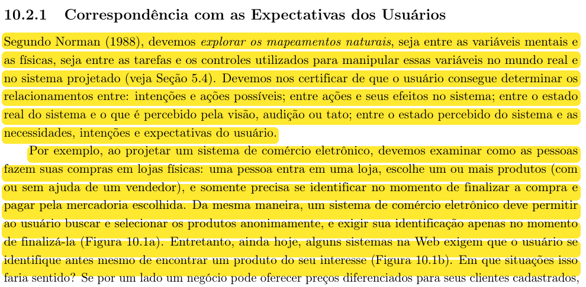
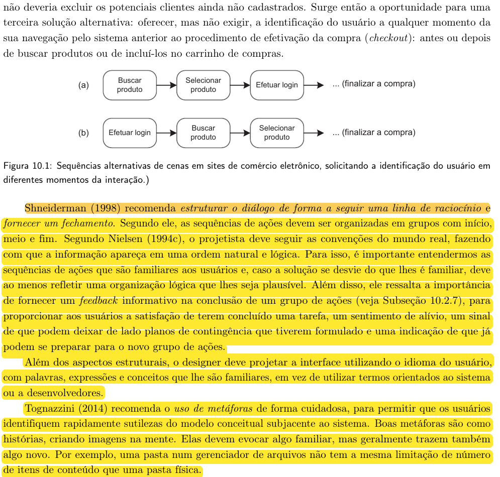
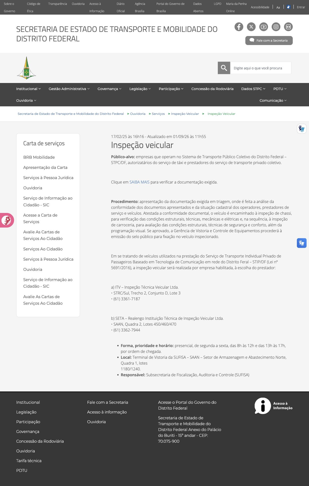
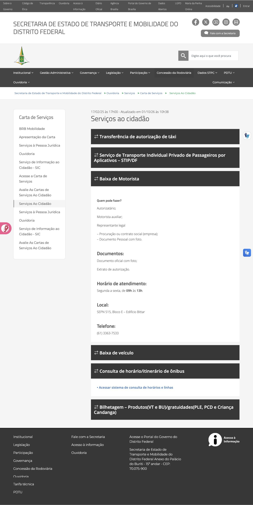
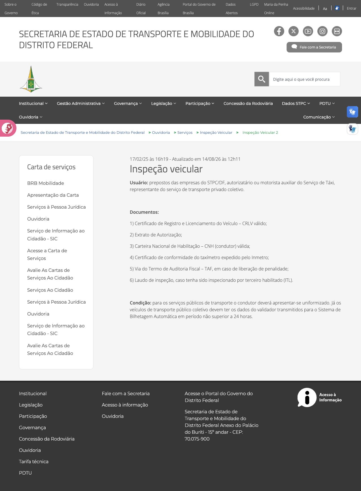
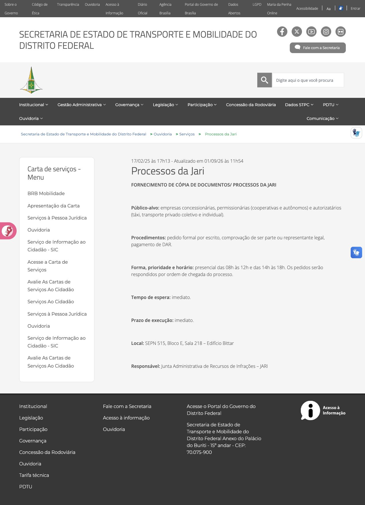
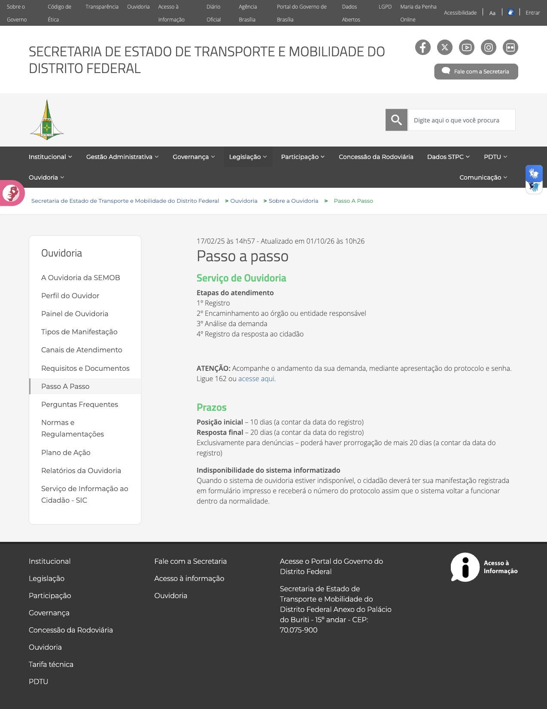

# Correspondência com as Expectativas dos Usuários no site da SEMOB-DF

## Histórico de Versão e Contribuição

| Data | Versão | Descrição | Autor(es) | Revisor(es) |
| :---: | :---: | :--- | :--- | :--- |
| 06/10/2026 | 1.0 | Criação da análise de correspondência com as expectativas dos usuários do portal **SEMOB-DF** para a Entrega 3, com fundamentação e evidências da inspeção. | [Lucas Araújo](https://github.com/Lucasaraujoszz) | [Rodrigo Barbosa](https://github.com/RodrigoCBarbosa) |
| 06/10/2026 | 1.1 | Redução de sobreposições com outros princípios e ampliação da inspeção para preparação documental, cópias de processos e etapas de atendimento. | [Lucas Araújo](https://github.com/Lucasaraujoszz) | [Rodrigo Barbosa](https://github.com/RodrigoCBarbosa) |
| 06/10/2026 | 1.2 | Destaque dos trechos da referência teórica utilizados na análise. | [Lucas Araújo](https://github.com/Lucasaraujoszz) | [Rodrigo Barbosa](https://github.com/RodrigoCBarbosa) |

---

**Site analisado:** <https://www.semob.df.gov.br/> (Secretaria de Estado de Transporte e Mobilidade do Distrito Federal)

**Princípio:** 10.2.1 Correspondência com as Expectativas dos Usuários

**Referência teórica:** Barbosa, S. D. J. et al. (2021). *Interação Humano-Computador e Experiência do Usuário*, Cap. 10: Princípios e Diretrizes para o Design de IHC, pp. 238–239.

**Contexto:** Grupo 05, Interação Humano-Computador, UnB/FCTE, Professor André Barros de Sales, Semestre 2026.2. Artefato correspondente ao tópico 1 do item 12 da Apresentação 3 do plano de ensino.

**Data da inspeção:** 06/10/2026, em navegador desktop (navegador integrado). As capturas da inspeção complementar foram realizadas com largura de 1.274 pixels.

**Autor do artefato:** [Lucas Araújo](https://github.com/Lucasaraujoszz)

**Revisor indicado:** [Rodrigo Barbosa](https://github.com/RodrigoCBarbosa).

---

## 1. O princípio segundo o livro

O princípio de **Correspondência com as Expectativas dos Usuários** orienta o projeto a relacionar os controles, a organização das tarefas e as informações apresentadas ao conhecimento que as pessoas trazem do mundo real (Barbosa et al., 2021, subseção 10.2.1). No portal da SEMOB-DF, essa relação envolve compreender o que preparar antes de um atendimento, qual sequência seguir e como reconhecer seu resultado.

As contribuições de Norman, Shneiderman, Nielsen e Tognazzini descritas a seguir foram consultadas **por meio de Barbosa et al. (2021)**. Não houve consulta direta às obras originais desses autores.

### 1.1. Mapeamentos naturais entre intenções, ações e resultados

Norman (1988 apud Barbosa et al., 2021, p. 238) recomenda explorar os mapeamentos naturais entre variáveis mentais e físicas e entre tarefas e controles. O usuário deve conseguir relacionar:

1. **Intenções e ações possíveis:** reconhecer qual opção permite realizar o que deseja;
2. **Ações e seus efeitos:** antecipar o resultado de selecionar um controle;
3. **Estado real e estado percebido:** interpretar o que o sistema efetivamente apresenta ou realizou;
4. **Estado percebido e necessidades:** verificar se o resultado atende às suas intenções e expectativas.

Uma lista de documentos, por exemplo, deve permitir que cada público identifique quais exigências se aplicam ao seu atendimento. Encontrar a lista só atende à intenção do usuário quando ele consegue decidir o que preparar.

O livro usa a compra em uma loja como exemplo de sequência familiar: procurar, escolher e identificar-se para finalizar a compra. Exigir identificação antes de conhecer os produtos pode contrariar essa sequência. No portal de transporte, o mesmo raciocínio orienta a consulta pública de serviços antes de etapas que eventualmente exijam cadastro.

A imagem 01 apresenta a discussão de Norman e o início desse exemplo.

*Imagem 01 — Mapeamentos entre intenções, ações, efeitos e estados percebidos.*

*Fonte: Barbosa et al. (2021, p. 238, subseção 10.2.1).*

### 1.2. Sequências familiares, ordem lógica e fechamento

Shneiderman (1998 apud Barbosa et al., 2021, p. 239) recomenda estruturar o diálogo com uma linha de raciocínio e fechamento, organizando as ações em grupos com **início, meio e fim**. Na Ouvidoria, por exemplo, o cidadão precisa distinguir registrar uma manifestação, acompanhar sua análise e receber uma resposta.

Nielsen (1994c apud Barbosa et al., 2021, p. 239) recomenda seguir as convenções do mundo real e apresentar as informações em **ordem natural e lógica**. Quando o fluxo não puder reproduzir uma sequência familiar, sua organização deve permanecer plausível para o usuário. O capítulo também destaca o **feedback informativo ao concluir um grupo de ações**, que permite reconhecer a conclusão da tarefa e preparar-se para o próximo passo.

Uma página informativa não precisa emitir um protocolo para encerrar uma consulta: título e conteúdo coerentes podem confirmar o resultado. Já uma solicitação exige distinguir orientação, envio e confirmação de recebimento. Encontrar instruções sobre o atendimento não comprova que uma manifestação foi registrada.

### 1.3. Linguagem dos usuários e uso cuidadoso de metáforas

Barbosa et al. (2021, p. 239) ressaltam que a interface deve empregar palavras, expressões e conceitos familiares ao público, evitando termos voltados ao sistema ou aos desenvolvedores. O significado de uma exigência deve estar ligado à ação que a pessoa precisa realizar, e não depender de seu conhecimento da organização administrativa.

Tognazzini (2014 apud Barbosa et al., 2021, p. 239) recomenda empregar **metáforas com cuidado** para comunicar o modelo conceitual. Uma representação familiar ajuda a compreender o sistema, mas suas propriedades não precisam coincidir integralmente com as do objeto físico. No portal, ícones de cartão e ônibus podem apoiar o reconhecimento; eles devem acompanhar rótulos e destinos coerentes, sem sugerir que selecionar uma imagem já realiza uma recarga ou uma consulta.

A imagem 02 apresenta a continuidade do exemplo, a organização das ações, o feedback, a linguagem e as metáforas.

*Imagem 02 — Sequências familiares e recomendações de Shneiderman, Nielsen e Tognazzini.*

*Fonte: Barbosa et al. (2021, p. 239, subseção 10.2.1).*

---

## 2. Como a inspeção foi realizada

A avaliação foi conduzida por **inspeção de usabilidade**, confrontando a intenção provável do usuário, a orientação apresentada e o próximo passo efetivamente disponível. A inspeção complementar concentrou-se na preparação e continuidade dos serviços, considerando cidadãos, motoristas e representantes de operadores de transporte.

Os problemas de rótulos repetidos, trilhas técnicas e mudança de domínio já estão detalhados em [Consistência e padronização](consistencia-e-padronizacao.md), [Visibilidade e reconhecimento](visibilidade-e-reconhecimento.md) e [Equilíbrio entre controle e liberdade](equilibrio-controle-liberdade.md). Aqui, o recorte é **como o usuário identifica o procedimento aplicável ao seu caso e avança até o resultado esperado**. A análise de cartões e recarga permanece no artefato de [Simplicidade nas estruturas das tarefas](simplicidade-nas-estruturas-das-tarefas.md).

**Tabela 1** — Escopo da inspeção complementar

| Área analisada | Endereço / Referência | Verificação realizada |
|---|---|---|
| **Inspeção veicular** | [Procedimento](https://www.semob.df.gov.br/inspecao-veicular/) e [documentos exigidos](https://www.semob.df.gov.br/inspecao-veicular-2) | Leitura das etapas e abertura do destino de “SAIBA MAIS”, comparando os públicos atendidos com os documentos listados. |
| **Cópias de processos da Jari** | [Processos da Jari](https://www.semob.df.gov.br/junta-administrativa-jari) | Verificação das instruções para formular o pedido, comprovar representação e cumprir o pagamento mencionado. |
| **Carta de Serviços** | [Serviços ao cidadão](https://www.semob.df.gov.br/servicos-ao-cidadao) | Expansão de “Baixa de Motorista” e “Consulta de horário/itinerário de ônibus”, conferindo o conteúdo revelado. |
| **Acompanhamento de manifestações** | [Passo a passo](https://www.semob.df.gov.br/passo-a-passo) | Clique em “acesse aqui” e comparação entre a ação anunciada e a página resultante. |

As expectativas são hipóteses da inspeção, não depoimentos de participantes. Foram lidos conteúdos públicos e verificados links; não foram enviados pedidos, efetuados pagamentos ou realizados atendimentos presenciais. A análise trata da orientação oferecida pelo portal, sem validar a vigência jurídica das exigências ou o funcionamento interno dos órgãos.

**Escala de gravidade adotada:**

- **Alta:** O problema de expressão ou conteúdo compromete criticamente a legibilidade ou impede o usuário de completar sua tarefa com autonomia;
- **Média:** O problema confunde o usuário, impõe sobrecarga cognitiva, exige decifração de jargão ou atrasa a navegação;
- **Baixa:** Problema cosmético ou secundário de apresentação que não chega a comprometer a conclusão da tarefa.

---

## 3. Pontos positivos observados

A Tabela 2 apresenta recursos que ajudam a prever as condições e o resultado de um atendimento.

**Tabela 2** — Pontos positivos relacionados à preparação e à sequência das tarefas

| ID | Observação no Portal | Relação com o princípio (Barbosa et al., 2021) |
|:---:|---|---|
| **P1** | A Inspeção veicular descreve triagem documental, inspeção de chassi, inspeção de carroceria e emissão do selo em caso de aprovação. | Explicita dependências e um resultado final reconhecível, aproximando a descrição digital da sequência presencial (Shneiderman). |
| **P2** | “Baixa de Motorista” apresenta “Quem pode fazer?”, documentos, horário, local e telefone nessa ordem. | A organização acompanha decisões de preparação: verificar se pode solicitar, reunir documentos e planejar o comparecimento (Nielsen). |
| **P3** | A página de Inspeção veicular explica que o destino de “SAIBA MAIS” contém a documentação exigida; a página aberta efetivamente lista documentos. | O contexto permite antecipar o efeito da ação, mesmo com um rótulo genérico (Norman). |
| **P4** | O “Passo a passo” da Ouvidoria distingue registro, encaminhamento, análise e resposta, além de informar protocolo e senha para acompanhamento. | A sequência permite diferenciar registrar um pedido de receber sua resposta. A falha do acesso ao acompanhamento é analisada em CE3. |

A imagem 03 registra a sequência da inspeção e seu desfecho informado. Trata-se da descrição publicada do serviço, não da observação de uma vistoria realizada.

*Imagem 03 — Triagem, inspeções e emissão do selo descritas em sequência.*

*Fonte: Portal da SEMOB-DF, captura de 06/10/2026.*

Na imagem 04, as informações de “Baixa de Motorista” estão organizadas conforme a preparação para o atendimento.

*Imagem 04 — Identificação de quem pode solicitar, documentos e condições de atendimento.*

*Fonte: Portal da SEMOB-DF, captura de 06/10/2026.*

---

## 4. Problemas encontrados

### Resumo das violações

**Tabela 3** — Síntese dos problemas encontrados

| ID | Problema Identificado | Diretriz Violada (Barbosa et al., 2021) | Gravidade |
|:---:|---|---|:---:|
| **CE1** | A lista da inspeção veicular reúne diferentes públicos sem associar todos os documentos ao caso correspondente. | Mapeamento entre a situação do usuário e as ações necessárias (Norman). | **Média** |
| **CE2** | A obtenção de cópias da Jari exige pagamento de DAR, mas a página não esclarece como nem em que etapa cumprir essa exigência. | Sequência familiar, ordem lógica e continuidade das ações (Shneiderman e Nielsen). | **Média** |
| **CE3** | O link para acompanhar a manifestação permanece na própria página de orientações. | Correspondência entre ação e efeito e acesso ao estado da tarefa (Norman). | **Média** |

---

### CE1. Documentos sem indicação suficiente de aplicabilidade (Gravidade Média)

**Descrição:** Ao preparar uma inspeção, o usuário precisa saber “quais documentos devo levar para o meu veículo?”. A página [Inspeção veicular — documentos](https://www.semob.df.gov.br/inspecao-veicular-2) reúne representantes de empresas do transporte coletivo, autorizatários ou motoristas auxiliares de táxi e representantes do transporte privado coletivo. Em seguida, apresenta uma única lista, que inclui “Certificado de conformidade do taxímetro expedido pelo Inmetro”, sem indicar nesse item o público correspondente.

**Por que é um problema:** A lista contém condições explícitas para outros itens: o Termo de Auditoria Fiscal aparece “em caso de liberação de penalidade” e o laudo, caso a inspeção tenha sido feita por terceiro habilitado. Essa delimitação ajuda a tomar uma decisão, mas não é aplicada a toda a lista. Um representante do transporte coletivo precisa inferir quais exigências correspondem ao seu caso. O problema está na relação entre a situação concreta e a ação de preparar documentos, discutida por Norman (apud Barbosa et al., 2021, p. 238), e não simplesmente na existência de termos técnicos.

**Recomendação:** Separar documentos comuns dos específicos e apresentar uma coluna “Quando se aplica” ou listas por modalidade de transporte. As condições devem ser confirmadas pela área responsável. A interface não deve obrigar o solicitante a deduzir regras a partir do nome de um equipamento.

A imagem 05 mostra os públicos e a lista com diferentes níveis de explicitação das condições.

*Imagem 05 — Lista única com certificado do taxímetro e condições explícitas apenas em determinados itens.*

*Fonte: Portal da SEMOB-DF, captura de 06/10/2026.*

---

### CE2. Uma exigência de pagamento não se transforma em um próximo passo claro (Gravidade Média)

**Descrição:** A página [Processos da Jari](https://www.semob.df.gov.br/junta-administrativa-jari) apresenta o serviço de fornecimento de cópias. Em “Procedimentos”, informa pedido formal por escrito, comprovação de ser parte ou representante legal e “pagamento de DAR”. Entretanto, o conteúdo não explica onde obter esse documento, como conhecer o valor ou se o pagamento ocorre antes ou durante o atendimento presencial.

**Por que é um problema:** Quem se prepara para solicitar a cópia provavelmente precisa decidir se já deve comparecer com um comprovante. A página informa local e horários, mas a etapa de pagamento fica sem ligação operacional com o restante do procedimento. Mesmo alguém que conheça a sigla ainda precisa descobrir a ordem das ações. O acréscimo desta análise, em relação às discussões de vocabulário do projeto, é a **lacuna na sequência da tarefa**: identificar uma exigência não basta para saber executá-la. Isso contraria a organização com início, meio e fim e a ordem natural e lógica discutidas por Shneiderman e Nielsen (apud Barbosa et al., 2021, p. 239).

**Recomendação:** Explicar o que é o DAR nesse serviço, como obtê-lo, como consultar o valor e em que momento apresentá-lo. Se a emissão ocorrer no atendimento, declarar essa condição. Organizar a orientação como preparação do pedido, atendimento, pagamento quando aplicável e entrega da cópia, após confirmação do procedimento pela unidade responsável.

A imagem 06 registra a orientação completa disponível na página. A classificação média considera a necessidade de esclarecimento adicional; não se afirma que o atendimento presencial seja impossível.

*Imagem 06 — “Pagamento de DAR” listado sem indicação de como ou quando realizá-lo.*

*Fonte: Portal da SEMOB-DF, captura de 06/10/2026.*

---

### CE3. A ação de acompanhar a demanda não abre uma consulta (Gravidade Média)

**Descrição:** Em [Passo a passo](https://www.semob.df.gov.br/passo-a-passo), a orientação é acompanhar a demanda com protocolo e senha, pelo telefone 162 ou pelo link “acesse aqui”. O clique nesse link acrescenta `#` ao endereço da própria página e mantém as instruções, sem abrir a consulta.

**Por que é um problema:** O usuário espera passar da explicação do processo para o estado de sua manifestação. Essa transição não ocorre. Diferentemente da crítica geral a “clique aqui” presente em [Conteúdo relevante e expressão adequada](conteudo-relevante-e-expressao-adequada.md), aqui o contexto explica a finalidade, mas o efeito não realiza a ação anunciada. A evidência é relevante porque mostra uma interrupção entre o fluxo descrito e o acompanhamento efetivamente oferecido, afetando a relação entre ação e resultado de Norman (apud Barbosa et al., 2021, p. 238).

**Recomendação:** Apontar o link para a consulta válida, identificando o sistema responsável e os dados necessários. Quando o acesso digital estiver indisponível, informar essa condição e a alternativa telefônica. A inspeção não avaliou o envio nem a confirmação de manifestações no sistema externo.

A imagem 07 registra o conteúdo após o clique; o destino `#` foi conferido no link.

*Imagem 07 — A orientação de acompanhamento permanece na tela, sem abertura da consulta anunciada.*

*Fonte: Portal da SEMOB-DF, captura de 06/10/2026.*

---

## 5. Síntese das recomendações para o redesign

As recomendações abaixo complementam o [Guia de Estilo](../guia-de-estilo/introducao.md) com critérios para a organização dos procedimentos. A prioridade considera a continuidade da tarefa, mantendo a escala de gravidade do grupo.

**Tabela 4** — Aplicação das recomendações e critérios de verificação

| Prioridade | Aplicação no redesign | Como verificar |
|:---:|---|---|
| **1 — CE3** | Ligar a orientação de acompanhamento à consulta correspondente. | Selecionar o acesso e conferir se é possível iniciar a consulta; verificar também a alternativa informada para indisponibilidade. |
| **2 — CE1** | Relacionar documentos a públicos e condições de aplicação. | Para cada modalidade atendida, verificar se a pessoa consegue determinar sua lista sem interpretar exigências de outra modalidade. |
| **3 — CE2** | Explicitar as dependências entre requerimento, pagamento e obtenção da cópia. | Pedir que um participante descreva o que faria antes, durante e depois do atendimento com base apenas na orientação apresentada. |

Os critérios com participantes são propostas para a avaliação futura. Os padrões positivos já encontrados — etapas com resultado definido e informações organizadas conforme a preparação — podem orientar essas correções.

---

## 6. Conclusão

A correspondência com as expectativas depende de o usuário conseguir transformar a orientação publicada em um procedimento aplicável ao seu caso. A inspeção veicular e a seção “Baixa de Motorista” oferecem exemplos úteis de sequência e preparação. As lacunas identificadas aparecem em três momentos distintos: decidir quais documentos levar, saber quando cumprir uma exigência de pagamento e acessar o acompanhamento de uma solicitação.

Esse recorte complementa as análises de rótulos, padronização e visibilidade existentes no projeto. As recomendações buscam aproximar a representação do serviço das decisões reais do cidadão, conforme os mapeamentos de Norman e a organização lógica das ações apresentada por Shneiderman e Nielsen em Barbosa et al. (2021, pp. 238–239).

---

## 7. Declaração sobre o Uso de IA Generativa

Em conformidade com o Código de Conduta da Sociedade Brasileira de Computação (SBC) e as diretrizes do Plano de Ensino da disciplina, declara-se que o assistente de inteligência artificial generativa *Gemini* foi utilizado no apoio ao refinamento textual e formatação Markdown deste documento. A condução analítica da inspeção, a identificação dos problemas de usabilidade e as proposições de redesign permaneceram sob autoria e responsabilidade dos integrantes do grupo.

---

## 8. Referências Bibliográficas

- BARBOSA, Simone Diniz Junqueira; SILVA, Bruno Santana da; SILVEIRA, Milene Selbach; GASPARINI, Isabela; DARIN, Ticianne; BARBOSA, Gabriel Diniz Junqueira. **Interação Humano-Computador e Experiência do Usuário**. Autopublicação, 2021. Capítulo 10, subseção 10.2.1: Correspondência com as Expectativas dos Usuários, pp. 238–239. Fonte consultada das contribuições de Norman (1988), Shneiderman (1998), Nielsen (1994c) e Tognazzini (2014).
- UNIVERSIDADE DE BRASÍLIA. **Plano de Ensino de Interação Humano-Computador — 2026.2, Turma 01, versão 1**. Professor André Barros de Sales. 2026. Uso de IA Generativa, p. 3; Apresentação 3, itens 11–12, p. 11. [Documento utilizado](../../assets/inspecoes/plano-de-ensino-ihc-2026-2-turma01-v1.pdf).
- DISTRITO FEDERAL. Secretaria de Estado de Transporte e Mobilidade. **Inspeção veicular: procedimento**. Disponível em: <https://www.semob.df.gov.br/inspecao-veicular/>. Acesso em: 06 out. 2026.
- DISTRITO FEDERAL. Secretaria de Estado de Transporte e Mobilidade. **Inspeção veicular: documentos**. Disponível em: <https://www.semob.df.gov.br/inspecao-veicular-2>. Acesso em: 06 out. 2026.
- DISTRITO FEDERAL. Secretaria de Estado de Transporte e Mobilidade. **Processos da Jari**. Disponível em: <https://www.semob.df.gov.br/junta-administrativa-jari>. Acesso em: 06 out. 2026.
- DISTRITO FEDERAL. Secretaria de Estado de Transporte e Mobilidade. **Serviços ao cidadão**. Disponível em: <https://www.semob.df.gov.br/servicos-ao-cidadao>. Acesso em: 06 out. 2026.
- DISTRITO FEDERAL. Secretaria de Estado de Transporte e Mobilidade. **Passo a passo**. Disponível em: <https://www.semob.df.gov.br/passo-a-passo>. Acesso em: 06 out. 2026.
