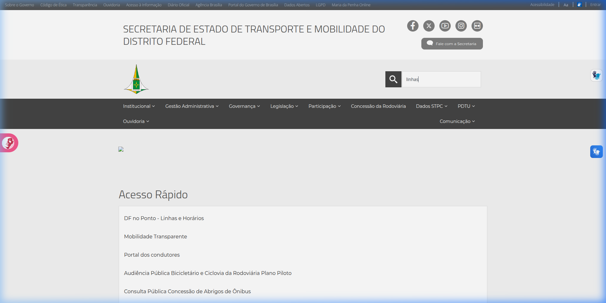
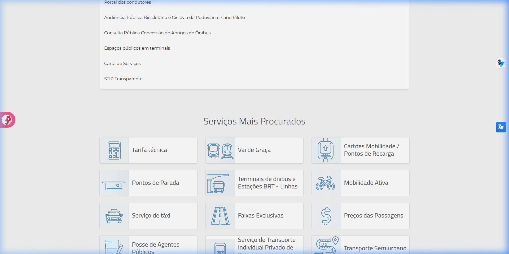
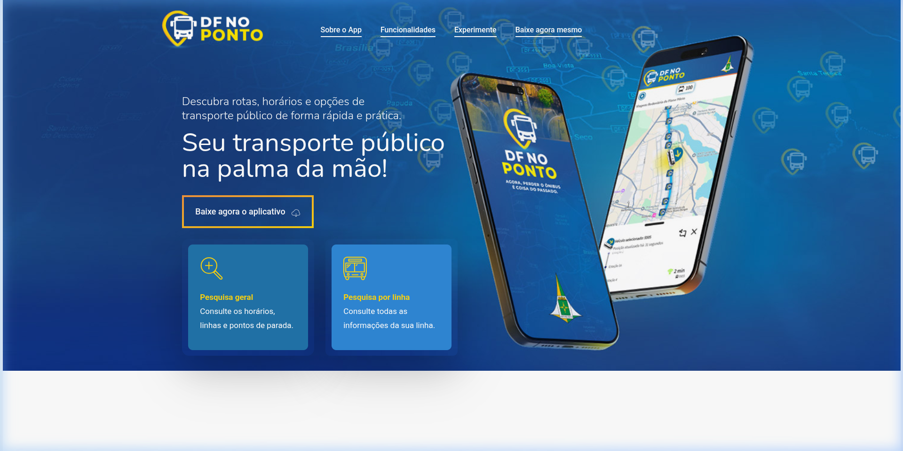
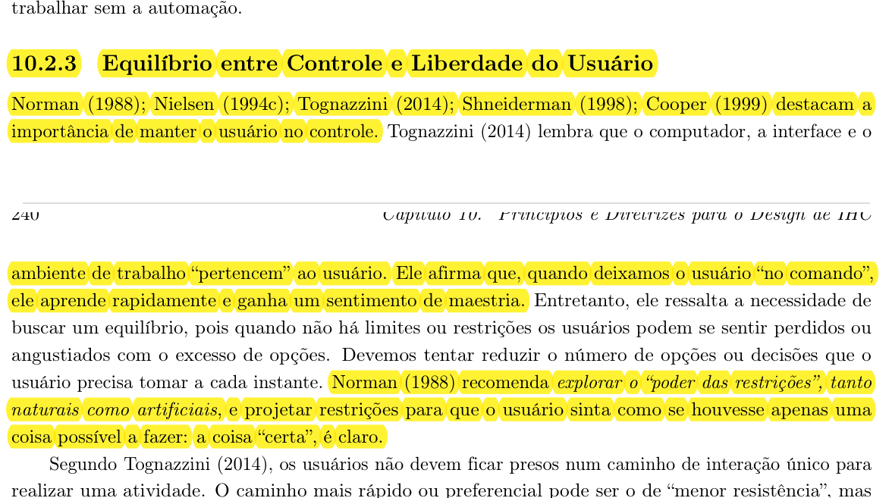
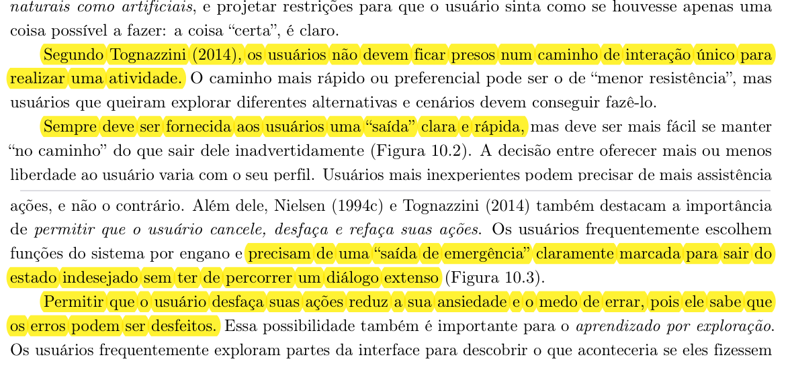
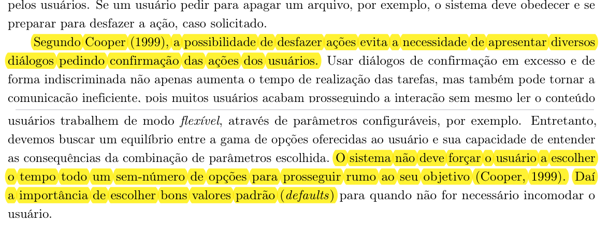

## Histórico de Versão e Contribuição

| Data | Versão | Descrição | Autor(es) | Revisor(es) |
| :---: | :---: | :--- | :--- | :--- |
| 05/10/2026 | 1.0 | Criação do documento de análise de equilíbrio entre controle e liberdade do usuário no site da **SEMOB-DF**. | [Carlos Costa](https://github.com/carloshfgit) | [Lucas Araújo](https://github.com/Lucasaraujoszz) |

---

# Equilíbrio entre Controle e Liberdade do Usuário no site da SEMOB-DF

**Site analisado:** <https://www.semob.df.gov.br/> (Secretaria de Estado de Transporte e Mobilidade do Distrito Federal)

**Princípio:** 10.2.3 Equilíbrio entre Controle e Liberdade do Usuário

**Referência:** Barbosa, S. D. J. et al. (2021). *Interação Humano-Computador e Experiência do Usuário*, Cap. 10: Princípios e Diretrizes para o Design de IHC, pp. 239–241.

**Data da inspeção:** 05/10/2026, em navegador desktop (Google Chrome)

**Autor do artefato:** [Carlos Costa](https://github.com/carloshfgit)

---

## 1. O princípio segundo o livro

O capítulo 10 consolida a visão de autores seminais de IHC — como Norman (1988), Nielsen (1994), Tognazzini (2014), Shneiderman (1998) e Cooper (1999) — acerca da soberania do usuário e da autonomia da interação, com recortes comprobatórios extraídos nas Imagens 01, 02 e 03.

Tognazzini (2014) postula que a interface, o ambiente de trabalho e o computador pertencem ao usuário. Deixar o usuário "no comando" confere-lhe rápida curva de aprendizado, sensação de domínio e segurança cognitiva. Contudo, os autores salientam a necessidade crítica de estabelecer um **equilíbrio delicado**: interfaces destituídas de limites ou restrições provocam angústia e sensação de desorientação diante de uma sobrecarga de opções.

As diretrizes centrais que regem esse princípio contemplam:

1. **O Poder das Restrições (Norman, 1988):** Projetar restrições naturais e artificiais para guiar o usuário com naturalidade para o caminho correto, reduzindo a chance de deslizes acidentais.
2. **Caminhos Alternativos sem Confinamento (Tognazzini, 2014):** Os usuários não devem ser encurralados em um fluxo de interação rígido e unidirecional. Embora deva existir um caminho preferencial de menor resistência, o sistema precisa viabilizar a exploração de percursos alternativos.
3. **Saídas de Emergência Claramente Marcadas (Nielsen, 1994):** Diante de escolhas equivocadas ou transições indesejadas, o usuário deve contar com mecanismos visíveis e rápidos para abortar, fechar, cancelar ou retornar imediatamente sem ser forçado a percorrer diálogos burocráticos.
4. **Reversibilidade de Ações e Redução da Ansiedade (Shneiderman, 1998; Nielsen, 1994):** A prerrogativa de desfazer (*Undo*) e refazer (*Redo*) atenua o medo do erro e incentiva a exploração ativa do ambiente digital.
5. **Jogo de Cintura e Menos Diálogos Bloqueantes (Cooper, 1999):** O software deve tolerar estados intermediários sem exibir insistentes caixas de confirmação para ações simples. Para operações que não podem ser desfeitas, devem ser construídas barreiras protetivas prévias.
6. **Valores Padrão Inteligentes (*Defaults*):** Evitar sobrecarregar o usuário com decisões constantes, fornecendo parâmetros predefinidos eficientes.

---

## 2. Como a inspeção foi feita

A avaliação prática no portal da SEMOB-DF envolveu a verificação dos mecanismos de comando, navegação exploratória e recuperação de estados:

- Inspeção do comportamento interativo do campo de busca global (mecanismo de digitação, reversibilidade e limpeza);
- Avaliação da trilha de navegação (*breadcrumbs*) como mecanismo de saída e navegação hierárquica reversa;
- Teste dos fluxos de transição para subsistemas externos (*DF no Ponto*, *Participa DF* e *Diário Oficial do Distrito Federal*);
- Avaliação dos controles de acessibilidade (ativação e restauração de estados visuais padrão);
- Verificação do comportamento da navegação em páginas densas e a existência de atalhos de retorno ao topo.

Escala de gravidade adotada:
- **Alta:** Prende o usuário, remove o controle sobre o histórico do navegador ou impossibilita o cancelamento/retorno;
- **Média:** Impõe atrito de interação para desfazer passos simples ou não avisa sobre redirecionamentos abruptos;
- **Baixa:** Ausência de comodidades de controle de visualização com impacto leve.

---

## 3. Pontos positivos

A Tabela 01 apresenta os aspectos positivos observados no portal da SEMOB-DF quanto ao equilíbrio entre controle e liberdade.

**Tabela 01** - Pontos positivos identificados

| # | Observação | Relação com o princípio |
|---|---|---|
| P1 | O menu institucional global de navegação e a barra do GDF permanecem acessíveis no topo em todas as páginas visitadas. | Permite ao usuário abandonar o fluxo corrente a qualquer momento e transitar livremente para qualquer outra seção. |
| P2 | Os recursos de acessibilidade da barra superior (Alto Contraste e Tamanho da Fonte) podem ser acionados e desativados imediatamente com um clique. | O usuário tem controle soberano sobre a apresentação visual da interface sem recarregamentos intrusivos. |
| P3 | O primeiro elo da trilha de navegação (*Secretaria de Estado de Transporte...*) atua de forma consistente como atalho de retorno à home. | Oferece saída de emergência rápida para a raiz do portal em caso de desorientação. |

A Imagem 04 ilustra os controles de acessibilidade e a estrutura do menu persistente do portal.

*Imagem 04: Cabeçalho do portal contendo os controles reversíveis de contraste/fonte e o menu global permanente.*

---

## 4. Problemas encontrados

### Resumo

A Tabela 02 resume os problemas de equilíbrio entre controle e liberdade levantados na inspeção:

**Tabela 02** - Síntese dos problemas encontrados

| # | Problema | Diretriz violada (Nielsen / Tognazzini / Cap. 10) | Gravidade |
|---|---|---|---|
| CL1 | Campo de pesquisa não oferece botão de limpeza rápida ("X") | Reversibilidade de ações e facilidade para desfazer digitação | **Média** |
| CL2 | Breadcrumb exibe rota técnica quebrada (*Modulo 15 Botoes*) que desorienta o retorno | Caminho claro de saída e integridade da navegação hierárquica | **Alta** |
| CL3 | Transição para aplicações externas (*DF no Ponto* e *Ouvidoria*) sem rota de retorno | Saídas de emergência e preservação do contexto do usuário | **Alta** |
| CL4 | Ausência de filtros e controle de refinamento na listagem de resultados da busca | Controle local da interação e liberdade de filtragem | **Média** |
| CL5 | Inexistência de botão flutuante "Voltar ao Topo" em páginas com rolagem extensa | Controle ergonômico da navegação vertical | **Baixa** |

---

### CL1. Ausência de botão de limpeza rápida no campo de busca (Gravidade Média)

Ao interagir com o campo de busca *"Digite aqui o que você procura"* no cabeçalho, o sistema não insere um botão gráfico de cancelamento ou limpeza (`X`) à direita do texto digitado, conforme retratado na Imagem 04 acima.

**Por que é um problema:** Nielsen (1994) e Tognazzini (2014) preconizam que desfazer uma ação deve ser tão simples quanto executá-la. Caso o cidadão digite um termo incorreto ou desista da pesquisa, ele é compelido a pressionar a tecla *Backspace* repetidas vezes ou selecionar manualmente o texto com o mouse, gerando atrito desnecessário em uma ação corriqueira.

**Recomendação:** Incluir um ícone dinâmico de limpeza (`clear button` / `X`) que surja assim que houver ao menos um caractere digitado, permitindo limpar instantaneamente o campo com um único clique.

---

### CL2. Trilha de navegação intermediária corrompida com nó técnico (Gravidade Alta)

Nas páginas de serviços internos (como *Preços das Passagens* e *Bilhetagem*), a trilha de navegação (*breadcrumb*) exibe o seguinte encadeamento:  
`Secretaria de Estado... > Modulo 15 Botoes > Preços das Passagens` (Imagem 05).

*Imagem 05: Trilha de navegação exibindo o elemento interno do CMS "Modulo 15 Botoes".*

Ao clicar sobre o item intermediário `Modulo 15 Botoes` buscando subir um nível hierárquico na navegação, o usuário é direcionado inadvertidamente para a tela de *Bilhete Único* ou cai em uma página genérica.

**Por que é um problema:** O breadcrumb serve precipuamente para assegurar a liberdade de navegação ascendente e situar o usuário no mapa da aplicação. Quando a trilha apresenta nomes internos de desenvolvimento de software e conduz a destinos inesperados, o usuário perde o controle de onde está e para onde está indo, frustrando sua expectativa de controle hierárquico.

**Recomendação:** Sanar a taxonomia do CMS, substituindo a categoria técnica por um agrupador compreensível ao cidadão (e.g., `Serviços ao Cidadão` ou `Transporte Coletivo`) com página de índice categorizada e funcional.

---

### CL3. Confinamento em subsistemas externos sem rota visível de regresso (Gravidade Alta)

Ao acionar links para serviços de alta demanda, como a consulta interativa no *DF no Ponto* ou o canal de manifestação no *Participa DF*, o portal transfere o usuário para domínios externos (`dfnoponto.semob.df.gov.br` e `participa.df.gov.br`), conforme exposto na Imagem 06.

*Imagem 06: Tela externa do DF no Ponto desprovida de qualquer link de retorno ao portal principal da SEMOB-DF.*

**Por que é um problema:** As páginas de destino não fornecem nenhum elemento de cabeçalho ou link contextual para *"Retornar ao Portal da SEMOB-DF"*. Se o link for aberto na mesma aba, o usuário é apartado da estrutura institucional do órgão e sua única rota de fuga passa a ser o botão retroceder do navegador. Se aberto em nova aba sem ícone indicativo, há quebra da convenção de navegação da janela.

**Recomendação:** Em links para subsistemas e serviços externos:
1. Sinalizar explicitamente no rótulo visual que se trata de link externo;
2. Disponibilizar, nas aplicações satélites sob gestão da Secretaria, uma barra de integração superior com botão evidente de regresso ao portal institucional.

---

### CL4. Resultados de busca sem opções de controle e parametrização (Gravidade Média)

Na página de resultados de pesquisa, o usuário recebe uma listagem paginada plana (com até 10 resultados por página) sem controles para refinar o escopo: não há filtros por data de publicação, tipo de conteúdo (serviço, notícia, documento normativo) ou órgão responsável.

**Por que é um problema:** Shneiderman (1998) argumenta que o usuário deve deter o controle local da interação, moldando o comportamento do sistema às suas necessidades. Ao privar o usuário de ferramentas para filtrar ou reordenar a consulta, o sistema impõe uma ordenação rígida e dificulta a localização do conteúdo almejado.

**Recomendação:** Acrescentar uma barra lateral ou menu suspenso de filtros que permita ao cidadão selecionar se deseja visualizar apenas *Serviços*, *Notícias*, *Contratos* ou *Legislação*.

---

### CL5. Ausência de comando "Voltar ao Topo" em páginas verticais extensas (Gravidade Baixa)

Páginas com tabelas densas ou extensos informativos (como a página de contatos e notícias) demandam rolagem expressiva. Ao atingir o rodapé, o usuário não encontra um botão flutuante de ascensão ao topo da página.

**Por que é um problema:** O usuário precisa rolar exaustivamente a barra de rolagem para recuperar o menu de navegação superior, impondo esforço físico e sensorial redundante.

**Recomendação:** Incluir um botão discreto e flutuante no canto inferior direito (*Back to Top*) que surja automaticamente após 300px de rolagem vertical.

---

## 5. Síntese das recomendações

1. **Botão de Limpeza em Campos de Entrada:** Implementar controle de reset instantâneo em todos os formulários e campos de busca.
2. **Correção de Categorias nos Breadcrumbs:** Eliminar rotulagens técnicas do CMS (`Modulo 15 Botoes`) e garantir caminhos ascendentes íntegros.
3. **Mecanismo de Saída em Aplicações Satélites:** Assegurar que serviços vinculados (como o *DF no Ponto*) possuam caminho de volta claro ao portal da SEMOB.
4. **Painel de Filtros e Refinamento de Resultados:** Permitir ao usuário parametrizar ordenação e categoria nos resultados de buscas.
5. **Comando de Retorno ao Topo:** Inserir botão de retorno ágil ao cabeçalho em páginas longas.

---

## 6. Conclusão

O portal da SEMOB-DF proporciona uma boa base estrutural de liberdade ao disponibilizar um menu institucional abrangente e controles rápidos de acessibilidade em todas as suas páginas. No entanto, o equilíbrio é comprometido quando o cidadão necessita transitar entre páginas e serviços: trilhas de navegação corrompidas e a ausência de elos de retorno nas ferramentas externas colocam o usuário em verdadeiros becos sem saída, ferindo as clássicas heurísticas de saídas de emergência preconizadas por Nielsen e a autonomia defendida por Tognazzini e Cooper. A aplicação das melhorias recomendadas garantirá que o usuário explore o portal com confiança e soberania sobre seus fluxos de interação.

---

## Declaração sobre o Uso de IA Generativa

Em conformidade com o Código de Conduta da Sociedade Brasileira de Computação (SBC) e as diretrizes do Plano de Ensino da disciplina, declara-se que o assistente de inteligência artificial generativa *Gemini* foi utilizado no apoio ao refinamento textual e formatação Markdown deste documento. A condução analítica da inspeção, a identificação dos problemas de usabilidade e as proposições de redesign permaneceram sob autoria e responsabilidade dos integrantes do grupo.

---

## Referências Bibliográficas

- BARBOSA, S. D. J.; SILVA, B. S. da; SILVEIRA, M. S.; GASPARINI, I.; DARIN, T.; BARBOSA, G. D. J. *Interação Humano-Computador e Experiência do Usuário*. Autopublicação, 2021. Cap. 10: Princípios e Diretrizes para o Design de IHC, pp. 239–241.
- COOPER, Alan. *The Inmates Are Running the Asylum*. Indianapolis: Sams Publishing, 1999.
- NIELSEN, Jakob. *Heuristic Evaluation*. In: NIELSEN, J.; MACK, R. L. (eds.). *Usability Inspection Methods*. Nova York: John Wiley & Sons, 1994.
- NORMAN, Donald A. *The Design of Everyday Things*. Nova York: Basic Books, 1988.
- SALES, André Barros de. *Plano de Ensino: Interação Humano Computador*. Faculdade UnB Gama, Universidade de Brasília, 2026.
- SHNEIDERMAN, Ben. *Designing the User Interface: Strategies for Effective Human-Computer Interaction*. 3. ed. Reading: Addison-Wesley, 1998.
- TOGNAZZINI, Bruce. *First Principles of Interaction Design (Revised & Expanded)*. AskTog, 2014.

---

## Imagens de Referências

Abaixo encontram-se os recortes comprobatórios extraídos diretamente da obra de referência da disciplina (Barbosa et al., 2021, pp. 239–241):

*Imagem 01: Trecho do livro-texto abordando a relevância de manter o usuário no comando e o poder das restrições (Norman; Tognazzini).*

*Imagem 02: Trecho do livro-texto destacando saídas de emergência e o impacto da reversibilidade de ações na redução da ansiedade (Nielsen; Tognazzini).*

*Imagem 03: Trecho do livro-texto evidenciando a ponderação de diálogos de confirmação e a seleção de valores padrão eficientes (Cooper).*
