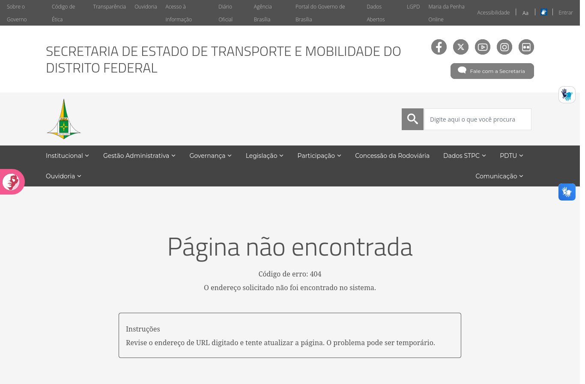
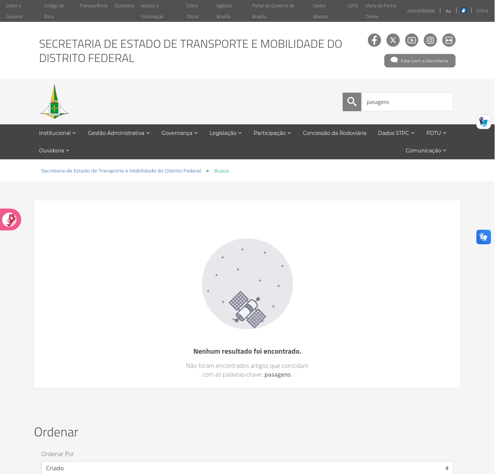
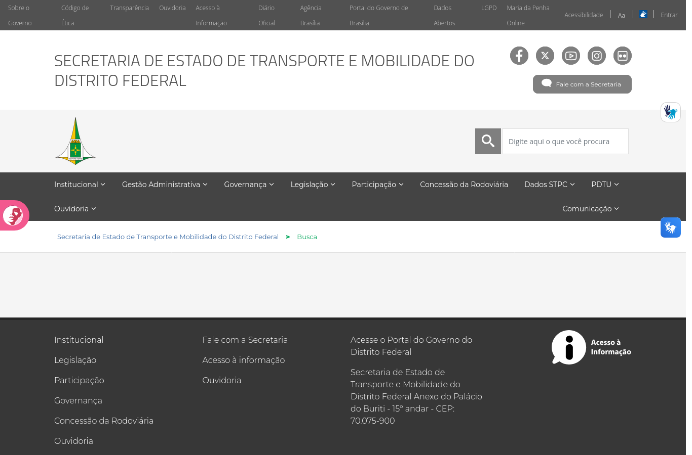

# Projeto para Erros no site da SEMOB-DF

## Histórico de Versão e Contribuição

| Data | Versão | Descrição | Autor(es) | Revisor(es) |
| :---: | :---: | :--- | :--- | :--- |
| 05/10/2026 | 1.0 | Criação do documento com a análise do princípio 10.2.9 Projeto para Erros no site da SEMOB-DF. | [Tomás Rocho](https://github.com/TomasRocho) | [Rodrigo Carvalho](https://github.com/RodrigoCBarbosa) |

---

- **Autor:** [Tomás Rocho](https://github.com/TomasRocho)
- **Revisor:** [Rodrigo Carvalho](https://github.com/RodrigoCBarbosa)
- **Site analisado:** <https://www.semob.df.gov.br/> (Secretaria de Estado de Transporte e Mobilidade do Distrito Federal)
- **Princípio:** 10.2.9 Projeto para Erros
- **Referência:** Barbosa, S. D. J. et al. (2021). *Interação Humano-Computador e Experiência do Usuário*, Cap. 10: Princípios e Diretrizes para o Design de IHC, pp. 247–248.
- **Data da inspeção:** 05/10/2026, em navegador desktop (Mozilla Firefox, janela de 1366 px de largura)

---

## 1. O princípio segundo o livro

O capítulo 10 apresenta o projeto para erros a partir de Norman (1988), Cooper (1999), Nielsen (1994) e Shneiderman (1998). As ideias usadas como critério nesta análise são:

1. **Assumir que todo erro possível será cometido** (Norman). O designer deve projetar pensando nos erros, e não só no caminho ideal.
2. **Ajudar o usuário a se recuperar**, informando *"o que ocorreu, as consequências disso e como reverter os resultados indesejados"* (Norman).
3. **Sistemas exploráveis:** deve ser fácil reverter operações e difícil realizar ações irreversíveis.
4. **Não colocar controles de uso frequente ao lado de controles perigosos ou raramente usados** (Cooper). O exemplo do livro é o botão *Propriedades* ao lado do botão *Desabilitar* (Figura 10.8).
5. **Evitar que os erros ocorram**, em primeiro lugar (Nielsen, Shneiderman).
6. **Detectar o erro e oferecer mecanismos simples para tratá-lo**, ajudando o usuário a *reconhecer, diagnosticar e se recuperar*. O exemplo do livro é a mensagem com "Tentar novamente" e "Voltar para a edição" (Figura 10.9).
7. **Mensagens de erro em linguagem simples**, *"sem códigos indecifráveis"*, que indiquem precisamente o problema e sugiram uma solução de forma construtiva.
8. **Ajuda e documentação de qualidade:** fáceis de encontrar, focadas na tarefa, com passos concretos e sem ser extensas.

---

## 2. Como a inspeção foi feita

- Provocação deliberada de situações de erro comuns para um cidadão:
  - acesso a um endereço inexistente (`/pagina-que-nao-existe-xyz`);
  - busca com erro de digitação (`pasagens`, `passajem`), com termo sem sentido (`xyzqwe`) e com o campo vazio;
  - busca sem acento e com variação de maiúsculas (`onibus`, `Onibus`, `ônibus`).
- Verificação do código de resposta HTTP de todos os 79 links internos da página inicial (`www.semob.df.gov.br`).
- Teste de acesso aos links que apontam para `semob.df.gov.br`, sem "www".
- Leitura do código HTML da página de erro, da busca e do formulário de login.
- Capturas de tela salvas na pasta `imagens/`.

**Limitações:** o site é quase todo informativo, e o cidadão não envia formulários nele. Os formulários de manifestação ficam em sites externos (Participa DF, e-Protocolo), que não foram avaliados. O formulário de login, destinado aos servidores, não foi testado com credenciais. A versão para celular também não foi avaliada.

Escala de gravidade usada: **Alta** (impede ou atrapalha muito a tarefa), **Média** (confunde ou atrasa) e **Baixa** (problema cosmético).

---

## 3. Pontos positivos

| # | Observação | Relação com o princípio |
|---|---|---|
| P1 | O site tem uma **página de erro própria** (404), em português, que mantém o cabeçalho, o menu e a busca (imagem E1). | O usuário não é jogado para fora do site e ainda tem caminhos para continuar. |
| P2 | A busca **ignora acentos e maiúsculas**: `onibus`, `Onibus` e `ônibus` retornam os mesmos 65 resultados; `horario` e `horário`, os mesmos 31. | Prevenção de erros: um deslize comum de digitação não impede a tarefa. |
| P3 | Quando a busca não encontra nada, o site diz isso claramente e **repete o termo digitado** ("Não foram encontrados artigos que coincidam com as palavras-chave: **pasagens**"), conforme a imagem E2. | Ajuda o usuário a **reconhecer** o erro: ele vê o que digitou e pode notar a falha. |
| P4 | Depois da busca, **o termo continua no campo** (imagem E2). | Facilita a correção: basta ajustar a palavra, sem redigitar tudo. |
| P5 | O formulário de login tem um aviso de **"Caps Lock está ativado"**, que só aparece quando necessário (verificado no código). | Prevenção de um erro clássico de senha. |
| P6 | O cidadão **não tem ações irreversíveis** no site: não há exclusão, envio de dados ou pagamento. | Pela própria natureza do site, o risco de erros graves é baixo. |

---

## 4. Problemas encontrados

### Resumo

| # | Problema | Diretriz violada (Cap. 10) | Gravidade |
|---|---|---|---|
| E1 | Links que levam a um erro que o site não consegue tratar (endereço sem "www") | Evitar que os erros ocorram; ajudar a recuperar | **Alta** |
| E2 | Item de menu que pede usuário e senha ao cidadão ("Plano de Fiscalização") | Evitar erros; informar o que ocorreu | **Alta** |
| E3 | Página 404 com código técnico, culpa o usuário e não oferece saída construtiva | Mensagens simples, precisas e construtivas | **Média** |
| E4 | Busca sem resultados não sugere correção nem alternativas | Ajudar a diagnosticar e se recuperar do erro | **Média** |
| E5 | Busca vazia leva a uma página em branco, sem nenhuma mensagem | Detectar o erro e informar o que ocorreu | **Média** |
| E6 | "Entrar" (área restrita) colado aos controles de acessibilidade | Não colocar controles de uso diferente lado a lado (Cooper) | **Baixa** |

---

### E1. Links que levam a um erro que o site não consegue tratar (gravidade alta)

Como descrito nos documentos de Visibilidade (V2) e de Consistência (C3), 28 referências da página inicial apontam para `semob.df.gov.br`, sem "www". Esse endereço não existe no DNS, e o clique termina na tela de erro **do navegador** (`ERR_NAME_NOT_RESOLVED`), em uma nova aba. Entre os afetados estão 10 dos 12 cartões de *Serviços Mais Procurados*, os 11 botões da seção *LAI*, incluindo **"Perguntas Frequentes"**, e o item *Organograma* do menu.

Do ponto de vista do projeto para erros, o problema é duplo:

- **O erro não foi evitado.** A falha está no próprio site e afeta os atalhos mais visíveis da página inicial.
- **Não há como o site ajudar na recuperação.** Como o pedido nunca chega ao servidor da SEMOB, nem a página 404 própria (P1) consegue aparecer. O usuário vê uma mensagem técnica do navegador, sem o que ocorreu, sem consequências e sem saída. Como a aba é nova, nem o botão "Voltar" funciona.

Vale notar que o link de **ajuda** (Perguntas Frequentes) está entre os quebrados. O livro pede que a ajuda seja *"facilmente encontrada"*, e aqui o principal atalho para ela leva a um erro.

**Por que é um problema:** é o oposto de *"evitar que os erros ocorram"* (Nielsen, Shneiderman). Quando o erro acontece, também não há nenhum mecanismo que ajude o usuário a *"reconhecer, diagnosticar e se recuperar"*.

**Recomendação:** corrigir os links (relativos ou com `www`) e configurar o DNS para que `semob.df.gov.br` redirecione para `www.semob.df.gov.br`. Assim, mesmo um link antigo ou digitado sem "www" passa a cair no site e, se for o caso, na página 404 própria. Incluir também a **verificação periódica de links quebrados** na rotina de manutenção do portal.

---

### E2. Item de menu que pede usuário e senha ao cidadão (gravidade alta)

No menu **Governança**, o item **"Plano de Fiscalização"** aponta para um arquivo PDF em um endereço de gerenciamento interno do portal (`/webdav/semob/document_library/...`). Esse endereço exige autenticação: o servidor responde com o código **401** e o cabeçalho `WWW-Authenticate: Digest realm="PortalRealm"`.

Na prática, ao clicar num item comum do menu, o cidadão recebe uma **janela de usuário e senha do navegador**, sem nenhuma explicação. Ele não tem essas credenciais. Se cancelar, o servidor não envia nenhum conteúdo (`Content-Length: 0`), e não aparece nenhuma mensagem dizendo o que houve nem onde encontrar o documento.

Dos 79 links internos da página inicial verificados, este foi o único que retornou erro (os demais retornaram 200 ou redirecionamentos 302 normais).

**Por que é um problema:** o usuário é levado a um "erro" que não cometeu. O sistema também não informa *"o que ocorreu, as consequências disso e como reverter"*. Pior, um pedido de senha inesperado pode levar o cidadão a achar que o documento é sigiloso ou que precisa de cadastro, ou ainda a digitar senhas de outros serviços numa janela que não conhece.

**Recomendação:** substituir o link pelo endereço público do documento na biblioteca de arquivos do portal (`/documents/...`), como já é feito em outros arquivos do site. Evitar publicar links de WebDAV na interface pública.

---

### E3. Página 404 com código técnico, que culpa o usuário e não oferece saída (gravidade média)

A página de erro própria do site (imagem E1) é um ponto positivo (P1), mas o conteúdo da mensagem não segue as recomendações do livro:

| Texto da página | Problema |
|---|---|
| "Código de erro: 404" | É o *"código indecifrável"* que o livro pede para evitar. Para o cidadão, o número não significa nada. |
| "O endereço solicitado não foi encontrado no sistema." | Diz *o que* ocorreu, mas não *por que* nem *o que fazer*. |
| "Revise o endereço de **URL digitado**..." | Supõe que o usuário digitou o endereço. Na maioria dos casos ele **clicou num link do próprio site** ou de um buscador, e a culpa não é dele. "URL" também é jargão técnico. |
| "...e tente atualizar a página. O problema pode ser temporário." | Sugestão imprecisa. Uma página que não existe não volta a existir se o usuário atualizar a tela. |

Além disso, a área de conteúdo **não oferece nenhum link ou ação**: não há botão para a página inicial, não há links para os serviços mais procurados e não há como avisar a Secretaria sobre o link quebrado. A busca e o menu continuam no cabeçalho, mas a mensagem não os menciona.

**Por que é um problema:** o livro pede mensagens de erro que *"indiquem precisamente o problema e sugiram uma solução de forma construtiva"*. Também mostra, na Figura 10.9, que uma boa mensagem oferece **caminhos de recuperação** ("Tentar novamente", "Voltar para a edição"), e não apenas um "OK".

**Recomendação:** reescrever a mensagem em linguagem simples, sem culpar o usuário. Exemplo: "Não encontramos esta página. Ela pode ter mudado de endereço ou sido removida." Depois, oferecer ações: um campo de busca no corpo da página, links para *Linhas e horários*, *Preços das passagens* e *Página inicial*, e um link "Avisar sobre este link quebrado" para a Ouvidoria ou o "Fale com a Secretaria". O código 404 pode ficar, em letra pequena, para uso técnico.

*Imagem E1: página de erro própria, com "Código de erro: 404", instrução para revisar a "URL digitada" e nenhum link ou ação na área de conteúdo.*

---

### E4. Busca sem resultados não sugere correção nem alternativas (gravidade média)

A busca ignora acentos (P2), mas **não tolera erros de digitação**. Um único caractere a menos faz o resultado cair a zero:

| Termo buscado | Resultado |
|---|---|
| `passagem` | 6 resultados |
| `pasagens` (falta um "s") | **Nenhum resultado** |
| `passajem` (j no lugar de g) | **Nenhum resultado** |

Na tela de "Nenhum resultado foi encontrado" (imagem E2):

- **não há sugestão de correção** do tipo "Você quis dizer: *passagens*?";
- **não há dicas** de como buscar melhor, como usar outras palavras ou termos mais gerais;
- **não há links alternativos** para os serviços mais procurados nem para o "Fale com a Secretaria";
- aparece o painel **"Ordenar por: Criado"**, que não faz sentido quando não há nada para ordenar.

**Por que é um problema:** o livro pede que o sistema ajude o usuário a *"reconhecer, diagnosticar e se recuperar de erros"*. A mensagem atual ajuda a reconhecer, porque repete o termo (P3), mas não ajuda a diagnosticar (foi erro de digitação? o conteúdo não existe?) nem a se recuperar. Para um público amplo, com diferentes níveis de escolaridade, erros de grafia na busca são esperados. Segundo Norman, *"qualquer erro potencial será cometido"*.

**Recomendação:** ativar a **sugestão ortográfica** do mecanismo de busca do portal ("Você quis dizer..."). Acrescentar à tela sem resultados dicas curtas e links para as tarefas mais comuns do cidadão. Esconder o painel "Ordenar" quando não houver resultados.

*Imagem E2: busca por "pasagens". A mensagem repete o termo (ponto positivo P3), mas não sugere "passagens", não oferece alternativas e ainda exibe o painel "Ordenar" sem resultados para ordenar.*

---

### E5. Busca vazia leva a uma página em branco (gravidade média)

Se o usuário clicar na lupa sem digitar nada, por exemplo por engano ou achando que o botão abre um menu de busca, o site carrega a página **Busca** com a área de conteúdo **completamente vazia** (imagem E3). Não aparece nenhuma mensagem, nenhuma instrução e nenhum resultado.

No código, o campo de busca do cabeçalho não tem nenhuma validação (falta o atributo `required`, por exemplo). Nada impede o envio vazio, e nada explica o que aconteceu depois dele.

**Por que é um problema:** o erro é previsível e fácil de evitar (*"evitar que os erros ocorram"*). Depois que ele acontece, o usuário não recebe nenhuma informação sobre *"o que ocorreu"*. Uma tela em branco pode ser interpretada como falha do site.

**Recomendação:** impedir o envio da busca vazia e, se ela acontecer, mostrar uma mensagem como "Digite uma palavra para buscar, por exemplo: *passagem*, *horário*, *cartão*". A página de busca vazia também pode exibir os serviços mais procurados.

*Imagem E3: resultado de uma busca com o campo vazio. Abaixo da trilha de navegação, a área de conteúdo fica em branco.*

---

### E6. "Entrar" colado aos controles de acessibilidade (gravidade baixa)

Na barra superior (imagem E1), o link **"Entrar"**, que leva ao login dos servidores, fica **imediatamente ao lado** dos controles de acessibilidade: "Acessibilidade | Aa | [alto contraste] | Entrar". Os itens são pequenos, separados só por barras finas, e têm a mesma aparência.

Um usuário que tenta aumentar a fonte ou ativar o alto contraste pode clicar em "Entrar" por engano. A consequência não é destrutiva, mas abre sobre a página uma janela modal com um formulário de e-mail e senha que não é para ele (ver o elemento 2 no documento de Elementos de Interface). A janela pode ser fechada pelo botão ×, que é pequeno e não tem rótulo em texto. Isso acontece justamente com quem mais precisa dos recursos de acessibilidade, como pessoas com baixa visão ou dificuldade motora.

**Por que é um problema:** Cooper recomenda *"não colocar controles de funções utilizadas com frequência adjacentes a controles perigosos ou que raramente são utilizados"*. Para o cidadão, "Entrar" é um controle sem uso. Os controles de acessibilidade são usados com frequência por parte do público.

**Recomendação:** retirar o "Entrar" da interface pública, como já sugerido no item V7 do documento de Visibilidade. Se ele precisar ficar, afastá-lo dos controles de acessibilidade e diferenciá-lo visualmente.

---

## 5. Síntese das recomendações

1. **Corrigir os links sem "www" e configurar o redirecionamento** no DNS, para que nenhum clique termine em erro do navegador (resolve E1).
2. **Trocar o link WebDAV** do "Plano de Fiscalização" pelo endereço público do documento (resolve E2).
3. **Reescrever a página 404** em linguagem simples, sem culpar o usuário, com busca, links úteis e uma forma de avisar sobre o link quebrado (resolve E3).
4. **Melhorar a busca:** sugestão ortográfica, dicas e links na tela sem resultados, e bloqueio ou mensagem para a busca vazia (resolve E4 e E5).
5. **Separar o "Entrar" dos controles de acessibilidade**, ou retirá-lo da interface pública (resolve E6).
6. **Verificar links quebrados periodicamente**, como rotina de prevenção.

## 6. Conclusão

Por ser um site essencialmente informativo, o portal da SEMOB não expõe o cidadão a erros graves e irreversíveis. Nesse ponto, o princípio é atendido pela própria natureza do sistema. O site também tem bons mecanismos básicos: página de erro própria, busca que ignora acentos, mensagem que repete o termo buscado e aviso de Caps Lock no login. Os problemas estão em dois pontos. Primeiro, **o próprio site provoca erros** que poderiam ser evitados, como os links sem "www" e o item de menu que pede senha, e nesses casos não há nenhum mecanismo de recuperação. Segundo, quando o erro é do usuário, como digitar errado ou enviar uma busca vazia, as mensagens **informam, mas não ajudam a sair dele**: não sugerem correções, usam termos técnicos ("Código de erro: 404", "URL") e não oferecem caminhos alternativos. Seguir a orientação de Norman, de assumir que todo erro possível será cometido, levaria a correções simples, como sugestões de grafia, links úteis nas telas de erro e verificação de links quebrados, com bom ganho para o cidadão.

---

### Referências

- BARBOSA, S. D. J.; SILVA, B. S. da; SILVEIRA, M. S.; GASPARINI, I.; DARIN, T.; BARBOSA, G. D. J. *Interação Humano-Computador e Experiência do Usuário*. Autopublicação, 2021. Cap. 10, Seção 10.2.9.
- COOPER, A. *The Inmates Are Running the Asylum*. Sams, 1999.
- NIELSEN, J. *Usability Engineering*. Morgan Kaufmann, 1994.
- NORMAN, D. A. *The Design of Everyday Things*. Basic Books, 1988.
- SHNEIDERMAN, B. *Designing the User Interface*. 3. ed. Addison-Wesley, 1998.
