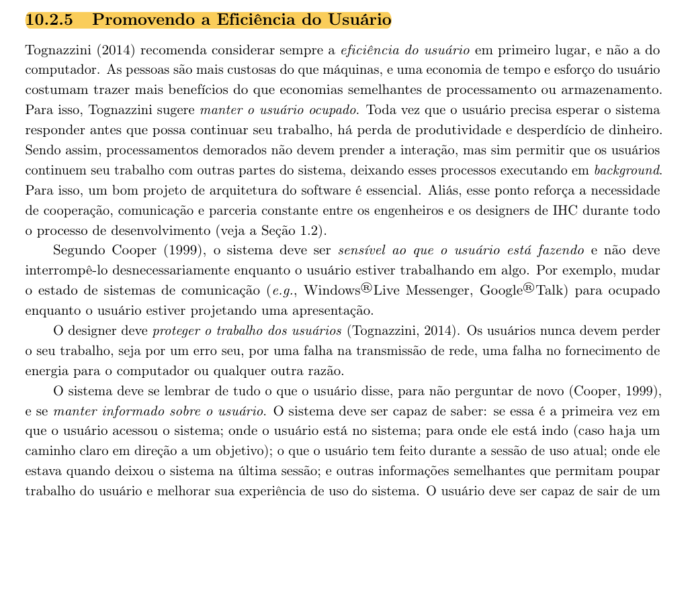
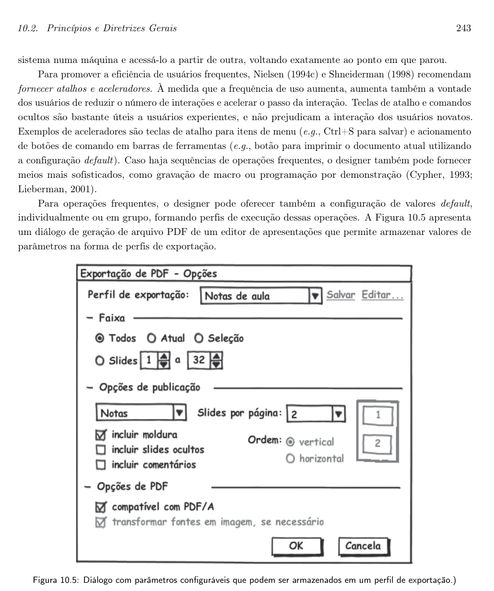

# Promoção da eficiência do usuário

## Histórico de Versão e Contribuição

| Data | Versão | Descrição | Autor(es) | Revisor(es) |
| :---: | :---: | :--- | :--- | :--- |
| 05/10/2026 | 1.0 | Criação do documento de promoção da eficiência do usuário no portal da SEMOB-DF. | [Arthur Mariani](https://github.com/arthur-mariani) | [Carlos Costa](https://github.com/carloshfgit) |

---

## 1. O princípio segundo o livro

Segundo Barbosa et al. (2021), o projeto deve considerar a eficiência do usuário em primeiro lugar. Economizar tempo e esforço das pessoas tende a produzir mais benefícios do que economizar recursos computacionais. Os critérios utilizados nesta análise são:

1. **Priorizar a eficiência do usuário.** O projeto deve procurar reduzir o tempo e o esforço necessários para que o usuário alcance seu objetivo.
2. **Não prender a interação durante processamentos demorados.** Quando possível, o sistema deve permitir que o usuário continue trabalhando em outras partes enquanto o processamento ocorre em segundo plano.
3. **Evitar interrupções desnecessárias.** O sistema deve considerar o que o usuário está fazendo e não interromper sua atividade sem necessidade.
4. **Proteger o trabalho do usuário.** Informações e ações já realizadas não devem ser perdidas por erro do usuário, falha de rede, energia ou outro problema.
5. **Lembrar informações e contexto.** O sistema deve evitar perguntar novamente o que o usuário já informou e deve reconhecer sua posição, objetivo e histórico da sessão.
6. **Oferecer atalhos e aceleradores.** Usuários frequentes devem conseguir reduzir o número de interações necessárias sem prejudicar a interação de usuários novatos.
7. **Oferecer valores padrão e perfis para operações frequentes.** Configurações recorrentes podem ser armazenadas para reduzir o esforço em usos posteriores.

---

## 2. Como a análise foi feita

Esta análise utiliza evidências já registradas no projeto, sem realizar uma nova inspeção externa do portal. Foram examinados:

- o [brainstorming de necessidades e desejos](../brainstorm.md);
- os [resultados de análise do guia de estilo](../guia-de-estilo/resultados-de-analise.md);
- a [TAR-03 - Planejamento de rota por origem e destino](../analise-de-tarefas/tar-03-planejamento-rota.md);
- a [TAR-06 - Consulta de ônibus em tempo real](../analise-de-tarefas/tar-06-df-no-ponto.md);
- o [Cenário 2 - Atraso na viagem matutina](../cenarios/cenario-2-viagem-matutina.md);
- as inspeções de [consistência e padronização](consistencia-e-padronizacao.md) e [visibilidade e reconhecimento](visibilidade-e-reconhecimento.md).

Os fluxos observados foram relacionados aos critérios da seção 10.2.5 do livro: redução de tempo e esforço, continuidade da interação, proteção dos dados, manutenção do contexto, atalhos e valores padrão.

### 2.1 Delimitação da evidência quantitativa

A TAR-03 apresenta uma comparação KLM que estima a redução do fluxo de 17,80 segundos para 9,70 segundos. Entretanto, a TAR-06 registra que os operadores e tempos do KLM apresentados no livro foram definidos para teclado e mouse e, por isso, não realiza uma estimativa para a interação em tela de toque.

Para não tratar uma aplicação metodológica ainda não revisada como comprovação, esta análise utiliza a TAR-03 apenas como evidência qualitativa de redução de etapas. O percentual de 45,5% não é utilizado como resultado quantitativo deste artefato.

---

## 3. Pontos positivos

A tabela 1 apresenta recursos documentados no projeto que podem promover a eficiência do usuário.

**Tabela 1** - Pontos positivos relacionados à eficiência

| # | Observação | Relação com o princípio |
|---|---|---|
| P1 | O portal apresenta uma seção de **Serviços Mais Procurados**. | O conceito funciona como atalho para tarefas frequentes. Sua eficiência, contudo, é prejudicada pelos links quebrados registrados nas inspeções. |
| P2 | O campo de busca permanece visível no cabeçalho. | Reduz o esforço necessário para localizar conteúdos. |
| P3 | O DF no Ponto permite favoritar uma linha. | Evita que o passageiro repita a mesma busca em consultas futuras. |
| P4 | O DF no Ponto permite ativar notificações de atraso ou alteração. | Funciona como acelerador para uma tarefa frequente. |
| P5 | A TAR-03 prevê o uso da localização atual como origem. | Utiliza uma informação disponível para reduzir o preenchimento manual. |

*Fonte: Arthur Mariani, elaborado a partir dos artefatos do projeto.*

---

## 4. Problemas encontrados

A tabela 2 relaciona os problemas documentados no projeto às diretrizes de eficiência apresentadas no capítulo 10.

**Tabela 2** - Síntese dos problemas encontrados

| # | Problema documentado | Diretriz relacionada | Gravidade |
|---|---|---|:---:|
| E1 | A página inicial não prioriza suficientemente as tarefas mais procuradas pelos passageiros. | Eficiência do usuário em primeiro lugar. | **Alta** |
| E2 | A consulta pode exigir que o passageiro conheça ou descubra externamente o código da linha. | Evitar esforço e repetição desnecessários. | **Alta** |
| E3 | O planejamento de rota e o acompanhamento em tempo real estão fragmentados entre telas, portais ou aplicativos. | Lembrar o contexto e o objetivo do usuário. | **Alta** |
| E4 | O passageiro pode ser redirecionado ou incentivado a instalar o DF no Ponto para concluir a tarefa. | Evitar interrupções desnecessárias. | **Alta** |
| E5 | A posição do ônibus pode exigir atualização manual da página. | Reduzir operações repetitivas. | **Média** |
| E6 | O mapa pode demorar para carregar em conexão móvel e interromper a consulta. | Processamentos demorados não devem prender a interação. | **Alta** |
| E7 | Algumas falhas levam o usuário a reiniciar o aplicativo ou apagar o *cache*. | Proteger o trabalho e evitar repetição. | **Alta** |
| E8 | Os redirecionamentos entre instituições não preservam claramente o contexto da tarefa. | Lembrar onde o usuário está e para onde pretende ir. | **Alta** |
| E9 | Informações fornecidas podem precisar ser repetidas após erro ou mudança de sistema. | Lembrar o que o usuário já informou. | **Média** |

*Fonte: Arthur Mariani, elaborado a partir das análises de tarefas, cenários, brainstorming e inspeções do projeto.*

### 4.1 Tarefas frequentes com pouco destaque

O brainstorming registrou que **menos informações na tela inicial** foi a ideia mais votada, com sete votos entre os nove participantes. Rastreamento em tempo real, uso do portal sem baixar o DF no Ponto e busca por destino e linhas próximas receberam seis votos cada.

Apesar disso, a inspeção de visibilidade verificou que consultar linhas e horários aparece no bloco de Acesso Rápido com o mesmo peso visual de serviços menos frequentes. Blocos institucionais e sistemas internos ocupam áreas visualmente mais destacadas.

**Por que é um problema:** o usuário precisa procurar tarefas diárias que deveriam funcionar como atalhos, aumentando o tempo e o esforço de navegação.

### 4.2 Busca dependente do código da linha

A TAR-03 registra que o fluxo atual exige que o passageiro descubra o código da linha, pesquise externamente e navegue por tabelas. Os resultados da análise também indicam que os usuários preferem buscar por origem e destino e nem sempre conhecem o código da linha.

**Por que é um problema:** a tarefa exige conhecimento e operações adicionais que não fazem parte do objetivo do passageiro, que é descobrir como chegar ao destino.

### 4.3 Fragmentação e redirecionamentos

O brainstorming registra o desejo de utilizar o portal sem baixar o DF no Ponto e sem percorrer vários sites. Os participantes também descreveram o portal como um local de redirecionamento para outros sistemas.

**Por que é um problema:** mudar de site ou aplicativo interrompe o fluxo e pode fazer o usuário repetir informações ou perder o ponto em que estava.

### 4.4 Carregamento, atualização e recuperação

A TAR-03 registra carregamento demorado do mapa em 4G, blocos não renderizados e atualização manual da posição do veículo. O brainstorming registra falhas que exigem reinício do aplicativo ou limpeza de *cache*.

**Por que é um problema:** o passageiro fica impedido de continuar uma tarefa crítica e precisa executar procedimentos técnicos que não fazem parte de seu objetivo.

---

## 5. Recomendações

### 5.1 Priorizar tarefas frequentes

A página inicial deve oferecer acesso direto às tarefas mais frequentes documentadas no projeto:

- planejar viagem;
- consultar linhas e horários;
- ver ônibus em tempo real;
- acessar atendimento.

Essa organização transforma a página inicial em um ponto de partida para os objetivos dos passageiros, em vez de exigir que procurem os serviços entre conteúdos institucionais.

### 5.2 Reduzir o esforço de busca

A busca deve permitir:

- origem;
- destino;
- localização atual;
- ponto de referência;
- número ou nome da linha, quando conhecido.

O passageiro não deve ser obrigado a descobrir previamente o código da linha.

### 5.3 Integrar consulta e acompanhamento

Depois de escolher uma rota, o passageiro deve conseguir acessar diretamente:

- posição do ônibus;
- previsão de chegada;
- última atualização;
- alertas relacionados à linha.

Essa integração evita que a busca seja repetida ou que o usuário precise trocar de sistema para acompanhar o veículo.

### 5.4 Facilitar consultas frequentes

Para linhas utilizadas com frequência, devem ser oferecidas as ações já documentadas na TAR-06:

- favoritar a linha;
- ativar notificações de atraso ou alteração.

Essas ações funcionam como aceleradores: reduzem o número de interações nas consultas posteriores sem impedir que usuários novatos realizem a busca completa.

### 5.5 Preservar dados e contexto

Quando ocorrer falha de conexão ou carregamento:

- os dados de origem e destino devem ser preservados;
- a rota selecionada deve continuar identificada;
- o usuário deve poder tentar novamente sem reiniciar a tarefa;
- o sistema não deve exigir novamente informações já fornecidas.

### 5.6 Tratar operações demoradas

Durante o carregamento de mapas ou o cálculo de rotas:

- a interface deve permanecer responsiva;
- o usuário deve receber indicação do processamento;
- as partes disponíveis do sistema não devem ficar bloqueadas;
- deve existir possibilidade de cancelar uma operação demorada quando aplicável.

### 5.7 Reduzir interrupções e redirecionamentos

Quando um serviço externo for necessário, o portal deve informar:

- qual serviço será aberto;
- qual instituição é responsável;
- por que o redirecionamento é necessário.

Sempre que possível, as tarefas devem permanecer disponíveis no navegador, conforme a necessidade registrada no brainstorming.

---

## 6. Rastreabilidade das decisões

**Tabela 3** - Relação entre recomendações, fundamentos e evidências

| Decisão | Fundamento do capítulo 10 | Evidência do projeto |
|---|---|---|
| Tarefas frequentes na página inicial | Atalhos e aceleradores | Brainstorming e inspeção de visibilidade |
| Busca por origem e destino | Redução de tempo e esforço | TAR-03 e resultados da análise |
| Uso da localização atual | Valores padrão | TAR-03 |
| Favoritar linhas | Atalhos para usuários frequentes | TAR-06 |
| Notificações | Aceleração de operações frequentes | TAR-06 |
| Preservação dos campos | Proteção do trabalho do usuário | Resultados da análise |
| Integração entre rota e rastreamento | Manutenção do contexto | TAR-03 |
| Interface disponível durante carregamentos | Processamentos não devem prender a interação | TAR-03 |
| Redirecionamentos contextualizados | Evitar interrupções desnecessárias | Brainstorming e inspeções |

*Fonte: Arthur Mariani, elaborado a partir dos artefatos do projeto e de Barbosa et al. (2021).*

---

## 7. Conclusão

O portal apresenta recursos que podem promover eficiência, como busca visível, atalhos de serviços, linhas favoritas e notificações. Entretanto, a eficiência é reduzida pela fragmentação entre sistemas, pela necessidade de conhecer códigos de linha, pelos redirecionamentos, por carregamentos lentos, pela atualização manual e pela recuperação técnica de falhas.

A principal recomendação é organizar a interação em torno das tarefas frequentes dos passageiros, preservando dados e contexto e reduzindo operações repetitivas. Dessa forma, o portal pode economizar tempo e esforço das pessoas, conforme o princípio apresentado por Barbosa et al. (2021).

---

## 8. Declaração sobre o Uso de IA Generativa

Em cumprimento às normas de conduta acadêmica da SBC e ao Plano de Ensino da disciplina, declara-se que a Gemini, uma ferramenta de Inteligência Artificial Generativa, foi empregado para auxílio na estruturação textual, refinamento de clareza formal e formatação Markdown do presente documento. Toda a fundamentação teórica, o levantamento empírico de dados, as tomadas de decisão e as análises críticas permaneceram sob responsabilidade exclusiva dos integrantes da equipe.

---

## Fotos de Referência

{ width="700" }

*Imagem 1 - Início da seção 10.2.5. Fonte: Barbosa et al. (2021), p. 242.*

{ width="700" }

*Imagem 2 - Continuação da seção 10.2.5. Fonte: Barbosa et al. (2021), p. 243.*

## Referências Bibliográficas

- BARBOSA, S. D. J.; SILVA, B. S. da; SILVEIRA, M. S.; GASPARINI, I.; DARIN, T.; BARBOSA, G. D. J. *Interação Humano-Computador e Experiência do Usuário*. Autopublicação, 2021. Cap. 10, Seção 10.2.5, p. 242-243.
