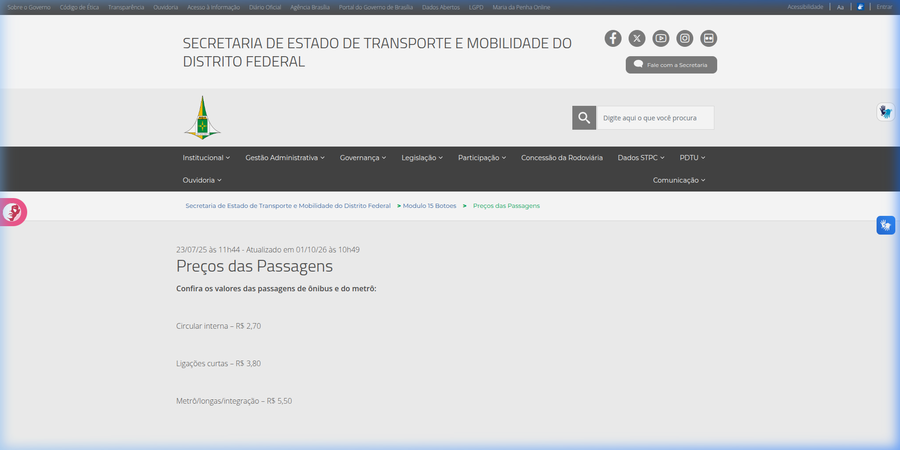
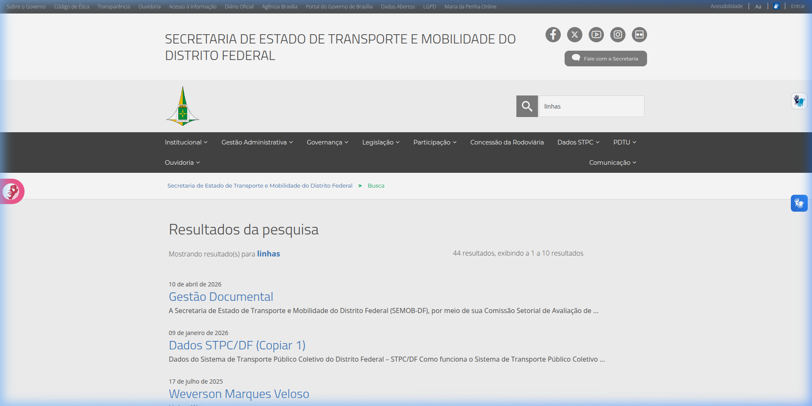
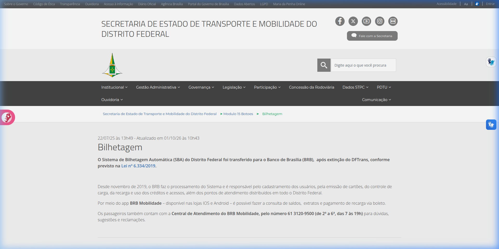
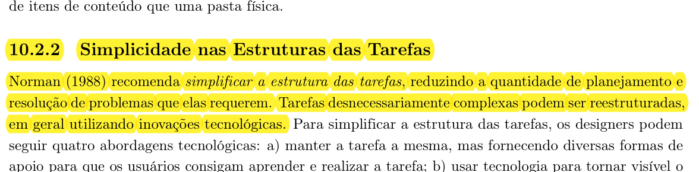
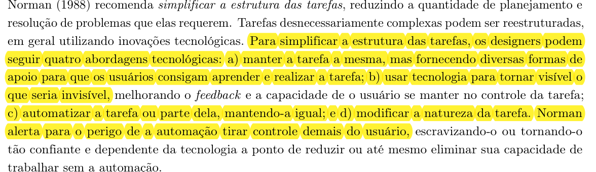

## Histórico de Versão e Contribuição

| Data | Versão | Descrição | Autor(es) | Revisor(es) |
| :---: | :---: | :--- | :--- | :--- |
| 05/10/2026 | 1.0 | Criação do documento de análise de simplicidade nas estruturas das tarefas no site da **SEMOB-DF**. | [Carlos Costa](https://github.com/carloshfgit) | [Lucas Araújo](https://github.com/Lucasaraujoszz) |

---

# Simplicidade nas Estruturas das Tarefas no site da SEMOB-DF

**Site analisado:** <https://www.semob.df.gov.br/> (Secretaria de Estado de Transporte e Mobilidade do Distrito Federal)

**Princípio:** 10.2.2 Simplicidade nas Estruturas das Tarefas

**Referência:** Barbosa, S. D. J. et al. (2021). *Interação Humano-Computador e Experiência do Usuário*, Cap. 10: Princípios e Diretrizes para o Design de IHC, p. 239.

**Data da inspeção:** 05/10/2026, em navegador desktop (Google Chrome)

**Autor do artefato:** [Carlos Costa](https://github.com/carloshfgit)

---

## 1. O princípio segundo o livro

O capítulo 10 reúne as recomendações consagradas do design de interação, apoiando-se fortemente nos preceitos de Norman (1988) sobre a psicologia cotidiana da interação humano-computador, cujas referências teóricas estão evidenciadas nas Imagens 01 e 02 ao final deste documento.

Norman (1988) preconiza que os designers devem **simplificar a estrutura das tarefas**, reduzindo a quantidade de planejamento prévio e de resolução de problemas que elas impõem ao usuário. Os seres humanos possuem limitações biológicas estritas em relação à memória de trabalho (memória de curto prazo), sendo capazes de reter apenas uma quantidade reduzida de itens simultâneos. Quando um sistema exige que o cidadão memorize rotas, códigos, tarifas ou instruções entre telas consecutivas, a sobrecarga cognitiva compromete a usabilidade e induz o usuário ao erro.

Para simplificar tarefas desnecessariamente complexas, o livro-texto apresenta quatro abordagens tecnológicas propostas por Norman:

1. **Manter a tarefa a mesma, mas fornecer apoios mentais:** Oferecer subsídios para que os usuários consigam aprender e realizar a tarefa com facilidade (e.g., instruções contextuais, assistentes passo a passo, preenchimento assistido e diagramação clara).
2. **Usar tecnologia para tornar visível o que seria invisível:** Exibir graficamente informações ocultas, melhorando substancialmente o feedback e a sensação de controle do usuário (e.g., simulação de itinerários sobre mapas, tempo de espera estimado e cálculos consolidados de integração tarifária).
3. **Automatizar a tarefa ou parte dela, mantendo-a igual:** Reduzir o esforço mecânico por meio de automações inteligentes, calculando rotas ou preenchendo parâmetros repetitivos sem demandar esforço manual.
4. **Modificar a natureza da tarefa:** Transformar uma sequência intrincada e burocrática em uma atividade direta e intuitiva.

Entretanto, Norman (1988) faz um alerta crucial: **a automação não pode subtrair controle excessivo do usuário**, sob pena de torná-lo dependente e alienado do processo, incapaz de intervir diante de exceções ou imprevistos.

---

## 2. Como a inspeção foi feita

A avaliação foi conduzida sob a ótica de inspeção de usabilidade e ergonomia no portal da SEMOB-DF, simulando cenários e tarefas habituais enfrentadas pelo cidadão usuário do transporte público coletivo:

- Realização de busca global no cabeçalho visando localizar itinerários de linhas de ônibus;
- Navegação rumo à tabela tarifária oficial do sistema de transporte;
- Tentativa de consulta e obtenção de informações sobre emissão de cartões e pontos de recarga;
- Verificação do fluxo de acesso às informações de horários e itinerários por meio do atalho de integração com o serviço *DF no Ponto*;
- Inspeção de quebras de navegação originadas por endereços inconsistentes de links na página principal.

Escala de gravidade adotada para classificação dos problemas:
- **Alta:** Impede a conclusão da tarefa ou impõe barreiras cognitivas severas ao usuário;
- **Média:** Confunde, dispersa a atenção ou desacelera expressivamente o fluxo da atividade;
- **Baixa:** Inconveniência pontual de baixa interferência no desfecho da tarefa.

---

## 3. Pontos positivos

A Tabela 01 sintetiza os pontos positivos identificados durante a inspeção do portal quanto à simplicidade na estrutura das tarefas.

**Tabela 01** - Pontos positivos identificados

| # | Observação | Relação com o princípio |
|---|---|---|
| P1 | A página de preços das passagens apresenta os valores das tarifas (circular interna, ligações curtas e linhas de integração) diretamente no corpo do texto de forma clara. | Torna a informação primária acessível de pronto, evitando cálculos mentais ou leitura prévia de decretos tarifários. |
| P2 | A página inicial disponibiliza um bloco de cartões sob o título "Serviços Mais Procurados" com atalhos para tarifas, cartões, pontos de parada e ouvidoria. | Reduz a profundidade do caminho percorrido (*clicks-to-content*), dispensando a navegação exaustiva por submenus complexos. |
| P3 | A página de contatos da Secretaria reúne os telefones dos principais canais em blocos destacados (Central BRB Mobilidade, Ouvidoria 162 e Atendimento 156). | Fornece apoio mental por meio de síntese dos canais de apoio sem espalhar contatos em textos extensos. |

A seguir, a Imagem 03 ilustra a apresentação direta dos valores tarifários na página interna de preços das passagens.

*Imagem 03: Exibição direta e sem burocracia dos valores de passagens no portal da SEMOB-DF.*

---

## 4. Problemas encontrados

### Resumo

A Tabela 02 apresenta o resumo das falhas e barreiras de simplicidade estrutural encontradas na interação com o site da SEMOB-DF:

**Tabela 02** - Síntese dos problemas encontrados

| # | Problema | Diretriz violada (Norman / Cap. 10) | Gravidade |
|---|---|---|---|
| ST1 | A busca pelo termo essencial "linhas" retorna documentos arquivísticos e cópias de tabelas burocráticas | Reduzir resolução de problemas e sobrecarga de busca | **Alta** |
| ST2 | Informações sobre cartões e recarga não possuem fluxo guiado e direcionam o cidadão para o app do BRB | Fornecer apoios mentais e simplificar tarefas | **Alta** |
| ST3 | A consulta de linhas e horários expulsa o usuário para uma aplicação externa desvinculada | Manter coerência e apoio contínuo na realização da tarefa | **Média** |
| ST4 | Links na página inicial apontam para domínio inexistente e quebram no meio do fluxo | Não interromper a tarefa com barreiras técnicas incontornáveis | **Alta** |

---

### ST1. A busca por "linhas" sobrecarrega a busca e retorna dados burocráticos (Gravidade Alta)

Ao utilizar o campo de busca no cabeçalho do portal digitando o termo `"linhas"`, o cidadão esperaria encontrar imediatamente um mecanismo de pesquisa rápida de itinerários de ônibus do DF. No entanto, o motor de busca do portal retorna 44 resultados genéricos, trazendo como primeiras posições documentos como *"Gestão Documental"* e *"Dados STPC/DF (Copiar 1)"*, conforme retratado na Imagem 04.

*Imagem 04: Resultados da busca pelo termo "linhas" trazendo nomes de arquivos internos e atas administrativas.*

**Por que é um problema:** Norman (1988) enfatiza que os sistemas devem minimizar a quantidade de resolução de problemas demandada ao usuário. Ao apresentar dezenas de itens administrativos desprovidos de hierarquização semântica, o portal transfere para o usuário todo o custo cognitivo de inspecionar título por título para verificar se algum contém a informação de seu trajeto.

**Recomendação:** Implementar um mecanismo de busca preditiva que reconheça intenções típicas do usuário (como número da linha, região administrativa ou itinerário) e exiba um cartão de destaque com consulta instantânea da linha antes dos resultados genéricos do repositório de documentos.

---

### ST2. Falta de fluxo estruturado para obtenção de cartões e recarga (Gravidade Alta)

Ao clicar no cartão *"Cartões Mobilidade / Pontos de Recarga"*, o usuário é direcionado para a página de *"Bilhetagem"*, exibida na Imagem 05. A página consiste em um texto expositivo breve citando a Lei Distrital nº 6.334/2019 e transferindo formalmente toda a atribuição ao Banco de Brasília (BRB), recomendando o download do aplicativo móvel ou o contato telefônico.

*Imagem 05: Página de Bilhetagem com texto puramente expositivo e ausência de ferramentas de apoio à tarefa.*

**Por que é um problema:** A tarefa básica do usuário nesta seção é: *"Onde posso recarregar meu cartão físico agora?"* ou *"Quais documentos preciso apresentar para emitir a 1ª via do Passe Livre?"*. O site não fornece nenhum dos apoios mentais descritos por Norman: não há mapa ou listagem filtrável de postos de recarga presenciais, não há simulador de elegibilidade para gratuidades nem um passo a passo do procedimento de emissão. A tarefa é fragmentada e empurrada para canais externos.

**Recomendação:** Reestruturar a página de bilhetagem em abas guiadas por tipo de necessidade:
1. *Onde Recarregar:* mapa interativo e lista de pontos físicos de recarga com endereço e horário de funcionamento;
2. *Como Solicitar Meu Cartão:* assistente passo a passo (*wizard*) especificando requisitos, documentos e link direto para cadastro online.

---

### ST3. Ruptura de contexto na consulta de itinerários no DF no Ponto (Gravidade Média)

Ao tentar consultar linhas e horários a partir do portal, o usuário é transferido para o domínio externo do aplicativo *DF no Ponto* (`dfnoponto.semob.df.gov.br`). Apesar do aplicativo oferecer recursos de busca e visualização geográfica, essa transferência ocorre de modo abrupto, quebrando o modelo mental da navegação no portal da Secretaria.

**Por que é um problema:** O princípio de simplicidade na tarefa dita que a tecnologia deve atuar agregando valor de modo fluido. Quando o cidadão precisa transitar entre interfaces com arquiteturas de informação completamente distintas para saber o horário de um ônibus e os valores de integração, ele é forçado a reaprender padrões de interação e perde o suporte unificado da tarefa de planejar sua viagem.

**Recomendação:** Embutir um componente (*widget*) de consulta expressa de linhas e previsão de horários diretamente na página inicial da SEMOB-DF, mantendo o usuário imerso no mesmo ambiente para tarefas rápidas e reservando o redirecionamento detalhado como opção secundária.

---

### ST4. Interrupção involuntária de tarefas por falha de DNS (Gravidade Alta)

Na página inicial, diversos links essenciais dos cartões de serviços (como *Pontos de Parada* e *Terminais de Ônibus*) utilizam URLs absolutas direcionadas a `semob.df.gov.br` (sem o prefixo `www`). Como esse domínio não resolve via DNS, o navegador aborta o carregamento com a mensagem de erro `ERR_NAME_NOT_RESOLVED`.

**Por que é um problema:** O usuário inicia uma tarefa simples e tem o processo completamente rompido por falha de infraestrutura. Não há caminho alternativo fornecido pela aplicação, forçando o cidadão a abandonar a tarefa ou tentar adivinhar a correção da URL na barra de endereços do navegador.

**Recomendação:** Corrigir todas as URLs no CMS para links relativos (e.g., `/pontos-de-parada`) e configurar o redirecionamento no servidor DNS para que requisições ao domínio raiz sejam automaticamente direcionadas ao subdomínio canônico `www`.

---

## 5. Síntese das recomendações

1. **Assistente de Busca de Linhas:** Adicionar preenchimento automático inteligente com filtro por número da linha e nome de itinerário na busca principal.
2. **Guias Práticos e Passo a Passo:** Transformar páginas estáticas de benefícios e cartões em fluxos com etapas bem definidas (documentos, formulário e pontos de atendimento).
3. **Mapeamento de Postos de Recarga:** Integrar mapa interativo dos pontos de recarga com geolocalização e filtros por Região Administrativa.
4. **Saneamento Imediato de URLs:** Garantir integridade de todos os links dos blocos de acesso rápido da página inicial.

---

## 6. Conclusão

O portal da SEMOB-DF apresenta algumas iniciativas louváveis para encurtar caminhos de tarefas básicas, como o agrupamento de atalhos na página inicial e a clareza dos preços das passagens. Contudo, em tarefas que demandam resolução ativa (como encontrar uma linha de ônibus adequada, planejar uma rota integrada ou obter orientações para emissão de benefícios de transporte), o portal falha por falta de estruturação e apoios mentais. As tarefas tornam-se árduas, obrigando o cidadão a navegar por resultados de busca não pertinentes ou a lidar com links quebrados. A aplicação das recomendações de Norman para simplificação de tarefas trará ganhos expressivos de eficiência e satisfação ao público usuário.

---

## Declaração sobre o Uso de IA Generativa

Em conformidade com o Código de Conduta da Sociedade Brasileira de Computação (SBC) e as diretrizes do Plano de Ensino da disciplina, declara-se que o assistente de inteligência artificial generativa *Gemini* foi utilizado como apoio na organização e revisão estilística do documento em Markdown. Todas as inspeções analíticas no portal da SEMOB-DF, a classificação de problemas e a emissão de recomendações técnicas foram fundamentadas na teoria de IHC sob responsabilidade dos autores.

---

## Referências Bibliográficas

- BARBOSA, S. D. J.; SILVA, B. S. da; SILVEIRA, M. S.; GASPARINI, I.; DARIN, T.; BARBOSA, G. D. J. *Interação Humano-Computador e Experiência do Usuário*. Autopublicação, 2021. Cap. 10: Princípios e Diretrizes para o Design de IHC, p. 239.
- NORMAN, Donald A. *The Design of Everyday Things*. Nova York: Basic Books, 1988.
- SALES, André Barros de. *Plano de Ensino: Interação Humano Computador*. Faculdade UnB Gama, Universidade de Brasília, 2026.

---

## Imagens de Referências

Abaixo encontram-se os recortes comprobatórios extraídos diretamente da obra de referência da disciplina (Barbosa et al., 2021, p. 239):

*Imagem 01: Trecho do livro-texto destacando a definição de Simplicidade nas Estruturas das Tarefas segundo Norman (1988).*

*Imagem 02: Trecho do livro-texto detalhando as quatro abordagens tecnológicas para simplificar tarefas e o alerta sobre os perigos da automação excessiva.*
