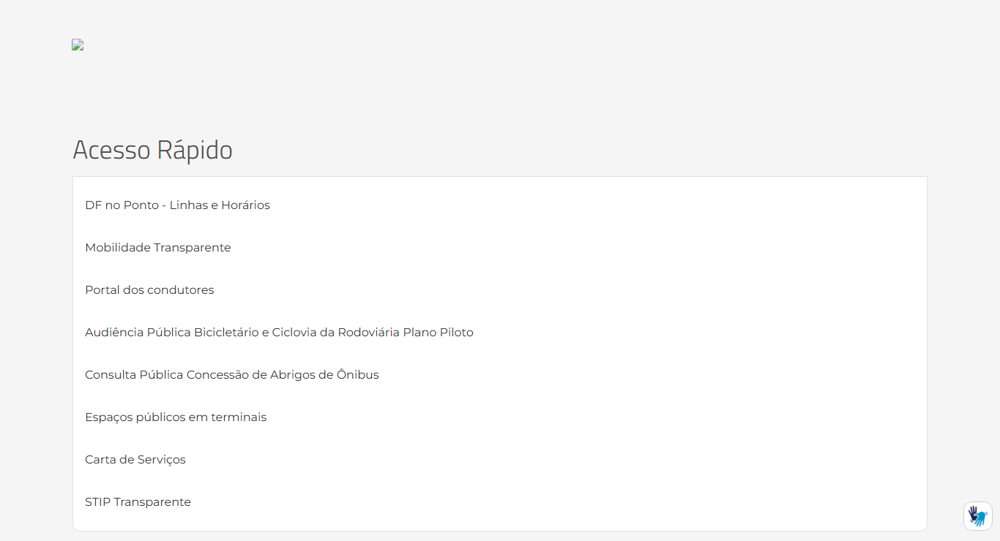
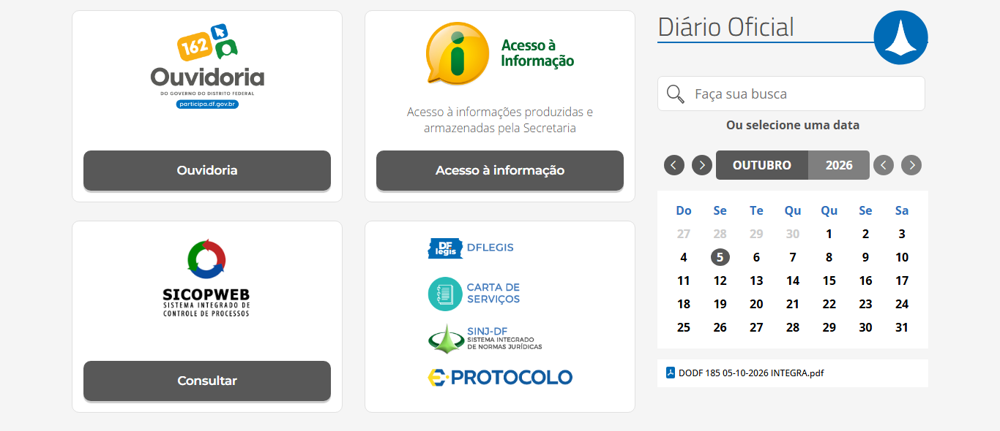
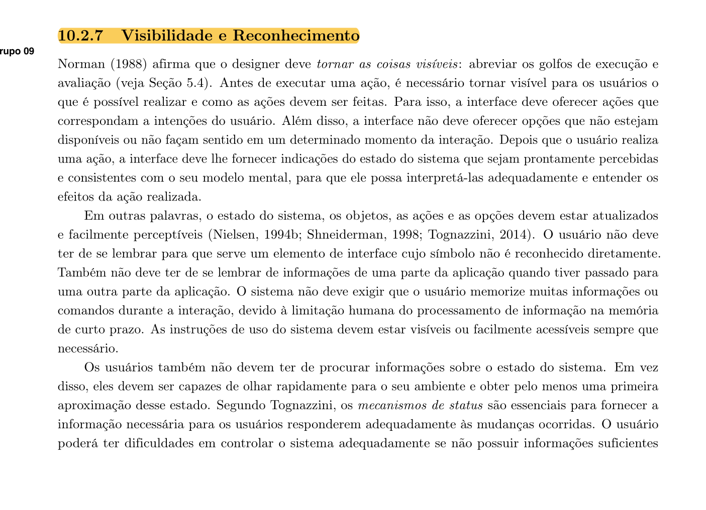
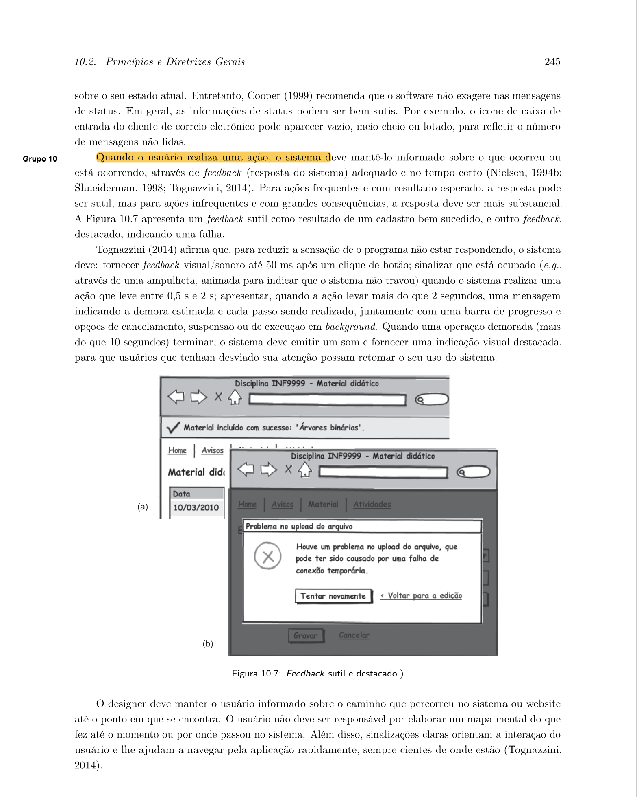

# Visibilidade e Reconhecimento

## Histórico de Versão e Contribuição

| Data | Versão | Descrição | Autor(es) | Revisor(es) |
| :---: | :---: | :--- | :--- | :--- |
| 05/10/2026 | 1.0 |Análise de visibilidade e reconhecimento no site do **SEMOB-DF**. | [Gabriel Melo](https://github.com/gabriellcardone-06) | [Igor Dantas](https://github.com/IgorDARAUJO) |

## 1.Introdução

As ideias usadas como critério nesta análise são:

1. **Tornar as coisas visíveis e reduzir os golfos de execução e de avaliação**. Antes da ação, o usuário precisa ver **o que é possível fazer e como**. Depois da ação, precisa ver **o estado do sistema**, de forma consistente com o seu modelo mental.
2. **Não oferecer opções indisponíveis ou sem sentido** no momento da interação.
3. **Reconhecer em vez de lembrar.** O usuário não deve ter de se lembrar para que serve um elemento de interface cujo símbolo não é reconhecido diretamente, nem guardar informações de uma parte do sistema para usar em outra. O motivo é o limite da memória de curto prazo.
4. **Instruções visíveis** ou facilmente acessíveis sempre que necessário.
5. **Estado do sistema perceptível num relance**, sem que o usuário precise procurá-lo. Segundo Cooper, a indicação de status pode ser sutil, como o ícone da caixa de entrada que aparece vazio, meio cheio ou lotado.
6. **Feedback adequado e no tempo certo.** Pode ser sutil para ações frequentes e deve ser destacado para ações raras ou de grande consequência.
7. **Mostrar o caminho percorrido.** O usuário não deve ser responsável por elaborar um mapa mental do que fez até o momento. Sinalizações claras orientam a navegação para que o usuário saiba sempre onde está.

---

## 2. Como a inspeção foi feita

- Inspeção da página inicial e das páginas internas *Preços das Passagens* e *Ouvidoria*.
- Capturas de tela da página inteira.
- Teste de acesso aos links que apontam para `semob.df.gov.br`, sem "www".

Escala de gravidade usada: **Alta** (impede ou atrapalha muito a tarefa), **Média** (confunde ou atrasa) e **Baixa** (problema cosmético).

---

## 3. Pontos positivos

| # | Observação | Relação com o princípio |
|---|---|---|
| P1 | O campo de busca fica sempre visível no cabeçalho, com a instrução "Digite aqui o que você procura" (imagem 01). | Instruções visíveis; o usuário vê como agir. |
| P2 | Os cartões de *Serviços Mais Procurados* combinam **ícone e rótulo em texto** (imagem 03). | Reconhecimento em vez de memorização: o ícone não precisa ser decifrado sozinho. |
| P3 | No menu principal, a seta `⌄` mostra quais itens têm submenu (imagem 01). | Torna visível o que é possível fazer antes da ação. |
| P4 | As páginas internas mostram uma trilha de navegação (*breadcrumb*) abaixo do menu (imagens 08 e 09). | Mostra onde o usuário está. |
| P5 | Cada página informa a data de publicação e a da última atualização, por exemplo "23/07/25 às 11h44 – Atualizado em 01/10/26 às 10h49". | Estado da informação perceptível: o usuário sabe se o conteúdo é atual. |
| P6 | O calendário do Diário Oficial destaca o dia atual e mostra o link da edição do dia ("DODF 185 05-10-2026 INTEGRA.pdf"), conforme a imagem 06. | Status sutil e perceptível num relance, no espírito do exemplo da caixa de entrada de Cooper. |
| P7 | Os recursos de acessibilidade ficam sempre visíveis: tamanho da fonte (Aa), alto contraste, VLibras e o link "Pular para o conteúdo principal". | Recursos disponíveis à vista, sem precisar ser lembrados. |
| P8 | Na página da Ouvidoria, o menu lateral lista todas as opções da seção (imagem 09). | O usuário vê o conjunto de ações possíveis naquele contexto. |

*Imagem 01: busca visível com instrução, setas indicando submenus e controles de acessibilidade na barra superior.*

---

## 4. Problemas encontrados

### Resumo

| # | Problema | Diretriz violada (Cap. 10) | Gravidade |
|---|---|---|---|
| V1 | Conteúdo invisível ou quebrado na página inicial (banner e seção PPP) | Tornar as coisas visíveis (Norman) | **Alta** |
| V2 | Links que falham sem nenhum feedback do site | Feedback adequado; golfo de avaliação | **Alta** |
| V3 | Siglas sem explicação que exigem memorização (STPC, PDTU, CTPC, STIP...) | Reconhecer em vez de lembrar | **Alta** |
| V4 | Logotipos e rótulos genéricos que não dizem o que fazem ("Consultar", "Clique aqui", DFLEGIS) | Tornar visível o que é possível e como (golfo de execução) | **Média** |
| V5 | O efeito do clique não é visível (nova aba, outro site, download de arquivo) | Tornar visível o resultado da ação | **Média** |
| V6 | Falhas na sinalização de "onde estou" (trilha com "Modulo 15 Botoes", menu sem item ativo) | Manter o usuário informado sobre o caminho (Tognazzini) | **Média** |
| V7 | Opção "Entrar" visível para todos, embora só sirva para a equipe interna | Não oferecer opções sem sentido para o usuário | **Baixa** |
| V8 | Os serviços mais usados pelo cidadão têm pouco destaque visual | Tornar visível o que corresponde às intenções do usuário | **Média** |

---

### V1. Conteúdo invisível ou quebrado na página inicial (gravidade alta)

1. **Banner principal quebrado.** O primeiro elemento abaixo do menu deveria ser um carrossel de banners. Ele aparece como um **ícone de imagem quebrada** no canto, sobre uma faixa vazia de cerca de 150 px (imagem 02). As imagens do banner estão hospedadas em `semob.df.gov.br`, sem "www", endereço que não existe no DNS.
2. **Seção "Parceria Público Privada – PPP" praticamente invisível.** O título e os seis botões (*Avenida das Cidades, VLT via W3, Projeto Zona Verde, Metrô – DF, Concessão do BRT Sul e Oeste, Concessão da Rodoviária do Plano Piloto*) são **brancos sobre fundo cinza-claro** (imagem 04). O fundo deveria ser uma imagem escura, que não carrega pelo mesmo motivo. Como não há cor de reserva, o texto fica quase ilegível.

**Por que é um problema:** é o caso mais básico de falta de visibilidade. Se o usuário não vê a opção, não sabe que ela existe, e o golfo de execução nem chega a ser percorrido. Na seção PPP, seis projetos importantes da Secretaria ficam escondidos.

**Recomendação:** corrigir os endereços das imagens (ver C3 no documento de Consistência). Definir também uma **cor de fundo de reserva** (`background-color`) escura para seções com texto branco sobre imagem, para que o texto continue legível se a imagem falhar.

*Imagem 02: no topo, ícone de imagem quebrada no lugar do banner. Abaixo, o "Acesso Rápido" em forma de lista simples.*

*Imagem 04: título e botões brancos sobre fundo cinza-claro, praticamente ilegíveis.*

---

### V2. Links que falham sem nenhum feedback do site (gravidade alta)

Ao clicar em 10 dos 12 cartões de *Serviços Mais Procurados* (por exemplo, *Preços das Passagens*) ou em qualquer botão da seção *LAI*, abre-se uma **nova aba** com a tela de erro do navegador ("Não é possível acessar esse site", `ERR_NAME_NOT_RESOLVED`). Nessa tela:

- não há nenhuma mensagem da SEMOB explicando o que houve;
- não há caminho para voltar, porque a aba é nova e o botão "Voltar" fica desativado;
- não há indicação de que o mesmo conteúdo existe e funciona pelo menu.

**Por que é um problema:** o livro pede que, depois de uma ação, o sistema forneça *"indicações do estado do sistema que sejam prontamente percebidas e consistentes com o seu modelo mental"*. A tela de erro do navegador faz o contrário: o usuário conclui que **o site da SEMOB está fora do ar**, o que não é verdade. O golfo de avaliação fica máximo, porque o usuário não consegue interpretar o efeito da própria ação.

**Recomendação:** corrigir os links. Como prevenção, configurar o redirecionamento de `semob.df.gov.br` para `www.semob.df.gov.br` e criar uma **página de erro própria** (404), com busca e links para as seções principais.

---

### V3. Siglas sem explicação que exigem memorização (gravidade alta)

O site usa muitas siglas sem expansão nem dica (*tooltip*), inclusive no **primeiro nível do menu principal**:

| Sigla | Onde aparece | Significado (não informado no ponto de uso) |
|---|---|---|
| **STPC** | Menu principal "Dados STPC" | Sistema de Transporte Público Coletivo |
| **PDTU** | Menu principal "PDTU" | Plano Diretor de Transporte Urbano |
| **PPA / PDTI** | Menu Governança | Plano Plurianual / Plano Diretor de Tecnologia da Informação |
| **CTPC** | Menu Participação ("Resoluções – CTPC", "Atas - CTPC") | Conselho de Transporte Público Coletivo |
| **STIP** | Acesso Rápido ("STIP Transparente") | Serviço de Transporte Individual Privado (aplicativos) |
| **JARI** | Menu Ouvidoria ("Processos da Jari") | Junta Administrativa de Recursos de Infrações |
| **LAI / SIC** | Menu, título de seção e botões | Lei de Acesso à Informação / Serviço de Informação ao Cidadão |
| **PPP, BRT, VLT** | Seção PPP | Parceria Público-Privada, Bus Rapid Transit, Veículo Leve sobre Trilhos |
| **SICOPWEB, DFLEGIS, SINJ-DF** | Bloco de sistemas (imagem 06) | Nomes de sistemas do GDF |

A sigla **STIP** é um caso ilustrativo. Ela só é explicada no cartão "Serviço de Transporte Individual Privado de Passageiros por Aplicativos – STIP/DF". O link "STIP Transparente", no *Acesso Rápido*, fica em outra parte da página e não traz a explicação. O usuário precisa **lembrar** de um bloco para entender o outro.

**Por que é um problema:** o livro afirma que o usuário *"não deve ter de se lembrar para que serve um elemento de interface cujo símbolo não é reconhecido diretamente"*, nem *"se lembrar de informações de uma parte da aplicação quando tiver passado para uma outra parte"*. Para o cidadão comum, o público principal de um site de transporte, essas siglas são jargão administrativo. Ele precisa de memória prévia para reconhecer o que cada item oferece.

**Recomendação:** usar o **nome por extenso** nos menus e deixar a sigla entre parênteses, por exemplo "Plano Diretor de Transporte Urbano (PDTU)". Quando não houver espaço, usar o elemento `<abbr title="...">`, que mostra o significado ao passar o mouse e é lido por leitores de tela.

---

### V4. Logotipos e rótulos genéricos que não dizem o que fazem (gravidade média)

- **Logotipos como links sem rótulo de ação.** O bloco com *DFLEGIS*, *Carta de Serviços*, *SINJ-DF* e *e-Protocolo* (imagem 06) mostra apenas marcas. Nada diz o que cada uma faz, por exemplo "pesquisar leis do DF" ou "abrir um protocolo". As imagens também têm texto alternativo vazio (`alt=""`), então um leitor de tela não anuncia nada.
- **Botão "Consultar"** abaixo do logotipo SICOPWEB: consultar o quê? Só quem já conhece o sistema sabe que se trata de consultar processos.
- **"Clique aqui e confira!"** e **"clique aqui"** na página da Ouvidoria (imagem 09): o texto do link não informa o destino.
- **Ícones de redes sociais sem rótulo** no cabeçalho (imagem 01). São convencionais e reconhecíveis, mas o ícone do Flickr (dois pontos) é pouco conhecido.

**Por que é um problema:** Norman diz que, antes da ação, é preciso *"tornar visível para os usuários o que é possível realizar e como as ações devem ser feitas"*, com ações que *"correspondam a intenções do usuário"*. Um logotipo de sistema não corresponde a uma intenção ("quero acompanhar meu processo"), mas ao nome interno de uma ferramenta.

**Recomendação:** acompanhar cada logotipo de uma frase de ação, como "Acompanhe seu processo (SICOPWEB)" ou "Pesquise leis e normas do DF (SINJ-DF)". Trocar "clique aqui" por textos que descrevam o destino, como "Conheça as melhorias do Participa DF".

*Imagem 06: botão "Consultar" sem objeto; logotipos DFLEGIS, SINJ-DF e e-Protocolo sem dizer o que fazem. À direita, o calendário do DODF com o dia atual destacado (ponto positivo P6).*

---

### V5. O efeito do clique não é visível (gravidade média)

Antes de clicar, o usuário não tem como prever o que vai acontecer:

| Efeito | Exemplos | Indicação visual |
|---|---|---|
| Abre em **nova aba** | Todos os cartões de *Serviços Mais Procurados* e de *Acesso Rápido*, inclusive páginas internas | nenhuma |
| **Sai do site** da SEMOB | *DF no Ponto*, *Portal dos condutores*, *Mobilidade Transparente*, *Concessão da Rodoviária*, *Site PDTU*, *Regimento Interno* (SINJ) | nenhuma |
| **Abre um arquivo** em vez de uma página | *Organograma*, *Mapa Estratégico*, *Cronograma Reuniões -CTPC*, *Código de Conduta*, *Código de Ética*, *Plano de Fiscalização* | nenhuma; os arquivos ficam misturados às páginas nos submenus |

**Por que é um problema:** o livro pede que o resultado das ações seja visível. Um clique que abre um arquivo grande, sai do site ou cria uma aba sem aviso surpreende o usuário e dificulta a avaliação do que aconteceu. Isso pesa mais em celulares e para usuários de leitores de tela.

**Recomendação:** usar **ícones padronizados** para link externo (↗), nova aba e tipo de arquivo, com o formato e o tamanho junto ao rótulo, por exemplo "Organograma (PDF, 300 KB)".

---

### V6. Falhas na sinalização de "onde estou" (gravidade média)

A trilha de navegação existe (ponto positivo P4), mas falha no conteúdo:

1. **Nome interno do sistema na trilha.** Na página *Preços das Passagens*, a trilha mostra **"Secretaria de Estado... > Modulo 15 Botoes > Preços das Passagens"** (imagem 08). "Modulo 15 Botoes" é o nome de uma pasta interna do gerenciador de conteúdo. O nome não significa nada para o cidadão e não corresponde ao caminho que ele fez (página inicial → *Serviços Mais Procurados*).
2. **O menu principal não marca a seção atual.** Na página da Ouvidoria, o item "Ouvidoria" do menu tem a mesma aparência dos demais (imagem 09).
3. **O menu lateral não marca a página atual.** Na mesma página, nenhum item do menu lateral está destacado. O usuário não sabe qual das 13 opções está vendo.
4. **Nomes diferentes para a mesma página:** "Sobre a Ouvidoria" na trilha, "Ouvidoria" no título e "A Ouvidoria da SEMOB" no menu lateral. O usuário não consegue confirmar, num relance, que está onde queria.

**Por que é um problema:** segundo Tognazzini, citado no livro, *"o usuário não deve ser responsável por elaborar um mapa mental do que fez até o momento ou por onde passou no sistema"*, e *"sinalizações claras orientam a interação do usuário e lhe ajudam a navegar pela aplicação rapidamente, sempre cientes de onde estão"*.

**Recomendação:** renomear a pasta "Modulo 15 Botoes" para um nome voltado ao cidadão, como "Serviços". Destacar com cor ou negrito o item ativo no menu principal e no menu lateral. Usar o mesmo nome da página na trilha, no título e no menu.

*Imagem 08: a trilha de navegação exibe "Modulo 15 Botoes", nome interno do gerenciador de conteúdo.*

*Imagem 09: nenhum item do menu principal ou do menu lateral está destacado como atual. Trilha, título e menu lateral usam três nomes diferentes. No texto, links do tipo "clique aqui".*

---

### V7. Opção "Entrar" visível para todos (gravidade baixa)

O link **"Entrar"** aparece na barra superior (imagem 01) e abre um formulário de login com e-mail e senha. Esse acesso serve só aos servidores que editam o conteúdo do portal. O cidadão não tem conta no site e não precisa dela para nenhum serviço oferecido ali.

**Por que é um problema:** o livro recomenda que a interface *"não deve oferecer opções que não estejam disponíveis ou não façam sentido em um determinado momento da interação"*. Para o cidadão, "Entrar" sugere a existência de uma área pessoal, por exemplo para consultar o cartão de transporte, que não existe.

**Recomendação:** retirar o link da interface pública e manter o acesso administrativo por um endereço próprio, como `/login`. Se o link precisar ficar, renomeá-lo para "Acesso restrito (servidores)".

---

### V8. Os serviços mais usados pelo cidadão têm pouco destaque visual (gravidade média)

O serviço que mais corresponde às intenções do público de um site de transporte, **consultar linhas e horários** ("DF no Ponto – Linhas e Horários"), aparece como **o primeiro item de uma lista de texto sem destaque** no *Acesso Rápido* (imagem 02), com o mesmo peso de "Espaços públicos em terminais". Ao mesmo tempo, blocos institucionais (*LAI*, *Transparência*, sistemas internos) ocupam boa parte da página inicial com botões bem visíveis (imagem 05).

Também na barra superior do GDF, os rótulos quebram em duas linhas ("Sobre o / Governo", "Acesso à / Informação"), em fonte pequena e de baixo contraste, o que dificulta a leitura num relance (imagem 01).

**Por que é um problema:** Norman pede que a interface ofereça *"ações que correspondam a intenções do usuário"* e as torne visíveis. Quando a ação mais procurada se confunde com itens secundários, o usuário precisa procurar o que deveria reconhecer de imediato.

**Recomendação:** dar às tarefas principais do cidadão (linhas e horários, preços, cartão e recarga, pontos de parada) um **bloco de destaque logo abaixo do menu**, no lugar do banner. Usar dados de acesso do site ou entrevistas com usuários (Cap. 7 do livro) para confirmar quais são essas tarefas.

---

## 5. Síntese das recomendações

1. **Corrigir os endereços sem "www"** e definir cores de reserva para textos sobre imagem (resolve V1 e V2).
2. **Escrever nomes por extenso** e usar `<abbr>` para siglas (resolve V3).
3. **Usar rótulos de ação** em vez de logotipos e "clique aqui" (resolve V4).
4. **Usar ícones padronizados** para link externo, nova aba e arquivo, com formato e tamanho (resolve V5).
5. **Melhorar a sinalização de localização:** trilha com nomes para o cidadão, item ativo destacado nos menus e o mesmo nome em todos os lugares (resolve V6).
6. **Retirar o "Entrar" da interface pública** (resolve V7).
7. **Destacar as tarefas mais frequentes** do cidadão na página inicial (resolve V8).

## 6. Conclusão

O site da SEMOB tem boa **infraestrutura** de visibilidade: busca sempre à vista, trilha de navegação, datas de atualização, cartões com ícone e texto, indicação de submenus e recursos de acessibilidade. Os problemas estão em como esses recursos são **alimentados**. Na página inicial, partes importantes ficam invisíveis ou quebradas sem nenhum feedback, como o banner, a seção PPP e os atalhos que levam a erro. O site também depende de siglas e logotipos que o cidadão precisa **lembrar** em vez de **reconhecer**, o oposto do que o princípio recomenda. Por fim, a sinalização de localização usa nomes internos do sistema ("Modulo 15 Botoes") e não marca a página atual. A maioria das correções é simples, de conteúdo e configuração, e reduziria bastante os golfos de execução e de avaliação descritos por Norman.

---

### Referências

- BARBOSA, S. D. J.; SILVA, B. S. da; SILVEIRA, M. S.; GASPARINI, I.; DARIN, T.; BARBOSA, G. D. J. *Interação Humano-Computador e Experiência do Usuário*. Autopublicação, 2021. Cap. 10, Seção 10.2.7.
- COOPER, A. *The Inmates Are Running the Asylum*. Sams, 1999.
- NIELSEN, J. *Heuristic Evaluation*. In: NIELSEN, J.; MACK, R. L. (eds.). *Usability Inspection Methods*. Wiley, 1994.
- NORMAN, D. A. *The Design of Everyday Things*. Basic Books, 1988.
- SHNEIDERMAN, B. *Designing the User Interface*. 3. ed. Addison-Wesley, 1998.
- TOGNAZZINI, B. *First Principles of Interaction Design (Revised & Expanded)*. AskTog, 2014.

### Imagens das Referências

{ width="500" }

{ width="500" }

