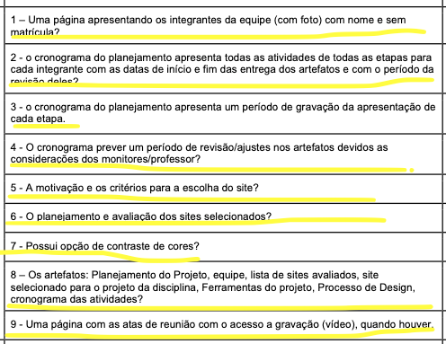
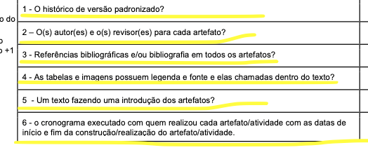
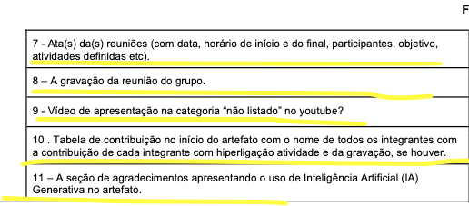
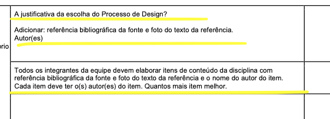

# Ata de reunião Interação Humano-Computador - Grupo 05

Data: 07/09/2026 Horário: 20h00 às 20h30 Local: Online via Microsoft Teams

## Histórico de Versão e Contribuição

| Versão | Data | Descrição | Autor(es) | Revisor(es) |
| :---: | :---: | :--- | :--- | :--- |
| `1.0` | 07/09/2026 | Criação da ata da Reunião 02 (Inspeção da Entrega 1 do Grupo 06). | Lucas Araújo Lima | Arthur Mariani |

---

## 1. Participantes presentes:

- [Arthur Mariani de Andrade da Cruz]()
- [Carlos Henrique dos Santos Costa Filho]()
- [Gabriel Melo Rodrigues Cardone]()
- [Igor Dantas Araújo]()
- [Lucas Araújo Lima]()
- [Rodrigo Carvalho Barbosa]()
- [Tomás Garcia Rocho]()

## 2. Discussão:

- **Inspeção da Entrega 1 do Grupo +1 (Grupo 06):** Em conformidade com o cronograma da disciplina previsto no Plano de Ensino (SALES, 2026, p. 4), o Grupo 05 reuniu-se via Microsoft Teams para conduzir a inspeção da Entrega 1 do Grupo 06.
- **Análise da Lista de Verificação de Planejamento:** A equipe percorreu os itens de verificação do planejamento geral, do desenvolvimento do projeto e do conteúdo da disciplina sugeridos no Plano de Ensino, avaliando o repositório e o GitHub Pages do Grupo 06.
- **Constatação de Conformidade:** Após análise minuciosa e conjunta de cada critério, os integrantes verificaram que todos os requisitos da lista de verificação foram atendidos com êxito pelo Grupo 06.

## 3. Decisões e Resultados da Inspeção:

- **Parecer da Inspeção:** O grupo registrou parecer favorável de conformidade plena para todos os itens avaliados do Grupo 06 na Entrega 1.
- **Registro da Lista de Verificação Adotada:** A fundamentação da inspeção baseou-se na lista de verificação da Entrega 1 extraída do Plano de Ensino da disciplina (SALES, 2026, p. 8-9). Os critérios de Planejamento Geral do Projeto encontram-se apresentados na **Figura 1**.

**Figura 1** - Itens da lista de verificação de Planejamento Geral do Projeto

**Fonte:** SALES (2026, p. 8).

- Os critérios de Desenvolvimento do Projeto encontram-se divididos e ilustrados na **Figura 2** (itens 1 a 6) e na **Figura 3** (itens 7 a 11).

**Figura 2** - Itens da lista de verificação de Desenvolvimento do Projeto (Parte 1)

**Fonte:** SALES (2026, p. 8).

**Figura 3** - Itens da lista de verificação de Desenvolvimento do Projeto (Parte 2)

**Fonte:** SALES (2026, p. 9).

- Por fim, as exigências relativas ao Conteúdo da Disciplina para a etapa inicial estão dispostas na **Figura 4**.

**Figura 4** - Itens da lista de verificação de Conteúdo da Disciplina

**Fonte:** SALES (2026, p. 9).

- Na **Tabela 1**, encontram-se sintetizados todos os itens avaliados pelo Grupo 05 no repositório do Grupo 06 e o respectivo status de conformidade apurado.

**Tabela 1** - Resultados da inspeção do Grupo 06 com base na Lista de Verificação da Entrega 1

| Categoria | Item | Questão Inspecionada (GitHub Pages do Grupo 06) | Avaliação do Grupo 05 |
| :--- | :---: | :--- | :---: |
| **Planejamento Geral** | **1** | Uma página apresentando os integrantes da equipe (com foto), com nome e sem matrícula? | Conforme |
| **Planejamento Geral** | **2** | O cronograma do planejamento apresenta todas as atividades de todas as etapas para cada integrante com as datas de início e fim das entregas dos artefatos e com o período da revisão deles? | Conforme |
| **Planejamento Geral** | **3** | O cronograma do planejamento apresenta um período de gravação da apresentação de cada etapa? | Conforme |
| **Planejamento Geral** | **4** | O cronograma prevê um período de revisão/ajustes nos artefatos devidos às considerações dos monitores/professor? | Conforme |
| **Planejamento Geral** | **5** | A motivação e os critérios para a escolha do site? | Conforme |
| **Planejamento Geral** | **6** | O planejamento e avaliação dos sites selecionados? | Conforme |
| **Planejamento Geral** | **7** | Possui opção de contraste de cores? | Conforme |
| **Planejamento Geral** | **8** | Os artefatos: Planejamento do Projeto, equipe, lista de sites avaliados, site selecionado para o projeto da disciplina, Ferramentas do projeto, Processo de Design e cronograma das atividades? | Conforme |
| **Planejamento Geral** | **9** | Uma página com as atas de reunião com o acesso à gravação (vídeo), quando houver? | Conforme |
| **Desenvolvimento** | **10** | O histórico de versão padronizado? | Conforme |
| **Desenvolvimento** | **11** | O(s) autor(es) e o(s) revisor(es) para cada artefato? | Conforme |
| **Desenvolvimento** | **12** | Referências bibliográficas e/ou bibliografia em todos os artefatos? | Conforme |
| **Desenvolvimento** | **13** | As tabelas e imagens possuem legenda e fonte e elas são chamadas dentro do texto? | Conforme |
| **Desenvolvimento** | **14** | Um texto fazendo uma introdução dos artefatos? | Conforme |
| **Desenvolvimento** | **15** | O cronograma executado com quem realizou cada artefato/atividade com as datas de início e fim da construção/realização do artefato/atividade? | Conforme |
| **Desenvolvimento** | **16** | Ata(s) da(s) reuniões (com data, horário de início e do final, participantes, objetivo, atividades definidas etc.)? | Conforme |
| **Desenvolvimento** | **17** | A gravação da reunião do grupo? | Conforme |
| **Desenvolvimento** | **18** | Vídeo de apresentação na categoria "não listado" no YouTube? | Conforme |
| **Desenvolvimento** | **19** | Tabela de contribuição no início do artefato com o nome de todos os integrantes com a contribuição de cada integrante com hiperligação para a atividade e para a gravação, se houver? | Conforme |
| **Desenvolvimento** | **20** | A seção de agradecimentos apresentando o uso de Inteligência Artificial (IA) Generativa no artefato? | Conforme |
| **Conteúdo da Disciplina** | **21** | A justificativa da escolha do Processo de Design, com referência bibliográfica da fonte, foto do texto da referência e autor(es)? | Conforme |
| **Conteúdo da Disciplina** | **22** | Todos os integrantes da equipe elaboraram itens de conteúdo da disciplina com referência bibliográfica da fonte, foto do texto da referência e o nome do autor do item? | Conforme |

**Fonte:** Elaborado pelos autores (2026).

## 4. Link da gravação:

A gravação completa da reunião de inspeção encontra-se disponibilizada no YouTube através do link a seguir:

- **Vídeo da Reunião 02:** [Gravação da Reunião 02 - Inspeção do Grupo 06](https://www.youtube.com/watch?v=I8lpMLe0A3o)
- **Participantes da gravação:** Arthur Mariani de Andrade da Cruz, Carlos Henrique dos Santos Costa Filho, Gabriel Melo Rodrigues Cardone, Igor Dantas Araújo, Lucas Araújo Lima, Rodrigo Carvalho Barbosa e Tomás Garcia Rocho.

## 5. Próxima Reunião 26/09/2026

A próxima reunião da equipe está prevista para o dia **26/09/2026**, às **20h00**, online via **Microsoft Teams**.

## 6. Declaração sobre o Uso de IA Generativa

Em cumprimento às normas de conduta acadêmica da SBC e ao Plano de Ensino da disciplina, declara-se que ferramentas de Inteligência Artificial Generativa foram empregadas para auxílio na estruturação textual, refinamento de clareza formal e formatação Markdown do presente documento. Toda a fundamentação teórica, levantamento empírico de dados, capturas de tela e análises críticas permaneceram sob responsabilidade exclusiva dos integrantes da equipe.

## 7. Referências Bibliográficas

-   SALES, André Barros de. *Plano de Ensino: Interação Humano Computador*. Universidade de Brasília, Faculdade UnB Gama, 2026.
