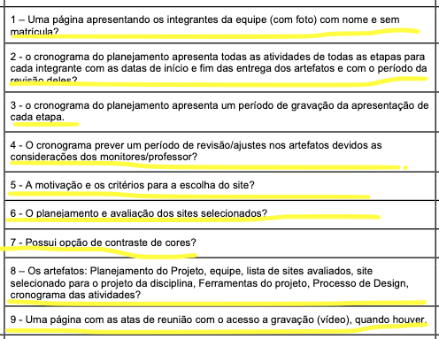
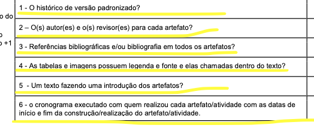
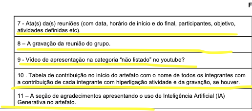
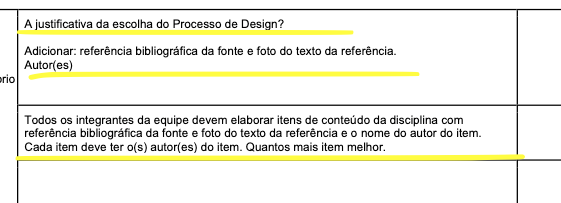

# Ata de reunião 2 (Inspeção) - Interação Humano-Computador - Grupo 05

- **Data:** 07/09/2026
- **Horário:** 20h00 às 20h30
- **Local:** Online via Microsoft Teams
- **Objetivo da Reunião:** Inspeção e verificação da Entrega 1 do Grupo +1 (Grupo 06) com base nos critérios do Plano de Ensino.
- **Redator da Ata:** [Lucas Araújo Lima](https://github.com/Lucasaraujoszz)
- **Ausentes:** Nenhum

## Histórico de Versão e Contribuição

| Data | Versão | Descrição | Autor(es) | Revisor(es) | Ferramenta(s) de IA |
| :---: | :---: | :--- | :--- | :--- | :---: |
| 07/09/2026 | `1.0` | Criação da ata da Reunião 02 (Inspeção da Entrega 1 do Grupo 06). | Lucas Araújo Lima | Arthur Mariani | Google Gemini |
| 26/09/2026 | `1.1` | Ajustes técnicos na ata: padronização do cabeçalho com identificação de inspeção, links dos participantes, especificação nominal de fonte, reposicionamento das imagens de referência, retificação do parecer da inspeção com apontamento de não conformidade no Item 22 e alinhamento da declaração de uso de IA. | Lucas Araújo Lima | Arthur Mariani | Google Gemini |

---

## 1. Participantes presentes:

- [Arthur Mariani de Andrade da Cruz](https://github.com/arthur-mariani)
- [Carlos Henrique dos Santos Costa Filho](https://github.com/carloshfgit)
- [Gabriel Melo Rodrigues Cardone](https://github.com/gabriellcardone-06)
- [Igor Dantas Araújo](https://github.com/IgorDARAUJO)
- [Lucas Araújo Lima](https://github.com/Lucasaraujoszz)
- [Rodrigo Carvalho Barbosa](https://github.com/RodrigoCBarbosa)
- [Tomás Garcia Rocho](https://github.com/TomasRocho)

## 2. Discussão:

- **Inspeção da Entrega 1 do Grupo +1 (Grupo 06):** Em conformidade com o cronograma da disciplina previsto no Plano de Ensino (SALES, 2026, p. 4), o Grupo 05 reuniu-se via Microsoft Teams para conduzir a inspeção da Entrega 1 do Grupo 06.
- **Análise da Lista de Verificação e Constatação de Desconformidade Pontual:** A equipe percorreu os 22 itens sugeridos no Plano de Ensino avaliando o repositório e o GitHub Pages do Grupo 06. Constatou-se conformidade em 21 itens; contudo, identificou-se uma não conformidade no **Item 22 (Conteúdo da Disciplina)**, uma vez que nem todos os integrantes do Grupo 06 elaboraram itens de conteúdo acompanhados da respectiva referência bibliográfica, foto do texto de referência e o nome do autor do item.

## 3. Decisões e Resultados da Inspeção:

- **Parecer da Inspeção do Grupo 06:** O Grupo 05 emitiu parecer com **apontamento de não conformidade no Item 22**. Para os demais itens de Planejamento Geral e Desenvolvimento (itens 1 a 21), o Grupo 06 obteve conformidade plena.
- **Recomendação e Encaminhamento ao Grupo 06:** Recomenda-se que o Grupo 06 realize o ajuste do artefato de Conteúdo da Disciplina no período de revisão pós-feedback, assegurando que cada membro da equipe elabore seu respectivo item teórico com foto da citação, página da obra e autoria individual, em estrita observância ao Plano de Ensino (SALES, 2026, p. 9).
- **Registro da Lista de Verificação Adotada:** A fundamentação da inspeção baseou-se na lista de verificação da Entrega 1 extraída do Plano de Ensino da disciplina (SALES, 2026, p. 8-9). Os registros visuais comprobatórios dos critérios de Planejamento Geral, Desenvolvimento do Projeto e Conteúdo da Disciplina encontram-se apresentados nas **Figuras 1, 2, 3 e 4** na seção de [Referências Bibliográficas e Anexos](#7-referencias-bibliograficas).
- Na **Tabela 1**, encontram-se sintetizados todos os itens avaliados pelo Grupo 05 no repositório do Grupo 06 e o respectivo status de conformidade apurado.

**Tabela 1** - Resultados da inspeção do Grupo 06 com base na Lista de Verificação da Entrega 1

| Categoria | Item | Questão Inspecionada (GitHub Pages do Grupo 06) | Avaliação do Grupo 05 |
| :--- | :---: | :--- | :---: |
| **Planejamento Geral** | **1** | Uma página apresentando os integrantes da equipe (com foto), com nome e sem matrícula? | Conforme |
| **Planejamento Geral** | **2** | O cronograma do planejamento apresenta todas as atividades de todas as etapas para cada integrante com as datas de início e fim das entregas dos artefatos e com o período da revisão deles? | Conforme |
| **Planejamento Geral** | **3** | O cronograma do planejamento apresenta um período de gravação da apresentação de cada etapa? | Conforme |
| **Planejamento Geral** | **4** | O cronograma prevê um período de revisão/ajustes nos artefatos devidos às considerações dos monitores/professor? | Conforme |
| **Planejamento Geral** | **5** | A motivação e os critérios para a escolha do site? | Conforme |
| **Planejamento Geral** | **6** | O planejamento e avaliação dos sites selecionados? | Conforme |
| **Planejamento Geral** | **7** | Possui opção de contraste de cores? | Conforme |
| **Planejamento Geral** | **8** | Os artefatos: Planejamento do Projeto, equipe, lista de sites avaliados, site selecionado para o projeto da disciplina, Ferramentas do projeto, Processo de Design e cronograma das atividades? | Conforme |
| **Planejamento Geral** | **9** | Uma página com as atas de reunião com o acesso à gravação (vídeo), quando houver? | Conforme |
| **Desenvolvimento** | **10** | O histórico de versão padronizado? | Conforme |
| **Desenvolvimento** | **11** | O(s) autor(es) e o(s) revisor(es) para cada artefato? | Conforme |
| **Desenvolvimento** | **12** | Referências bibliográficas e/ou bibliografia em todos os artefatos? | Conforme |
| **Desenvolvimento** | **13** | As tabelas e imagens possuem legenda e fonte e elas são chamadas dentro do texto? | Conforme |
| **Desenvolvimento** | **14** | Um texto fazendo uma introdução dos artefatos? | Conforme |
| **Desenvolvimento** | **15** | O cronograma executado com quem realizou cada artefato/atividade com as datas de início e fim da construção/realização do artefato/atividade? | Conforme |
| **Desenvolvimento** | **16** | Ata(s) da(s) reuniões (com data, horário de início e do final, participantes, objetivo, atividades definidas etc.)? | Conforme |
| **Desenvolvimento** | **17** | A gravação da reunião do grupo? | Conforme |
| **Desenvolvimento** | **18** | Vídeo de apresentação na categoria "não listado" no YouTube? | Conforme |
| **Desenvolvimento** | **19** | Tabela de contribuição no início do artefato com o nome de todos os integrantes com a contribuição de cada integrante com hiperligação para a atividade e para a gravação, se houver? | Conforme |
| **Desenvolvimento** | **20** | A seção de agradecimentos apresentando o uso de Inteligência Artificial (IA) Generativa no artefato? | Conforme |
| **Conteúdo da Disciplina** | **21** | A justificativa da escolha do Processo de Design, com referência bibliográfica da fonte, foto do texto da referência e autor(es)? | Conforme |
| **Conteúdo da Disciplina** | **22** | Todos os integrantes da equipe elaboraram itens de conteúdo da disciplina com referência bibliográfica da fonte, foto do texto da referência e o nome do autor do item? | Não Conforme |

**Fonte:** Elaborada por Lucas Araújo Lima (2026).

> **Nota sobre o Item 22:** *Identificou-se no GitHub Pages do Grupo 06 a ausência de itens teóricos individuais de conteúdo da disciplina para a totalidade dos integrantes da equipe contendo a respectiva referência bibliográfica, foto da página consultada e indicação explícita do autor.*

## 4. Link da gravação:

A gravação completa da reunião de inspeção encontra-se disponibilizada no YouTube através do link a seguir:

- **Vídeo da Reunião 02:** [Gravação da Reunião 02 - Inspeção do Grupo 06](https://www.youtube.com/watch?v=I8lpMLe0A3o)
- **Participantes da gravação:** Arthur Mariani de Andrade da Cruz, Carlos Henrique dos Santos Costa Filho, Gabriel Melo Rodrigues Cardone, Igor Dantas Araújo, Lucas Araújo Lima, Rodrigo Carvalho Barbosa e Tomás Garcia Rocho.

## 5. Próxima Reunião 26/09/2026

A próxima reunião da equipe está prevista para o dia **26/09/2026**, às **20h00**, online via **Microsoft Teams**.

## 6. Declaração sobre o Uso de IA Generativa

Em cumprimento às normas de conduta acadêmica da SBC e ao Plano de Ensino da disciplina, declara-se que o Gemini, uma ferramenta de Inteligência Artificial Generativa, foi empregado para auxílio na estruturação textual, refinamento de clareza formal e formatação Markdown do presente documento. Toda a fundamentação teórica, o levantamento empírico de dados, as capturas de tela e as análises críticas permaneceram sob responsabilidade exclusiva dos integrantes da equipe.

## 7. Referências Bibliográficas

- SALES, André Barros de. *Plano de Ensino: Interação Humano Computador*. Universidade de Brasília, Faculdade UnB Gama, 2026.

### Anexo: Registros Visuais da Lista de Verificação (SALES, 2026)

**Figura 1** - Itens da lista de verificação de Planejamento Geral do Projeto

**Fonte:** SALES (2026, p. 8).

**Figura 2** - Itens da lista de verificação de Desenvolvimento do Projeto (Parte 1)

**Fonte:** SALES (2026, p. 8).

**Figura 3** - Itens da lista de verificação de Desenvolvimento do Projeto (Parte 2)

**Fonte:** SALES (2026, p. 9).

**Figura 4** - Itens da lista de verificação de Conteúdo da Disciplina

**Fonte:** SALES (2026, p. 9).
