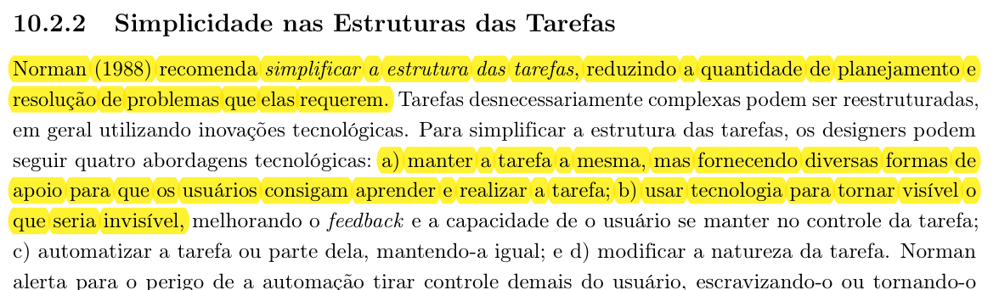
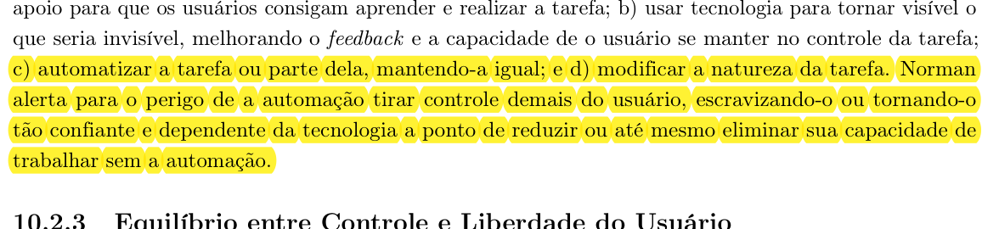
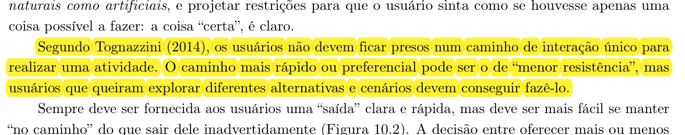
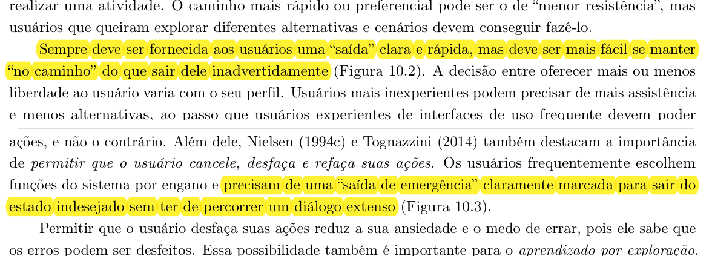
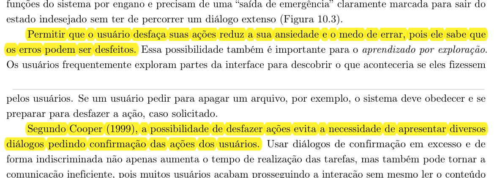

# Lista de Verificação - Entrega 3 (Princípios Gerais de IHC, Metas de Usabilidade e Guia de Estilo)

## Histórico de Versão e Contribuição

| Data | Versão | Descrição | Autor(es) | Revisor(es) |
| :---: | :---: | :--- | :--- | :--- |
| 06/10/2026 | 1.0 | Elaboração dos itens da lista de verificação para os Princípios Gerais de IHC, as Metas de Usabilidade e o Guia de Estilo, com fundamentações teóricas e links para as referências visuais no padrão ABNT. | [Carlos Costa](https://github.com/carloshfgit), [Lucas Araújo](https://github.com/Lucasaraujoszz), [Gabriel Melo](https://github.com/gabriellcardone-06), [Igor Dantas](https://github.com/IgorDARAUJO), [Rodrigo Carvalho](https://github.com/RodrigoCBarbosa) e [Arthur Mariani](https://github.com/arthur-mariani) | [Arthur Mariani](https://github.com/arthur-mariani) e [Carlos Costa](https://github.com/carloshfgit) |

---

## 1. Orientações

Esta lista de verificação compõe os instrumentos de inspeção e avaliação da **Entrega 3 (Princípios Gerais do Projeto, Metas de Usabilidade e Guia de Estilo)**, em conformidade com as diretrizes do Plano de Ensino da disciplina (SALES, 2026, pp. 11–12) e com a literatura seminal de Interação Humano-Computador (BARBOSA et al., 2021).

O presente documento abrange os itens de verificação elaborados pelos membros da equipe, contemplando **Princípios Gerais do Projeto de IHC** (Simplicidade, Controle e Liberdade, Conteúdo, Legibilidade, Prevenção de Erros), o **Guia de Estilo** (Escopo, Registro, Elementos de Interface e Padrões de Interação) e as **Metas de Usabilidade** (Priorização, Indicadores, Faixas de Valores e Avaliação).

Para cada pergunta, o avaliador deve assinalar uma das opções:
- **Conforme (Sim):** O artefato ou sistema atende integralmente ao critério estabelecido na literatura;
- **Não conforme (Não):** O critério é violado ou não foi implementado;
- **Não se aplica:** O critério não possui aderência ao escopo da tarefa ou tela sob inspeção.

---

## 2. Perguntas de Verificação

A Tabela 01 sintetiza as questões formuladas, os princípios de IHC contemplados, a autoria responsável e os links diretos para as respectivas figuras de referência bibliográfica.

<strong>Tabela 01</strong> — Itens de verificação de IHC para Princípios Gerais, Guia de Estilo e Metas de Usabilidade (Etapa 3)

| Nº | Pergunta de verificação | Princípio de IHC | Conforme | Não conforme | Não se aplica | Autor |
| :---: | :--- | :---: | :---: | :---: | :---: | :--- |
| 1 | O sistema simplifica a estrutura das tarefas reduzindo a quantidade de planejamento prévio e de resolução de problemas, fornecendo apoios para aprender e realizar a tarefa ou tornando visível o que seria invisível? ([Figura 1](#figura-1)) | Simplicidade nas Tarefas | ☐ | ☐ | ☐ | [Carlos Costa](https://github.com/carloshfgit) |
| 2 | Caso o sistema automatize etapas ou tarefas completas, essa automação preserva o controle do usuário, evitando retirar autonomia excessiva e prevenindo dependência cega da tecnologia? ([Figura 2](#figura-2)) | Simplicidade nas Tarefas | ☐ | ☐ | ☐ | [Carlos Costa](https://github.com/carloshfgit) |
| 3 | O sistema oferece flexibilidade de percurso sem confinar o usuário a um fluxo de interação rígido e unidirecional, disponibilizando um caminho preferencial claro, mas viabilizando percursos alternativos? ([Figura 3](#figura-3)) | Controle e Liberdade | ☐ | ☐ | ☐ | [Carlos Costa](https://github.com/carloshfgit) |
| 4 | O sistema disponibiliza saídas de emergência claramente marcadas, visíveis e de fácil acionamento, permitindo que o usuário abandone estados indesejados rapidamente e sem diálogos burocráticos? ([Figura 4](#figura-4)) | Controle e Liberdade | ☐ | ☐ | ☐ | [Carlos Costa](https://github.com/carloshfgit) |
| 5 | O sistema assegura a reversibilidade de ações (como desfazer/refazer digitação ou limpar entradas de dados), reduzindo o medo do erro e evitando o uso excessivo de diálogos bloqueantes de confirmação? ([Figura 5](#figura-5)) | Controle e Liberdade | ☐ | ☐ | ☐ | [Carlos Costa](https://github.com/carloshfgit) |
| 6 | Os princípios e as diretrizes selecionados foram contextualizados de acordo com o domínio da SEMOB-DF, os perfis de usuário e as atividades realizadas por esses usuários? | Contextualização de Diretrizes | ☐ | ☐ | ☐ | [Lucas Araújo](https://github.com/Lucasaraujoszz) |
| 7 | Para cada problema identificado, o artefato apresenta a evidência encontrada, o princípio violado, a recomendação de correção e as possíveis consequências caso o problema permaneça? | Avaliação e Diagnóstico | ☐ | ☐ | ☐ | [Lucas Araújo](https://github.com/Lucasaraujoszz) |
| 8 | As recomendações propostas explicam como o princípio analisado deverá aparecer concretamente no redesign ou no protótipo da SEMOB-DF? | Manifestação em Design | ☐ | ☐ | ☐ | [Lucas Araújo](https://github.com/Lucasaraujoszz) |
| 9 | Os textos, instruções, mensagens, links e botões seguem as máximas de qualidade, quantidade, relevância e clareza, evitando informações desnecessárias, ambiguidades e termos pouco compreensíveis? | Conteúdo e Redação | ☐ | ☐ | ☐ | [Lucas Araújo](https://github.com/Lucasaraujoszz) |
| 10 | As decisões de apresentação garantem legibilidade, com contraste adequado, tamanho de fonte suficiente, destaque para dados importantes e pistas adicionais quando cores são usadas para transmitir informação? | Apresentação e Legibilidade | ☐ | ☐ | ☐ | [Lucas Araújo](https://github.com/Lucasaraujoszz) |
| 11 | O projeto prevê prevenção e recuperação de erros, com operações reversíveis e mensagens que indiquem claramente o problema, suas consequências e uma possível solução? | Prevenção e Recuperação de Erros | ☐ | ☐ | ☐ | [Lucas Araújo](https://github.com/Lucasaraujoszz) |
| 12 | O Guia de Estilo declara claramente seu escopo, indicando se foi elaborado para uma plataforma, organização, família de produtos ou especificamente para o redesign da SEMOB-DF? | Guia de Estilo - Escopo | ☐ | ☐ | ☐ | [Lucas Araújo](https://github.com/Lucasaraujoszz) |
| 13 | O Guia de Estilo registra as decisões de design de forma fácil de consultar, reutilizar, atualizar e comunicar entre as equipes de design e desenvolvimento? | Guia de Estilo - Reutilização e Registro | ☐ | ☐ | ☐ | [Lucas Araújo](https://github.com/Lucasaraujoszz) |
| 14 | O Guia de Estilo define orientações para layout e grid, tipografia, ícones e símbolos, cores, visualização de informações e componentes de interface? | Guia de Estilo - Elementos de Interface | ☐ | ☐ | ☐ | [Lucas Araújo](https://github.com/Lucasaraujoszz) |
| 15 | O Guia de Estilo apresenta padrões para estilos de interação, ações, preenchimento de campos, terminologia, tipos de tela e sequências de diálogo, relacionando essas decisões aos resultados da análise dos usuários? | Guia de Estilo - Padrões de Interação | ☐ | ☐ | ☐ | [Lucas Araújo](https://github.com/Lucasaraujoszz) |
| 16 | As sequências de navegação do site da SEMOB-DF seguem uma ordem natural e lógica para o cidadão (por exemplo, consultar linhas, horários e itinerários sem exigir identificação prévia, solicitando dados pessoais apenas quando o serviço realmente os requer)? | Mapeamento Natural e Expectativas | ☐ | ☐ | ☐ | [Gabriel Melo](https://github.com/gabriellcardone-06) |
| 17 | Os serviços do site (como solicitação de Passe Livre, Cartão Mobilidade ou registro na Ouvidoria) estão organizados em etapas com início, meio e fim, fornecendo um fechamento claro e um feedback informativo ao término de cada tarefa? | Diálogos com Fechamento e Feedback | ☐ | ☐ | ☐ | [Gabriel Melo](https://github.com/gabriellcardone-06) |
| 18 | A interface utiliza o vocabulário do cidadão, evitando siglas, termos jurídicos ou administrativos internos (como nomes de portarias, setores ou sistemas) sem explicação? | Linguagem e Correspondência | ☐ | ☐ | ☐ | [Gabriel Melo](https://github.com/gabriellcardone-06) |
| 19 | O usuário dispõe de "saídas de emergência" claramente marcadas (voltar, cancelar, limpar filtros, retornar à página inicial) e pode explorar diferentes caminhos sem ficar preso a um fluxo único? | Controle e Liberdade | ☐ | ☐ | ☐ | [Gabriel Melo](https://github.com/gabriellcardone-06) |
| 20 | Ações semelhantes funcionam da mesma forma e recebem o mesmo rótulo em todo o site (por exemplo, "Consultar", "Buscar" e "Pesquisar" não são usados indiscriminadamente), e elementos com comportamentos diferentes têm aparências distintas (links, botões e textos simples)? | Consistência e Padronização | ☐ | ☐ | ☐ | [Gabriel Melo](https://github.com/gabriellcardone-06) |
| 21 | O site antecipa as necessidades do usuário, oferecendo informações complementares úteis (por exemplo, ao exibir uma linha de ônibus, apresentar também horários, itinerário, pontos de parada e tarifa) e valores padrão adequados e facilmente alteráveis em formulários e filtros? | Antecipação das Necessidades | ☐ | ☐ | ☐ | [Igor Dantas](https://github.com/IgorDARAUJO) |
| 22 | O usuário consegue identificar, a qualquer momento, em que parte do site se encontra e por qual caminho chegou até ela (por exemplo, por meio de breadcrumbs, destaque do item de menu ativo e títulos de página coerentes)? | Visibilidade do Estado do Sistema | ☐ | ☐ | ☐ | [Igor Dantas](https://github.com/IgorDARAUJO) |
| 23 | O sistema fornece feedback adequado e no tempo certo durante operações demoradas (carregamento de mapas, consultas de itinerário, envio de formulários ou downloads de documentos), com indicação de progresso, de estimativa de tempo e possibilidade de cancelamento? | Feedback e Tempos de Resposta | ☐ | ☐ | ☐ | [Igor Dantas](https://github.com/IgorDARAUJO) |
| 24 | A ajuda e a documentação disponíveis (FAQ, Carta de Serviços, tutoriais) são fáceis de encontrar, focadas nas tarefas do cidadão, apresentam passos concretos e não são excessivamente extensas? | Ajuda e Documentação | ☐ | ☐ | ☐ | [Igor Dantas](https://github.com/IgorDARAUJO) |
| 25 | O site está livre de dark patterns, como pop-ups ou banners insistentes (incômodo repetitivo), exigência de dados desnecessários para acessar um serviço (ação forçada/obstrução), opções pré-selecionadas sem aviso ou links disfarçados de texto simples (interferência na interface)? | Prevenção de Dark Patterns | ☐ | ☐ | ☐ | [Igor Dantas](https://github.com/IgorDARAUJO) |
| 26 | Disposição espacial e grid: O guia de estilo define claramente os grids e o arranjo espacial, garantindo alinhamento, consistência e uma organização visual lógica das informações no portal da SEMOB-DF? | Guia de Estilo - Disposição Espacial e Grid | ☐ | ☐ | ☐ | [Rodrigo Carvalho](https://github.com/RodrigoCBarbosa) |
| 27 | Janelas: O documento estabelece padrões para a apresentação, comportamento, dimensionamento e controle das janelas (como caixas de diálogo, modais ou pop-ups) utilizadas no sistema? | Guia de Estilo - Janelas e Modais | ☐ | ☐ | ☐ | [Rodrigo Carvalho](https://github.com/RodrigoCBarbosa) |
| 28 | Tipografia: As famílias tipográficas, tamanhos, estilos (negrito, itálico) e espaçamentos estão padronizados para assegurar a legibilidade e a correta hierarquia visual do texto? | Guia de Estilo - Tipografia | ☐ | ☐ | ☐ | [Rodrigo Carvalho](https://github.com/RodrigoCBarbosa) |
| 29 | Símbolos não tipográficos: O guia fornece orientações sobre o uso de ícones e símbolos, garantindo que sejam de fácil reconhecimento e possuam significados consistentes e culturalmente adequados para os usuários? | Guia de Estilo - Símbolos Não Tipográficos | ☐ | ☐ | ☐ | [Rodrigo Carvalho](https://github.com/RodrigoCBarbosa) |
| 30 | Cores: A paleta de cores está definida com regras de aplicação para fundos, textos e estados de componentes, respeitando recomendações de contraste e acessibilidade? | Guia de Estilo - Cores e Contraste | ☐ | ☐ | ☐ | [Rodrigo Carvalho](https://github.com/RodrigoCBarbosa) |
| 31 | Animações: Existem diretrizes para o uso de animações e transições de tela que ajudem a fornecer feedback de estados do sistema sem causar distrações ou sobrecarga cognitiva? | Guia de Estilo - Animações e Transições | ☐ | ☐ | ☐ | [Rodrigo Carvalho](https://github.com/RodrigoCBarbosa) |
| 32 | Estilos de interação: O documento descreve e padroniza os estilos de interação adotados no sistema (ex.: menus, preenchimento de formulários, manipulação direta) de acordo com as atividades dos usuários? | Guia de Estilo - Estilos de Interação | ☐ | ☐ | ☐ | [Rodrigo Carvalho](https://github.com/RodrigoCBarbosa) |
| 33 | Seleção de um estilo: O guia apresenta critérios ou orientações claras para ajudar os designers a escolherem o estilo de interação mais apropriado para cada tarefa específica ou contexto de uso? | Guia de Estilo - Seleção de Estilos | ☐ | ☐ | ☐ | [Rodrigo Carvalho](https://github.com/RodrigoCBarbosa) |
| 34 | Aceleradores (teclas de atalho): Estão previstos e documentados atalhos de teclado e outros aceleradores para flexibilizar a interação e torná-la mais eficiente para usuários frequentes ou experientes? | Guia de Estilo - Aceleradores e Atalhos | ☐ | ☐ | ☐ | [Rodrigo Carvalho](https://github.com/RodrigoCBarbosa) |
| 35 | O documento informa quais fatores de usabilidade serão priorizados, como eficácia, eficiência, facilidade de aprendizado, facilidade de recordação, segurança e satisfação, e explica a razão dessa seleção com base nas necessidades dos usuários e no contexto de uso da SEMOB-DF? | Metas de Usabilidade - Priorização | ☐ | ☐ | ☐ | [Arthur Mariani](https://github.com/arthur-mariani) |
| 36 | Cada meta possui pelo menos um indicador claramente definido, isto é, uma medida que permita verificar seu atendimento, como quantidade de usuários que concluem a tarefa, quantidade de abandonos, tempo necessário para conclusão ou número de erros cometidos? | Metas de Usabilidade - Indicadores | ☐ | ☐ | ☐ | [Arthur Mariani](https://github.com/arthur-mariani) |
| 37 | Para cada indicador, o documento prevê três faixas de resultado, inaceitável, aceitável e ideal, e informa que esses valores devem considerar o desempenho atual dos usuários, ou seja, os resultados obtidos no sistema antes do redesign? | Metas de Usabilidade - Faixas de Valores | ☐ | ☐ | ☐ | [Arthur Mariani](https://github.com/arthur-mariani) |
| 38 | O planejamento da avaliação informa quais tarefas serão executadas, quais características os participantes devem possuir, como as interações serão observadas e registradas e se será realizado um teste-piloto, isto é, uma execução prévia antes das sessões definitivas? | Metas de Usabilidade - Planejamento da Avaliação | ☐ | ☐ | ☐ | [Arthur Mariani](https://github.com/arthur-mariani) |
| 39 | O documento explica como os resultados dos testes serão comparados com as metas estabelecidas, considerando medidas como quantidade de participantes que alcançaram o resultado esperado, tempo médio, porcentagens, erros, consultas à ajuda e satisfação dos usuários? | Metas de Usabilidade - Verificação dos Resultados | ☐ | ☐ | ☐ | [Arthur Mariani](https://github.com/arthur-mariani) |

<em>Fonte: Carlos Costa, Lucas Araújo, Gabriel Melo, Igor Dantas, Rodrigo Carvalho e Arthur Mariani (2026), adaptado de Barbosa e Silva (2010) e Barbosa et al. (2021).</em>

---

## 3. Fotos de Referência

Abaixo encontram-se as imagens dos recortes da obra de referência da disciplina (BARBOSA et al., 2021) para fundamentar os itens de verificação correspondentes.

---

<strong>Figura 1</strong> — Trecho da obra abordando a simplificação da estrutura das tarefas e apoios mentais (Norman, 1988)

<em>Fonte: Print retirado por Carlos Costa (2026), a partir de BARBOSA et al. (2021, p. 239).</em>

---

<strong>Figura 2</strong> — Trecho da obra abordando abordagens tecnológicas e o alerta quanto ao excesso de automação (Norman, 1988)

<em>Fonte: Print retirado por Carlos Costa (2026), a partir de BARBOSA et al. (2021, p. 239).</em>

---

<strong>Figura 3</strong> — Trecho da obra abordando soberania do usuário e caminhos alternativos de interação (Tognazzini, 2014)

<em>Fonte: Print retirado por Carlos Costa (2026), a partir de BARBOSA et al. (2021, p. 240).</em>

---

<strong>Figura 4</strong> — Trecho da obra abordando saídas de emergência e rotas claras de abandono de estados indesejados (Nielsen, 1994; Tognazzini, 2014)

<em>Fonte: Print retirado por Carlos Costa (2026), a partir de BARBOSA et al. (2021, p. 240).</em>

---

<strong>Figura 5</strong> — Trecho da obra abordando reversibilidade de ações, redução do medo do erro e controle de diálogos de confirmação (Shneiderman, 1998; Cooper, 1999)

<em>Fonte: Print retirado por Carlos Costa (2026), a partir de BARBOSA et al. (2021, pp. 240–241).</em>

---

## 4. Declaração sobre o Uso de IA Generativa

Em conformidade com o Código de Conduta da Sociedade Brasileira de Computação (SBC) e as diretrizes do Plano de Ensino da disciplina, declara-se que o assistente de inteligência artificial generativa *Gemini* foi empregado no apoio à estruturação e formatação em Markdown deste artefato. A formulação dos critérios e a fundamentação teórica permaneceram sob autoria e responsabilidade dos integrantes do grupo.

---

## 5. Referências Bibliográficas

- BARBOSA, Simone Diniz Junqueira; SILVA, Bruno Santana da. **Interação Humano-Computador**. Rio de Janeiro: Elsevier, 2010.
- BARBOSA, Simone Diniz Junqueira; SILVA, Bruno Santana da; SILVEIRA, Milene Selbach; GASPARINI, Isabela; DARIN, Ticianne; BARBOSA, Gabriel Diniz Junqueira. **Interação Humano-Computador e Experiência do Usuário**. Rio de Janeiro: Autopublicação, 2021. ISBN 978-65-00-19677-1. Cap. 10: Princípios e Diretrizes para o Design de IHC, pp. 239–241.
- COOPER, Alan. **The Inmates Are Running the Asylum**. Indianapolis: Sams Publishing, 1999.
- NIELSEN, Jakob. **Heuristic Evaluation**. In: NIELSEN, J.; MACK, R. L. (eds.). *Usability Inspection Methods*. Nova York: John Wiley & Sons, 1994.
- NORMAN, Donald A. **The Design of Everyday Things**. Nova York: Basic Books, 1988.
- SALES, André Barros de. **Plano de Ensino: Interação Humano Computador — Turma 01**. Universidade de Brasília, Faculdade UnB Gama, 2026. pp. 11–12.
- SHNEIDERMAN, Ben. **Designing the User Interface: Strategies for Effective Human-Computer Interaction**. 3. ed. Reading: Addison-Wesley, 1998.
- TOGNAZZINI, Bruce. **First Principles of Interaction Design (Revised & Expanded)**. AskTog, 2014.
